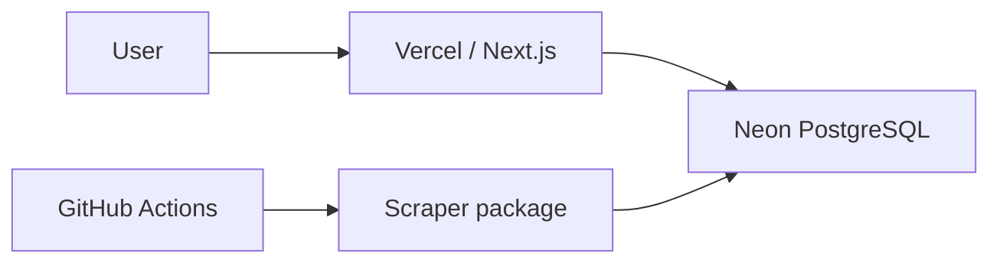

# Architecture

CompraFino starts serverless first to reduce idle costs and operational work while validating data. The existing Neon/Vercel/GitHub Actions deployment is complete in the developer-provided Milestones 0–6 baseline. Bounded Tottus, Plaza Vea and Metro ingestion is implemented:

The homepage is static and requires no database. Public search and product comparison are request-rendered Server Components over verified canonical associations and open price-history states; queries live in `@comprafino/db`. See [public search](public-search.md) for filtering and request-time freshness boundaries. Initially there is no always-on API server, always-on worker, Redis or message queue.

## Boundaries

- `apps/web`: routes and application presentation. Prefer Server Components; use Client Components only where required.
- `packages/ui`: reusable shadcn components using Base UI, shared Tailwind 4 theme and explicit source scanning. Both shadcn configs use `base-nova`. No domain logic.
- `packages/core`: pure framework-independent logic, without React, Next.js, browser or database dependencies.
- `packages/db`: PostgreSQL schema home, reviewed migrations, URL validation and lazy Drizzle clients. Importing does not connect or require credentials. Neon HTTP suits stateless queries and batched transactions; interactive transactions would justify revisiting the driver.
- `packages/scrapers`: retailer adapters and ingestion orchestration, currently native-fetch Tottus hydration JSON and Plaza Vea/Metro public VTEX JSON. Fetching/parsing is independent of persistence. Ingestion/refresh dry-run never opens a database; discovery dry-run reads database demand without writes or retailer calls.

Current dependency graph: `web → ui, db, core`; `scrapers → core, db`; `db → core`. Core owns the shared validated listing boundary and exact money normalization. Dedicated workers can replace or supplement GitHub Actions without rewriting framework-independent domain logic. Retailer-specific behavior remains isolated.

## Package and task management

pnpm workspaces manage packages/dependency relationships, using `workspace:*`. Turborepo manages task ordering, parallel execution and caching. Next.js compiles shared TypeScript source; libraries do not need artificial build scripts. Build tasks respect upstream builds, type checks respect upstream checks, and tests respect upstream builds. Dev tasks are persistent and uncached. Lint and format run once from the root.

TypeScript remains authoritative; type-aware Oxlint supplements it. Oxfmt is the sole formatter and sorts Tailwind classes using the shared stylesheet. CI checks frozen installation, formatting, lint, types, unit tests, build and Chromium smoke E2E without credentials.

## Persistence and operations

The first generated migration creates `retailers`, `retailer_listings`, `price_history` and `ingestion_runs`, including retailer seeds. Add reviewed tables to `packages/db/src/schema.ts`, generate migrations, review and commit SQL/metadata, then apply explicitly with a validated URL. CLI-only dotenv loads root `.env`; deployed clients receive platform environment variables. Migrations never run during app build or startup.

Vercel, Neon and scheduled GitHub Actions are the user-provided deployed baseline. The Tottus, Plaza Vea and Metro workflows are manual only and require a `DATABASE_URL` secret. The full catalog workflow now supports twice-daily bounded refresh; activation requires the workflow on the default branch, Actions enabled and the existing secret. No active remote schedule is claimed by local implementation. See [operations](operations.md). Validate free-tier quotas against measured workloads and provider terms when deploying.

## Deferred choices

Native fetch before HTTP client dependencies. TanStack Form only for complex forms, TanStack Query for justified client server-state needs, and shadcn Chart/Recharts for implemented price history. HTML parsers, browser automation, caching, queues, search services and workers require concrete needs. Authentication waits for user-specific features. Matching is deterministic, without LLMs or embeddings.

### Ingestion state

A listing is identified by retailer plus source SKU, retaining the product ID separately. Money is integer PEN cents; KG/UN price basis is preserved. Each retailer validates its own source JSON before normalization, and normalized listings are validated again at persistence. `packages/scrapers/src/adapter.ts` owns the small shared adapter contract; fetching and pagination remain source-specific. Stock remains unknown for Tottus delivery labels; Plaza Vea exposes available anonymous seller/channel offers without establishing address-specific delivery.

The Neon HTTP driver executes a bounded batch transaction: lock the retailer row, upsert fresh observations, close changed history states, then insert missing current states. All writers must use this lock convention. A partial unique index enforces one open price state per listing. Equal/older observations cannot overwrite newer state. Repeated unchanged observations update freshness without appending history. Bounded samples never deactivate unseen listings. Run start/finish records are separate from the atomic listing batch; interrupted processes can leave a `running` record. `listingsChanged` counts newly opened price states, including first observations.

The `/dev/ingestion` Server Component reads at request time, shows helpful missing-DB/error messages and is blocked in production. The migration and live Neon schema have been verified. Repeated live Tottus and Plaza Vea persistence is idempotent without retailer-specific tables or persistence paths. Separate isolated-schema PostgreSQL integration tests exercise transitions, rollback and concurrent writers through the real batch transaction; they require explicit `TEST_DATABASE_URL` and never fall back to the application database configuration. Unit tests remain credential-free.

## Catalog normalization

Core owns deterministic title/brand/content normalization, independent of retailer APIs and PostgreSQL. Adapters retain validated source brands and sale-unit multipliers; raw source fields remain in listings. The additive second migration creates a one-to-one derived `listing_normalizations` table with explicit indexed dimensions, version, fingerprint and diagnostics. The standalone database-package CLI reads bounded samples and persists them in one atomic batch using ingestion's existing retailer locks and raw-input guards. It never writes price history or runs automatically during ingestion.

`/dev/catalog` inspects up to twenty rows per retailer, marking missing/stale derived data and remaining blocked in production. Exact g/ml/unit content is separate from KG/UN pricing. Approximate/variable masses and mixed bundles remain unresolved. Canonical products and matching are now derived separately as described below; queues remain deferred; public search reads these verified groups separately. See [catalog normalization](catalog-normalization.md) for the model, observed metadata trust, real-data audit and validation status.

## Canonical matching

Core owns deterministic candidate blocks, compatibility, evidence decisions and complete-link grouping. Database code computes pg_trgm similarity for bounded candidate pairs and persists canonical products/versioned automatic links using the existing retailer-lock convention. Guarded snapshots prevent stale assignment; PostgreSQL primary/unique/composite foreign keys enforce one canonical per listing and one listing per retailer/group. Manual links and incomplete group scopes block automatic recomputation. Raw listings, normalization and price history remain intact.

The read-only `/dev/matching` Server Component is blocked in production. Standalone `pnpm match:catalog` and `pnpm match:evaluate` use root database configuration; dry-run never writes. The pg_trgm extension is migration-managed; no dedicated search infrastructure or npm dependency was added. See [catalog matching](catalog-matching.md) for model, provisional thresholds, bounded real metrics and remaining validation/audit gaps.

## Scheduled refresh ownership

`packages/scrapers/src/refresh-cli.ts` wires the existing adapters and DB APIs; `refresh.ts` isolates retailer failures and orders downstream work. GitHub Actions only supplies scheduling/environment/concurrency. Core owns operational freshness thresholds; db reads independent latest attempts/successes; the existing development ingestion page renders them. Failed fetches preserve prior observations through existing atomic persistence. Public queries continue reading persisted canonical offers without dynamic scraping/matching. No new schema, dependency or service is required. See [operations](operations.md) for scope, failure and validation evidence.

## Search-driven discovery ownership

Public zero-result search uses Next.js `after` only for a validated database demand upsert, after the response. Core owns conservative query normalization/limits. DB owns deduplication, atomic counts, a locked UTC daily budget and 24-hour claim cooldown. Scrapers own single-page public text search and the discovery processor, reusing existing ingestion statements and complete normalization/matching APIs. GitHub Actions schedules small batches independently of public requests. `/dev/discovery` provides read-only demand inspection and is blocked in production. Query text never becomes canonical identity; no matcher logic or new infrastructure is introduced. See [discovery](discovery.md) for schema, exact admission/retry policy and validation.

## Known listing refresh ownership

Core owns deterministic targeted admission and public observation-age classification. DB owns immutable acquisition/query provenance, category observation and guarded targeted admission/outcomes; existing listing/history persistence remains the only quote-write path. Scrapers extend existing adapters with exact known-SKU/product-page lookup and sequential bounded processing, inserted after category ingestion before a single complete normalization/matching pass. Public queries classify observations at request time and retain historical groups without fabricating a current best price. Read-only demand/coverage reporting feeds the development ingestion page. See [listing refresh](listing-refresh.md) for migration, budgets, audit and pending build/E2E gate.

## Generic offer comparison ownership

Core owns bigint rational unit-price calculation, incompatible dimensions and display rounding. DB owns normalized-listing offer eligibility, PostgreSQL token/trigram search, exact fraction sorting, bounded dimension selection and combined canonical/generic search. Server Components render independent cards and native GET sorting; no SQL, dynamic matching or retailer work runs in UI components. Existing canonical reads remain authoritative for exact identity and detail pages. Combined empty results alone admit discovery. The read-only unit audit CLI and development catalog inspection expose coverage/unavailable reasons. See [generic comparison](generic-comparison.md).

## Staple family relevance ownership

Core classifies small observed product families from current source leaf evidence and conservative nouns/negative descriptors, independently of exact identity. DB recomputes these attributes per eligible generic offer and combines them with PostgreSQL token/trigram order before sort/limit. No family column, migration or normalization-version/matcher change is needed. Combined family queries also gate incidental canonical cards without changing canonical detail routes. Scrapers own retailer-specific complete category allowlists and fixed per-pair bounds; scheduled refresh fetches them before the existing single derivation pass. The developer catalog displays source category/family/origin/evidence. See [staple coverage](staple-coverage.md) for audit, refresh budgets and limitations.

### Quantity quality and operational reporting

Core comparison output has explicit mass/volume/item-count/approximate-roll bases and quality. These are separate from persisted exact-match normalization (version 1) and do not enter matching identity. DB owns read-only catalog/size/candidate metrics; the scraper developer CLI combines them with local category/workflow configuration and optional recorded refresh evidence. This preserves the existing dependency graph. No telemetry service, schema, source expansion or new infrastructure is introduced; see [quantity quality](quantity-quality.md) and [catalog budget](catalog-budget.md).

## Conditional pricing and URL controls

Core owns validated concrete conditional offers, CMR identity, validity/freshness eligibility, potential-benefit ranking and URL filter parsing. DB owns a separate current `retailer_listing_offers` model, synchronized inside accepted listing upserts under the existing retailer lock. Unchanged offer states reuse atomically verified listing freshness without offer-row rewrites; ordinary history remains independent. Retailer adapters interpret only evidence-backed source amounts. The web toolbar immediately navigates URL filters while results remain server-rendered; discovery uses the unfiltered query count. See [conditional pricing](conditional-pricing.md) and [search UX](search-ux.md).

## Public ordinary price history

Core owns range parsing, half-open state intersection, ordinary transitions and summary metrics. DB owns one canonical/range-scoped query sharing public exact-product eligibility. The product Server Component loads summaries below current offers; a Client Component renders Recharts event markers, verified daily-coverage step segments and retailer toggles. Core also owns covered periods and conservative descriptive price insights. The shared atomic ingestion writer rolls accepted usable quotes into `listing_observation_days`, keyed by listing and Peru calendar date, while `price_history` retains actual state transitions. Daily evidence is queried separately from state aggregation; gaps split paths, and pre-coverage events remain disconnected. See [price history](price-history.md) and [observation coverage](observation-coverage.md) for semantics, migration, storage and pending validation.

Local database tests can use the disposable Docker PostgreSQL setup described in
[local testing](local-testing.md). Production retains Neon HTTP; an explicit test
mode provides TCP queries with the same Drizzle batch and schema isolation semantics.

## Recurring shopping list ownership

Core owns the versioned list schema, semantic duplicate keys, family/variant compatibility, integer package fulfillment and per-item pricing/overbuy ranking. DB reuses public generic/canonical current-offer eligibility and quantity evidence through a read-only evaluation boundary. Web owns isolated localStorage access, a small React subscription hook, add/edit dialogs and `/list`; route handlers validate requests and never persist list data or call retailers. Generic candidates include independently normalized store brands; null canonical identities never create exact/history associations. No account, migration or server list repository is introduced. See [shopping lists](shopping-list.md) for policy, audit and pending browser acceptance.

## Current basket optimization ownership

Core exposes complete approved fulfillment options through the existing shopping evaluator and enumerates the seven retailer subsets without implementing substitution policy in the optimizer. DB shares current public/generic eligibility in one bounded statement snapshot for the whole list; the 1,000-row guard and 1,001 overflow detector prevent truncated optima. Web extends the uncached evaluation route and `/list` with complete/partial tiers, actual retailer counts, grouped assignments and explicit conditions. Browser lists remain version two. No schema, dependency, scraping or infrastructure change. See [basket optimization](basket-optimization.md) for deterministic order, scope, measured current-scale tradeoff and validation results.
