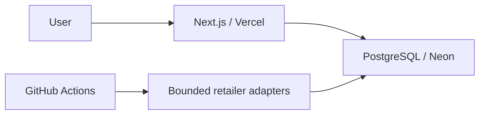

# Architecture

[Milestone 19B](shopping-list-persistence.md) adds authenticated JSONB list persistence and GET/POST `/api/list/sync`. SQL/CAS lives in `packages/db`; strict contracts and existing domain mutation live in `packages/core`; session/Origin/HTTP boundaries live in `apps/web`. Browser list storage and public evaluation remain unchanged; client sync is deferred to 19C.

CompraFino uses Next.js on Vercel, PostgreSQL on Neon and scheduled acquisition on GitHub Actions. This is the deployment model; repository contents do not verify remote rollout status. The homepage requires no database. Public search, exact comparison and independent listing pages read persisted data; browser-local lists use bounded server evaluation APIs. There is no separate always-on server, worker, cache service or queue.

## Ownership

- `apps/web`: Server Component routes, presentation, required interactive Client Components, browser storage and application tests.
- `packages/ui`: Base UI/shadcn primitives, Tailwind theme and Recharts presentation; no domain policy.
- `packages/core`: framework-independent listing validation, integer money, normalization, matching, freshness, comparison, substitution and shopping/basket logic.
- `packages/db`: lazy Drizzle/Neon client, external DB validation, reviewed migrations, transactional ingestion, derived identity and read projections.
- `packages/scrapers`: retailer-specific native-fetch acquisition/parsing, conservative request bounds and orchestration.

Dependencies flow `web → ui, db, core`, `scrapers → core, db`, `db → core`. Typed source exports are compiled by consumers; pnpm handles workspaces and Turbo task ordering/cache. The browser-safe `core/search-filters` entry point has no database dependencies. Client search controls import it directly.

## Persistence invariants

Retailer/SKU identifies a retained listing. Ordinary purchase money is positive integer PEN cents; KG/UN quote basis stays separate from package content. Ordinary state history, current conditional benefits, prospective Peru-day observation coverage and tri-state availability evidence have distinct semantics.

Accepted writes use stable retailer locks, replay/snapshot guards and atomic batches. A global admission lock enforces the retained catalog cap. Unchanged usable observations advance verification/coverage without appending price states. Negative/failed/absent outcomes do not fabricate successful price observations. Unknown stock cannot erase newer explicit evidence or recover an unavailable listing.

Normalization is separate from ingestion and never rewrites ordinary history. Scheduled category, discovery and targeted processors invoke complete normalization/matching once after accepted writes. Raw/derived identity changes invalidate automatic confidence until matching revalidates current complete evidence. All identity writers must maintain this safety and roll out together; manual links and split scopes remain protected. See [normalization](catalog-normalization.md), [matching](catalog-matching.md) and [availability](availability.md).

## Public and shopping boundaries

Exact identity differs from independent search relevance and safe substitution. Current purchase eligibility combines positive ordinary state, active/stock, observation freshness and current derived evidence. Historical listing pages can remain accessible when purchasing eligibility expires. Public requests do not fetch retailers or run matching. Zero-result discovery records only bounded database demand after the response.

Core calculates unit prices with bigint rational arithmetic and supported quantity-quality gates. Browser lists are versioned local data with a session fallback. The evaluation API bounds UTF-8 bodies to 128 KiB before JSON parsing, validates input and reads one bounded catalog statement snapshot. Core approves fulfillment options before enumerating seven retailer subsets; complete/partial baskets remain separate. The catalog cap and overflow sentinel prevent truncated optima; UI result limits are independent. See [eligibility](eligibility.md), [substitution](substitution-compatibility.md) and [baskets](basket-optimization.md).

## Operations, tests and deferred choices

Apply existing reviewed migrations explicitly; build/startup never migrates. CLI configuration loads root `.env`; hosting supplies application variables. Native fetch and public endpoints remain preferred; no retries, protection bypass or stealth tooling.

Required CI runs static checks, unit/stream regressions, disposable PostgreSQL tests, production build and combined deterministic Chromium fixtures/smoke. Test writers own random schemas and never fall back to the application database. Production uses Neon HTTP exclusively. Test lifecycle/local TCP transport lives under `packages/db/src/testing`; controlled web fixtures install it explicitly with a test-process preload, without production imports or environment-mode branching. HTTP tests and benchmark wiring belong to `apps/web/testing`; DB suites own domain/query fixtures. See [local testing](local-testing.md), [operations](operations.md) and the [Next patch](dependencies.md#next-stream-cancellation-patch).

The [Milestone 19A auth foundation](auth.md) uses Better Auth in `apps/web` and four core PostgreSQL tables in `packages/db`. Public routes remain public; the authenticated persistence backend is implemented in 19B and client synchronization is deferred. Complex form/client-cache tooling, workers, queues and dedicated search services require concrete needs. Recharts is already used for ordinary history. Matching is deterministic without embeddings/LLMs. Historical architecture decisions and validation are preserved in [engineering history](history/engineering-notes-2026-10-05.md#original-docsarchitecturemd).
