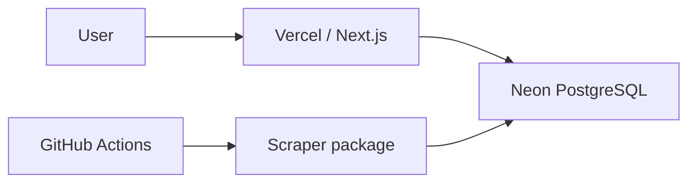

# Architecture

CompraFino starts serverless first to reduce idle costs and operational work while validating data. This is the intended deployment; no resources or ingestion have been created:

The homepage is static and requires no database. Initially there is no always-on API server, always-on worker, Redis or message queue.

## Boundaries

- `apps/web`: routes and application presentation. Prefer Server Components; use Client Components only where required.
- `packages/ui`: reusable shadcn components using Base UI, shared Tailwind 4 theme and explicit source scanning. Both shadcn configs use `base-nova`. No domain logic.
- `packages/core`: pure framework-independent logic, without React, Next.js, browser or database dependencies.
- `packages/db`: PostgreSQL schema home, reviewed migrations, URL validation and lazy Drizzle clients. Importing does not connect or require credentials. Neon HTTP suits stateless queries and batched transactions; interactive transactions would justify revisiting the driver.
- `packages/scrapers`: future retailer adapters and ingestion orchestration. Its documented typed entry point has no runtime dependency today.

Current dependency graph: `web → ui`. Later adapters will compose core logic and database persistence when needed. Dedicated workers can replace or supplement GitHub Actions without rewriting framework-independent domain logic. Retailer-specific behavior remains isolated.

## Package and task management

pnpm workspaces manage packages/dependency relationships, using `workspace:*`. Turborepo manages task ordering, parallel execution and caching. Next.js compiles shared TypeScript source; libraries do not need artificial build scripts. Build tasks respect upstream builds, type checks respect upstream checks, and tests respect upstream builds. Dev tasks are persistent and uncached. Lint and format run once from the root.

TypeScript remains authoritative; type-aware Oxlint supplements it. Oxfmt is the sole formatter and sorts Tailwind classes using the shared stylesheet. CI checks frozen installation, formatting, lint, types, unit tests, build and Chromium smoke E2E without credentials.

## Persistence and operations

No domain tables are invented. Add reviewed tables to `packages/db/src/schema.ts`, generate migrations, review and commit SQL/metadata, then apply explicitly with a validated URL. CLI-only dotenv loads root `.env`; deployed clients receive platform environment variables. Migrations never run during app build or startup.

Vercel, Neon and scheduled GitHub Actions are intended deployment choices. No fake cron workflows exist. Validate free-tier quotas against measured workloads and provider terms when deploying.

## Deferred choices

Native fetch before HTTP client dependencies. TanStack Form only for complex forms, TanStack Query for justified client server-state needs, and shadcn Chart/Recharts for implemented price history. HTML parsers, browser automation, caching, queues, search services and workers require concrete needs. Authentication waits for user-specific features. Initial matching will be deterministic, without LLMs or embeddings.
