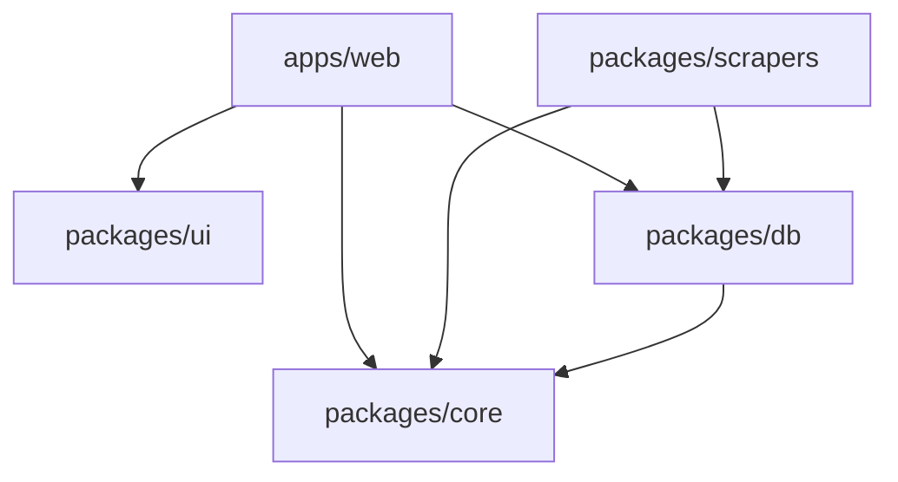

# CompraFino engineering audit

Audit date: October 5, 2026, America/Lima. Baseline: `9ab4575` (`feat: improve catalog coverage and availability quality`). The worktree was clean when inspection began.

This is a read-only ownership review, not a feature milestone or cleanup implementation. Only this report was created; nothing was staged or committed. Finding IDs below are stable references; repeated discussion of an ID is not another finding.

## 1. Executive summary

CompraFino has a sound, deliberately small architecture and unusually careful domain semantics. Its package direction, integer-money handling, conservative substitution rules, atomic price-state persistence, unknown-stock distinction and bounded basket optimizer should be preserved. A broad rewrite, new repository abstraction, new scraping stack or monitoring platform is not justified.

The main debt is accumulated milestone material functioning as current documentation, incomplete automated integration coverage in CI, and a few eligibility boundaries that have diverged. Two concrete correctness risks need focused fixes: zero ordinary prices can enter Tottus/public ranking, and old canonical associations can survive changed identity inputs until matching reconciles them. Neither establishes that current live prices are wrong; both are supported by reachable code paths.

Recommendation: a conservative cleanup and reliability milestone before further catalog expansion. Start with eligibility regressions and deterministic CI, then reconcile documentation and isolate historical evidence. Preserve the 1,000-listing guard. The last recorded catalog has 952 listings, leaving 48 slots; this is dated evidence, not a fresh database count.

No P0 was established. There are **4 P1, 12 P2 and 3 P3 findings**. Priorities distinguish correctness/reliability from cleanup; see section 31 for each finding's effort, evidence, recommendation and behavioral effect.

## 2. Overall maintainability assessment

**Assessment: maintainable foundation, with targeted hardening and documentation cleanup needed before easy ownership transfer.** Production modules are mostly modest in size. `core` contains recognizable domains rather than framework code. `db` has explicit query modules rather than a sprawling generic data-access framework. The web app uses a shared public shell, reusable cards, common history presentation and one shopping editor/dialog flow.

A new engineer can follow source ownership quickly, but cannot safely treat all prose as current instructions. README status, roadmap headings, old completion gates and late appended corrections disagree. Operational budget and acceptance facts often require reading the bottom of several documents. Two large test files concentrate unrelated domains and fixture state. The major ownership burden is reconciling those facts, not understanding the stack.

Scope and confidence:

- Inventoried all 305 tracked files, package manifests, lockfile importers, scripts, six workflows, routes, documentation, fixtures, migration SQL and metadata. Reviewed production domain/query/UI paths and test/harness contracts; this is not a claim of independent manual relabelling of every captured retailer row or matching pair.
- Inspected ignored local artifacts without executing their binaries or treating them as source authority. No credentials or local environment-file contents were printed.
- Source-supported risks and the zero-price reproduction have high confidence. Dead-code labels are repository-local candidates, not proof about external callers. Deployment configuration, live schema state, remote job history, billing, real-device accessibility and dependency vulnerability status were not verified.
- Existing validation reports are historical evidence. They do not substitute for running this checkout's build or browsers.

Checks performed with installed Node `v24.3.0`, pnpm `12.8.1`:

| Check                                  | Result                        | Read-only qualification                                                                                                             |
| -------------------------------------- | ----------------------------- | ----------------------------------------------------------------------------------------------------------------------------------- |
| `pnpm format:check`                    | Passed before report creation | Check mode only                                                                                                                     |
| `pnpm lint`                            | Passed                        | No fixes requested                                                                                                                  |
| TypeScript in core/db/scrapers/ui      | Passed                        | Direct workspace `tsc --noEmit`                                                                                                     |
| Web TypeScript                         | Passed                        | `tsc --noEmit --incremental false -p apps/web/tsconfig.json`; existing generated Next types, no `next typegen`                      |
| Core Vitest                            | 474 passed, 20 files          | Direct `vitest run --no-cache`                                                                                                      |
| DB unit Vitest                         | 56 passed, 12 files           | Cache disabled; integration files excluded                                                                                          |
| Scraper Vitest                         | 113 passed, 13 files          | Cache disabled; no retailer requests                                                                                                |
| Total unit tests                       | **643 passed, 45 files**      | No Turbo result reuse                                                                                                               |
| Pure zero-price boundary reproduction  | Confirmed                     | In-memory alteration of an existing Tottus fixture; no files/network/DB writes                                                      |
| PostgreSQL integration tests           | Not run                       | Require schema creation, migrations, fixture writes and teardown; incompatible with this pass's read-only scope                     |
| Production build                       | Not run                       | Would regenerate `.next` and Next declarations; explicitly excluded by read-only requirement                                        |
| Chromium E2E / benchmark / live audits | Not run                       | Browser runs write reports/screenshots/traces; fixtures and benchmark mutate schemas/artifacts; no live audit snapshot regeneration |

The ordinary root `pnpm typecheck` includes `next typegen`, and Turbo tasks write cache/log artifacts. Direct checks above intentionally avoid those mutations. This is an audit result, not a declaration that all release gates were rerun.

## 3. Architecture assessment

The serverless web/Neon/GitHub Actions split is appropriate for current requirements. Source ingestion does not run in public request handlers. Search records only validated discovery demand after a successful empty read; scheduled processing owns retailer requests. There is no speculative Redis, queue, external search or AI service.

Domain computations are reusable and largely deterministic; time-sensitive APIs accept a `now` argument. Public reads validate SQL aggregates before presentation. Listing history and canonical history reuse one scoped history query and presentation. Basket evaluation uses one bounded statement snapshot rather than per-item web queries.

The main architectural risk is derived identity lifecycle: safe normalization and matching writes do not by themselves make old associations safe during every intermediate reader state (F02). The main automated assurance gap is CI's lack of the actual PostgreSQL and controlled browser suites (F03). Neither requires replacing the architecture.

## 4. Repository/package structure

Actual manifest and production import direction:

| Workspace           | Actual responsibility                                                                                  | Assessment                                                                                  |
| ------------------- | ------------------------------------------------------------------------------------------------------ | ------------------------------------------------------------------------------------------- |
| `apps/web`          | App Router pages, API handlers, browser storage, presentation, E2E                                     | Clear; API tests/benchmark are exceptionally owned by db                                    |
| `packages/core`     | Schemas and pure pricing, normalization, matching, discovery, history, substitution/list/basket policy | Correct boundary; no React/Next/DB imports                                                  |
| `packages/db`       | Drizzle schema, migrations, Neon client, queries, persistence, audits, isolated tests                  | Coherent but also ships test transport and imports a web route in test/benchmark code       |
| `packages/scrapers` | Retailer adapters, acquisition orchestration, refresh/discovery CLIs                                   | Correct; source-specific parsing stays local                                                |
| `packages/ui`       | Base UI primitives, chart wrapper, dialog, skeleton, theme/styles/icons                                | No product matching or database logic; some app-specific CSS is acceptable at one-app scale |

All internal dependencies use `workspace:*`. No production workspace dependency cycle was found. Test/benchmark imports from db back into `apps/web` are a source-level ownership exception, not a production manifest cycle (F07). The browser-safe `db/search-filters` facade delegates directly to the existing `core/search-filters` entry point (F14).

No config/tooling workspace is present or needed. Source exports with no artificial library build step are intentional. Root-level lint/format avoids duplicated workspace checks. There is no `CLAUDE.md` or nested tracked `AGENTS.md`.

## 5. Domain organization

| Domain                      | Core owner                                                                      | Persistence/acquisition/UI owner and assessment                                                                  |
| --------------------------- | ------------------------------------------------------------------------------- | ---------------------------------------------------------------------------------------------------------------- |
| Ingestion                   | `listing.ts`, exact money parser                                                | db `ingestion.ts`; scraper `adapter.ts`, `ingestion.ts`; shared atomic writer is good                            |
| Normalization               | `catalog.ts`                                                                    | db `catalog.ts`; fingerprinted derived records and replay guards are good                                        |
| Exact matching              | `matching.ts`                                                                   | db `matching.ts`, evaluation/audit CLIs; complete-link groups and manual-link protection are good                |
| Public search               | `public-products.ts`, `product-family.ts`, `search-filters.ts`                  | db `public-products.ts`, `generic-offers.ts`; SQL token admission plus core quantity/family interpretation       |
| Freshness                   | `freshness.ts`, `listing-refresh.ts`                                            | Separate run-health and listing-age semantics are intentional, not redundant thresholds                          |
| Discovery                   | `discovery.ts`                                                                  | db demand/budget/claim lifecycle; scraper `discovery.ts` and CLI; no query-to-canonical shortcut                 |
| Targeted refresh            | `listing-refresh.ts`                                                            | db claims/outcomes; scraper `targeted.ts`, `listing-refresh.ts`; exact evidence is separated from failed fetches |
| Ordinary/conditional prices | `listing.ts`, `conditional-offer.ts`, `conditional-pricing.ts`, `unit-price.ts` | db independent current-benefit table and open ordinary states; explicit CMR requirement preserved                |
| Price history/coverage      | `price-history.ts`, `observation-coverage.ts`                                   | db scoped query and prospective daily rollup; web common presentation/chart                                      |
| Availability                | Refresh admission and price/fulfillment gates                                   | Retailer evidence parsers and db evidence timestamps/missing counters; unknown remains distinct from false       |
| Safe substitution           | `substitution-compatibility.ts`                                                 | Search family evidence does not grant generic substitution; good conservative boundary                           |
| Recurring list              | `shopping-list.ts`, `shopping-creation.ts`                                      | db read-only evaluation; web repository/hook/editor; versioned storage migration                                 |
| Basket optimization         | `basket-optimization.ts`                                                        | db one-snapshot evaluation; web basket presentation; seven subsets, no duplicated substitution policy            |
| Listing details             | History/quantity/shared domain functions                                        | db `listing-detail.ts`, web `/listings/[id]`; independent UUID identity is correct                               |
| Catalog coverage            | Existing family/quantity/substitution functions                                 | db `catalog-coverage.ts`; deliberately reuses real public boundaries rather than inventing useful coverage       |

Business policy is predominantly in core. Search-page default quantity selection and the special egg default are UI creation policy currently embedded in `search/page.tsx`; this is a small extraction candidate under F09, not evidence that the whole page needs decomposition. Whole-package rounding, overbuy limits, preferred savings, freshness and optimizer ranking are not hidden in JSX.

## 6. Database/query review

Nine ordered migrations define eleven tables. `schema.ts` is about 333 lines: a single schema file is still understandable. Query modules align with their use cases, and complex PostgreSQL statements have useful invariant comments. Raw SQL uses Drizzle parameter binding; no `sql.raw` use was found in production source. Dynamic identifiers in test harnesses come from generated/schema-validated names.

Strong design:

- Listing batches are atomic; retailer row locks serialize writers, stable retailer ordering protects normalization/matching, and catalog-admission advisory locking serializes cross-retailer capacity decisions.
- Older/equal observations are rejected; unchanged quotes advance verification without appending ordinary states. Partial unique open-state and listing/start indexes independently enforce key invariants.
- Matching persistence guards raw/derived snapshots, manual decisions and incomplete groups. Canonical/listing/retailer foreign keys and per-retailer group uniqueness enforce identity shape.
- History predecessor lookups use the listing/start index. Daily coverage is aggregated separately, avoiding state multiplication. Public paths have no unbounded per-retailer query loop.
- Discovery claims separately acquire the daily-budget lock before READ COMMITTED updates and use `skip locked`; this is purposeful concurrency logic, not SQL to simplify casually.

Issues and tradeoffs:

- F01/F02: exact/public eligibility accepts nonnegative prices and omits current identity validation. Generic/detail boundaries check normalization fingerprints, but exact `eligibleProducts` does not. Normalization alone also cannot prove an existing association was matched against the latest identity.
- F09: freshness, auto-confidence and 1,000/1,001 bounds are repeated in SQL, core and orchestration. Share policy constants and contract tests, not a generic repository layer.
- `coverageReport` executes up to twenty sequential attributed-group queries plus twenty canonical searches. This is a bounded operational/development N+1, not a public basket N+1. Batch only if actual report latency warrants it.
- `eligibleProducts` aggregates the canonical catalog even for a single product/listing projection. Current basket JSON snapshots normalize/reclassify the complete current set in JavaScript. Existing measured latency supports profiling (section 23), not inventing indexes without query plans.
- One SQL statement is a consistent snapshot. Multiple `db.batch` statements at default READ COMMITTED can see different committed states; do not describe every multi-statement audit as a single point-in-time database snapshot.

## 7. Next.js/React review

Routes and layouts use Server Components. Required Client Components cover navigation pending state, interactive filters/form, image errors, charts, themes, localStorage/list editing and dialogs. No SQL is embedded in React. Small server wrappers and shared `PublicShell`, cards, loading components and history presentation keep duplication controlled.

The installed Next `16.3.8` documentation under `apps/web/node_modules/next/dist/docs/` was consulted for `after` and Link/navigation semantics. Async route props, request-time `connection()`, request-local React `cache`, keyed search Suspense and `onNavigate` usage are deliberate. No framework configuration was changed.

Specific observations:

- Search has an explicit keyed Suspense boundary in addition to route `loading.tsx`; one supports changed URL results, the other route transitions. Do not remove one just because both display the shared skeleton.
- Navigation prevents repeated activation while retaining Link's modified-click behavior. Recent test history shows prefetch timing races, with fixes in `b731316`, `2619099` and the milestone-17 report; it does not establish an unresolved application race.
- Product metadata uses `loadProduct(id, "standard")`; benefits pages call the same cached function with a different mode, causing another comparison read (F18). Listing metadata/page already share identical range keys.
- `search-controls.tsx` imports the browser-safe db facade. This is currently safe, but unnecessary ownership indirection (F14). No current secret-in-client bundle was established.
- Shopping requests use abort controllers and response schemas; stale responses cannot replace the current list/mode. Visible-tab refresh is one minute, and requests are uncached. This is understandable without TanStack Query.
- `useShoppingList` has a reasonable session fallback and cross-tab notification design, with a transient reread failure edge case (F19). Concurrent tabs can still race read-modify-write; documentation correctly says reduced lost writes, not atomic storage.
- Dialog focus containment, escape/backdrop dismissal, focus restoration after regrouping, reduced-motion behavior, labels and skip links have concrete implementations and E2E coverage. Chart DOM assertions are library-coupled (F17); a full screen-reader/physical-device audit was not performed.

Largest app components are approximately 258–285 lines. These sizes alone do not justify broad splitting. `price-history.tsx` logs failures and shows explicit unavailable-history copy, rather than fabricating an empty healthy history.

## 8. TypeScript review

Strict mode, `noUncheckedIndexedAccess`, isolated modules and no-emit checks are consistent. No explicit TypeScript `any`, suppression directives or meaningful TODO/FIXME escape hatches were found in tracked application/package source. SQL's `any(...)` occurrences are PostgreSQL expressions, not TypeScript violations.

External retailer JSON, API bodies and localStorage are `unknown` until validated. Most public DB aggregate projections use Zod and inferred types. `ReturnType<typeof createDatabase>` and inferred domain results avoid manual reconstruction of full DB row types. Small schema/type differences represent transport projections, not gratuitous duplication.

Non-null assertions are mostly backed by array length checks, validated fixture indices, complete-link group construction or response invariants. Do not mass-replace them for stylistic purity. `evaluatePairs` assumes its SQL query returns every requested pair; this is reasonable for that exact projection, though missing-pair diagnostics would be easier to debug than a downstream undefined score. The Neon proxy/local transport is the most specialized typing machinery, justified by real isolated tests; improve its ownership (F10), not its existence.

No overly complex generic abstraction or TypeScript/Zod divergence requiring a rewrite was established. The API response schema validates basket sums, coverage, unique IDs and monotonic tier savings; this is substantive boundary validation.

## 9. Validation/error handling

| Boundary/failure                          | Current behavior                                                                                         | Assessment                                                                                                 |
| ----------------------------------------- | -------------------------------------------------------------------------------------------------------- | ---------------------------------------------------------------------------------------------------------- |
| Retailer response                         | Retailer Zod schema, URL/identity/seller/price checks; fail closed or explicitly skip supported omission | Strong; ordinary zero Tottus quote remains a hole (F01)                                                    |
| Missing/malformed exact retailer evidence | `not-found`, `unavailable`, or failure distinguished                                                     | Protect this distinction                                                                                   |
| API list body                             | `unknown`, schema validation before DB access; malformed JSON becomes 400                                | Good logical limits; no application byte cap before parsing (F13)                                          |
| URL params                                | Scalar checks, range/mode/filter defaults, UUID validation before queries                                | Good                                                                                                       |
| localStorage                              | Versioned schema, legacy migration, invalid-data warning, session fallback                               | Good with transient reread risk (F19)                                                                      |
| Environment                               | PostgreSQL URL protocol validated; test-only local URL/schema tightly constrained                        | Good; template omits intentionally internal harness variables, documented separately                       |
| CLI args                                  | Numeric/category allowlists and bounds                                                                   | Generally good; scraper parser accepts repeated options while catalog/discovery/targeted reject them (F09) |
| DB aggregate values                       | Mostly Zod parsing, current-version/fingerprint and trusted URL gates                                    | Good, exact association lifecycle exception (F02)                                                          |
| Public DB failure                         | Safe data-error copy or 503, not false zero-result discovery                                             | Good                                                                                                       |
| Background failure                        | Retailer isolation, safe summaries, failed exit status; prior data retained                              | Good reliability, weak diagnostic specificity (F08)                                                        |
| Storage write failure                     | Warning and session-local list                                                                           | Appropriate; no account/storage service needed                                                             |

Ordinary, optional benefit and availability evidence are deliberately validated at different strengths. Invalid CMR evidence can be discarded without discarding a valid ordinary quote. Validation at source and persistence is intentional defense at separate boundaries, not wasteful duplication.

Many scheduled paths catch errors without retaining a structured reason, while product/listing/history pages log entire error objects. Neither is evidence of a confirmed credential leak, but the asymmetry makes safe debugging difficult (F08). Run creation/finish failures can leave `running` records, and partial fetch progress before an adapter returns is lost; both are already documented limitations, not hidden transaction promises.

## 10. Testing assessment

The implemented pyramid is healthy in breadth: **643 passing offline unit tests**, real isolated PostgreSQL tests for SQL constraints/rollback/races, and Chromium application tests for interaction/navigation/storage/history. Fixture tests do not scrape retailers. DB SQL-string contract tests are supplemented by real-database tests, so they are not the sole correctness proof.

The automation pyramid is weaker: ordinary CI excludes PostgreSQL integration tests, and the history/listing/shopping fixture suites skip unless their harness runs (F03). Historical documentation reports 52 PostgreSQL tests, eight listing fixtures and 22 shopping/basket cases; those counts were not rerun here.

Maintainability concerns:

- `packages/db/src/ingestion.integration.test.ts` is 2,090 lines and covers persistence, matching, search, discovery, quantity/history/list/availability/capacity domains in one suite. It uses suite-wide state and resets. The milestone-14 report explicitly records order interference with discovery fixture foreign keys (F06).
- Journal loading, extension filtering, foreign-key rewriting, transaction-local schema wrapping and fixture setup recur in the integration suite, shopping suite, history runner and benchmark (F06). Share the isolation contract before splitting tests into independently seeded suites.
- `apps/web/e2e/shopping-list.spec.ts` is 810 lines and includes shopping intent, storage, dialogs and basket cases. Serial sections support intentional fixture mutations. Keep mutation scenarios serial or give them independent schemas; do not enable parallelism blindly.
- There are no `waitForTimeout` sleeps in the browser suite. Network holds and `expect.poll` test actual navigation timing. Production scraper pauses are conservative request behavior, not flaky test sleeps.
- Role/name selectors predominate. `.recharts-scatter-line .recharts-curve`, product CSS classes and some `.first()` assertions couple tests to rendering internals. The documented duplicate unavailable-text failure was fixed by panel scoping (F17).
- CI has one retry, local zero; this is ordinary resilience, not proof of masked flakiness. Remote retry history was not available. Failure traces are retained locally but not uploaded by CI (F17).

No stale removed-feature test was proven dead. Generic-only, quail, CMR, availability, replay and history-gap tests protect meaningful distinctions and should remain.

## 11. CI assessment

| Workflow                                 | Trigger                      | Concurrency / timeout                                  | Assessment                                                                                |
| ---------------------------------------- | ---------------------------- | ------------------------------------------------------ | ----------------------------------------------------------------------------------------- |
| `.github/workflows/ci.yml`               | PRs, `main` pushes           | `ci-${github.ref}`, cancel previous; 20 min            | Frozen install, format/lint/types/unit/build/Chromium; missing isolated SQL/browser gates |
| `.github/workflows/refresh-catalog.yml`  | `17 11,23 * * *`, manual     | Shared catalog group, no running cancellation; 120 min | 06:17/18:17 Peru; source requests and derivation isolated from ordinary CI                |
| `.github/workflows/discover-catalog.yml` | `43 0,6,12,18 * * *`, manual | Same catalog group; 60 min                             | 19:43 previous Peru day, 01:43/07:43/13:43; 10-query batches, DB daily guard              |
| `.github/workflows/ingest-tottus.yml`    | Manual only                  | `ingest-tottus`; 20 min                                | Validated bounded input, quoted env argument                                              |
| `.github/workflows/ingest-plaza-vea.yml` | Manual only                  | `ingest-plaza-vea`; 20 min                             | Same setup; retailer-specific scope                                                       |
| `.github/workflows/ingest-metro.yml`     | Manual only                  | `ingest-metro`; 20 min                                 | Default dairy description is consistent with omitted category option                      |

All six use Node 24, manifest-pinned pnpm via action setup, frozen installs, pnpm caching and read-only repository permissions. No stale duplicate schedule was found. Shared refresh/discovery concurrency is intentional; manual/local processes still rely on DB locks. Repeated setup steps in six short workflows are harmless; a reusable-workflow refactor is optional and not a priority.

F03: only ordinary E2E receives the application `DATABASE_URL` secret. Expected values are read from a changing catalog, while the public zero-result test calls a page that records discovery demand through `after`. It therefore has a real side effect when pointed at an application database. Secrets are unavailable to forks, so coverage varies by PR origin. CI never runs `test:integration:local`, `test:e2e:history:local --listings`, `test:e2e:history:local` or `test:e2e:list:local`. The existing Docker setup can provide deterministic, secret-independent coverage without new infrastructure.

No Actions artifact upload captures retained traces on failure (F17). Add this alongside fixture CI, rather than introducing an alerting platform.

## 12. Dependencies

All direct dependencies have actual imports, commands, build use or peer/type use. Lockfile importers match the declared workspace/package direction; no unexplained direct scraping/forms/cache dependency was found. Exact versions and frozen install are consistent. This audit did not query a vulnerability database or recommend upgrades.

| Group                                           | Classification / evidence                                                                                                                                           |
| ----------------------------------------------- | ------------------------------------------------------------------------------------------------------------------------------------------------------------------- |
| Root TypeScript, Turbo, Oxlint, tsgolint, Oxfmt | Clearly required by root scripts; correctly development-scoped                                                                                                      |
| Web Next/React/React DOM and three workspaces   | Clearly required by routes and components                                                                                                                           |
| Web Tailwind/PostCSS/types/Playwright           | Build or test tooling; appropriate dev scope                                                                                                                        |
| Core Zod/Vitest                                 | Runtime schemas / pure tests; correct                                                                                                                               |
| DB Drizzle/Neon/Zod/core                        | Runtime SQL/schema/boundaries; correct                                                                                                                              |
| DB Drizzle Kit/dotenv                           | Reviewed generation/migration tooling; correct dev scope                                                                                                            |
| DB `pg`                                         | Used by local test transport, imported transitively by production client; currently runtime scope is required by implementation, but ownership should improve (F10) |
| UI Base UI/cva/clsx/tailwind-merge              | Button/select/utilities; required                                                                                                                                   |
| UI Lucide/Recharts                              | Actual icon and history-chart imports; required, despite stale docs                                                                                                 |
| UI React/DOM dev and peers                      | Independent typechecks plus consumer peer contract; legitimate, not needless duplication                                                                            |
| Scraper Zod/core/db                             | Source validation and orchestration/persistence; required                                                                                                           |

Do not remove `pg` merely because it is conceptually testing tooling: static production imports currently reach it. Do not remove Recharts/Lucide based on README or old inventory claims. `docs/dependencies.md` omits current UI Lucide and a normal web db row, retaining an old milestone addendum; update the inventory under F04.

## 13. Scripts/commands

The command surface is large because there are real operations and audits, not because obsolete scripts were proved unused.

| Command family                                                      | DB/network/write behavior                                                               | Assessment                                                                                   |
| ------------------------------------------------------------------- | --------------------------------------------------------------------------------------- | -------------------------------------------------------------------------------------------- |
| `dev`, `build`, `typecheck`, `lint`, `format:*`, `test`, `test:e2e` | Build/types/tests can generate ignored artifacts; lint/format check modes are read-only | Clear; document full gate and read-only variants                                             |
| `db:generate`, `db:migrate`                                         | Generate SQL locally / explicitly mutate configured DB                                  | Keep distinct; normal clone should apply existing reviewed migrations, not generate new ones |
| `scrape:tottus`, `scrape:plaza-vea`, `scrape:metro`                 | Bounded live requests; default persists; dry-run fetches without DB                     | Real current operations, retain                                                              |
| `refresh:catalog`                                                   | Live requests, writes, normalization/matching; dry-run fetches without DB               | Real scheduled entry point                                                                   |
| `discover:catalog`                                                  | Claim/budget/retailer/write lifecycle; dry-run reads demand only                        | Explicit and safe                                                                            |
| `refresh:listings`                                                  | Known-SKU claims/requests/writes; dry-run selection reads DB                            | Keep, semantics differ from category dry-run                                                 |
| `normalize:catalog`, `match:catalog`                                | Derived writes; optional read-only previews                                             | Keep; small default sample is documented, complete pipelines explicitly pass 1000            |
| `match:evaluate`, `match:audit`                                     | DB similarity evaluation, no association writes                                         | Calibration and independent audit are different, not redundant                               |
| `coverage:report`, `catalog:budget`, `audit:*`                      | Read-only DB/measurement commands                                                       | Useful operator tools; budget consumes a local historical JSON (F11)                         |
| `test:db:*`, `test:integration:local`, fixture runners              | Disposable PostgreSQL / random schemas / browser artifacts                              | Existing basis for CI hardening                                                              |
| `benchmark:basket:local`                                            | Isolated fixture DB plus tracked performance JSON overwrite                             | F12: make destination explicit before treating as routine verification                       |

`audit:availability` intentionally aliases `audit:catalog-coverage`; do not deduplicate away a useful operator alias. Listing-detail audit is real and documented as a direct Node command in `docs/listing-detail.md`, even though it has no root pnpm alias. Adding an alias is optional. The unused product-search API is a route, not a missing command (F15).

## 14. README assessment

The root README covers product intent, package graph, Node/pnpm pins, `.env` versus web `.env.local`, migrations, ingestion commands, tests, deployment and CI. DB and scraper READMEs explain real invariants and commands. Missing package READMEs for core/UI/web are not a defect by themselves; concise root/domain docs can suffice.

F04: the 263-line root document mixes current product behavior with implementation history. “Current status” still describes milestone-14 acceptance as pending; the bottom says milestone 18 is staged despite committed HEAD. “Roadmap” says Recharts is only intended, while later history sections describe implemented charts. Setup's migration example includes `db:generate`, although a new engineer should first apply the existing reviewed journal. The Vercel section gives useful monorepo settings but calls them a future project while declaring deployment complete elsewhere.

Target shape: current product capabilities and limitations; five-package graph; short clone/run path; explicit environment matrix; existing migration command; test matrix; operator command links; deployment/rollout checklist. Move task-baseline commit IDs, fixed catalog counts, test counts and approval history to dated evidence. Keep the useful explanation that generated `next-env.d.ts` is ignored and `next typegen` supplies it.

## 15. AGENTS.md assessment

Only root `AGENTS.md` exists: 29 lines, already concise. It accurately captures pnpm, strict TypeScript, package ownership, source-access limits, toolchain, reviewed migrations, domain tests, docs and definition of done. No contradictory obsolete milestone instructions occur there. The no-speculative-chart rule means avoid unjustified additions; it does not forbid the already implemented history chart.

Keep one root file. Proposed future additions, kept short: never use application `DATABASE_URL` as test fallback; use random-schema/disposable fixtures for writes; preserve tri-state stock, accepted observation semantics and safe substitution gates; update all writers when changing ingestion invariants. Link detailed domain docs instead of copying tables/thresholds. Existing user authorization always governs task-specific approval; historical docs must not be treated as current commit permissions.

## 16. Documentation consistency

All tracked Markdown local link targets checked by a simple path scan resolve. Link existence does not establish semantic freshness. The following contradictions are concrete instances of F04:

| File / section                                                      | Conflict with current source or another document                                                                    | Recommended treatment                                                               |
| ------------------------------------------------------------------- | ------------------------------------------------------------------------------------------------------------------- | ----------------------------------------------------------------------------------- |
| `README.md` — Current status                                        | Milestone 14 pending; current HEAD contains milestone 18                                                            | Replace with present capabilities; archive acceptance narrative                     |
| `README.md` — Roadmap                                               | Recharts called future dependency; UI manifest/chart use it now                                                     | Distinguish implemented charts from truly deferred tools                            |
| `README.md` — Milestone 18 catalog operations                       | “Changes remain staged pending commit approval”; HEAD `9ab4575` committed                                           | Remove local task-state claims from current guide                                   |
| `docs/roadmap.md` — Milestone 18 heading/body                       | Heading pending local build/Chromium; body says complete with passing browser checks                                | Collapse completed entry; keep future roadmap separately                            |
| `docs/roadmap.md` — Milestone 15.1/16                               | “Commit authorized; do not push…”, “staged and uncommitted”                                                         | Historical authorization text must leave active guidance                            |
| `docs/operations.md` — opening / Architecture and coverage          | Sixteen sources, 590 observations; code has seventeen sources, 600                                                  | Put current limits at top; dated old measurements elsewhere                         |
| `docs/operations.md` — Latest attempt, latest success and freshness | Says stale public messaging deferred/no price hidden automatically; current generic gates and UI stale labels exist | Describe current policy and retain past design as history                           |
| `docs/operations.md` — Live validation                              | No successful build and staged gate as historical conclusion                                                        | Separate from actionable troubleshooting                                            |
| `docs/architecture.md` — Package/task management                    | CI described “without credentials”; workflow injects `DATABASE_URL` into E2E                                        | State credential-free versus optional live coverage accurately                      |
| `docs/architecture.md` — Known listing refresh / History / Shopping | Pending acceptance language for already committed work                                                              | Link dated validation, describe current ownership only                              |
| `docs/dependencies.md` — UI inventory / concluding bootstrap text   | Says initial icon preference installs no icon dependency; actual Lucide runtime use                                 | Complete current inventory; archive bootstrap decisions                             |
| `docs/catalog-budget.md` — Validation and next UX                   | Says no history UI implemented; later revision documents subsequent milestones                                      | Retain old conclusion only in historical section                                    |
| `docs/catalog-budget.md` — early budget vs Milestone 18 revision    | 486 daily cap/590 observations then 490/600 update                                                                  | One current policy table plus separately dated measurements                         |
| `docs/local-testing.md` — verification / Shopping fixtures          | 41 tests/542 unit tests and browser build pending; later reports show 52/643 and passed fixtures                    | Do not put frozen counts or historical sandbox failure in current setup status      |
| `docs/milestone-14-validation.md` — opening / final report          | “not complete” and commit instructions, while roadmap identifies later accepted baseline                            | Archive, label as historical partial-run evidence                                   |
| `docs/catalog-matching-audit.md` — final paragraph                  | Stage/wait instructions from milestone 3 despite implemented later milestones                                       | Archive final instruction; merge only enduring evaluation policy                    |
| `docs/catalog-coverage.md` — opening / final validation             | Staged/uncommitted deployment assertions                                                                            | Keep dated measurement; do not infer current remote deployment from old local state |

Other domain/retailer docs append milestone follow-ups after older limits and validation. Some explicitly mark earlier material historical; this lowers ambiguity but still burdens readers. Fixed catalog/test/category counts should be dated evidence, not evergreen definitions. No unsupported claim is made that remote deployment matches HEAD.

## 17. Prompt/milestone document classification

No separate tracked prompt directory or standalone pasted task prompt was found. Historical prompts/approval language are embedded in roadmap and validation Markdown. The user's attached task file is outside the repository and is not a cleanup candidate.

Section 32 lists exact documentation/artifact paths. Policy: KEEP permanent rules and current operating guides; MERGE durable UX/design details into their permanent owners; ARCHIVE measurements and acceptance narratives with timestamps/baselines; REMOVE only demonstrably obsolete local/generated material or narrowly unused bootstrap code. Do not delete source fixtures or matching independent labels as “milestone artifacts”: tests and evaluators consume them.

Archiving means preserve evidence and update every link/runtime reference in a separately reviewed cleanup. It is not permission to move files in this audit.

## 18. Roadmap assessment

`docs/roadmap.md` is primarily an implementation/acceptance history: milestone 0 through 18, baseline commits, live counts, staged instructions and multiple “Later” sections interleaved. That historical record is useful but does not provide a crisp next-development decision.

Under F04, collapse completed work into a brief capabilities summary with links to archived history. Keep a short current roadmap ordered by evidence: eligibility/CI/docs hardening; measured query/capacity review; observation accumulation; separately reviewed future promotion/timing/substitution/account requirements. Do not start those features as part of cleanup. Recharts is already implemented and should not appear among unadopted future stack options.

## 19. Generated/temp artifacts

Tracked source totals approximately 4.61 MB. The twenty `docs/*.json` evidence files occupy approximately 2.51 MB, including ~633 KB staple-after, ~557 KB catalog-coverage and ~373 KB staple-baseline snapshots. These are deliberate captured evidence, not accidental screenshots or secrets.

- `.tools/` contains bootstrap pnpm/browser assets and UI/navigation screenshots; ignored, machine-local, not a repo architectural dependency. The README already says it is optional.
- `.next`, `.turbo`, `.pnpm-store`, web `test-results`, `tsconfig.tsbuildinfo`, generated `next-env.d.ts` and node_modules are local ignored outputs. None of the inspected generated screenshot/trace/Next-type patterns is tracked.
- Migration `meta/*_snapshot.json` and `_journal.json` are generated but authoritative versioned migration inputs; KEEP them.
- Retailer fixtures and reviewed matching/relevance JSON are test/evaluation inputs; KEEP them.
- Historical catalog/audit/benchmark JSON should be archived or regenerated to an explicit ignored output destination, preserving reviewed baselines (F12).
- `docs/catalog-refresh-measurement.json` is an exception: budget CLI reads it at runtime (F11). Do not move/delete it until the consumer is changed and provenance checks exist.
- Benchmark CLI unconditionally overwrites `docs/milestone-16-performance.json`, even though milestone-18 benchmark evidence has a separate file. This is an actual historical-artifact overwrite hazard, not merely naming preference (F12).

## 20. Gitignore assessment

Coverage is good: node_modules, project pnpm store, `.tools`, `.next`, exact Next declaration path, Turbo, dist, coverage, Playwright report/results, all local `.env*` except `.env.example`, TS build info and OS metadata. Tracked credential-like names are the blank `.env.example` and env source/tests, not real credentials.

No tracked browser screenshots, traces, caches or generated Next declarations were found. `c3e5eb7` specifically stopped tracking Next declarations; do not undo that fix. Gitignore need not blanket-ignore all JSON or screenshots, since intentional fixtures/evidence may be reviewed source. If future audit output defaults change, reserve an ignored report-output directory rather than silently ignoring the reviewed docs corpus. Local optional `.agents/.codex/.aws` directories are not tracked in this checkout; no blanket deletion or guessed credential inspection is warranted.

## 21. Naming/terminology

Recommended vocabulary (no mass rename):

| Term                         | Meaning / current examples                                                                        |
| ---------------------------- | ------------------------------------------------------------------------------------------------- |
| Retailer listing             | One retailer/source SKU; `retailer_listings`, `/listings/[id]`                                    |
| Canonical product            | Trusted exact cross-retailer identity; `/products/[id]`                                           |
| Generic retailer option      | Independent current quote admitted to search; not a substitution guarantee                        |
| Ordinary price               | Unconditional observed payable quote; internal `currentPriceCents`, UI “para todos”               |
| Reference price              | Higher crossed/list value; internal `regularPriceCents`; not ordinary history's winner            |
| Conditional offer/benefit    | Explicit program amount and condition; currently CMR                                              |
| Price state                  | Interval in `price_history`; opening can reflect reference/unit change as well as ordinary change |
| Price observation            | Accepted quote at a source timestamp; can leave the state unchanged                               |
| Verification/coverage        | Successful evidence; daily rollup does not imply continuous real-time monitoring                  |
| Availability                 | Explicit true/false or unknown; separate timestamp, never category omission                       |
| Freshness                    | Listing age for recommendations versus retailer run health; distinct policies                     |
| Public identity eligibility  | Safe canonical group; may still have historical/unavailable offers                                |
| Current purchase eligibility | Fresh, usable quote with applicable quantity/substitution gates                                   |
| Discovery                    | Deferred acquisition from validated unmet search demand                                           |

“Offer” is used for both ordinary retailer rows and conditional offers; qualify it in docs rather than renaming the API. `standard` is a mode name and `regularPriceCents` is a reference price; clarify the vocabulary so “standard/regular” are not treated as synonyms. `knownListings.public` means an association-priority approximation, not exact current purchase eligibility; reports already differ intentionally, but names/docs should qualify this under F09/F04.

## 22. Security/data handling

Practical strengths: blank secret template and ignored env files, protocol/host/path URL gates, encoded route/query inputs, parameterized SQL, UUID validation before DB work, React text escaping, `noopener noreferrer` external links, fixed retailer endpoints and redirects refused in scrapers. The static theme initializer is the only inspected raw HTML injection and does not interpolate user text. `/dev/*` blocks before database access in production.

No confirmed credential exposure, SQL injection, HTML injection or access-control bypass was established. This was not a penetration test or dependency security scan.

Practical follow-ups:

- F03: stop relying on the application secret for required CI coverage; the zero-result page performs a demand write.
- F08: standardize safe structured diagnostics instead of raw database error objects or completely generic failure messages.
- F13: the evaluation API bounds validated items/fields but calls `request.json()` before any application byte cap. Fifty small needs bound normal work, not arbitrarily large invalid payload parsing. Add a conservative body-byte boundary with tests; platform limits were not inspected.
- F13: `discovery_queries.original_query` retains user search text indefinitely; there is no user ID/IP storage, but users can still put personal information into a valid query. The daily budget bounds processing, not the number of stored distinct demand rows. Define retention/admission policy before broad traffic; no new rate-limit service is recommended now.

Browser lists stay browser-local, but evaluation sends their labels/queries/quantities to the server; it does not persist the list. Document that distinction if privacy copy is expanded. No authentication should be added solely for this cleanup.

## 23. Performance/scale assumptions

| Bound / assumption                                  | Actual location / behavior                                                       | Assessment                                                                        |
| --------------------------------------------------- | -------------------------------------------------------------------------------- | --------------------------------------------------------------------------------- |
| 1,000 retained listings                             | Ingestion admission, scope guard, public generic/basket/coverage overflow checks | Preserve; duplicated policy literals (F09), only 48 recorded slots remain (F05)   |
| 1,001 reads                                         | Generic search and snapshots detect overflow instead of truncating optimum       | Correct sentinel pattern                                                          |
| 20 exact / 30 generic results                       | `public-products.ts`, `generic-offers.ts`                                        | UI bounds; unlimited admitted candidates are considered before generic sort/limit |
| 36h fresh / 72h visible                             | Core refresh policy; SQL repeats 36h                                             | Centralize same policy, don't merge with run-health 18h/30h                       |
| Targeted age 24h / cooldown 12h / max 100           | Core policy, db claim, scraper budget                                            | Useful source recovery and conservative bounds                                    |
| Three consecutive retailer failures                 | Scraper targeted processor                                                       | Local behavior constant can remain source-orchestration-owned                     |
| Discovery 30 queries/day / 10 results per retailer  | Core, SQL constraints, workflow limit                                            | Processing budget is UTC; observation days are Peru; intentional distinction      |
| Scheduled categories                                | Seventeen sources, up to 600 observations, hard 100 category requests/cycle      | Code-derived budget; docs need current top-level table                            |
| Daily scheduled request cap                         | 2 × (100 category + 100 targeted) + 90 discovery = 490                           | Excludes manual/audit calls; not a traffic guarantee                              |
| CLI sample 1–5000                                   | Catalog/matching operator commands                                               | Intentional operator sample bound, distinct from complete production cap          |
| Shopping 50 needs, quantity up to 10000, 3 decimals | Core schemas; API reuses them                                                    | Meaningful computation bounds; request bytes remain unbounded at app boundary     |
| History 7/30/90 days                                | Core range parse and scoped query                                                | Bounded time window; no explicit number-of-states cap inside window               |
| Observation growth                                  | One listing/day identity; accepted count increments                              | No retention yet; current measurements do not justify destructive deletion        |

Recorded October 5 evidence in `docs/catalog-coverage.md`: real configured-DB four-need basket retrieval median ~1,879.6 ms, total ~1,969.6 ms; listing detail ~260.7 ms. The isolated 900-row handler benchmark ~87.7–97.3 ms excludes deployed HTTP/Neon latency. Do not compare them as a claimed speedup. Candidate count ~9,751 is blocked-candidate workload, not a full Cartesian catalog comparison.

F05 recommends a capacity decision and operational admission-failure visibility before expansion, not raising a cap automatically. Existing-identity refresh remains permitted at capacity; mixed batches containing over-cap new rows atomically fail. F18 is a narrow duplicate-read opportunity; profile aggregate CTE costs and candidate projection with real query plans before adding caching/indexes/infrastructure.

## 24. Operations/observability

JSON stage events, run records, safe errors, latest attempt separate from latest success, targeted statuses, read-only coverage/availability/budget/history CLIs and GitHub nonzero job results are adequate building blocks at this scale. Conservative failure isolation retains last-known-good data and prevents ambiguous negative inference. Dry-run modes have documented differing DB/network behavior.

Weaknesses: generic scheduled failures lose reason codes (F08), targeted/discovery do not have full ingestion-run records (documented), CI does not retain diagnostics remotely (F17), and budget runtime mixes current configuration with optional older evidence (F11). DB cannot record its own outage; Actions logs remain necessary. An interrupted run may leave running/processing state; discovery cooldown retry is explicit, and abrupt test termination can leave only the owned schema.

Recommend safe stage/retailer/error codes, a current runbook and failed-run artifacts. Do not add Grafana, OpenTelemetry, a worker service or broad automatic cleanup. Remote schedule activation, actual deployed writer versions and alert settings were not observable locally.

## 25. Developer-experience assessment

Clone walkthrough:

| Step                | Available instructions / outcome                                       | Friction                                                                                |
| ------------------- | ---------------------------------------------------------------------- | --------------------------------------------------------------------------------------- |
| 1. Node/pnpm        | Node 24.x, pnpm 12.8.1, `.node-version`, `packageManager`              | Version selection assumes an existing manager/Corepack; `.tools` is explicitly optional |
| 2. Install          | `pnpm install --frozen-lockfile`                                       | Clear; not rerun because dependency installation was out of scope                       |
| 3. Env              | Root `.env` for operations, web `.env.local` for requests              | Correct but repeated; one environment matrix would help                                 |
| 4. DB               | Neon for app; disposable Docker PostgreSQL for tests                   | These are distinct: normal app driver is Neon HTTP, not automatic local TCP             |
| 5. Migrations       | Explicit reviewed journal, no build-time migration                     | README should lead with applying existing migrations, not generating (F04)              |
| 6. Run web          | `pnpm dev`, loopback 3000, static home works without DB                | Clear                                                                                   |
| 7. Unit tests       | `pnpm test`; all offline                                               | Good                                                                                    |
| 8. PostgreSQL tests | Explicit test URL or `test:db:up` + `test:integration:local`           | Good isolation; stale test-status narrative obscures current state                      |
| 9. E2E              | Build first, install Chromium headless shell, `test:e2e`               | Secret-dependent public cases versus fixture cases need a single matrix                 |
| 10. Fixtures        | History, listing flag and shopping local runners                       | Good reuse; naming is history-centric although harness now serves three domains         |
| 11. Operations      | Root scripts and package/domain docs                                   | Strong command coverage, fragmented current limits                                      |
| 12. Deploy          | Vercel root/monorepo settings, Neon secret, migrations, Actions secret | Useful; coordinated writer rollout belongs in one current checklist                     |

No hidden global dependency or browser scraping installation is required. No fresh clone/install/build/deploy was executed during this audit. The sandbox failure documented in old reports is not evidence that this checkout currently cannot build.

## 26. Dead-code candidates

| Candidate                                                            | Actual usage evidence                                                                   | Conservative conclusion                                                                                  |
| -------------------------------------------------------------------- | --------------------------------------------------------------------------------------- | -------------------------------------------------------------------------------------------------------- |
| `/api/list/products` — `apps/web/src/app/api/list/products/route.ts` | No internal fetch/link/reference found; contextual editor removed nested product search | Likely leftover endpoint (F15); routes are externally callable, verify external consumers before removal |
| `unique` — `packages/core/src/index.ts`                              | Only `index.test.ts` imports/calls it; production uses local Sets/Maps                  | Narrow bootstrap helper and its dedicated test are removable candidates (F16); retain barrel itself      |
| `shoppingIntentLabels` — `packages/core/src/shopping-list.ts`        | Definition/export only; current editor/list render intent copy directly                 | Remove or use deliberately, not a mass terminology rewrite (F16)                                         |
| `db/search-filters`                                                  | One real web client consumer; core equivalent already exported                          | Used redundant facade, not dead code (F14)                                                               |
| `evaluateCurrentShoppingItem`                                        | Used by audits, fixtures and integration comparisons                                    | KEEP; single-item reference is useful despite batched web replacement                                    |
| `basket-fixtures` export                                             | Used by E2E DB restriction helper, harness and benchmark                                | KEEP testing behavior; improve ownership (F07)                                                           |
| `buttonVariants`, skeleton, chart, modal dialog                      | Source-internal/app consumers exist                                                     | KEEP; no unused UI dependency removal justified                                                          |
| Migration snapshots/source fixtures/audit CLIs                       | Journal/test/script/doc references verified                                             | KEEP or intentionally archive evidence; filenames alone do not prove dead code                           |

No whole package or substantial production subsystem was found demonstrably dead. This is not an automated whole-program reachability proof.

## 27. Duplication candidates

Meaningful candidates are shared test-schema lifecycle (F06), source-level API test ownership (F07), duplicated policy thresholds/eligibility projections (F09), and redundant browser filter re-export (F14). Normalization/quantity/family recomputation in generic and detail readers could share a small validated listing projection if it removes real drift; their freshness/current/historical behaviors must remain different.

Do not combine retailer schemas merely because both VTEX parsers look similar: retailer metadata and validation policies differ and are independently tested. Share mechanical fetching only when supported by equivalent contracts. Do not merge search-family classification with safe substitution, current benefits with ordinary history, retailer run health with offer freshness, or stale identity display with current purchase eligibility.

Tiny wrappers, GET parsing defaults, a couple of common JSX blocks, repeated reviewed fixtures with different scenario semantics and three short not-found/loading route files are harmless. No general utility/repository/fixture factory framework is recommended.

## 28. Configuration/magic-number findings

F09 targets only values representing the same policy in multiple places:

- `listingRefreshPolicy.freshHours` versus SQL `36` in `currentGenericOfferRows` and operational code.
- Core `matchingThresholds.auto` versus SQL `0.90` in exact/public priority predicates.
- Repeated catalog `1000`/overflow `1001` in ingestion, scope checks, search, basket and reports.
- Targeted default/cap `100` repeated in selection, parsers, CLI wiring and budget reporting.
- Scheduled totals `150/220/230` alongside the actual `refreshCoverage` configuration; derive totals rather than independently maintaining both.
- Shopping `50`, amount/precision bounds and preferred savings `100` cents / 5% are clear business rules but should have local named policy constants. The UI-specific egg quantity seed can share the creation policy.

Keep API result limits, history ranges, retailer page sizes, request timeouts/pauses and matching weights in their natural owners unless consumers genuinely need the same value. PostgreSQL constraints intentionally encode some policy; update them through reviewed migrations and contract tests, not runtime configuration alone. Scraper CLI duplicate-option behavior can be aligned in a small follow-up.

## 29. Migration assessment

| Order / exact file                                       | Purpose / assessment                                                                                                                    |
| -------------------------------------------------------- | --------------------------------------------------------------------------------------------------------------------------------------- |
| `packages/db/migrations/0000_long_the_santerians.sql`    | Retailers/listings/history/runs, seeds, FK/money/unit/time/open-state constraints; KEEP                                                 |
| `packages/db/migrations/0001_slow_marvel_zombies.sql`    | Source metadata and one-to-one normalization, explicit quantity arithmetic/basis checks; KEEP                                           |
| `packages/db/migrations/0002_complete_malice.sql`        | pg_trgm, canonical entities/links, retailer uniqueness and composite identity FK; KEEP                                                  |
| `packages/db/migrations/0003_fair_kylun.sql`             | Discovery queries/daily budget, identity/cooldown/counter constraints; KEEP                                                             |
| `packages/db/migrations/0004_slim_lady_vermin.sql`       | Acquisition provenance/category/targeted metadata with conservative unknown default; KEEP                                               |
| `packages/db/migrations/0005_redundant_deadpool.sql`     | Separate current CMR offer state, positive price/program/window constraints; KEEP                                                       |
| `packages/db/migrations/0006_light_blink.sql`            | Prospective listing/day coverage with Lima-date and count/time checks; KEEP                                                             |
| `packages/db/migrations/0007_brainy_captain_britain.sql` | Availability evidence/exact absence fields and initial constraints; KEEP                                                                |
| `packages/db/migrations/0008_large_masque.sql`           | Drops initial availability/timestamp check for legacy writer compatibility; corrective, not accidental empty/superseded migration; KEEP |

`0008` contains a SQL statement despite `wc -l` reporting zero because it lacks a trailing newline. Do not interpret it as an empty migration. Latest snapshot drops the same check as SQL, and `schema.ts` retains the nonnegative missing-count constraint. No concrete schema/journal drift was found in this static comparison; actual database catalogs and migration application were not queried.

Indexes support source uniqueness, last-seen inspection, open states/history predecessor lookups, normalized dimensions, canonical links, discovery identity/eligibility and daily coverage identity. No obsolete index was established from usage alone. pg_trgm is used for bounded similarity scoring, not proof that a trigram index would improve current queries.

Never squash/delete old migrations merely because a later one corrects a constraint. Availability timestamps intentionally do not backfill legacy booleans, and absent products are not deleted. F01's remedy should consider public/source eligibility first rather than casually changing historical nonnegative money constraints.

## 30. Public/internal route inventory

| Route / method                                     | Class                             | Production behavior / consumer                                                           |
| -------------------------------------------------- | --------------------------------- | ---------------------------------------------------------------------------------------- |
| `/`                                                | Public page                       | Static home, no DB required                                                              |
| `/search?q=…&sort=…&retailer=…&unit=…&priceMode=…` | Public page                       | Persisted canonical/generic search; validated empty demand recorded after response       |
| `/products/[id]?range=…&priceMode=…`               | Public page                       | Trusted exact comparison/history; UUID validation and safe not-found/data error          |
| `/listings/[id]?range=…`                           | Public page                       | Independent retailer UUID detail/history; optional safe comparison link                  |
| `/list`                                            | Public page/client interaction    | Browser-local recurring list and current API evaluation                                  |
| `POST /api/list/evaluate?priceMode=…`              | Public API                        | Validated read-only market evaluation, uncached response, timings; used by shopping view |
| `GET /api/list/products?q=…`                       | Public API                        | Canonical ID/label search; no current internal consumer found (F15)                      |
| `/dev/ingestion`                                   | Development-only operational page | `NODE_ENV === "production"` → `notFound()` before DB access                              |
| `/dev/catalog`                                     | Development-only operational page | Same production guard; bounded normalization/quantity inspection                         |
| `/dev/matching`                                    | Development-only operational page | Same production guard; matching evidence/review inspection                               |
| `/dev/discovery`                                   | Development-only operational page | Same production guard; demand/cooldown inspection                                        |

There is no public refresh/admin HTTP route. CLI/Actions is the operational write surface. Framework assets/image routes are not custom business endpoints. Existing smoke tests exercise production dev-route blocking; this audit verified guard order statically, not with a fresh production server.

## 31. Prioritized findings table

P0: immediate correctness/security incident. P1: significant correctness, maintainability or reliability gap. P2: worthwhile bounded hardening/cleanup. P3: optional polish. Effort describes a conservative fix, including meaningful tests where rules change.

| ID  | Title / class                                                                                               | Priority | Effort | Concrete evidence and why it matters                                                                                                                                                                                                                                                                                                                                                                                                                                                                 | Recommended action                                                                                                                                                                                                                                                                          | Behavior changes?                                                                        |
| --- | ----------------------------------------------------------------------------------------------------------- | -------- | ------ | ---------------------------------------------------------------------------------------------------------------------------------------------------------------------------------------------------------------------------------------------------------------------------------------------------------------------------------------------------------------------------------------------------------------------------------------------------------------------------------------------------- | ------------------------------------------------------------------------------------------------------------------------------------------------------------------------------------------------------------------------------------------------------------------------------------------- | ---------------------------------------------------------------------------------------- |
| F01 | Zero ordinary quote can become a winner — correctness                                                       | P1       | SMALL  | `scrapers/src/tottus-parser.ts` accepts `internetPrice=0`; core `listing.ts`/`unit-price.ts` and db `public-products.ts`/`generic-offers.ts` allow nonnegative price. In-memory fixture reproduction returned `{acceptedPriceCents:0, unitPriceReason:null, zeroUnitPrice:true}`. Detail/history require positive states, so boundaries disagree.                                                                                                                                                    | Reject/withhold unusable zero quotes at source/current purchase boundaries; preserve historical state compatibility. Add source, public ranking and fulfillment regressions.                                                                                                                | Yes: unusable zero quotes stop appearing as free/current winners. No historical rewrite. |
| F02 | Canonical association can outlive changed identity evidence — correctness                                   | P1       | MEDIUM | `db/ingestion.ts` updates identity fields without invalidating links; `eligibleProducts` in `db/public-products.ts` checks method/version/confidence but not current normalization fingerprint/version or matching-input provenance. Generic/detail validate normalization but may still join an old association after normalization and before rematching. A changed pack can temporarily retain an old canonical name/quantity/link, especially after derivation failure or manual-only ingestion. | Add focused changed-title/quantity/unit/brand lifecycle tests; define a reader/writer guard that withholds stale exact association until identity is revalidated. Fingerprint checks alone must also address normalize-before-match state. Preserve historical access and manual decisions. | Yes: stale exact claims are withheld; ordinary independent history remains.              |
| F03 | Required CI omits real SQL/fixture browser assurance and depends on mutable app data — reliability          | P1       | MEDIUM | `.github/workflows/ci.yml` only runs unit and ordinary E2E; db integration excluded, fixture specs skipped. Application `DATABASE_URL` supplies changing expected data; zero-result public page records discovery demand. Fork PR coverage differs.                                                                                                                                                                                                                                                  | Run existing disposable PostgreSQL integration and controlled history/listing/shopping browser harnesses in CI; make live-catalog checks optional and explicit. Keep build before Chromium.                                                                                                 | CI changes; no product behavior. Test writes move to owned schemas.                      |
| F04 | Active docs carry contradictory current state and old approval instructions — documentation/maintainability | P1       | MEDIUM | Exact contradictions in section 16, including README/roadmap staged claims versus committed HEAD, pending acceptance, obsolete limits/dependency claims and old commit directions. Operator must reconcile several appendices to find current behavior.                                                                                                                                                                                                                                              | Rewrite current guide/status/limits and short roadmap; archive dated acceptance/measurements; maintain one operational rollout checklist and accurate dependency/test matrix.                                                                                                               | No application behavior; guidance becomes current.                                       |
| F05 | Capacity readiness has little recorded headroom — reliability/planning                                      | P2       | SMALL  | `docs/catalog-coverage.md` records 952/1000; `db/ingestion.ts` atomically rejects whole mixed batches adding over-cap identities. Rotating existing sources/discovery can consume 48 slots without another source milestone.                                                                                                                                                                                                                                                                         | Retain cap; expose remaining slots/admission reason in current runbook/output and review measured capacity before expansion. No automatic cap increase or deletion.                                                                                                                         | Reporting only initially; any capacity change needs separate review.                     |
| F06 | Test isolation lifecycle duplicated and suite state order-sensitive — maintainability                       | P2       | MEDIUM | 2,090-line `db/src/ingestion.integration.test.ts`; repeated migration/schema/proxy setup in shopping/history/benchmark; milestone-14 report documents fixture FK/order interference.                                                                                                                                                                                                                                                                                                                 | Extract small schema/migration lifecycle helpers; split into independently seeded domain suites with cleanup guards; retain transaction/race scenarios.                                                                                                                                     | Tests only; verify same isolation contract.                                              |
| F07 | DB tests/benchmark own imports of web route — maintainability                                               | P2       | SMALL  | `db/src/shopping-api.test.ts` and `basket-benchmark-cli.ts` import `apps/web/src/app/api/list/evaluate/route.ts`; production package graph remains acyclic but test ownership reverses it.                                                                                                                                                                                                                                                                                                           | Move HTTP-handler tests/benchmark wiring to app/testing ownership or a small explicit test harness; retain core/db evaluator tests. Avoid a new runtime package.                                                                                                                            | Testing/tool organization only.                                                          |
| F08 | Safe failures lose actionable causes; raw web errors inconsistent — reliability/data handling               | P2       | MEDIUM | Refresh/discovery/targeted catch blocks collapse source/persistence causes; comparison/listing/history log raw error objects; product-search API catches without logging. Operators see failures but not consistent safe stage/reason.                                                                                                                                                                                                                                                               | Introduce small sanitized stage/retailer/reason summaries; preserve safe public messages and nonzero partial failures; test sanitization. No full raw payload/credential logging.                                                                                                           | Diagnostics only, same failure semantics.                                                |
| F09 | Shared policy literals and eligibility vocabulary diverge — maintainability                                 | P2       | SMALL  | Core freshness/auto thresholds vs db literal 36h/0.90; repeated 1000/1001/100 and scheduled totals; `knownListings.public` is priority approximation; scraper duplicate options unlike other parsers.                                                                                                                                                                                                                                                                                                | Share named same-policy constants, derive coverage totals, add cross-boundary tests and clarify priority/current eligibility; keep distinct freshness concepts.                                                                                                                             | Mostly no; CLI duplicate rejection would intentionally change invalid-input behavior.    |
| F10 | Local test transport is reachable from production client — maintainability/runtime scope                    | P2       | MEDIUM | `db/client.ts` imports `test-query-client.ts`, which imports runtime `pg` and Neon proxy machinery even when production uses Neon HTTP. Env gating is validated, so this is not proven production test-mode exposure.                                                                                                                                                                                                                                                                                | Keep production client small; inject/expose local transport through explicit testing ownership while preserving isolated web fixture behavior. Only then reconsider `pg` dependency scope.                                                                                                  | Normal production behavior should stay identical; testing wiring changes.                |
| F11 | Budget mixes current source config with older refresh evidence — reliability/reporting                      | P2       | SMALL  | `scrapers/catalog-budget-cli.ts` reads `docs/catalog-refresh-measurement.json` and uses its duration with current workflow/source totals; schema has no compatibility check for source scope/config revision.                                                                                                                                                                                                                                                                                        | Report evidence age/baseline/scope mismatch explicitly, withhold comparable projections when incompatible; keep evidence readable until runtime reference is updated.                                                                                                                       | Report accuracy changes; no scraping behavior.                                           |
| F12 | Historical artifacts occupy active docs and benchmark overwrites a baseline — cleanup/reliability           | P2       | SMALL  | Twenty evidence JSONs (~2.51 MB), scattered validation reports; `db/basket-benchmark-cli.ts` always writes `docs/milestone-16-performance.json`. Separate milestone-18 evidence exists.                                                                                                                                                                                                                                                                                                              | Archive reviewed snapshots with an index; benchmark accepts explicit destination/default ignored output and never silently overwrites historical baseline. Keep fixtures/journal/runtime evidence.                                                                                          | Tool output path changes; application unchanged.                                         |
| F13 | Logical limits do not bound request bytes or stored discovery demand — reliability/data handling            | P2       | MEDIUM | `api/list/evaluate` parses arbitrary JSON before 50-item schema gate; `recordDiscoveryForSearch` inserts each valid distinct query and retains original text; processing cap is not storage admission/retention.                                                                                                                                                                                                                                                                                     | Add conservative request-byte validation; define/document demand retention/admission at current scale, with focused tests. Do not add a speculative service.                                                                                                                                | Oversized requests/demand lifecycle may change; explicit policy review required.         |
| F14 | Browser filter facade unnecessarily owned by db — cleanup                                                   | P2       | SMALL  | Web `search-controls.tsx` imports `@comprafino/db/search-filters`; facade re-exports existing `@comprafino/core/search-filters` without DB use.                                                                                                                                                                                                                                                                                                                                                      | Use core browser-safe entry point directly; recheck consumers before removing redundant facade/export.                                                                                                                                                                                      | No behavior.                                                                             |
| F15 | Product-search API lacks an internal consumer — cleanup                                                     | P3       | SMALL  | `api/list/products/route.ts` exists; no internal URL reference found; editor explicitly has no nested canonical search. Still publicly callable.                                                                                                                                                                                                                                                                                                                                                     | Confirm external consumers, then retain/document or remove in a reviewed cleanup.                                                                                                                                                                                                           | Yes if endpoint removed; do not remove from filename inference.                          |
| F16 | Narrow unused bootstrap exports — cleanup                                                                   | P3       | SMALL  | Core `unique` only has its dedicated test; `shoppingIntentLabels` has no consumer. Most other suspected small helpers are actually used.                                                                                                                                                                                                                                                                                                                                                             | Remove narrowly after reference recheck, or use labels where beneficial; preserve core barrel and meaningful domain tests.                                                                                                                                                                  | No current internal behavior; exported surface changes.                                  |
| F17 | Browser diagnostics/selected selectors are fragile — maintainability/reliability                            | P2       | SMALL  | `.recharts-*`/CSS selectors and repeated `.first()` use; documented unavailable-text/prefetch assertion fixes; CI retains trace locally but uploads nothing.                                                                                                                                                                                                                                                                                                                                         | Scope semantic selectors, retain only SVG assertions needed to prove gaps; upload failed traces/results with bounded retention. No arbitrary sleeps/retry increases.                                                                                                                        | Test/CI only.                                                                            |
| F18 | Benefits metadata/page duplicate exact read — optional performance polish                                   | P3       | SMALL  | `products/[id]/page.tsx`: metadata uses default standard cached key; benefits page uses different key; history is another query. Standard metadata/page deduplicate correctly.                                                                                                                                                                                                                                                                                                                       | If measurement supports it, cache raw comparison per request and apply ranking modes afterward, keeping metadata correct.                                                                                                                                                                   | No intended visible behavior; fewer queries.                                             |
| F19 | Transient storage reread failure can discard session list — correctness/reliability                         | P2       | SMALL  | `use-shopping-list.ts` `change()` replaces `sessionList` with `readShoppingStorage().list` whenever prior warning is empty. A newly failing read returns empty list plus warning, but that warning is ignored before applying mutation. Existing in-memory needs can be lost on that mutation.                                                                                                                                                                                                       | Preserve latest session list on reread failure and propagate warning; test storage succeeding at mount then throwing before add/edit/remove, without changing cross-tab semantics.                                                                                                          | Yes: preserve session needs when storage becomes inaccessible.                           |

Paths abbreviated as `db/`, `core/`, `scrapers/` in this table refer to their `packages/*/src/` owners unless a full path is given. No stylistic preference is elevated to a P1.

## 32. KEEP / MERGE / ARCHIVE / REMOVE file table

Exact tracked documentation and evidence paths are listed below. KEEP domain docs means retain current policy and commands while extracting dated audit/acceptance material. MERGE means preserve useful content in the named permanent owner before removing the redundant document. ARCHIVE preserves historical evidence and requires link updates. No listed action was performed.

| Exact path                                    | Class                        | Destination / reason                                                                                         |
| --------------------------------------------- | ---------------------------- | ------------------------------------------------------------------------------------------------------------ |
| `AGENTS.md`                                   | KEEP                         | Concise current agent rules                                                                                  |
| `README.md`                                   | KEEP                         | Current clone/product/architecture guide; reconcile F04                                                      |
| `packages/db/README.md`                       | KEEP                         | Persistence/test isolation/command entry points                                                              |
| `packages/scrapers/README.md`                 | KEEP                         | Adapter and operator boundary; reconcile current scopes                                                      |
| `docs/engineering-audit.md`                   | KEEP                         | This baseline review, clearly dated                                                                          |
| `docs/architecture.md`                        | KEEP                         | Package/ownership/invariant map, remove milestone approval narrative                                         |
| `docs/operations.md`                          | KEEP                         | Current runbook; update source budgets and rollout instructions                                              |
| `docs/local-testing.md`                       | KEEP                         | Current test matrix and safe fixture commands                                                                |
| `docs/dependencies.md`                        | KEEP                         | Complete present import/script-backed inventory                                                              |
| `docs/roadmap.md`                             | KEEP                         | Short future roadmap; MERGE completed history into an archive index/history document                         |
| `docs/availability.md`                        | KEEP                         | Critical tri-state/evidence/recovery policy                                                                  |
| `docs/basket-optimization.md`                 | KEEP                         | Optimizer model, limits and measured tradeoffs                                                               |
| `docs/catalog-budget.md`                      | KEEP                         | Current capacity policy; ARCHIVE dated tables/conclusions                                                    |
| `docs/catalog-coverage.md`                    | KEEP                         | Durable usefulness definitions/current command; ARCHIVE milestone-specific experiment/acceptance portion     |
| `docs/catalog-matching.md`                    | KEEP                         | Identity/matching rules and persistence safeguards                                                           |
| `docs/catalog-normalization.md`               | KEEP                         | Quantity/brand/source precedence model; ARCHIVE pre-implementation audit sections                            |
| `docs/conditional-pricing.md`                 | KEEP                         | Ordinary versus concrete conditional price policy                                                            |
| `docs/discovery.md`                           | KEEP                         | Demand/privacy/budget/claim/retry rules                                                                      |
| `docs/generic-comparison.md`                  | KEEP                         | Search versus exact identity and quantity-quality semantics                                                  |
| `docs/listing-detail.md`                      | KEEP                         | Independent listing public boundary, commands and history reuse                                              |
| `docs/listing-refresh.md`                     | KEEP                         | Targeted admission, evidence and recovery policy                                                             |
| `docs/observation-coverage.md`                | KEEP                         | Prospective day coverage/gaps semantics                                                                      |
| `docs/price-history.md`                       | KEEP                         | Ordinary states/ranges/summary/chart semantics                                                               |
| `docs/quantity-quality.md`                    | KEEP                         | Source ambiguity and strong/approximate/withheld policy                                                      |
| `docs/shopping-list.md`                       | KEEP                         | Versioned intents/quantity/storage policy                                                                    |
| `docs/staple-coverage.md`                     | KEEP                         | Conservative family/leaf evidence; ARCHIVE milestone before/after analysis                                   |
| `docs/substitution-compatibility.md`          | KEEP                         | Supported/withheld substitution policy and tests                                                             |
| `docs/retailers/tottus.md`                    | KEEP                         | Actual source contract/access/price/evidence rules                                                           |
| `docs/retailers/plaza-vea.md`                 | KEEP                         | Actual source contract/access/price/evidence rules                                                           |
| `docs/retailers/metro.md`                     | KEEP                         | Actual source contract/access/price/evidence rules; add current eggs scope                                   |
| `docs/search-ux.md`                           | MERGE                        | Durable filter/navigation rules into `docs/public-search.md`; design details into `docs/architecture.md`     |
| `docs/ui-polish.md`                           | MERGE                        | Current visual/accessibility rules into `docs/architecture.md`; ARCHIVE historical iterations and acceptance |
| `docs/public-search.md`                       | KEEP                         | Public search/current eligibility and presentation owner                                                     |
| `docs/catalog-matching-audit.md`              | ARCHIVE                      | Preserve independent evaluation evidence; merge enduring sample/acceptance method into matching guide        |
| `docs/milestone-11-validation.md`             | ARCHIVE                      | Dated validation and old completion gate                                                                     |
| `docs/milestone-14-validation.md`             | ARCHIVE                      | Dated partial checks/acceptance/test race narrative                                                          |
| `docs/milestone-17-validation.md`             | ARCHIVE                      | Dated acceptance/prefetch stabilization evidence                                                             |
| `docs/catalog-budget-audit.json`              | ARCHIVE                      | Historical snapshot; keep guide link/provenance                                                              |
| `docs/catalog-coverage-audit.json`            | ARCHIVE                      | Valuable complete before/after evidence, not current live count                                              |
| `docs/catalog-refresh-measurement.json`       | KEEP                         | Runtime budget input; F11 must precede any move                                                              |
| `docs/conditional-live-validation.json`       | ARCHIVE                      | Historical ordinary/CMR integrity evidence                                                                   |
| `docs/conditional-source-audit.json`          | ARCHIVE                      | Historical source evidence                                                                                   |
| `docs/generic-comparison-audit.json`          | ARCHIVE                      | Dated query/quantity audit                                                                                   |
| `docs/listing-detail-audit.json`              | ARCHIVE                      | Dated detail/history eligibility audit                                                                       |
| `docs/listing-refresh-audit.json`             | ARCHIVE                      | Dated coverage/refresh selection                                                                             |
| `docs/milestone-10-validation.json`           | ARCHIVE                      | Historical acceptance evidence                                                                               |
| `docs/milestone-14-history-audit.json`        | ARCHIVE                      | Historical depth/coverage evidence                                                                           |
| `docs/milestone-14-validation.json`           | ARCHIVE                      | Historical prospective rollup validation                                                                     |
| `docs/milestone-16-performance.json`          | ARCHIVE                      | Reviewed performance baseline; stop silent overwrite first                                                   |
| `docs/milestone-18-basket-performance.json`   | ARCHIVE                      | Distinct dated benchmark; preserve environment                                                               |
| `docs/price-history-audit.json`               | ARCHIVE                      | Historical depth/changes evidence                                                                            |
| `docs/quantity-quality-audit.json`            | ARCHIVE                      | Dated complete-catalog quantities                                                                            |
| `docs/quantity-source-audit.json`             | ARCHIVE                      | Captured source-policy evidence                                                                              |
| `docs/shopping-list-audit.json`               | ARCHIVE                      | Dated current-market intent evaluations                                                                      |
| `docs/staple-after.json`                      | ARCHIVE                      | Reviewed after snapshot                                                                                      |
| `docs/staple-baseline.json`                   | ARCHIVE                      | Reviewed before snapshot; not duplicate after data                                                           |
| `docs/staple-validation.json`                 | ARCHIVE                      | Dated acquisition/derivation validation                                                                      |
| `packages/core/src/index.test.ts`             | REMOVE candidate             | Only after removing the unused bootstrap `unique` helper; preserve meaningful domain tests                   |
| `packages/core/src/index.ts`                  | KEEP                         | Required domain export barrel; only `unique` is a removal candidate                                          |
| `apps/web/src/app/api/list/products/route.ts` | KEEP pending consumer review | F15; removal changes public route surface                                                                    |
| `packages/db/src/search-filters.ts`           | MERGE candidate              | Replace consumer with existing core entry point, then remove redundant facade                                |

Additional exact artifact groups, with individual filenames determined by the existing journal/test imports:

| Paths                                                                                                                                                                                                                                     | Class                                  | Reason                                                                                                                 |
| ----------------------------------------------------------------------------------------------------------------------------------------------------------------------------------------------------------------------------------------- | -------------------------------------- | ---------------------------------------------------------------------------------------------------------------------- |
| `packages/db/migrations/0000_long_the_santerians.sql` through `0008_large_masque.sql` as listed in section 29; `packages/db/migrations/meta/0000_snapshot.json` through `0008_snapshot.json`; `packages/db/migrations/meta/_journal.json` | KEEP                                   | Full reviewed ordered migration history; never archive as disposable generated output                                  |
| `packages/core/src/fixtures/matching.json`, `matching-independent.json`, `staple-relevance.json`                                                                                                                                          | KEEP                                   | Calibration/independent reviewed labels and relevance tests                                                            |
| `packages/scrapers/src/fixtures/tottus.json`, `tottus-dairy.json`, `tottus-conditional.json`, `tottus-product.json`, `plaza-vea.json`, `metro.json`, `staple-plaza-vea.json`, `staple-metro.json`                                         | KEEP                                   | Source-boundary fixture inputs                                                                                         |
| `.tools/`, `.next/`, `.turbo/`, `.pnpm-store/`, `apps/web/test-results/`, generated `apps/web/next-env.d.ts`, `apps/web/tsconfig.tsbuildinfo`                                                                                             | REMOVE only on demand / remain ignored | Machine-local generated artifacts, not tracked cleanup candidates; do not erase useful failure traces before diagnosis |
| `.env.example`, `compose.test.yaml`, `packages/db/testing/init.sql`, `pnpm-lock.yaml`, `.node-version`, tool configs                                                                                                                      | KEEP                                   | Setup/reproducibility/security boundaries                                                                              |

No historical source evidence is recommended for outright deletion solely to reduce file count. No dependency deletion is approved by this classification.

## 33. Quick wins

Small, independently reviewable changes after approval: F01 zero-price regression and current eligibility guard; F19 preserve session state on transient storage read failure; F09 same-policy constants and derived scheduled totals; F14 direct core filter import; F17 failed CI artifact upload; F11 evidence provenance warning; F12 explicit benchmark output destination; F16 narrow unused bootstrap export cleanup.

Documentation cleanup should immediately remove current staged/commit instructions and contradictory top-level status, even if a fuller archive reorganization follows. Do not change numerical thresholds or source/category behavior while extracting constants.

## 34. Larger improvements

F02 identity lifecycle needs a small design decision and regression matrix covering ingestion → normalization → matching, failures and manual association preservation. F03 needs deterministic disposable DB/fixture CI, including migration application and all three browser harness modes. F06 needs independently seeded domain suites, sharing only mechanical schema lifecycle. F04 needs a coherent current guide plus clearly historical acceptance/evidence index. F10 should isolate test transport without losing the real Drizzle/Neon interface contract.

Measured query efficiency and capacity review can follow these assurance changes. Limit the work to existing projections/queries and real plans; a new cache, service or data-access framework is not part of this recommendation.

## 35. Things that should NOT be changed

- Five-package production direction, core's framework independence, typed-source libraries and pnpm-only tooling.
- Integer PEN cents, exact bigint rational unit prices and dimension/quality-aware comparisons.
- Exact identity distinct from generic search relevance and independently normalized retailer listings.
- Complete-link exact matching, unknown evidence conservatism, manual/split-group protection and independent evaluation labels.
- Fail-closed supported substitution profiles; no quail/ordinary-egg, specialty-rice, tuna-content, paper-roll or detergent-form relaxation during cleanup.
- Ordinary state history separate from conditional current benefits, unchanged observation verification without fake price transitions, and prospective daily coverage without backfill.
- Unknown versus false availability, explicit negative evidence, recovery ordering guards and exact absence distinct from permanent deletion.
- Atomic bounded ingestion, replay protection, retailer locks, catalog admission guard and all-writer rollout requirement.
- One-snapshot current basket evaluation, seven-subset optimizer, complete/partial separation, whole-package overbuy bounds and meaningful preferred savings.
- Server-rendered public reads, no source requests during browsing, browser-local versioned lists, optional storage fallback, shared dialog/history/loading presentation.
- Legitimate public endpoints/native fetch, conservative sequential requests, strict source schemas, no retries/bypass/stealth tooling.
- Layered unit/real SQL/Chromium testing and disposable random-schema isolation; improve CI execution and lifecycle ownership rather than replacing the tools.
- Reviewed migrations and metadata, generated Next declarations remaining ignored, system fonts and deferred infrastructure decisions.

## 36. Proposed cleanup sequence

1. Review this report; decide the exact eligibility and test-automation scope. No cleanup is implemented here.
2. Fix F01 and F19 with narrowly failing-before/passing-after regressions. Preserve historical storage/price-state semantics.
3. Resolve F02 with changed-identity, interrupted derivation and normalize-before-match tests; ensure generic/history access remains honest.
4. Add F03 disposable PostgreSQL and fixture browser CI; build once before browser modes, retain diagnostics (F17), make live catalog opt-in.
5. Reconcile F04 current README/architecture/runbook/roadmap/dependency/environment/test docs; archive old approval text and dated evidence through an index.
6. Address F09/F14 small ownership/policy duplication, F11 evidence provenance and F12 explicit artifact destinations. Recheck imports/scripts/links after moves.
7. Improve F06/F07/F10 testing lifecycle ownership; preserve failure/concurrency/isolation coverage and use independent fixtures where splitting suites.
8. Add F08 safe diagnostics and F13 request-byte/demand-lifecycle policy only within agreed current operational scope.
9. Review F05 capacity and query plans using measured real DB latency. Keep the cap until a deliberate capacity decision; no automatic expansion or historical deletion.
10. Consider F15/F16/F18 optional route/export/read polish only after consumer checks and measurements.

For implementation changes, run applicable format, lint, authoritative typecheck, unit tests, isolated PostgreSQL tests, production build and Chromium suites in repository-required order. Update current docs and preserve dated evidence. Each behavior change should be independently reviewable, not bundled into a cosmetic rewrite.

Final finding counts: **P0: 0; P1: 4; P2: 12; P3: 3 — 19 findings total.**

Top ten actions in priority order:

1. F01: prevent zero ordinary quotes from becoming current/free winners.
2. F02: withhold stale canonical identity claims across ingestion/derivation stages.
3. F03: make PostgreSQL and controlled browser coverage required, deterministic CI.
4. F04: replace contradictory active guidance and obsolete approval directions.
5. F19: preserve session list when a previously working storage read fails.
6. F05: make capacity headroom/admission failure visible before expansion.
7. F09: centralize repeated same-policy thresholds and derive scheduled totals.
8. F08: retain actionable, sanitized failure reasons.
9. F06/F07: share isolation mechanics and restore domain/app test ownership.
10. F11/F12: protect measurement provenance and historical benchmark artifacts.

**Cleanup milestone recommended: yes.** Suggested scope: current eligibility fixes, deterministic CI, documentation reconciliation, safe storage handling, small policy/test-ownership cleanup and artifact provenance. Explicitly exclude new product features, source expansion, dependency updates, migration squashing, mass renaming, infrastructure replacement and unmeasured optimization. Await user review before any cleanup.

## Cleanup A remediation status — October 5, 2026

Original evidence and finding IDs above are preserved. This remediation is limited to F01, F02, F03, F17 and F19.

- **F01 implemented:** positive ordinary source/persistence eligibility and current exact/generic/shopping/basket guards; historical states/constraints and reference/benefit semantics unchanged. Seven added unit regressions fail against the original implementation. See [public search](public-search.md#positive-ordinary-purchasing-prices-cleanup-a).
- **F02 implemented:** automatic confidence invalidation for accepted raw identity changes and changed persisted normalization evidence. Failed normalization and normalize-before-match cannot renew an exact claim; matching must revalidate. Manual decisions and independent history are preserved. Seven new isolated lifecycle regressions fail against the original implementation. See [matching lifecycle](catalog-matching.md#exact-identity-revalidation-cleanup-a), including existing-catalog rollout requirements.
- **F03 implemented, local browser validation passed:** required CI uses the existing disposable PostgreSQL container and random schemas, with one combined controlled browser/smoke invocation after build. No application database secret is required; forks receive the same coverage. See [required CI](local-testing.md#required-deterministic-ci-cleanup-a).
- **F17 implemented, local browser validation passed:** failure-results upload with seven-day retention; semantic listing links, generic SVG visibility and tooltip role selectors; SVG gap assertions and existing retries preserved.
- **F19 implemented, local browser validation passed:** inaccessible rereads preserve current session data and propagate the warning; malformed recovery and working cross-tab behavior remain. Added mounted-then-failing add/edit/remove and cross-tab regressions. See [storage behavior](shopping-list.md#transient-browser-storage-failure-cleanup-a).

No migration, dependency update, catalog expansion, product feature, Next configuration change or Cleanup B work is included. The user confirmed that the final production build and deterministic Chromium fixture suite passed locally and accepted Cleanup A as complete. The agent sandbox worker-port restriction remains an environment limitation; local acceptance covers the final source and retained patch. Database-only fixture validation is not E2E acceptance.

Validation before the first local browser run: format/check, Oxlint and authoritative TypeScript pass; **650 unit tests** (477 core, 59 db, 114 scrapers) and **61 isolated PostgreSQL tests** pass. Combined database-only browser fixture validation passes in **1.48 seconds**; the PostgreSQL suite measured **4.34 seconds**. Playwright discovery alone reported 56 runnable cases, but did not resolve all runtime skips. No random test schemas remain. The production build was attempted and failed at the known sandbox port-binding restriction; The updated source still requires local build/Chromium confirmation. Changes are staged for review, with no automatic commit.

Local Chromium follow-up: the supplied run started the production server and reported **33 passed, one failed, eight optional skips and 20 not run (24 seconds)**. The actual deterministic suite has **54 cases**. Transient-read add/edit passed; removal exposed an existing render race where old basket assignments referenced an item already removed from the current list. The view now retains each market response with its list/mode/revision snapshot and withholds it synchronously when that snapshot changes. The controlled storage regressions wait for the prior basket and assert no browser errors, making removal coverage deterministic. Updated format, lint, TypeScript and unit checks pass; complete local rebuild/browser confirmation remains pending. No retry or timeout increase was introduced.

Server-log follow-up: the user reports the subsequent browser tests pass, with repeated `The destination stream closed early.` messages. All eight unpatched Next 16.3.8 App Router runtime variants reproduce this error when a suspended RSC stream is canceled. A version-pinned pnpm patch now backports the cancellation behavior from upstream PR #96715 to the Node helper and precompiled runtimes. **24 new runtime regressions pass**, proving that cancellation is classified as `ResponseAborted`, completed streams stay successful, and genuine render failures still reach Next's error reporter with a digest. They run as the web package's browser-free test task in the existing `pnpm test` CI gate. Frozen-lockfile installation, format, lint, TypeScript and the existing 650 unit tests pass. Dependency versions and Next configuration remain unchanged. The patched source still requires a local production rebuild and Chromium rerun because of the sandbox worker-port restriction. See [canceled React streams](local-testing.md#canceled-react-streams).

Final acceptance: the user confirmed the remaining production build and deterministic Chromium fixture suite passed and accepted Cleanup A as complete. Earlier pending-check statements above describe the investigation history. The version-pinned Next 16.3.8 patch is retained, with no dependency version or migration changes. The accepted milestone is committed as `fix: harden eligibility storage and ci`; no automatic push is authorized.
