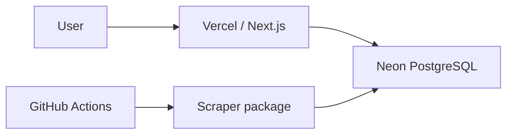

# Engineering notes captured October 5, 2026

Captured from committed baseline `15cb5c2` before Cleanup B. These documents combine earlier October 3–5 measurements and session instructions. Dates and baseline commits inside each document describe its original evidence; capture date is not measurement date. Historical approval text is not authorization for current work. Values are historical measurements, not a live catalog or current setup guide. Use the [current README](../../README.md).

## Original README.md

# CompraFino

A Peruvian grocery and household-products price intelligence platform with verified bounded Tottus, Plaza Vea and Metro ingestion pipelines.

## Problem

Supermarket pricing in Peru is fragmented across retailers. Promotions can depend on dates, quantities, payment methods and campaigns, making it difficult to judge the real cost of a purchase.

## Vision

CompraFino compares current prices, shows ordinary price history and stores shopping needs in this browser. Milestone 16 adds current basket comparisons across up to three supermarkets, validated by local production build and Chromium tests. Purchase-timing recommendations remain planned.

## Current status

Milestones 0–11 are complete in the provided baseline (`6c3a52f`). Milestone 12 refines the public home, search, cards and comparison pages with a shared visual system and intentional mobile layouts. Its focused second design iteration, custom Select menus and light/dark themes are accepted following user visual review. See [UI polish](../ui-polish.md) for the design, manual audit and validation, [conditional pricing](../conditional-pricing.md) for separate CMR semantics and [search UX](../search-ux.md) for URL controls. The homepage remains database-independent. Milestone 13 ordinary-price history is complete in the user-provided baseline. Milestone 14 adds durable Peru-day observation coverage, verified chart segments/gaps and safe descriptive price insights; local build, history Chromium and visual acceptance remain pending. See [price history](../price-history.md), [observation coverage](../observation-coverage.md) and [validation](milestone-14-validation.md).

## Initial retailers

**Tottus**, **Plaza Vea** and **Metro** have bounded category and public text-search adapters.

## Architecture

Serverless first: Next.js is intended to run on Vercel, PostgreSQL on Neon, and scheduled ingestion on GitHub Actions. There is no always-on API server or worker. The existing Neon-backed application and scheduled refresh are deployed in the developer-provided baseline. See [architecture](../architecture.md).

## Technology

- **Next.js 16 / React 19:** Server Components and server-side loading keep the first application simple and suited to Vercel.
- **PostgreSQL / Neon:** relational storage provides a durable basis for future catalog and price history without an always-on application server.
- **Drizzle:** typed queries and reviewed SQL migrations, using Neon's serverless HTTP driver.
- **pnpm workspaces:** package ownership and dependency relationships. **Turborepo:** task execution, dependency ordering, parallelism and caching.
- **TypeScript:** strict authoritative checking. **Zod 4:** validation at external boundaries, currently the database URL.
- **Oxlint / Oxfmt:** correctness-focused linting (including type-aware rules) and one repository formatter.
- **Vitest / Playwright Test:** fast unit tests and a real Chromium smoke test of the production application.

Stable dependency versions were checked against npm registry metadata before installation. Exact direct versions are pinned in manifests; `pnpm-lock.yaml` pins the full graph. [Dependency inventory](../dependencies.md) records ownership and purpose.

## Repository structure

```text
apps/web/          Next.js App Router application and E2E tests
packages/core/     Framework-independent pure logic and unit tests
packages/db/       Lazy Drizzle/Neon client, schema home, environment validation, migration configs
packages/scrapers/ Retailer public-data adapters, fixtures and bounded ingestion CLI
packages/ui/       Shared shadcn Base UI components, utilities and Tailwind theme
.github/workflows/ CI with persisted-catalog E2E, manual ingestion, twice-daily refresh and six-hour discovery
docs/             Architecture, roadmap and dependency inventory
```

Internal dependencies: `web → ui, db, core`; `scrapers → core, db`; `db → core`. Library workspaces export typed source and are compiled by their consumer; they do not need artificial build scripts. The core package has no React, Next.js, database or browser dependency.

## Local development

Requires Node.js **24.x** and pnpm **12.8.1**. Use your existing version manager/Corepack to select the pinned pnpm version; do not install dependencies globally for this project.

```sh
pnpm install --frozen-lockfile
pnpm dev
```

Open <http://127.0.0.1:3000>. Stop with Ctrl+C. The app uses system fonts, so builds need no external font download. The shared Base UI button and product-image error fallback are Client Components; the homepage and layout remain Server Components.

Codex repository instructions live in the root `AGENTS.md`. Next.js agent-file auto-generation is disabled so development does not create `CLAUDE.md` or duplicate app-level instructions.

`apps/web/next-env.d.ts` is generated by Next.js and ignored by Git. Development references types in `.next/dev`, while builds reference `.next`; switching commands can rewrite this local file. Keep it in TypeScript's `include` list. `pnpm typecheck` runs `next typegen` before TypeScript, so a fresh checkout does not need a committed copy.

If you are using the original bootstrap workspace and its older system pnpm, the ignored project-local binary is available:

```sh
export PATH="$PWD/.tools/bin:$PATH"
pnpm --version
```

That helper is local to the bootstrap environment and is not required in a fresh checkout. The original bootstrap also stores Chromium locally; run `PLAYWRIGHT_BROWSERS_PATH="$PWD/.tools/browsers" pnpm test:e2e` to reuse it, or run the standard browser installation below. `pnpm-workspace.yaml` keeps the pnpm store inside the project; use the pinned pnpm yourself.

## Environment variables

The root `.env.example` contains `DATABASE_URL=` and the explicit integration-test opt-in `TEST_DATABASE_URL=`. No environment variable is needed for the homepage, unit tests or build. Public search/comparison requests require the migrated database through `DATABASE_URL` in `apps/web/.env.local` or deployment settings.

For actual migrations:

```sh
cp .env.example .env
# Set DATABASE_URL to your Neon PostgreSQL connection URL.
pnpm db:generate
# Review the generated SQL before applying it.
pnpm db:migrate
```

Generation reads the schema locally and needs no database. The first migration creates retailers, retailer listings, price history and ingestion runs, and seeds the three retailer identities. Migration configuration loads root `.env`, respects existing process variables, and rejects a missing/invalid URL with a clear message. `createDatabase()` validates only when explicitly called. Web database access should receive `DATABASE_URL` through Vercel environment settings or `apps/web/.env.local`. Never commit secret files. The Tottus migration has since been applied and its live Neon constraints/indexes verified.

## Tottus ingestion

```sh
pnpm scrape:tottus -- --dry-run --limit=20
# After reviewing and applying migrations, with DATABASE_URL in root .env:
pnpm scrape:tottus -- --limit=50
```

Dry-run requires no database and prints five normalized samples. Default limit: 20; maximum: 500, restricted to one allowlisted category per run. Default meats is unchanged; `pnpm scrape:tottus -- --category=dairy --limit=100` selects the observed dairy category. Rows missing a quote unit are skipped without inferring UN/KG. Persisted runs fail clearly without `DATABASE_URL`. `/dev/ingestion` reads current results during `pnpm dev`; set `DATABASE_URL` in `apps/web/.env.local`. The route returns 404 in production. The manual workflow `.github/workflows/ingest-tottus.yml` needs a repository secret named `DATABASE_URL`; it never applies migrations automatically. See [Tottus integration](../retailers/tottus.md) for observed fields, verification evidence and limitations.

## Plaza Vea ingestion

```sh
pnpm scrape:plaza-vea -- --dry-run --limit=20
pnpm scrape:plaza-vea -- --limit=50
```

Native fetch reads the public VTEX catalog for one dairy/eggs category in anonymous channel 1. Seller-1 ordinary prices exclude conditional card/quantity teaser discounts. Default 20 usable listings, maximum 500, at most 25 sequential pages / 500 source products. Dry-run needs no database; persisted mode requires `DATABASE_URL`. Two live runs verified 50 then 0 new price states. No dependencies or migrations were added. The manual `.github/workflows/ingest-plaza-vea.yml` reuses the same `DATABASE_URL` secret and has no schedule. See [Plaza Vea integration](../retailers/plaza-vea.md) for source fields, price/unit interpretation and location limitations.

## Metro ingestion

```sh
pnpm scrape:metro -- --dry-run --limit=20
pnpm scrape:metro -- --limit=50
```

Native fetch reads the public VTEX catalog for one dairy category in anonymous channel 1. Seller-1 ordinary prices exclude Metro-card promotion teasers; only higher reference prices are retained. Default 20 usable listings, maximum 500, at most 25 sequential pages / 500 source products. Dry-run needs no database; persisted mode requires `DATABASE_URL`. Two live runs verified 50 then 0 new price states. No dependencies or migrations were added. The manual `.github/workflows/ingest-metro.yml` reuses `DATABASE_URL` and has no schedule. See [Metro integration and three-retailer review](../retailers/metro.md) for live samples, price/package semantics and validation limitations. Metro ingestion is committed in the Milestone 1 baseline; see current catalog validation below.

## Catalog normalization

After applying the reviewed migration, normalize existing listings independently of ingestion:

```sh
pnpm normalize:catalog -- --limit=100
pnpm normalize:catalog -- --retailer=tottus --limit=50
pnpm normalize:catalog -- --retailer=plaza-vea --limit=50
pnpm normalize:catalog -- --retailer=metro --limit=50 --dry-run
```

This command requires root `.env`/`DATABASE_URL`, reads no retailer websites and leaves price history unchanged. Default 100, maximum 5000; repeated unchanged runs perform zero writes. Exact quantities use g/ml/unit; pricing basis remains separate. Source brands are retained during future ingestion; legacy title fallback and ambiguous/approximate values are conservative. `/dev/catalog` displays up to twenty rows per retailer during development and returns 404 in production. See [catalog normalization](../catalog-normalization.md) for model, precedence, migration, audit statistics and limitations.

## Canonical product matching

After applying the reviewed pg_trgm/canonical migration and refreshing normalization:

```sh
pnpm match:catalog -- --dry-run --limit=1000
pnpm match:catalog -- --limit=1000
pnpm match:evaluate
pnpm match:audit
```

These commands use root `.env`/`DATABASE_URL`, without retailer requests. Matching uses exact brands/content, hard incompatibilities, PostgreSQL trigram similarity and conservative variant gates. Repeats with unchanged input perform zero canonical writes; dry-run writes nothing. A scope splitting an existing group, containing manual links or reading stale normalization refuses persistence. `/dev/matching` provides read-only development inspection and returns 404 in production. See [catalog matching](../catalog-matching.md) for scoring, schema, evaluation, audit gaps and limitations.

## Scheduled catalog refresh

```sh
pnpm refresh:catalog
pnpm refresh:catalog -- --dry-run
pnpm refresh:listings -- --dry-run --limit=50
pnpm coverage:report
pnpm audit:staples
pnpm audit:quantity-quality
pnpm catalog:budget
pnpm audit:observation-coverage
```

The full pipeline reuses category ingestion (Tottus meat/dairy plus Plaza Vea/Metro dairy and six bounded staple sources each), up to 100 eligible known-listing lookups, then one normalization and matching pass. New staple sources allow twenty usable listings and two pages each; see [staple coverage](../staple-coverage.md). Public offers older than 36 hours cannot win cheapest price; retained historical prices remain labelled. Its GitHub workflow supports manual dispatch and cron `17 11,23 * * *`: 11:17/23:17 UTC, or 06:17/18:17 Peru. Full refresh workflows do not overlap or cancel a running refresh. Failed retailers retain prior data; successful retailers continue, while the command still exits nonzero. `/dev/ingestion` shows distinct latest attempts/successes and healthy (≤18h), delayed (≤30h) or stale (>30h) operational freshness. GitHub schedules can start late; prices remain observed rather than real-time. See [operations](../operations.md) for fixed category limits, safe failure behavior, notifications and troubleshooting.

## Search-driven discovery

```sh
# Apply the reviewed additive discovery migration first.
pnpm db:migrate
pnpm discover:catalog -- --dry-run --limit=3
pnpm discover:catalog -- --limit=3
```

Both modes read root `DATABASE_URL`; dry-run previews demand without writes or retailer calls. Normal mode defaults to ten queries, respects the thirty-attempt UTC daily cap and 24-hour cooldown, and retains at most ten usable listings per retailer/query. The new workflow runs every six hours at minute 43 and shares refresh concurrency without canceling work. `/dev/discovery` shows popularity/outcomes in development and returns 404 in production. Only query text and operational metadata are retained. See [discovery](../discovery.md) for exact eligibility, failure semantics, privacy and live validation.

## Scripts

| Command                             | Purpose                                                                        |
| ----------------------------------- | ------------------------------------------------------------------------------ |
| `pnpm dev`                          | Start the web development server directly through pnpm                         |
| `pnpm build`                        | Build production application through Turbo                                     |
| `pnpm lint` / `pnpm lint:fix`       | Type-aware Oxlint checks / fixes                                               |
| `pnpm format` / `pnpm format:check` | Oxfmt formatting / verification                                                |
| `pnpm typecheck`                    | Generate Next types and run `tsc --noEmit` for every workspace                 |
| `pnpm test`                         | Vitest tests in core, database and scraper packages                            |
| `pnpm test:integration`             | Isolated-schema PostgreSQL tests; explicit `TEST_DATABASE_URL`                 |
| `pnpm test:e2e`                     | Chromium smoke test against a production server (build first)                  |
| `pnpm discover:catalog`             | Process bounded zero-result discovery demand; read-only dry-run available      |
| `pnpm refresh:listings`             | Refresh eligible known SKUs; optional read-only selection preview              |
| `pnpm audit:observation-coverage`   | Read-only daily evidence, public gaps, retailer health and storage projections |
| `pnpm audit:quantity-quality`       | Read-only complete-catalog quantity basis, quality and withheld audit          |
| `pnpm catalog:budget`               | Read-only catalog counts, storage, candidates and configured request budgets   |
| `pnpm audit:unit-prices`            | Read-only unit-price coverage, samples and real-search audit                   |
| `pnpm coverage:report`              | Read-only freshness, category coverage and discovery demand audit              |
| `pnpm refresh:catalog`              | Refresh validated retailer scopes, normalize and match; optional dry-run       |
| `pnpm db:generate`                  | Generate reviewed migrations from the schema                                   |
| `pnpm normalize:catalog`            | Normalize bounded existing listings; requires `DATABASE_URL`                   |
| `pnpm match:catalog`                | Match bounded fresh normalized listings; optional dry-run                      |
| `pnpm match:evaluate`               | Evaluate the 66 reviewed real pairs with PostgreSQL similarity                 |
| `pnpm match:audit`                  | Evaluate 105 independently reviewed pairs, separate from calibration           |
| `pnpm db:migrate`                   | Apply migrations; requires `DATABASE_URL`                                      |

Turbo caches builds, type checks and unit tests. The root development command starts the single web server directly through pnpm, avoiding Turbo's child-process output interaction with pnpm 12's Node.js fallback launcher. Development is uncached. Repository lint/format run once from the root. Only workspaces with actual tasks declare them.

## Testing

Unit tests cover source fixtures, money parsing, normalization, persistence SQL contracts, a deterministic price-state reference model and run outcomes without live network/database calls. `pnpm test:integration` separately exercises the real Neon HTTP persistence batch on PostgreSQL, without Turbo caching. It skips clearly when `TEST_DATABASE_URL` is absent and never loads `.env` or falls back to `DATABASE_URL`. Use `pnpm test:integration:local` with the [Docker test database](../local-testing.md), or export the test URL explicitly for a dedicated Neon test database/branch. The suite applies the checked-in migration inside a fresh randomly named schema, sets transaction-local search paths without a public fallback, and drops only its own schema afterwards. It applies journaled table migrations, qualifying foreign keys with that test schema. The target test database must already have pg_trgm from the reviewed migration; the suite excludes extension creation to keep shared public objects untouched. Live tables are untouched. The role needs schema-creation permission. An interrupted process may leave its isolated schema for manual review/cleanup. Browser smoke testing checks functional homepage search, blank/short searches, malformed product IDs and production blocking of developer tooling against `next start` on port 3100. Explicit `DATABASE_URL` in the runner enables two additional persisted-catalog flows; see [public search validation](../public-search.md).

```sh
pnpm test
pnpm build
pnpm --filter @comprafino/web exec playwright install chromium --only-shell
pnpm test:e2e
```

On a Linux machine missing Chromium system libraries, use `playwright install --with-deps chromium --only-shell` in the web workspace. CI installs only Chromium's headless shell and its system requirements, then passes the existing repository secret `DATABASE_URL` only to `pnpm test:e2e`. Playwright and its child `next start` server inherit it, enabling persisted-catalog tests. GitHub does not supply repository secrets to fork pull requests; persisted-catalog tests remain skipped on those runs. `TEST_DATABASE_URL` remains a separate explicit opt-in for isolated PostgreSQL/history fixtures and is not supplied by ordinary CI. CI also checks frozen installation, formatting, lint, types, unit tests and production build on PRs and pushes to `main`.

`@playwright/test` is application testing tooling; no browser scraper dependency is installed. React Testing Library is deferred until component-level tests justify it.

## Data ingestion philosophy

Use legitimate publicly accessible data only, with conservative requests. Prefer simple JSON/data endpoints, then HTTP parsing; browser automation is a last step justified by a real adapter. Do not bypass authentication, CAPTCHAs, bot protection or access controls, and do not use stealth tooling. Validate external data before domain logic or persistence. Bounded catalog refresh and discovery use scheduled GitHub Actions.

## Initial deployment strategy

The user-provided deployed baseline uses: **Vercel** for web, **Neon** for PostgreSQL, **GitHub Actions** for scheduled ingestion. Free-tier quotas and provider terms must be assessed when deploying.

For a future Vercel project, select this monorepo, set Root Directory to `apps/web`, enable inclusion of source outside that directory, and use the Next.js preset with the pinned pnpm lockfile. Use `pnpm exec turbo run build --filter=@comprafino/web` from the repository root if customizing the build command; the default app `pnpm build` also works. Set `DATABASE_URL` for server database features; the developer inspection route remains unavailable in production. Provision Neon separately and run reviewed migrations explicitly before dependent releases. The manual Tottus, Plaza Vea and Metro ingestion workflows require the GitHub Actions secret `DATABASE_URL` and explicitly applied migrations. They have no schedule. Do not put credentials in build commands or client bundles.

## Roadmap

Public search, verified product comparison, unit-price comparison, concrete CMR benefits, ordinary history/observation coverage and browser-local shopping lists are implemented through the accepted Milestone 15.1 baseline. Milestone 16 basket optimization is implemented and validated by local production build/Chromium tests; timing guidance remains future work. See the [roadmap](../roadmap.md).

TanStack Form, TanStack Query and shadcn Chart/Recharts are intended options for future complexity, not current dependencies. Redis, queues, external search, AI, dedicated workers and browser scraping are also deferred.

## Quantity quality and operating budget

Comparison bases distinguish physical kg/L and item counts from approximate paper-roll prices. Current cross-retailer tuna content remains semantically unresolved and has no unit price, including count-only packs. Exact normalization stays version 1 and matching remains unchanged. `pnpm audit:quantity-quality` and `pnpm catalog:budget` require migrated root `DATABASE_URL`, without retailer requests or writes. Budget runtime evidence is the timestamped local `docs/catalog-refresh-measurement.json`; missing evidence reports unavailable timing. See [policies and audited counts](../quantity-quality.md) and [operating limits and expansion scenarios](../catalog-budget.md).

## Conditional pricing and immediate filters

Apply reviewed migration `0005_redundant_deadpool.sql` using `pnpm db:migrate` before deploying Milestone 11 readers and ingestion together. Existing Tottus category/search/targeted acquisition now confirms explicit CMR prices separately from ordinary history. Plaza Vea/Metro teaser discounts remain excluded. Existing scrape/refresh commands and request bounds are unchanged; no new environment variables or dependencies.

Search supports immediate sorting, retailer selection, optional kg/L/item/approximate-roll basis and `priceMode=benefits`. Defaults omit URL parameters; browser back/forward restores them. Ordinary prices still determine default winners, and filtered emptiness never creates discovery demand when underlying catalog results exist. See [conditional pricing](../conditional-pricing.md) and [search UX](../search-ux.md).

## Ordinary price history

Exact product pages support `?range=7d`, `30d` and `90d` (initial default 7 days, based on the young live catalog). Summaries use ordinary state intervals; disconnected chart markers never invent daily observations. CMR remains separate.

```sh
pnpm audit:price-history
# After a successful production build; explicit isolated-schema test opt-in:
TEST_DATABASE_URL=... pnpm test:e2e:history
```

The history browser runner creates and removes a random schema, checks isolation, seeds controlled fixtures there and launches only the history spec. It passes a validated `COMPRAFINO_E2E_SCHEMA` to its child web server to scope every Neon HTTP batch/direct query transaction. Do not set that test-only override in deployment or normal development. No test URL fallback or automatic `.env` loading is provided. Interrupted runners may leave their random schema. The ordinary `pnpm test:e2e` smoke suite remains unchanged; the fixture-only cases skip clearly without the runner. Details and validation evidence: [price history](../price-history.md).

For a disposable Docker PostgreSQL database, run `pnpm test:db:up`, then
`pnpm test:integration:local` or, after `pnpm build`, `pnpm test:e2e:history:local`.
Stop it with `pnpm test:db:down`. See [local testing](../local-testing.md).

## Recurring shopping list

`/list` saves generic needs, preferred products or strict canonical products in this browser, with unit/kg/L quantities and weekly/biweekly/monthly frequency. Search/detail pages provide add dialogs; current ordinary/CMR options share the Milestone 15.1 safe-substitution boundary. Milestone 16 compares complete/partial baskets using at most one, two and three supermarkets, with actual retailer counts, grouped purchases and marginal savings. There is no account, server list persistence or timing optimizer. See [basket optimization and validation](../basket-optimization.md). See [shopping-list behavior, current-data audit and validation](../shopping-list.md). Run the read-only `pnpm audit:shopping-list` with root `.env`/`DATABASE_URL`, and `pnpm test:e2e:list:local` after a successful production build for isolated shopping-list browser fixtures.

## Milestone 18 catalog operations

`pnpm audit:catalog-coverage` and `pnpm audit:availability` provide read-only complete catalog usefulness, family, stock and eligibility reports; add `-- --timings` to the coverage command for real DB basket/detail measurements. Apply reviewed migrations 0007/0008 and roll out all updated writers together. One bounded Metro eggs category is added, with ten scheduled listings; the 1,000-listing guard is retained. The measured catalog has 952 listings but only 103 generic shopping candidates and 228 potential generic/exact basket candidates. [Coverage report](../catalog-coverage.md) and [availability](../availability.md) distinguish search from safe fulfillment. Milestone 18 implementation and validation are complete: local production build, 22 smoke cases (36 expected skips), eight listing and 22 shopping/basket Chromium cases pass. Changes remain staged pending commit approval.

## Original docs/architecture.md

# Architecture

CompraFino starts serverless first to reduce idle costs and operational work while validating data. The existing Neon/Vercel/GitHub Actions deployment is complete in the developer-provided Milestones 0–6 baseline. Bounded Tottus, Plaza Vea and Metro ingestion is implemented:



The homepage is static and requires no database. Public search and product comparison are request-rendered Server Components over verified canonical associations and open price-history states; queries live in `@comprafino/db`. See [public search](../public-search.md) for filtering and request-time freshness boundaries. Initially there is no always-on API server, always-on worker, Redis or message queue.

## Boundaries

- `apps/web`: routes and application presentation. Prefer Server Components; use Client Components only where required.
- `packages/ui`: reusable shadcn components using Base UI, shared Tailwind 4 theme and explicit source scanning. Both shadcn configs use `base-nova`. No domain logic.
- `packages/core`: pure framework-independent logic, without React, Next.js, browser or database dependencies.
- `packages/db`: PostgreSQL schema home, reviewed migrations, URL validation and lazy Drizzle clients. Importing does not connect or require credentials. Neon HTTP suits stateless queries and batched transactions; interactive transactions would justify revisiting the driver.
- `packages/scrapers`: retailer adapters and ingestion orchestration, currently native-fetch Tottus hydration JSON and Plaza Vea/Metro public VTEX JSON. Fetching/parsing is independent of persistence. Ingestion/refresh dry-run never opens a database; discovery dry-run reads database demand without writes or retailer calls.

Current dependency graph: `web → ui, db, core`; `scrapers → core, db`; `db → core`. Core owns the shared validated listing boundary and exact money normalization. Dedicated workers can replace or supplement GitHub Actions without rewriting framework-independent domain logic. Retailer-specific behavior remains isolated.

## Package and task management

pnpm workspaces manage packages/dependency relationships, using `workspace:*`. Turborepo manages task ordering, parallel execution and caching. Next.js compiles shared TypeScript source; libraries do not need artificial build scripts. Build tasks respect upstream builds, type checks respect upstream checks, and tests respect upstream builds. Dev tasks are persistent and uncached. Lint and format run once from the root.

TypeScript remains authoritative; type-aware Oxlint supplements it. Oxfmt is the sole formatter and sorts Tailwind classes using the shared stylesheet. CI checks frozen installation, formatting, lint, types, unit tests, build and Chromium smoke E2E without credentials.

## Persistence and operations

The first generated migration creates `retailers`, `retailer_listings`, `price_history` and `ingestion_runs`, including retailer seeds. Add reviewed tables to `packages/db/src/schema.ts`, generate migrations, review and commit SQL/metadata, then apply explicitly with a validated URL. CLI-only dotenv loads root `.env`; deployed clients receive platform environment variables. Migrations never run during app build or startup.

Vercel, Neon and scheduled GitHub Actions are the user-provided deployed baseline. The Tottus, Plaza Vea and Metro workflows are manual only and require a `DATABASE_URL` secret. The full catalog workflow now supports twice-daily bounded refresh; activation requires the workflow on the default branch, Actions enabled and the existing secret. No active remote schedule is claimed by local implementation. See [operations](../operations.md). Validate free-tier quotas against measured workloads and provider terms when deploying.

## Deferred choices

Native fetch before HTTP client dependencies. TanStack Form only for complex forms, TanStack Query for justified client server-state needs, and shadcn Chart/Recharts for implemented price history. HTML parsers, browser automation, caching, queues, search services and workers require concrete needs. Authentication waits for user-specific features. Matching is deterministic, without LLMs or embeddings.

### Ingestion state

A listing is identified by retailer plus source SKU, retaining the product ID separately. Money is integer PEN cents; KG/UN price basis is preserved. Each retailer validates its own source JSON before normalization, and normalized listings are validated again at persistence. `packages/scrapers/src/adapter.ts` owns the small shared adapter contract; fetching and pagination remain source-specific. Stock remains unknown for Tottus delivery labels; Plaza Vea exposes available anonymous seller/channel offers without establishing address-specific delivery.

The Neon HTTP driver executes a bounded batch transaction: lock the retailer row, upsert fresh observations, close changed history states, then insert missing current states. All writers must use this lock convention. A partial unique index enforces one open price state per listing. Equal/older observations cannot overwrite newer state. Repeated unchanged observations update freshness without appending history. Bounded samples never deactivate unseen listings. Run start/finish records are separate from the atomic listing batch; interrupted processes can leave a `running` record. `listingsChanged` counts newly opened price states, including first observations.

The `/dev/ingestion` Server Component reads at request time, shows helpful missing-DB/error messages and is blocked in production. The migration and live Neon schema have been verified. Repeated live Tottus and Plaza Vea persistence is idempotent without retailer-specific tables or persistence paths. Separate isolated-schema PostgreSQL integration tests exercise transitions, rollback and concurrent writers through the real batch transaction; they require explicit `TEST_DATABASE_URL` and never fall back to the application database configuration. Unit tests remain credential-free.

## Catalog normalization

Core owns deterministic title/brand/content normalization, independent of retailer APIs and PostgreSQL. Adapters retain validated source brands and sale-unit multipliers; raw source fields remain in listings. The additive second migration creates a one-to-one derived `listing_normalizations` table with explicit indexed dimensions, version, fingerprint and diagnostics. The standalone database-package CLI reads bounded samples and persists them in one atomic batch using ingestion's existing retailer locks and raw-input guards. It never writes price history or runs automatically during ingestion.

`/dev/catalog` inspects up to twenty rows per retailer, marking missing/stale derived data and remaining blocked in production. Exact g/ml/unit content is separate from KG/UN pricing. Approximate/variable masses and mixed bundles remain unresolved. Canonical products and matching are now derived separately as described below; queues remain deferred; public search reads these verified groups separately. See [catalog normalization](../catalog-normalization.md) for the model, observed metadata trust, real-data audit and validation status.

## Canonical matching

Core owns deterministic candidate blocks, compatibility, evidence decisions and complete-link grouping. Database code computes pg_trgm similarity for bounded candidate pairs and persists canonical products/versioned automatic links using the existing retailer-lock convention. Guarded snapshots prevent stale assignment; PostgreSQL primary/unique/composite foreign keys enforce one canonical per listing and one listing per retailer/group. Manual links and incomplete group scopes block automatic recomputation. Raw listings, normalization and price history remain intact.

The read-only `/dev/matching` Server Component is blocked in production. Standalone `pnpm match:catalog` and `pnpm match:evaluate` use root database configuration; dry-run never writes. The pg_trgm extension is migration-managed; no dedicated search infrastructure or npm dependency was added. See [catalog matching](../catalog-matching.md) for model, provisional thresholds, bounded real metrics and remaining validation/audit gaps.

## Scheduled refresh ownership

`packages/scrapers/src/refresh-cli.ts` wires the existing adapters and DB APIs; `refresh.ts` isolates retailer failures and orders downstream work. GitHub Actions only supplies scheduling/environment/concurrency. Core owns operational freshness thresholds; db reads independent latest attempts/successes; the existing development ingestion page renders them. Failed fetches preserve prior observations through existing atomic persistence. Public queries continue reading persisted canonical offers without dynamic scraping/matching. No new schema, dependency or service is required. See [operations](../operations.md) for scope, failure and validation evidence.

## Search-driven discovery ownership

Public zero-result search uses Next.js `after` only for a validated database demand upsert, after the response. Core owns conservative query normalization/limits. DB owns deduplication, atomic counts, a locked UTC daily budget and 24-hour claim cooldown. Scrapers own single-page public text search and the discovery processor, reusing existing ingestion statements and complete normalization/matching APIs. GitHub Actions schedules small batches independently of public requests. `/dev/discovery` provides read-only demand inspection and is blocked in production. Query text never becomes canonical identity; no matcher logic or new infrastructure is introduced. See [discovery](../discovery.md) for schema, exact admission/retry policy and validation.

## Known listing refresh ownership

Core owns deterministic targeted admission and public observation-age classification. DB owns immutable acquisition/query provenance, category observation and guarded targeted admission/outcomes; existing listing/history persistence remains the only quote-write path. Scrapers extend existing adapters with exact known-SKU/product-page lookup and sequential bounded processing, inserted after category ingestion before a single complete normalization/matching pass. Public queries classify observations at request time and retain historical groups without fabricating a current best price. Read-only demand/coverage reporting feeds the development ingestion page. See [listing refresh](../listing-refresh.md) for migration, budgets, audit and pending build/E2E gate.

## Generic offer comparison ownership

Core owns bigint rational unit-price calculation, incompatible dimensions and display rounding. DB owns normalized-listing offer eligibility, PostgreSQL token/trigram search, exact fraction sorting, bounded dimension selection and combined canonical/generic search. Server Components render independent cards and native GET sorting; no SQL, dynamic matching or retailer work runs in UI components. Existing canonical reads remain authoritative for exact identity and detail pages. Combined empty results alone admit discovery. The read-only unit audit CLI and development catalog inspection expose coverage/unavailable reasons. See [generic comparison](../generic-comparison.md).

## Staple family relevance ownership

Core classifies small observed product families from current source leaf evidence and conservative nouns/negative descriptors, independently of exact identity. DB recomputes these attributes per eligible generic offer and combines them with PostgreSQL token/trigram order before sort/limit. No family column, migration or normalization-version/matcher change is needed. Combined family queries also gate incidental canonical cards without changing canonical detail routes. Scrapers own retailer-specific complete category allowlists and fixed per-pair bounds; scheduled refresh fetches them before the existing single derivation pass. The developer catalog displays source category/family/origin/evidence. See [staple coverage](../staple-coverage.md) for audit, refresh budgets and limitations.

### Quantity quality and operational reporting

Core comparison output has explicit mass/volume/item-count/approximate-roll bases and quality. These are separate from persisted exact-match normalization (version 1) and do not enter matching identity. DB owns read-only catalog/size/candidate metrics; the scraper developer CLI combines them with local category/workflow configuration and optional recorded refresh evidence. This preserves the existing dependency graph. No telemetry service, schema, source expansion or new infrastructure is introduced; see [quantity quality](../quantity-quality.md) and [catalog budget](../catalog-budget.md).

## Conditional pricing and URL controls

Core owns validated concrete conditional offers, CMR identity, validity/freshness eligibility, potential-benefit ranking and URL filter parsing. DB owns a separate current `retailer_listing_offers` model, synchronized inside accepted listing upserts under the existing retailer lock. Unchanged offer states reuse atomically verified listing freshness without offer-row rewrites; ordinary history remains independent. Retailer adapters interpret only evidence-backed source amounts. The web toolbar immediately navigates URL filters while results remain server-rendered; discovery uses the unfiltered query count. See [conditional pricing](../conditional-pricing.md) and [search UX](../search-ux.md).

## Public ordinary price history

Core owns range parsing, half-open state intersection, ordinary transitions and summary metrics. DB owns one canonical/range-scoped query sharing public exact-product eligibility. The product Server Component loads summaries below current offers; a Client Component renders Recharts event markers, verified daily-coverage step segments and retailer toggles. Core also owns covered periods and conservative descriptive price insights. The shared atomic ingestion writer rolls accepted usable quotes into `listing_observation_days`, keyed by listing and Peru calendar date, while `price_history` retains actual state transitions. Daily evidence is queried separately from state aggregation; gaps split paths, and pre-coverage events remain disconnected. See [price history](../price-history.md) and [observation coverage](../observation-coverage.md) for semantics, migration, storage and pending validation.

Local database tests can use the disposable Docker PostgreSQL setup described in
[local testing](../local-testing.md). Production retains Neon HTTP; an explicit test
mode provides TCP queries with the same Drizzle batch and schema isolation semantics.

## Recurring shopping list ownership

Core owns the versioned list schema, semantic duplicate keys, family/variant compatibility, integer package fulfillment and per-item pricing/overbuy ranking. DB reuses public generic/canonical current-offer eligibility and quantity evidence through a read-only evaluation boundary. Web owns isolated localStorage access, a small React subscription hook, add/edit dialogs and `/list`; route handlers validate requests and never persist list data or call retailers. Generic candidates include independently normalized store brands; null canonical identities never create exact/history associations. No account, migration or server list repository is introduced. See [shopping lists](../shopping-list.md) for policy, audit and pending browser acceptance.

## Current basket optimization ownership

Core exposes complete approved fulfillment options through the existing shopping evaluator and enumerates the seven retailer subsets without implementing substitution policy in the optimizer. DB shares current public/generic eligibility in one bounded statement snapshot for the whole list; the 1,000-row guard and 1,001 overflow detector prevent truncated optima. Web extends the uncached evaluation route and `/list` with complete/partial tiers, actual retailer counts, grouped assignments and explicit conditions. Browser lists remain version two. No schema, dependency, scraping or infrastructure change. See [basket optimization](../basket-optimization.md) for deterministic order, scope, measured current-scale tradeoff and validation results.

## Catalog usefulness and availability audit

DB owns a complete bounded read-only coverage/availability audit reusing normalization, current generic/exact eligibility and detail boundaries. Source evidence stays retailer-specific; core owns deterministic safe-catalog refresh priority and availability-aware recovery admission. Nullable stock remains distinct from price observation, with prospective evidence timestamps and exact-absence counters. Ingestion serializes new-identity admission under the reviewed 1,000-row capacity; all writer revisions must roll out together. See [coverage](../catalog-coverage.md) and [availability](../availability.md). No monitoring service or broader taxonomy is introduced.

## Original docs/availability.md

# Availability evidence — Milestone 18

Unknown stock remains distinct from unavailable. `pnpm audit:availability` and `pnpm audit:catalog-coverage` inspect the complete bounded catalog without retailer calls or writes. [Measured audit](catalog-coverage-audit.json) includes prospective timestamps, legacy booleans, price freshness, last request failures and exact absence separately.

## Real source semantics

| Source                 | Positive evidence                                                                                                            | Explicit unavailable                                          | Missing/uncertain evidence                                                                                                                |
| ---------------------- | ---------------------------------------------------------------------------------------------------------------------------- | ------------------------------------------------------------- | ----------------------------------------------------------------------------------------------------------------------------------------- |
| Tottus category/search | Usable quote; stock remains unknown                                                                                          | No new negative inference                                     | Omission from bounded sample says nothing about stock                                                                                     |
| Tottus exact page      | Exact parent/variant, published, purchaseable, online sellable, unique active TOTTUS_PERU offering; validated ordinary quote | Explicit false published/purchaseable/online/active flag      | Missing seller, hydration/schema/identity/quote failures are failures; 404/410 or missing variant is exact absence, not proof of deletion |
| Plaza Vea exact SKU    | Exact parent/SKU, unique seller 1, IsAvailable true, AvailableQuantity >0 and validated ordinary quote                       | Seller 1 explicitly IsAvailable false or AvailableQuantity =0 | Missing/ambiguous/malformed seller evidence or invalid quote is failure; empty/404/missing SKU is exact absence                           |
| Metro exact SKU        | Same VTEX identity/seller gates, isolated Metro parser/context                                                               | Same explicit seller-1 stock fields                           | Same distinction; no authentication or protection bypass                                                                                  |

VTEX previously called any parser omission unavailable. The updated lookup checks exact seller stock **before** full quote parsing and throws for missing/ambiguous evidence. Tottus previously treated a missing offering as inactive; it now requires an explicit negative flag for unavailable, otherwise missing seller evidence fails. Exact positive Tottus lookup supplies true; category/search keeps null because it does not expose those purchase flags. Anonymous channel/location stock is not a universal fulfillment promise.

## Small additive persistence model

Existing nullable `available` remains the source-state value. Migration `0007_brainy_captain_britain.sql` adds:

- `availability_verified_at`: prospective timestamp of explicit stock evidence, independent of ordinary-price `last_seen_at`.
- `exact_missing_count`: nonnegative consecutive successful exact-absence results, initialized to zero.
- `last_exact_missing_at`: latest such absence timestamp; null after successful presence recovery.

No availability event table, price-history model change, backfill or inferred legacy timestamps is added. Legacy true/false booleans retain their previous eligibility semantics but are reported separately from timestamped evidence. Migration `0008_large_masque.sql` drops the initially generated non-null-stock/timestamp constraint to keep older writers' unknown quotes compatible. Both are reviewed and applied; the final schema retains the nonnegative missing-count constraint. Neither touches history or observation coverage.

**Rollout:** deploy every category/discovery/targeted writer from this revision together. Additive DB fields alone cannot upgrade older writers' evidence behavior or global capacity lock. Older writers can still replace stock with unknown, so preservation/cap guarantees apply to the updated writer. No workflow/app deployment was performed in this task. The compatibility correction avoids rejecting legacy writes while code is pending approval.

Explicit category/discovery/targeted quote evidence updates stock and its timestamp only when newer than existing stock evidence. Unknown quote stock preserves the previous evidence; it cannot recover an unavailable listing. A quote arriving after an older price but before a newer negative may update real price metadata while retaining the stronger negative and withholding usable coverage. Exact absence/unavailable finalization is guarded by the owned attempt and timestamps, so an older request cannot overwrite a newer quote/stock observation. Failures update attempt metadata only. Replaying the same absent result does not increment the count twice.

## Conservative missing/negative lifecycle

Active supported listings retain normal refresh. One exact absence is suspected missing; two or more are repeated absence. This is an operational audit flag, **not** confirmed permanent disappearance or a false availability boolean. Request failures do not increment it; category omission does not alter it. A newer successfully observed listing resets it, including presence with unknown stock; explicit unavailable presence also resets absence. No hard deletion, automatic deactivation or historical-page removal occurs.

The anonymous sources do not reliably prove permanent deletion, so this milestone deliberately does not implement a confirmed-disappeared state. Repeated absence retains existing price-age eligibility, loses recommendation eligibility as ordinary freshness expires, and remains inspectable. Continued targeted age/cooldown retries can recover it. Available/unavailable evidence also ages in the audit; stale negative stock remains blocking until stronger positive source evidence recovers it. Do not convert stale stock evidence into a fabricated available boolean.

## Refresh, public offers and recovery

Priority: trusted public exact associations, normalized strong safe shopping candidates, discovery acquisitions, other quantity-useful staple candidates, then other known listings. Within each tier, oldest quote observation first, UUID tie-breaker. Global relevance never reads browser shopping lists. Age remains 24 hours, attempt cooldown 12 hours, cap 100 sequential requests and three consecutive failures per retailer cutoff. Ordinary successful category observation prevents immediate targeted duplication.

One conservative exception prevents a permanently blocked recovery: when retained stock is explicitly false, refresh eligibility uses its verification timestamp. A recent unknown-stock category quote cannot forever suppress exact verification. Fresh negative evidence still waits 24 hours and all attempt cooldown/claim guards apply. This verifies stock rather than pretending the recent quote recovered it.

Current normalized search/list/basket candidates exclude explicit false. Null continues the existing freshness/current-price rules. Exact comparison cheapest ranking also excludes false. Listing pages remain accessible with retained ordinary history and existing “No disponible en la última consulta” / last-registered-price copy. Recovery with newer true restores current offer eligibility; it is not inferred from omission, an unknown quote, a local list label or a failed request. No public layout or label redesign is required.

Availability-only outcomes never update `price_history`, close a state, insert a zero price or fabricate an observation. `listing_observation_days` remains **usable ordinary-price coverage**: unavailable exact lookups, missing results and request failures add no daily coverage. Accepted unchanged quotes advance counts only if effective retained stock is not false. This avoids an unknown quote falsely filling a gap during verified unavailability. Recovered usable quotes resume prospective coverage without fabricating the missing period.

## Evidence and limits

Final measured catalog: 664 available source flags, zero unavailable, 288 unknown; 443 timestamped positives and 221 legacy positive flags. No live missing/negative result was manufactured. One Tottus chorizo exact response failed source schema validation with HTTP 200; it stays unknown and stale, with prior data intact. Final complete metrics are a dated snapshot; schedules/discovery may change them.

Unit tests cover positive/negative/unknown/stale ranking, exact source flags versus missing sellers, deterministic priority and unavailable recovery admission. Isolated PostgreSQL tests exercise persistence/timestamps, out-of-order newer negatives, unknown quote preservation, failed requests, category omission, absent-result replay, recovery, unchanged price history, withheld/resumed coverage and atomic cross-retailer capacity. Existing canonical/list/basket boundaries retain their regression coverage. The local production build and all eight isolated listing Chromium tests pass, including unavailable search exclusion, retained history and explicit recovery; all 22 shopping/basket cases also pass. See [coverage validation](../catalog-coverage.md).

## Original docs/basket-optimization.md

# Current basket optimization — Milestone 16

Implemented and validated. The user’s local production build succeeded, and the standard Chromium run passed 21 tests with 29 expected fixture/database skips. The isolated shopping/basket Chromium run now passes all 22 tests, including all five Milestone 16 scenarios. The earlier agent Turbopack CSS-worker port restriction is historical; Next.js configuration is unchanged. Work remains staged and uncommitted.

## Ownership and safety

`packages/core/src/shopping-list.ts` now exposes `evaluateShoppingFulfillment`: the existing per-item evaluator and the basket boundary share semantic compatibility, current pricing, quantity evidence and whole-package fulfillment. It returns the original display evaluation plus **all approved options**, before the three-option display limit. `evaluateShoppingListItem` remains a wrapper over the same logic. The optimizer in `packages/core/src/basket-optimization.ts` accepts only these approved, retailer-identified options and has no search, product-family or substitution logic.

Milestone 15.1 remains authoritative: generic saved queries/profile normalization, retailer/brand qualifier removal, conservative null profiles, and distinct quail eggs/integral rice/olive oil semantics are preserved. Broad relevance never proves equivalence. Negative source-family evidence remains negative. Independent listings retain null canonical IDs and cannot satisfy strict identity or acquire product/history associations.

Strict needs use the existing safe public canonical association. Preferred needs keep exact options and admit each alternative only when the existing shared rules establish equivalent quantity and at least **both S/ 1 and 5%** savings against the globally cheapest current exact fulfillment. This gate runs once before retailer subsets; omitting a retailer never creates preferred unavailability. When exact fulfillment is genuinely unavailable, existing compatibility/reference requirements still apply. Missing public identity cannot be reconstructed from a local label. Package alternatives require fresh strong exact contents; reference selection is deterministic by listing ID and excludes unavailable/stale offers.

Generic normalized quantities, explicit exact sale-package counts and legacy normalized exact semantics are unchanged. Quantities use integer thousandths and whole packages, bounded to at most 100% overbuy. Direct per-kg quotes do not become package prices. Each need buys enough packages of **one listing**, without splitting a need across listings or pooling packages across distinct needs. Saved frequencies do not multiply quantities or produce recurring bills.

## Current snapshot query and scale tradeoff

`evaluateCurrentShoppingList` performs one parameterized SQL statement in one DB batch for a nonempty list, sharing a statement snapshot and evaluation time across all needs. It returns requested public canonical metadata and the full current normalized offer snapshot across Metro, Plaza Vea and Tottus. Empty lists make no query. Shared `eligibleProducts`, `currentGenericOfferRows`, `genericProductOffer` and `listingOffers` enforce existing public matching, active/available, PEN/open history, quote basis, normalization fingerprint/version, trusted URL and conditional-offer boundaries.

Current prices must be verified within 36 hours, including the boundary, and cannot be future observations. Only supported current concrete CMR prices participate in benefits mode; structured start/end windows remain authoritative, with exclusive expiration. Catalog evaluation is read-only and never ingests, refreshes, searches retailer websites or creates discovery demand.

Fetching the **bounded eligible catalog snapshot is an intentional current-scale tradeoff**: predictable one-query work, complete candidate coverage and simple safety reuse. The existing 1,000-listing operational bound remains; requesting 1,001 rows detects overflow and returns an API error rather than a truncated optimum. No search-page or three-option display limit affects optimization.

If the catalog guard grows substantially, move candidate filtering earlier into SQL by requested canonical IDs and safe substitution families, preserving the same domain safety gate and complete candidate accounting. That future optimization is not implemented now. There is no new schema, migration, dependency, infrastructure or cache.

The uncached POST `/api/list/evaluate` validates version-two input and returns validated per-item evaluations, three basket tiers, evaluation time and timings. `timings.queryMs` measures awaited DB retrieval/transport, not PostgreSQL execution alone. `timings.totalMs` begins before request JSON parsing and includes DB retrieval, domain evaluation and optimization; it is captured before final response validation/serialization. `Server-Timing` exposes both. The benchmark also measures full handler invocation through validated response-body consumption (`handlerResponseMs`). Query/overflow/malformed-output failures remain 503 errors with retry, never partial-basket results.

## Optimization and deterministic order

Enumerate all seven nonempty subsets of the three supported retailers. For each subset, select the cheapest approved fulfillment of each need. Report the best solution using **at most** one, two and three retailers, using only retailers actually assigned purchases. Complete coverage outranks partial coverage. When no complete plan exists at a limit, maximize covered needs first, then minimize partial cost.

Option ties follow the existing order: purchase cost, lower overbuy, lower effective unit cost, lexical listing ID. Basket ties follow covered-need count descending, cost ascending, fewer actual retailers, lexical sorted retailer-ID sequence, then assignments ordered by item UUID and compared by the shared option comparator; sorted missing UUIDs provide the final stable signature. Overbuy is never summed across incompatible measures. Money uses safe integer PEN cents, including checked aggregate totals.

Results distinguish `empty`, `complete` and `incomplete`. Complete plans have `totalCostCents`; incomplete plans have only `partialSubtotalCents`, covered assignments and missing IDs. Response validation checks consistent coverage, actual retailer sets, totals, tier limits and marginal savings. Marginal savings are computed only between adjacent **complete** tiers; every comparison touching an incomplete tier is null. No complete total or saving is manufactured from a subtotal.

## `/list` behavior

All three maximum-retailer tiers are always shown for a nonempty successfully evaluated list. Cards show the actual retailer count and names, so a two/three-store limit may display **1 supermercado · Metro**. Equal complete totals say “No ahorras más al añadir otra tienda.” Adding a store to an incomplete plan may explain improved coverage or completion, without a saving claim.

The initially selected plan is the complete one-store result when available; otherwise the first higher complete limit; otherwise the best partial result. This is presentation only. Selecting another limit persists through evaluation refreshes and edits within the current page session.

Incomplete cards and selected details prominently display “Canasta incompleta · X de Y productos”, “Subtotal de productos disponibles” and “Faltan”. Selected purchases group by supermarket with product, whole packages, quantity, overbuy, price and retailer link. Preferred substitutions are marked explicitly. Canonical/history links appear only for existing safe public associations.

Standard mode uses ordinary prices. Benefits mode shows potential prices and required CMR conditions, plus the ordinary total/subtotal **for the same selected assignments**; that amount is not the independently optimized standard basket. Switching mode recomputes the global preference gate and basket optimization. Saved quantities and identities remain unchanged. Frequency groups, editing/removal, migration, browser persistence, minute/tab-return refresh and error/retry behavior remain.

## Validation and performance

Vitest covers exact optima (including non-nested winning combinations), an independent exhaustive-assignment oracle, complete/partial/empty results, default selection, actual counts, zero/marginal savings, deterministic shuffled inputs, fourth-ranked listings needed for coverage, thresholds, safety/identity, quantity/freshness/CMR and overflow. API unit tests cover invalid input, uncached timing headers and failure separation. PostgreSQL regressions exercise one-query evaluation, equivalence with the existing per-item evaluator, all intents, quail rejection, null identity, normalization/public eligibility, benefits and the snapshot guard. Browser scenarios cover comparison selection, actual counts, partial coverage, preferred/benefit labels, edit refresh, retry and 390px/1280px in both themes.

The reproducible [performance snapshot](milestone-16-performance.json) uses a disposable loopback PostgreSQL 17 schema with 900 current normalized listings, valid lists mixing supported/unsupported generics and exact/preferred milk, one warmup and five measured runs per case, in both pricing modes. It calls the actual POST handler with native TypeScript and consumes/validates its JSON response. **It does not measure Next.js HTTP startup, deployment latency or network overhead.** Median values are recorded in the JSON; this controlled measurement is not a production latency claim.

Current validation: format, lint and TypeScript passed; **623 unit tests** and **47 PostgreSQL integration tests** passed; isolated shopping/history/basket fixture validation passed. The user’s successful local production build and standard Chromium output establish **21 passed / 29 expected skips** across 50 discovered tests. After correcting three E2E synchronization/selector issues, a fresh isolated `pnpm test:e2e:list:local` run passed **all 22 tests in 45.5 seconds**, including all five basket scenarios. Those corrections wait for animated dialog removal before a card-background click, scope Edit to saved-item frequency sections, and scope retry errors to main content rather than Next.js’s route announcer. Application/substitution/optimizer code is unchanged by this follow-up. Mobile/desktop screenshots in both themes were generated; the mobile comparison was visually inspected. Work remains staged and uncommitted.

Median local timings in milliseconds (900 listings, five measured runs after warmup):

| Items | Mode     | DB retrieval | API handler through response consumption |
| ----- | -------- | ------------ | ---------------------------------------- |
| 5     | Standard | 44.1         | 83.2                                     |
| 20    | Standard | 43.3         | 86.6                                     |
| 50    | Standard | 42.3         | 88.9                                     |
| 5     | Benefits | 43.1         | 80.9                                     |
| 20    | Benefits | 42.1         | 87.5                                     |
| 50    | Benefits | 40.7         | 88.2                                     |

```sh
pnpm format:check
pnpm lint
pnpm typecheck
pnpm test
pnpm test:db:up
pnpm test:integration:local
pnpm test:e2e:list:local --validate-fixtures
pnpm benchmark:basket:local
pnpm build
pnpm test:e2e
pnpm test:e2e:list:local
pnpm test:db:down
```

No temporal advice, weekdays/month-period recommendations, travel/distance, delivery fees, alerts, accounts or individual retailer-listing history pages are included.

## Milestone 18 availability and capacity review

The shared current candidate query already excludes explicit false and admits unknown under freshness rules. Updated evidence persistence now prevents unknown quotes from undoing explicit unavailability; newer source-positive recovery restores eligible options. No optimization/substitution rule changes. The final 952-row catalog has 228 unique potential generic/exact basket candidates. Keep the 1,000 guard: real configured DB four-need retrieval median is 1,879.6 ms, distinct from the isolated 900-row handler benchmark (87.7–97.3 ms). See [coverage report](../catalog-coverage.md), [availability](../availability.md) and [new benchmark](milestone-18-basket-performance.json). The original Milestone 16 benchmark remains preserved.

## Original docs/catalog-budget.md

# Catalog operating budget — Milestone 10

Measured October 4, 2026, starting clean at `d8858b3`. Use `pnpm catalog:budget` with root `DATABASE_URL`. This developer CLI uses existing PostgreSQL, local category configuration, workflow files and optional [recorded full-refresh evidence](../catalog-refresh-measurement.json). It makes no retailer/GitHub/billing API calls or writes. No new infrastructure, category sources, retailer or limits. [Read-only snapshot](catalog-budget-audit.json) and [quantity audit](../quantity-quality.md) preserve measured evidence. Full-refresh evidence is a timestamped local measurement, not live GitHub workflow telemetry.

## Measured catalog and database

| Metric                                       |     Value |
| -------------------------------------------- | --------: |
| Known / normalized listings                  | 736 / 736 |
| Trusted public exact-group offers            |       127 |
| Canonical groups                             |        57 |
| Open / total price-history rows              | 736 / 763 |
| Ingestion runs                               |        45 |
| Discovery queries / daily-budget rows        |    14 / 1 |
| Lifetime recorded search requests            |        33 |
| Matching candidates                          |     8,853 |
| Stale public offers / targeted selected now  |     0 / 0 |
| Configured category sources                  |        16 |
| Maximum category observations per full cycle |       590 |

“Public offers” above means trusted exact canonical associations; the generic catalog can expose independent offers too. The quantity audit has 736 active current offers, including ones without a usable unit price. Keep these definitions distinct. Sources are two Tottus, seven PV and seven Metro retailer/category pairs.

Database size: **10,788,864 bytes (~10.29 MiB)**. Largest relations, including indexes/TOAST: listings 680 KiB (indexes 200 KiB), normalizations 312 KiB (indexes 96 KiB), history 272 KiB (indexes 168 KiB), canonical associations 104 KiB (indexes 32 KiB), discovery queries 64 KiB (indexes 48 KiB). Ingestion runs total 48 KiB. Whole database includes fixed PostgreSQL overhead and is not the sum of logical row payloads. Page allocation and recent updates make bytes/row only a rough projection.

The final metadata snapshot showed eleven visible connections; other audit/test snapshots showed eight to eighteen. These include concurrent database clients and shared provider behavior. It is not peak usage, a pool limit or workflow attribution. No connection failure was observed, so the existing Neon HTTP and pooled/direct strategy is retained. Exact Neon account quotas and GitHub billing assumptions are external/current-plan concerns; no stale free-tier limits are hardcoded or billing impact asserted.

## Refresh and request budget

One actual unchanged-scope full pipeline took **76.503 seconds**. It made **27 category requests**: Tottus five, PV eleven, Metro eleven; targeted requests **zero**. Category results: Tottus 243 source products / 150 observations / zero new states; PV 198 / 191 / one; Metro 208 / 208 / zero. PV's source ordering acquired one legitimate paper-and-cloth bundle, taking 735→736 listings and 762→763 history states. The bundle is withheld from unit comparison. Normalization processed 736 / wrote one new derived row; matching evaluated 8,853 / wrote zero products or associations.

Measured stage times: Tottus 11.312s, PV 18.155s, Metro 23.277s, targeted selection 0.723s, normalization 2.657s, matching 20.378s. Together category acquisition/persistence is 52.744s. Previous Milestone 9 local full refresh was 71.974s: these two comparable local observations average about 74s, without implying a stable production distribution. Individual `ingestion_runs` have real start/end durations but cannot reconstruct full pipeline/GitHub runtime or distinguish manual invocations reliably.

| Work      | Per run                                                        | Scheduled per day                                    |
| --------- | -------------------------------------------------------------- | ---------------------------------------------------- |
| Category  | 27 observed; 98 hard maximum                                   | ~54 at observed pages; max 196                       |
| Targeted  | 0 observed; cap 100                                            | 0 in this snapshot; max 200                          |
| Discovery | 3 requests per processed query; ≤10 queries/run = ≤30 requests | 30-query shared UTC daily cap = ≤90 requests         |
| Total     | Full-refresh observed 27; max 198 before discovery             | ~54 plus actual discovery/targeted; hard max **486** |

Category maximum is **24 Tottus pages + 50 VTEX dairy pages + 24 staple pages**, not merely the sixteen source count. Sparse/unavailable products can need extra pages before the usable-listing limit. Audits, manual invocations and the separate one-SKU targeted regression are excluded from scheduled estimates. That targeted regression made one observed call with zero history/normalization/matching writes. Targeted lookups stay sequential with age/cooldown gating; discovery is query-demand/cooldown gated. Limits are unchanged.

The command reports durable reserved discovery attempts. Those include interrupted claims, so three times the reserved count is an upper estimate of attempted source searches, not an observed request log. Thirteen query attempts were reserved on October 4 UTC, giving an upper estimate of 39 source searches that day, not an observed call count. Three queries were processing and one pending in the snapshot. With only fourteen accumulated unique queries and thirty-three search requests, current demand is small; no historical request volume or average discovery duration is fabricated.

## Workflow time budget

Actual checked workflow cadence: full refresh `17 11,23 * * *` (**06:17/18:17 Peru**, twice daily); discovery `43 0,6,12,18 * * *` (**19:43/01:43/07:43/13:43 Peru**, four daily). Shared noncanceling concurrency serializes the two workflows. Limits remain 120 minutes for refresh and 60 for discovery.

Observed refresh **command** runtime projects to **~2.55 minutes/day, ~76.5 minutes per 30-day month**. GitHub run durations are unavailable and were not queried. Total workflow estimate is explicitly:

`minutes/day ≈ 2.55 + 4 × D + 6 × H`

`minutes/30-day month ≈ 76.5 + 120 × D + 180 × H`

Here `D` is average discovery command minutes and `H` is average checkout/setup/install overhead per job, both currently unmeasured. These formulas assume every scheduled run executes; delays/pending-run replacement can change counts. For illustration only, **D=1 and H=1 minute** would mean ~12.6 minutes/day / ~377 minutes/month. That is a scenario, not observed Actions consumption or billing. Measure actual successful workflow durations separately before quota decisions; no external API integration is added.

## Growth and expansion scenarios

Listings are retained and relatively stable, but bounded source rotation and demand acquisition can still add rows. History is append-on-change (including the first observation), not append-per-refresh. All 763 states fall inside the last seven days because bootstrap began October 3; **27 are repeat-listing transitions** and 736 are first states. This is too short/bootstrap-heavy to give a trustworthy monthly price-change rate or storage growth. Monthly history growth is deliberately **unavailable**, not `736 × 60`.

Predictable operating rows: three category ingestion run records × two cycles/day × thirty days = **180/month**, plus manual ingestion. Discovery and targeted persistence do not create `ingestion_runs`. Discovery budget rows add at most one per active UTC day (~30/month); unique queries are deduplicated and grow with new demand, while requests/statuses update existing rows. Normalizations remain one per listing. No retention policy or telemetry infrastructure is added.

The following are simple projections, not a simulator. Same brand/retailer composition implies candidate work approximately quadratic; normalization/listing storage approximately linear. Use stage measurements to illustrate runtime, without treating source/network latency as constant.

| Scenario                                               | Requests                                                                 |                                               Candidate estimate | Illustrative full command time                                          | Storage / guard                                                                                  |
| ------------------------------------------------------ | ------------------------------------------------------------------------ | ---------------------------------------------------------------: | ----------------------------------------------------------------------- | ------------------------------------------------------------------------------------------------ |
| +5 bounded category sources per retailer (15 total)    | +15 typical pages (+56% category); +30 hard-max pages; daily cap 486→546 | At worst 300 new unique listings: 1,036 rows, ~17,540 candidates | ~125–130s if acquisition scales with pages and matching with candidates | Listing/normalization allocation ~1.41×; **exceeds 1000 guard**; Tottus sources still unverified |
| 2× listings (1,472) with existing source/lookup bounds | Same request caps; older/unobserved backlog grows                        |                                                 **35,412 (~4×)** | ~140s if category remains 53s, normalization ~5s and matching ~82s      | Listing/normalization ~2×; **cannot run under current guard**                                    |
| 1,500 listings with existing bounds                    | Same request caps; freshness coverage worsens                            |                                              **36,772 (~4.15×)** | ~145s under the same assumptions                                        | Listing/normalization ~2.04×; **cannot run under current guard**                                 |

Existing history allocated size of 272 KiB would be roughly 544/554 KiB at 2×/2.04× rows and unchanged history composition; this is a rough storage scenario, not monthly growth. Do not multiply the whole 10.29 MiB database by catalog count because fixed overhead/history/index pages differ. If request limits stay fixed, expanding listings does not automatically double acquisition work; it instead increases derivation and freshness pressure. No category source was actually added.

## Headroom decision

1. **More staples?** Small bounded additions are affordable at current measured latency/storage, but require source validation, quantity review and preserving room for discovery/rotation. Fifteen new sources are unsafe under the present row guard.
2. **Matching?** 8,853 candidates / ~20s is material but not currently a failure. Candidate scaling is a later constraint; do not retune thresholds or optimize prematurely.
3. **Refresh duration?** ~77s is comfortable against twelve-hour cadence and the workflow timeout; source timeouts/targeted backlog are more relevant than steady measured time.
4. **History growth?** 763 rows / 272 KiB is small; establish several stable days before projecting append-on-change growth.
5. **Discovery volume?** Current demand is small, capped at ninety source requests/day. Repeated popular query processing can add derivation work; no average duration exists yet.
6. **First constraint?** **1,000-listing complete-catalog guard**, with only **264 slots remaining**, then oldest-offer targeted coverage and candidate growth. Public exact offers already exceed the 100-per-invocation lookup cap, but current category observations cover many and no lookups were due. The cap does not guarantee every public offer recovery in one failed-category cycle.

Safe next expansion: first validate a few Tottus staple sources to reduce the retailer gap, without activating them; review complete-catalog growth/search/matching guard deliberately before sustained additions. If subsequently authorized, trial at most **one twenty-listing source per retailer** (≤60 new unique listings), keep current request limits, and monitor retained-row rotation, public freshness and candidate counts. Do not automatically add sources or raise limits here.

## Validation and next UX

The quantity audit, existing generic/unit-price audit, full scheduled flow, two zero-write normalization repeats and explicit Metro targeted regression succeeded. History digest after full refresh stays `7fb5f1a0abaf405c98dee46fc13eb7a7` through normalization/targeted validation. Matching implementation/thresholds are unchanged and writes were zero. Format/lint/types, **499 unit tests** and **34 isolated PostgreSQL tests** pass. Build fails at the known Turbopack CSS-worker port restriction; Chromium E2E cannot start its production server. The normal Next.js configuration is retained; stage and await fresh local build/E2E confirmation before the requested commit. No commit, push or next milestone yet.

First price-history UX recommendation: a small exact-product detail section showing observed ordinary-price changes per retailer with timestamps, sale unit and stale/unavailable labels. Begin with a compact table, disclose gaps and conditional-price exclusions, and verify price-state intervals before any chart or “buy now” claim. This is a recommendation only; no price-history UI is implemented.

## Milestone 14 prospective observation evidence

All successful category, discovery and targeted quotes now update one shared atomic listing/day coverage rollup in America/Lima. Failed/negative/unusable outcomes create no price coverage; unchanged accepted observations increment the rollup without duplicate price states. Existing schedules, source/request limits and the complete-catalog guard remain. Apply reviewed migration `0006_light_blink.sql` before deploying all writers/readers together. Use `pnpm audit:observation-coverage` and `/dev/ingestion` to inspect collection. See [observation model](../observation-coverage.md) and [measured validation/storage](milestone-14-validation.md). Prior milestone measurements above are historical.

## Milestone 18 measured revision

The October 4 numbers above are historical. The [October 5 coverage report](../catalog-coverage.md) records 943→952 listings, 11.04→11.20 MiB, 9,697→9,751 matching candidates, 981→1,088 history states and 815→1,394 coverage rows. One bounded Metro eggs source raises the scheduled daily request hard cap 486→490. Expanded/repeated refreshes pass at 87.602/99.840 seconds; the 164.889-second old-source baseline has 40 targeted requests and one source-validation failure. Real DB basket retrieval median is 1.88 seconds; listing detail 261 ms. Keep the 1,000 guard, with 48 slots, and deploy updated admission/evidence writers together. Stable monthly price-change growth remains unmeasured. See [before/after evidence](catalog-coverage-audit.json); local production build and Chromium checks pass (22 smoke cases with 36 expected skips, eight isolated listing and 22 shopping/basket cases).

## Original docs/catalog-coverage.md

# Catalog usefulness and controlled coverage — Milestone 18

Measured October 5, 2026 (Peru), starting clean at `c3e5eb7`. Implementation, real expansion and validation are complete; **Milestone 18 is staged for commit review**. No commit, push, deployment or subsequent milestone is authorized by this report.

Reproduce the complete read-only audit with `pnpm audit:catalog-coverage`, optionally `pnpm audit:catalog-coverage -- --timings`. `pnpm audit:availability` runs the same evidence report. Both require root `DATABASE_URL`, make no retailer calls/writes, validate external DB values and refuse a catalog above 1,000 rather than truncate. [Measured before/after evidence](catalog-coverage-audit.json) includes retailer/family breakdowns, public-search results, shopping-list evaluations, refresh outcomes, budget and timings.

## Definitions and current usefulness

Quantity quality below is intrinsic unit-price quality, evaluated independently of observation age and availability; it is not proof of a current offer. Strong includes direct KG quotes; the final audit separately reports **704 strong contained quantities and 75 direct KG quotes**. Public generic options reuse the real open-PEN-state, active/available, 36-hour freshness, normalization fingerprint/version and trusted URL boundary. Public exact rows also require the existing safe canonical eligibility CTE. Associations count stored identity separately from current public eligibility.

Generic shopping potential requires a supported profile, a fresh public offer, strong contained quantity and the profile's measure. It precedes need-specific package rounding, form compatibility, overbuy and preferred-savings gates. Strict/preferred exact potential means a trusted current canonical UN sale package; it does not require generic substitutions. Basket potential is the union, not the sum, of these two sets. Search-only rows can still be useful for exact discovery/history; they are not equivalent to safe generic coverage.

| Metric                                                        |         Before |          After |
| ------------------------------------------------------------- | -------------: | -------------: |
| Known listings                                                |            943 |            952 |
| Fresh / stale / >72h                                          |   903 / 40 / 0 |    951 / 1 / 0 |
| Positive retained ordinary prices                             |            943 |            952 |
| Current usable ordinary offers / public generic options       |            903 |            951 |
| Current normalization                                         |            943 |            952 |
| Strong / approximate / withheld unit quality                  | 771 / 39 / 133 | 779 / 39 / 134 |
| Supported substitution profiles, including stale rows         |            102 |            106 |
| Stored canonical associations                                 |            147 |            147 |
| Current public exact-group listings                           |            146 |            147 |
| Generic shopping potential                                    |             94 |            103 |
| Strict/preferred exact package potential                      |            146 |            147 |
| Basket potential, unique union                                |            219 |            228 |
| Public listing-detail pages, including retained stale history |            943 |            952 |
| Current searchable rows without basket potential              |            684 |            723 |

| Retailer  | Known before → after | Fresh/public generic after | Current exact | Generic potential | Exact package potential | Basket potential | Strong / approximate / withheld |
| --------- | -------------------- | -------------------------: | ------------: | ----------------: | ----------------------: | ---------------: | ------------------------------- |
| Tottus    | 291 → 293            |                        292 |            34 |                47 |                      34 |               75 | 271 / 0 / 22                    |
| Plaza Vea | 312 → 312            |                        312 |            61 |                26 |                      61 |               77 | 255 / 20 / 37                   |
| Metro     | 340 → 347            |                        347 |            52 |                30 |                      52 |               76 | 253 / 19 / 75                   |

## Family audit and priority

The internal classification is deliberately categorical. GOOD requires at least six fresh safe potential candidates across all three retailers. LIMITED requires at least two but weaker count/diversity. POOR has fewer than two safe current candidates in a supported family. UNSAFE means products exist but this family has no supported generic substitution policy. UNSAFE does not prohibit exact canonical purchases. No public ranking or numerical score is introduced.

Counts use complete family buckets, not the search page's 30-option limit. Milk is a lexical audit bucket of titles beginning with leche; no milk taxonomy/substitution policy is invented. Soap/basic cleaning and shampoo have no supported current family/source coverage, so this milestone records them as unsupported instead of inventing broader taxonomy.

| Family          | Known before → after | Fresh search options after | Safe generic potential | Current canonical comparisons | Unit quality strong / approximate / withheld | Classification / gap                                                |
| --------------- | -------------------- | -------------------------: | ---------------------: | ----------------------------: | -------------------------------------------- | ------------------------------------------------------------------- |
| Huevos          | 30 → 35              |                         35 |                     22 |                             3 | 34 / 0 / 1                                   | LIMITED before → GOOD; Metro had 7 stale rows and no fresh option   |
| Arroz           | 54 → 54              |                         54 |                     44 |                             7 | 54 / 0 / 0                                   | GOOD; specialty rice stays separate                                 |
| Aceite          | 31 → 31              |                         31 |                     18 |                             3 | 29 / 0 / 2                                   | GOOD; vegetable and sunflower contexts differ                       |
| Azúcar          | 52 → 52              |                         52 |                      0 |                             4 | 51 / 0 / 1                                   | UNSAFE; no generic policy                                           |
| Fideos/pasta    | 41 → 43              |                         43 |                      0 |                             0 | 37 / 0 / 6                                   | UNSAFE; no generic policy, Tottus absent                            |
| Harina          | 33 → 33              |                         33 |                      0 |                             5 | 32 / 0 / 1                                   | UNSAFE; no generic policy, Tottus absent                            |
| Avena           | 35 → 35              |                         35 |                      0 |                             4 | 33 / 0 / 2                                   | UNSAFE; no generic policy, Tottus absent                            |
| Leche           | 87 → 87              |                         87 |                      0 |                            15 | 86 / 0 / 1                                   | UNSAFE; fat/lactose/content semantics remain withheld               |
| Atún            | 37 → 37              |                         37 |                      0 |                             5 | 0 / 0 / 37                                   | UNSAFE; net/drained semantics unresolved                            |
| Detergente      | 24 → 24              |                         24 |                     19 |                             0 | 23 / 0 / 1                                   | GOOD overall; powder/liquid/machine contexts stay separate          |
| Papel higiénico | 40 → 40              |                         40 |                      0 |                             3 | 0 / 39 / 1                                   | UNSAFE; approximate rolls do not establish substitution equivalence |

The JSON preserves each family's retailer counts, safe profiles, freshness, unit quality, exclusions and association metrics. Broad current shopping searches returned 35 eggs, 54 rice, 31 oils, 80 lexical milk and 24 detergent candidates. The ordinary representative contexts yielded respectively **22 / 44 / 17 / 0 / 12 powder / 6 liquid** safe quantity candidates before overbuy. The family-wide oil/detergent totals include separate supported forms, hence differ from the generic vegetable/powder/liquid contexts. Existing quail search/substitution regressions remain intact.

## One controlled expansion

The only new source is **Metro eggs**, verified against both the public category tree and one returned product page: `C:/1001327/1001347/1001348/`, leaf `1001348`. Anonymous channel 1, existing seller-1 parser, sequential requests, 30-second timeout and no retries/bypasses. Scheduled limit **10 usable listings**, at most **two 20-product pages**. The operator CLI retains its staple maximum 20; `pnpm scrape:metro -- --category=eggs --limit=10` reproduces this trial. Plaza Vea/Tottus reject that category. No other source, retailer, schedule or dependency is added.

The existing-source measurement acquired four rotating rows before this expansion: two Tottus poultry listings and two Metro pasta listings. These are **not** attributed to the new source. Count progression: **943 → 947 existing-source baseline → 952 controlled expansion → 952 after full refresh and repeat**.

The expansion requested one 20-product page, persisted ten quotes and added five Metro eggs identities/initial ordinary states. Normalization wrote five rows; matching generated 9,751 candidates and wrote no products/associations. Additions:

| Listing                               | New generic/basket potential        |
| ------------------------------------- | ----------------------------------- |
| Huevos Clásicos Pardos La Calera 30un | Yes                                 |
| Huevos Pardo San Fernando 30un        | Yes                                 |
| Huevos para el Ande La Calera 15un    | Yes                                 |
| Huevo de Corral La Calera 12un.       | No; specialty substitution withheld |
| Huevos Pardos Metro Bandeja 90 Unid   | No; contained quantity unresolved   |

Do not reinterpret Unid or corral to inflate coverage. All five have useful search/history pages; only three add current safe generic potential. Metro's seven previously known eggs were recovered by targeted refresh **before** expansion. The new category principally maintains their scheduled coverage and adds three useful alternatives. No new exact egg group was manufactured.

## Refresh efficiency, budget and performance

| Measurement                                   |                     Previous sources baseline | Expanded full refresh | Immediate repeat |
| --------------------------------------------- | --------------------------------------------: | --------------------: | ---------------: |
| Command runtime                               |                                     164.889 s |              87.602 s |         99.840 s |
| Category requests                             |                                            27 |                    28 |               28 |
| Category unique persisted observations        |                                           549 |                   559 |              559 |
| Targeted requests / successful observations   |                                       40 / 39 |                 0 / 0 |            0 / 0 |
| Category/targeted duplicate same-run coverage |                                             0 |                     0 |                0 |
| New ordinary states                           |                                           102 |                     0 |                0 |
| Normalization writes                          |                                             4 |                     0 |                0 |
| Matching product/link writes                  |                                             0 |                     0 |                0 |
| Result                                        | Partial: one strict source validation failure |                Passed |           Passed |

The baseline used the updated evidence writer/selection but skipped the new eggs request; it includes one no-op one-second combiner pause. Its 40-lookups backlog prevents treating the shorter later runtime as a speedup caused by expansion. Normal age/claim guards exclude just-updated category rows; no negative availability recovery exceptions existed in this live dataset. Expanded/repeat efficiency is **559 accepted category observations / 28 requests ≈ 19.96**. Baseline overall is **588 / 67 ≈ 8.78**, including its failed request. Category source-product counts are not usable-observation or duplicate counts.

Total controlled retailer requests: baseline 67, manual expansion 1, expanded full 28, repeat 28, one read-only failure diagnostic 1 = **125**. Public/category-tree validation adds two requests separately (one metadata tree, one page). Audits make no retailer requests. Scheduled category sources 16→17, maximum observations 590→600, typical category requests 27→28, hard category cap 98→100. Twice-daily scheduled category estimate 54→56; combined category/targeted/discovery daily hard cap **486→490**. Targeted cap 100/run, discovery 30 queries/day and cron/cooldowns remain unchanged.

DB size **11,575,296→11,747,328 bytes** (11.04→11.20 MiB); matching **9,697→9,751** candidates. History **981→1,088** states: nine acquisitions plus 98 genuine ordinary transitions. Coverage **815→1,394** listing/day rows; accepted observations **2,459→4,175**. Repeats increment existing daily rollups without new ordinary states or daily identities. History allocation **311,296→327,680 bytes**; coverage relation **180,224→262,144 bytes**, including indexes/TOAST. Final ordinary digest is `050cba85b87d5775fb3f6804f9a37fa6`. Explicit normalization/matching repeats write zero.

Monthly ordinary-state growth remains unavailable: bootstrap/manual runs and less than several stable days do not establish a reliable rate. Fixed 952-listing complete daily coverage is an **upper scenario of 952 rows/day / 28,560 per 30 days**, not an achieved cadence. Current allocated coverage bytes/row would imply roughly 5.1 MiB/month under that scenario, an allocation approximation. New history allocation is small and does not justify hard deletion. Today's measured coverage includes 740 listings, not all 951 fresh offers; fresh within 36 hours does not prove observation on every Peru day.

Real configured DB timings: one warmup and three sequential samples of four supported generic needs; retrieval + domain evaluation, not deployed HTTP. Basket retrieval median **1,946.6→1,879.6 ms**, total evaluation **2,023.7→1,969.6 ms**. One deterministic UUID detail median **314.1→260.7 ms**. Noise/concurrent DB work prevents claiming a performance improvement. The isolated 900-listing actual API handler benchmark, five samples per case, measures median handler response consumption **87.7–97.3 ms** for 5/20/50 items in ordinary/benefits modes; transport-free local results are not Neon/deployment latency. [Benchmark](milestone-18-basket-performance.json) preserves this rerun without changing Milestone 16 evidence.

**Keep the 1,000 guard**, with 48 slots remaining. Storage is not the immediate constraint; complete snapshot latency, discovery/rotation headroom, quadratic matching and refresh coverage are. Do not raise to 1,250/1,500 simply because DB bytes are small. The updated ingestion writer serializes identity admission and atomically rejects over-cap additions, while permitting existing-identity refresh. An over-cap mixed batch rolls back as a whole; targeted existing identities can still refresh. All writers must receive this code for the admission guarantee; old deployed writers do not acquire this guard. Review capacity before further source expansion.

## Availability and validation

See [availability](../availability.md) for evidence distinctions, prospective migration fields, exact-miss policy, race/recovery behavior, legacy rollout and preserved history. No public redesign or matching/substitution policy change occurs. Existing search, list/basket and listing-detail boundaries already exclude explicit false and admit null under freshness rules.

One retained stale row remains: Tottus `153822664`, Chorizo San Fernando Cebolla Caramelizada Empaque 400 g. Exact diagnostic returned HTTP 200 but failed strict Zod source validation. No stock/deletion inference, history rewrite or retry/bypass was made. No live verified-unavailable or exact-missing row was observed in this sample; those transitions are proved through isolated fixtures/tests rather than fabricated production evidence.

Passed: format, lint, strict TypeScript, **643 unit tests**, **52 isolated PostgreSQL tests**, coverage/availability/public-search/shopping/observation/budget audits, expanded full refresh and repeat, explicit zero-write derivation repeats, real DB timings and isolated basket benchmark. The existing-source baseline deliberately reports partial/nonzero due to the source validation failure. PostgreSQL tests cover unknown/positive/negative evidence, timestamps, out-of-order observations, failure/omission/replay, preserved history/coverage, recovery and concurrent capacity. Listing/history and shopping/basket fixture validation pass without live retailers.

The user-provided **local production build passed** with Next.js 16.3.8 Turbopack, and the standard Chromium run passed **22 tests with 36 expected fixture/database skips**. The initial isolated listing run exposed a test selector matching both current-offer and history unavailable copy. Scoping that assertion to the current-price panel resolves the ambiguity; a fresh isolated run passes **all eight listing tests (3.7 seconds)**, including unavailable search exclusion, historically accessible detail and recovered search/detail. The subsequent isolated shopping/basket run passes **all 22 tests (48.6 seconds)**. Format/lint/types also pass after this test-only correction. The earlier sandbox CSS-worker port restriction is historical; Next configuration is unchanged. No dependencies added. Two additive/corrective reviewed migrations were applied to the configured DB; all runtime/scheduled writer changes remain local and staged, not deployed.

Reproduce the production and browser checks:

```sh
pnpm build
pnpm test:e2e
pnpm test:e2e:history:local --listings
pnpm test:e2e:list:local
```

Recommended next milestone after acceptance: improve measured catalog snapshot/query efficiency and review controlled capacity while collecting observation history. Any later substitution-family policy must receive separate source review/tests; no new policy or temporal recommendations are started here.

## Original docs/catalog-matching-audit.md

# Independent matching audit — Milestone 3

The user confirmed the staged implementation's default Next.js 16 Turbopack build and Chromium E2E passed. No commit was made. This follow-up collects broader real evidence before accepting matching, without modifying version 1 scoring, thresholds, hard compatibility, comparison-title normalization, identity tokens, grouping, or persistence.

## Frozen implementation

The following SHA-256 values were recorded before additional ingestion and remained identical after the audit:

| File                            | SHA-256                                                            |
| ------------------------------- | ------------------------------------------------------------------ |
| `packages/core/src/matching.ts` | `e46dda295c9a6f69118d0e431b6def1ff9005a3b658c09b985c29e6381d5da57` |
| `packages/db/src/matching.ts`   | `f24d9274a478cb2348cb629f245408b11146d05669560d91a9da3173a51f1466` |
| `packages/core/src/catalog.ts`  | `901e6656b37caea1114ae295bfe4e682602b5a57f15c43f3f8d5be49a359d395` |

The initial database reproduced 151 listings, 744 candidates, 12 automatic pairs, 50 reviews, 667 incompatible, 15 no-match and 12 two-retailer groups. These results are the historical design sample, not the independent audit.

## Conservative coverage expansion

Existing Plaza Vea and Metro adapters already select dairy categories. The smallest useful addition was one allowlisted Tottus dairy path discovered in its public Peru navigation: `https://www.tottus.com.pe/tottus-pe/lista/CATG16061/Lacteos`. Existing HTML hydration parsing, request identification, one-second pauses, timeouts, no-retry/no-redirect policy and page/limit caps were reused. Default Tottus ingestion still selects meats.

```sh
pnpm scrape:tottus -- --category=dairy --dry-run --limit=20
pnpm scrape:tottus -- --category=dairy --limit=100
pnpm scrape:plaza-vea -- --limit=100
pnpm scrape:metro -- --limit=100
pnpm normalize:catalog -- --limit=1000
```

No catalog crawl, fourth retailer, new scraping architecture or dependency was added. Tottus dairy exposed a real cheese row with an omitted `measurements.unit`; strict parsing initially stopped. The minimum source-boundary correction allows an absent unit in the validated source shape and excludes that row from purchasable listings. It never assumes UN/KG. Explicit unsupported units still fail validation. Discovered counts include all source rows, including omitted-unit rows; price, reference, card exclusion and history semantics for valid listings are unchanged. A sanitized dairy fixture covers this case and ordinary versus card prices.

| Retailer  | Source fetched | Persisted in additional run | New listings / initial price states | Final stored listings |
| --------- | -------------: | --------------------------: | ----------------------------------: | --------------------: |
| Tottus    |            147 |                         100 |                                 100 |                   151 |
| Plaza Vea |            100 |                         100 |                                  50 |                   100 |
| Metro     |            100 |                         100 |                                  50 |                   100 |
| Total     |            347 |                         300 |                                 200 |                   351 |

Tottus retained its 51 earlier meat listings and added 100 dairy listings; weighted meat did not supply the independent automatic-match evidence. Plaza Vea/Metro refreshed their original 50 and added 50 each. There were no extra changed states for their already-known listings during these expansion runs.

## Normalization coverage

The existing Milestone 2 normalizer stayed unchanged. Initial processing created 200 derived rows; the 151 old derived rows were unchanged. Per-retailer repeats reported zero changed, 351 unchanged and zero stale rows. Ordered price-history digests remained identical across normalization and later matching/repeat verification.

| Retailer  | Processed | Brand | Mass/volume | Count quantity | Package count | Weighted | Diagnostics | Unresolved |
| --------- | --------: | ----: | ----------: | -------------: | ------------: | -------: | ----------: | ---------: |
| Tottus    |       151 |   151 |         104 |              1 |           112 |       39 |           7 |          7 |
| Plaza Vea |       100 |   100 |          94 |              6 |           100 |        0 |           0 |          0 |
| Metro     |       100 |   100 |          91 |              0 |            92 |        6 |           2 |          3 |
| Total     |       351 |   351 |         289 |              7 |           304 |       45 |           9 |         10 |

New-listing coverage alone: Tottus 100 brands, 94 mass/volume quantities, one count quantity, 95 package counts, five weighted, zero diagnostics/unresolved; Plaza Vea 50 brands, 49 mass/volume quantities, one count quantity, 50 package counts, zero weighted/diagnostics/unresolved; Metro 50 brands, 44 mass/volume quantities, zero count quantities, 44 package counts, five weighted, one diagnostic/unresolved. Coverage counts overlap and establish attribute presence rather than complete manufacturer identity.

## Untouched matcher results

Run the existing algorithm with `--limit=1000` over the complete expanded sample; no rule changes preceded or followed these measurements.

| Metric                | Initial design dataset | Expanded frozen matcher |
| --------------------- | ---------------------: | ----------------------: |
| Listings considered   |                    151 |                     351 |
| Candidate pairs       |                    744 |                    7278 |
| Automatic pairs       |                     12 |                      46 |
| Reviews               |                     50 |                     355 |
| Incompatible          |                    667 |                    6703 |
| No-match              |                     15 |                     174 |
| Canonical groups      |                     12 |                      28 |
| Two-retailer groups   |                     12 |                      19 |
| Three-retailer groups |                      0 |                       9 |

The expanded cross-retailer Cartesian space would contain 40,200 pairs; brand-block candidates reduce it to 7278. The independent audit was labelled against the dry-run output before expanded canonical groups were persisted. After the audit passed, the same matcher persisted 28 groups with 65 associations. Nine three-retailer groups contribute 27 pairwise edges; nineteen two-retailer groups contribute nineteen: all 46 automatic pairs are represented without duplicate retailer members.

A complete-scope repeat made zero product/link inserts, updates or deletes. Raw/normalized snapshots and price history remained preserved. Use `--limit=1000` for this dataset: the unchanged default global limit of 100 now covers only Metro's first 100 listings, so it cannot demonstrate cross-retailer coverage and persisted mode refuses scopes splitting saved groups.

## Independent sample and labels

The sanitized checked-in `packages/core/src/fixtures/matching-independent.json` records **105 manually reviewed real pairs**, product titles, normalized attributes, public source SKU IDs, expected outcomes, per-pair rationale, sampling strata and a ledger of every canonical group. Every pair includes at least one newly ingested listing. Original calibration fixture pairs and the twelve previously reviewed automatic pairs are excluded from the independent metric denominator.

| Stratum                                             | Reviewed pairs | Positive identities | Negative / unresolved identities |
| --------------------------------------------------- | -------------: | ------------------: | -------------------------------: |
| All newly produced automatic pairs                  |             34 |                  34 |                                0 |
| Highest-score new review pairs                      |             30 |                  17 |                               13 |
| Highest-similarity new rejected pairs               |             30 |                   0 |                               30 |
| Targeted brand / unknown-content / family contrasts |             11 |                   2 |                                9 |
| Total                                               |            105 |                  53 |                               52 |

Selection is deterministic: all newly produced automatic pairs; then thirty review pairs by descending score and thirty rejected pairs by descending similarity, with listing-ID tie-breaks; eleven manually chosen contrasts add store brands, missing package content, equal total mass/different product families and Bonle/Bonlé brand spelling. Twenty-eight of the high rejected pairs have hard conflicts; two are conservative variable-weight no-match cases. The audit exceeds the targets of 20 automatic decisions (preferably 30+), 20 reviews and 20 rejects.

Expected `match` means the reviewed source descriptions support the same consumer variant. Expected `review` means evidence is insufficient, not a positive identity. TP/FP refer specifically to automatic decisions; a positive retained as review/incompatible/no-match is an FN. A nonpositive retained outside automatic matching is a TN. This measures automatic linking rather than exact reproduction of review/no-match labels.

The labels were manually reviewed by the development agent after seeing the frozen decision strata, **not by a separate blinded reviewer**. Independence here means the additional pairs did not design the weights/rules. No manufacturer/GTIN validation was obtained; correlated triangle edges and known product families reduce effective independence. Precision is observed within this bounded selected sample; recall is audit-sample recall, not population recall. These limitations remain explicit rather than presenting the sample as proof of universal 98% precision.

## Independent metrics — not combined with calibration

| Independent stratum   |     TP |    FP |     TN |     FN | Automatic precision |                                 Recall |
| --------------------- | -----: | ----: | -----: | -----: | ------------------: | -------------------------------------: |
| Newly automatic only  |     34 |     0 |      0 |      0 |    **100% (34/34)** | 100% within selected auto stratum only |
| High reviews          |      0 |     0 |     13 |     17 |           Undefined |                                     0% |
| High rejects          |      0 |     0 |     30 |      0 |           Undefined |       Undefined: no labelled positives |
| Targeted              |      0 |     0 |      9 |      2 |           Undefined |                                     0% |
| All independent pairs | **34** | **0** | **52** | **19** |    **100% (34/34)** |                     **64.15% (34/53)** |

Eight targeted brand contrasts are not generated by candidate blocking: six correct negative brand contrasts and two positive Bonle/Bonlé pairs missed by strict keys. The evaluation explicitly scores targeted contrasts to verify hard-rule behavior, recording candidate eligibility separately; none can become an automatic link. This does not hide candidate-generation false negatives.

For comparison, unchanged **historical design metrics** remain separate:

| Design sample                      | Pairs |  TP |  FP |  TN |  FN | Automatic precision | Recall |
| ---------------------------------- | ----: | --: | --: | --: | --: | ------------------: | -----: |
| Calibration                        |    40 |  12 |   0 |  24 |   4 |                100% |    75% |
| Original holdout                   |    26 |   0 |   0 |  25 |   1 |           Undefined |     0% |
| Historical combined design fixture |    66 |  12 |   0 |  49 |   5 |                100% | 70.59% |

The independent 64.15% recall is lower than the historical combined result. Seventeen new labelled positives remain review because of harmless wording/spelling/style differences; two exact product positives miss candidates because structured Bonle/Bonlé keys differ. No token/brand synonym or threshold was added to make those examples pass.

## Every canonical group inspected

All **28** automatic canonical groups were manually inspected, including their 46 internal pairwise decisions. The fixture stores every member, reviewed status and outcome. No false product merge or systematic dangerous automatic pattern was established from available source descriptions.

The nine three-retailer groups are:

- Laive Light lactose-free mixture, six 480 g cartons.
- Gloria whole UHT milk, three 946 ml cartons.
- Gloria salted butter, single 180 g.
- Gloria Light UHT milk, three 946 ml cartons.
- Gloria Light Zero Lacto milk, six 390 g cans.
- Danlac Frutado Maracumango yogurt, single 900 g.
- Standard Laive lactose-free mixture, six 480 g cartons.
- Gloria Zero Lacto UHT milk, three 946 ml cartons.
- Ideal Cremosita mixture, six 390 g cans.

The other nineteen two-retailer groups keep evaporated/reconstituted milk, light/standard and single/multipack variants separate. Representative newly verified groups include Laive Parmesan 35 g, Vakimu Greek forest-fruit 960 g, Sello de Oro margarine bar 200 g, Laive light lactose-free milk single 390 g, Gloria Zero Lacto UHT bag 800 ml, Gloria Greek honey yogurt 800 g and Laive salted butter 350 g.

### Suspicious cases and unresolved evidence

| Case                                       | Finding                                                                       | Outcome                                                                                                                            |
| ------------------------------------------ | ----------------------------------------------------------------------------- | ---------------------------------------------------------------------------------------------------------------------------------- |
| Gloria Niños milk six-pack                 | Both matched Metro/Tottus titles omit honey; Plaza Vea explicitly names honey | Matched plain source descriptions are consistent; explicit-honey pair remains review. Manufacturer-level identity remains unproven |
| Gloria salted butter 180 g                 | Tottus has another source ID/title including Envase 180 g                     | Possible same-retailer duplicate retained separately; no uniqueness weakening or same-retailer merge                               |
| Strawberry-banana versus strawberry yogurt | High review score 0.9349 despite a real flavor difference                     | Identity tokens prevent automatic matching; broad review queue remains a limitation                                                |
| Light versus standard lactose-free mixture | Review scores around 0.9259                                                   | Light token prevents automatic matching; no canonical merge                                                                        |
| Bonle versus Bonlé                         | Same reviewed Familiar six-pack, two cross-retailer pairs                     | Strict brand blocking causes two FNs; leave unchanged for precision                                                                |
| Unknown Metro Zero Lacto content           | Missing quantity/count and normalization diagnostic                           | No automatic package identity; remains unresolved                                                                                  |
| Same 390 g total, milk versus butter       | Brand/quantity/count/total agree but product families differ                  | No match; structured equality never establishes identity alone                                                                     |
| Source omitted price unit                  | Tottus cheese metadata lacks UN/KG                                            | Excluded at ingestion; no invented price basis                                                                                     |

Milk processing and container differences were also checked: UHT versus omitted processing stays review; reconstituted/evaporated groups remain distinct; many rejected milk pairs have similarity 1 but different quantity, dimension, package count or bag/carton format. No same-total/different-count pair was established in this sample, so none was fabricated for independent metrics.

## Decision, persistence and validation

Independent observed automatic precision is 100%, above the requested ≥98% decision criterion; no systematic false-positive pattern was found. **Keep version 1 unchanged.** Lower recall and broad review remain acceptable costs; no score, threshold, token, compatibility, brand or normalization changes were made. Before/after matcher metrics are identical because no correction was warranted.

```sh
pnpm match:catalog -- --dry-run --limit=1000
pnpm match:catalog -- --limit=1000
pnpm match:audit
pnpm match:evaluate
```

`match:audit` validates and scores the independent fixture with PostgreSQL without canonical writes; `match:evaluate` still reports the historical calibration/holdout fixture separately. Both require root `.env`/`DATABASE_URL` and the applied pg_trgm migration. Audit helpers do not change matcher APIs or behavior.

Validation passes format, lint, strict TypeScript, all 273 unit tests and all twelve isolated PostgreSQL integration tests. Added coverage checks the allowlisted category/unchanged defaults, omitted-price-unit boundary using real sanitized metadata, no overlap with calibration, nonpositive identity gates, all reviewed groups, and independent metrics through actual PostgreSQL trigram scoring.

The user's local build/E2E confirmation applies to the **previous staged implementation**. The minimal ingestion/category and audit code additions require a fresh local `pnpm build` and `pnpm test:e2e` confirmation before commit. Build architecture is unchanged. Stage this final result and wait for that confirmation; do not commit or push yet. The intended commit remains `feat: add cross-retailer product matching`. Milestone 3's independent-audit acceptance is satisfied on the documented evidence; final completion/commit remains pending fresh validation. No public search was begun.

## Original docs/catalog-matching.md

# Catalog matching — Milestone 3

Deterministic version 1 identifies the same **purchasable variant** across retailers. False positives can compare the wrong prices; automatic precision takes precedence over recall. There is no AI, embedding, search service, public search/comparison UI, promotion model or fourth retailer.

The user confirmed the previous staged default production build/Chromium E2E passed. A subsequent [independent audit](../catalog-matching-audit.md) expanded coverage to 351 listings and reviewed 105 new pairs, including 34 newly automatic decisions: observed precision 34/34, recall 34/53. All 28 canonical groups were inspected with the matcher unchanged. This satisfies the broader audit criterion on the documented evidence. Fresh local build/E2E confirmation is required for the minimal ingestion/audit code added afterwards; no commit has been made. The 151-listing measurements below are historical design evidence, kept separate from the independent audit.

## Refresh and normalization

October 3, 2026: the clean baseline was `3abd9f9` (normalization). Read architecture, roadmap, normalization and all three retailer documents/types/tests before refreshing. Existing safe category commands ran with `--limit=50`; coverage/categories were not expanded.

| Retailer  | Source fetched | Persisted | New price states |
| --------- | -------------: | --------: | ---------------: |
| Tottus    |             97 |        50 |                1 |
| Plaza Vea |             60 |        50 |               25 |
| Metro     |             60 |        50 |                0 |

The ordinary ingestion pipeline remained unchanged. Tottus's bounded ordering introduced one previously unseen listing, retaining its prior 50: 51 current Tottus listings, 151 total. Source refresh opened 25 Plaza Vea states and one initial Tottus state; normalization/matching never insert, update or delete prices/history. History now has 51 Tottus, 75 Plaza Vea and 50 Metro states, with 51/50/50 open states. Do not attribute every changed Plaza Vea state specifically to current price: the existing state also includes reference price. No history was rewritten to improve matching metrics.

| Retailer  | Listings | Brands | Mass/volume | Count quantity | Package count | Weighted | Diagnostics | Unresolved |
| --------- | -------: | -----: | ----------: | -------------: | ------------: | -------: | ----------: | ---------: |
| Tottus    |       51 |     51 |          10 |              0 |            17 |       34 |           7 |          7 |
| Plaza Vea |       50 |     50 |          45 |              5 |            50 |        0 |           0 |          0 |
| Metro     |       50 |     50 |          47 |              0 |            48 |        1 |           1 |          2 |
| Total     |      151 |    151 |         102 |              5 |           115 |       35 |           8 |          9 |

The first normalization pass changed 150 rows and left one unchanged. A per-retailer repeat changed zero, with 151 unchanged and zero stale rows. These columns overlap; coverage is presence, not proof of product identity. Source metadata resolves legacy missing brands but does not resolve approximate meat or mixed bundles. Tottus remains a meat sample; only Plaza Vea/Metro dairy overlap is presently demonstrable.

## Candidate generation and similarity

Read an active, stable retailer/external-ID ordered sample of persisted normalized listings. Refuse stale input fingerprints, wrong normalization versions or derived values that differ from current normalization. `--limit` is a global bound; default 100, maximum 5000. A limit cutting an existing canonical group refuses persistence; rerun with a complete scope.

Core builds exact brand-key blocks and emits different-retailer pairs only. Missing-brand listings use a small observed product-family block (`leche`, `yogurt`, `queso`, `mantequilla`, `huevos`, `mezcla`, `kefir`); unknown family plus absent brand generates no candidates. Known different brands are never fuzzy matched. Equal brand is candidate evidence, not a final decision. Missing quantity/count does not block candidate generation. Keeping conflicting quantities/counts in these bounded blocks allows rejection audits.

The real sample produces 744 candidates, versus 7600 possible cross-retailer pairs. No global Cartesian comparison is performed. Brand blocks can still become large; this bounded baseline is not a full-catalog scaling claim. Stronger dimension/category sub-blocks require future measured coverage.

Structured incompatibilities are checked first. PostgreSQL `public.similarity()` computes `pg_trgm` similarity in one parameterized JSON batch; rejected candidates retain similarity only for audit and never receive a positive decision from it. Migration `0002_complete_malice.sql` enables `pg_trgm` in public. No trigram text index is added: the query scores generated pairs, not a similarity scan of stored titles. The composite listing index added in the same migration supports the retailer/listing foreign key, not speculative search.

Comparison titles remove exact brand, supported measurements and explicit package-count/container syntax; lowercase and accent folding are deterministic. Word order and duplicate words do not change the identity token set. Unknown identity words, model/stage numbers, `light`, whole/skim terms, flavors, sugar-free terms, processing instructions and product-family words survive. Only observed `sin lactosa`, `deslactosada`, `zero lacto` aliases share a token; `descremada`/`descremado` share their grammatical stem. No milk-formulation or yogurt-style synonym ontology is inferred. Explicit pack syntax (`pack x6`) is removed; arbitrary standalone numbers remain. Known explicit bag/carton/can/bottle differences are separately incompatible even though container syntax is absent from similarity text.

## Compatibility, score and decisions

Hard conflicts win, returning score zero and explicit reasons:

- Same retailer or two known different brand keys.
- Different pricing basis or quantity dimension (g/ml/unit).
- Different exact base per-item quantities: no approximate tolerance.
- Different known package counts or total quantities/dimensions.
- Different explicit containers when both titles identify one bag/carton/can/bottle.
- Contradictory observed whole/light/skim, flavor or salted/unsalted descriptors.

Missing values are missing evidence, not hard conflicts. An absent variant modifier never proves equivalence. Asymmetric and unrecognized variant terms remain different identity tokens and prevent automatic matching. Variable-weight listings and any normalization diagnostics cannot auto-match. Fixed-package versus KG quotes are incompatible. Ambiguous weighted or packaged cases can remain review/no-match depending on available evidence.

| Evidence                               |      Contribution | Rationale                                                    |
| -------------------------------------- | ----------------: | ------------------------------------------------------------ |
| Same known brand                       |              0.20 | Necessary supplier evidence; no fuzzy brands                 |
| Same known per-item quantity/dimension |              0.20 | Fixed content supports comparability                         |
| Same known package count               |              0.15 | Singles/multipacks are different offerings                   |
| Same known total content               |              0.05 | Correlated arithmetic cross-check, deliberately lower weight |
| Trigram title similarity               | 0.40 × similarity | Largest differentiating signal after structured conflicts    |

Missing evidence contributes zero with a `missing_*` reason. Scores round to four decimals and are **evidence scores, not calibrated probabilities**. The persisted `confidence` column stores this evidence score.

`auto_match` requires score ≥ 0.90 **and** complete brand/quantity/count/total evidence, no weight/diagnostic uncertainty, and identical nonempty identity token sets. `review` requires score ≥ 0.65 after no hard conflict; otherwise `no_match`. Hard conflicts always produce `incompatible`. Review is never persisted as a canonical link. Reasons record every evidence contribution, missing field, similarity and safety-gate failure.

The weights and conservative gates were chosen by examining the labelled calibration pairs' structured and variant failures, not coefficient fitting. All accepted calibration pairs score 1; several uncertain pairs exceed 0.90 and still require review because their identity terms differ. Thus calibration supports the safety gate, **not a statistically established 0.90 numeric boundary**. The 0.65 review boundary retains broad plausible cases without routing zero-title-overlap, complete-attribute pairs (score 0.60) into review. Both boundaries are provisional, documented engineering choices. Do not lower gates to improve recall on this fixture.

## Canonical schema and recomputation

`canonical_products`: deterministic UUID, display name, brand key, exact quantity/unit, package count, total quantity, creation time. Only confirmed groups with at least two retailers are persisted; unmatched single listings remain raw/normalized listings rather than speculative canonical products. The shortest member title wins display naming, with listing-ID tie-break; it is not generated prose.

`canonical_product_listings`: listing primary key, canonical foreign key, retailer, evidence confidence, matching version, automatic/manual method, reasons, link time. Listing primary key means one active association per listing. Unique `(canonical_product_id, retailer_id)` means at most one listing per retailer. The composite FK `(listing_id, retailer_id)` verifies that the claimed retailer actually owns the listing. SQL also checks confidence/version/method and canonical positive, dimension-consistent quantities/totals.

Groups use complete-link clustering: every pair must auto-match and retailers must remain unique. A–B and B–C do not automatically establish A–C. Ties sort deterministically by score and listing IDs. Duplicate alternatives within one retailer stay unlinked rather than weakening uniqueness. No legitimate within-retailer duplicate equivalence was established in this bounded audit.

Canonical IDs are SHA-256-derived, correctly formatted UUID version 8 values from sorted member listing IDs. Equal membership preserves identity across versions/reruns; changed membership creates a new derived group. Future stable manually curated identities are not promised by this algorithm. Initial reporting validation exposed a nonstandard UUID layout after persistence; the layout was corrected, rebuilt, and covered by a regression test before staging.

Matching version 1 is stored per association. Future behavioral changes increment it. Re-run fresh normalization first, then matching over a complete scope. Obsolete automatic links are removed, changed canonical display/content fields updated, new links inserted and former sampled orphan groups removed. Raw listings, normalizations and price history are preserved. Manual links prevent automatic writes to the entire selected batch; no review/edit UI exists yet.

One atomic Neon HTTP batch locks all retailer identities in stable order, following ingestion/normalization's lock convention. Under READ COMMITTED, subsequent statements see the current state. Raw and normalized snapshots must still equal the evaluated inputs; every mutation repeats this guard and refuses split/manual groups. Concurrent equal runs serialize, deterministic IDs/constraints prevent duplicates, and unchanged values cause zero writes. All future canonical/manual writers must follow the lock convention. No Redis or distributed locks.

## Evaluation and metrics

The checked-in sanitized fixture has **66 reviewed real pairs**, 17 positive and 49 negative/uncertain pairs. Each has expected `match`, `no_match` or `review`, rationale and split. Review is deliberately not positive identity for automatic-precision metrics. All nonautomatic positive decisions count as false negatives; no-match/review/incompatible on nonpositive labels count as true negatives. This is a binary **automatic-link** confusion matrix, not a claim that every review label was reproduced as exactly review.

Titles, trusted metadata, quantity/count and presentation were manually reviewed before scoring. Barcode/manufacturer confirmation is absent. First 40 pairs are calibration; last 26 are holdout, fixed before scoring. Holdout has only one positive and is badly imbalanced: report it separately. Pack-syntax/numeric-preservation and UUID fixes were systematic correctness corrections; thresholds were not changed to make the test set perfect. The fixture is a regression baseline, not an independent scientific benchmark.

| Split       | Pairs |  TP |  FP |  TN |  FN |                      Auto precision |         Recall |
| ----------- | ----: | --: | --: | --: | --: | ----------------------------------: | -------------: |
| Calibration |    40 |  12 |   0 |  24 |   4 |                                100% |            75% |
| Holdout     |    26 |   0 |   0 |  25 |   1 | Undefined: no automatic predictions |             0% |
| All         |    66 |  12 |   0 |  49 |   5 |                        100% (12/12) | 70.59% (12/17) |

The five missed positives retain differences such as explicit whole/reconstituted metadata, skim/lactose terms, batido/bebible or flavor descriptors. These differences are intentionally not discarded just to pass positives. The observed 12/12 precision has small-sample uncertainty, and combined metrics include calibration. This initial small sample motivated the separate follow-up independent audit.

Initial bounded real dataset: 151 normalized listings; 744 candidates; 12 auto matches; 50 review pairs; 667 incompatible; 15 no-match. Persisted state: **12 canonical products, 24 associations, 12 two-retailer groups and zero three-retailer groups**. All groups are Plaza Vea–Metro. Repeated final matching produces zero product inserts/updates/deletes and zero link inserts/deletes. A final dry-run preserves the same state; a SHA-256 comparison of ordered price-history rows remains identical through matching repeats.

## Manual audit

Initially all 12 available automatic pairs were inspected, below the requested minimum of 20. The authorized follow-up [independent audit](../catalog-matching-audit.md) uses bounded dairy expansion and verifies 34 new automatic pairs without relaxing rules.

| Correct automatic pair, Plaza Vea ↔ Metro            | Content    |
| ---------------------------------------------------- | ---------- |
| Gloria Entera UHT bag three-pack                     | 3 × 800 ml |
| Gloria Entera UHT carton three-pack                  | 3 × 946 ml |
| Gloria salted butter                                 | 180 g      |
| Vakimu original Greek yogurt                         | 960 g      |
| Gloria Light Zero Lacto six-pack                     | 6 × 390 g  |
| Bonlé Familiar dairy mixture                         | 6 × 480 g  |
| Gloria Light UHT three-pack                          | 3 × 946 ml |
| Laive Light lactose-free milk six-pack               | 6 × 390 g  |
| Laive salted butter                                  | 180 g      |
| Gloria Zero Lacto UHT three-pack                     | 3 × 946 ml |
| Ideal Cremosita mixture six-pack                     | 6 × 390 g  |
| Laive lactose-free mixture `Paquete 6un` ↔ `Pack x6` | 6 × 480 g  |

At least ten review pairs inspected, including these representative cases:

| Pair                                                                      | Review reason                  |
| ------------------------------------------------------------------------- | ------------------------------ |
| Gloria Greek red-fruit 120 g ↔ batido red-fruit 120 g                     | Style omitted on one side      |
| Gloria Greek natural 800 g ↔ batido natural 800 g                         | Style omitted on one side      |
| Laive light mixture ↔ lactose-free standard mixture                       | Light modifier differs         |
| Laive light lactose-free milk ↔ unspecified lactose-free milk             | Light modifier absent          |
| Gloria Light Zero Lacto ↔ unspecified Zero Lacto                          | Light modifier absent          |
| Gloria Slim Triple Zero ↔ Slim Triple Zero with explicit lactose-free     | Lactose evidence asymmetric    |
| Gloria reconstituted whole six-pack ↔ reconstituted six-pack              | Whole modifier omitted         |
| Gloria butter 390 g ↔ explicitly salted butter 390 g                      | Salt metadata absent           |
| Gloria Zero Lacto ↔ explicitly ultrafiltered Zero Lacto                   | Processing descriptor absent   |
| Laive lactose-free milk ↔ `para diluir` milk                              | Dilution/formulation uncertain |
| Laive lactose-free UHT ↔ semiskim lactose-free UHT                        | Fat descriptor omitted         |
| Gloria Battimix vanilla ↔ vanilla with detailed crunchy/chocolate mix-ins | Mix-ins omitted                |

Rejected high-similarity inspection included twelve pairs: whole milk 800/946 ml, single/three-pack milk in both formats, 180/390 g butter, one/six-pack Laive light milk, 800/946 ml Zero Lacto, single/three-pack Zero Lacto, and 390 g mass versus 946 ml volume Laive milk. Several have title similarity 1 after measurement removal; quantity/count/dimension rejection still wins with score zero. Evaluation additionally covers different brands, national/store brands, flavored yogurt, eggs, mixed bundles and weighted cheese versus packaged butter.

## Commands, inspection and validation

```sh
pnpm db:migrate
pnpm match:catalog -- --dry-run --limit=100
pnpm match:catalog -- --limit=100
# Entire current bounded sample:
pnpm match:catalog -- --limit=500
pnpm match:evaluate
```

Both commands use root `.env`/`DATABASE_URL` and public pg_trgm; no retailer fetch occurs. Unknown/duplicate options or invalid bounds fail before connection. Retailer filters are not supported for cross-retailer matching. Dry-run writes no associations. Persisted stale/split/manual scopes return a clear error without mutation. Database errors never print credentials.

Development-only `/dev/matching` is a read-only Server Component. It shows saved canonical products/retailer links, raw/normalized titles, attributes, confidence/version/reasons and the 20 highest-score recomputed reviews. Inspection is bounded to 150 listings and 150 saved links, with the bound explicit on the page. Production returns 404 before any database access. No public search or editing controls were created.

Unit coverage adds candidate blocks, exact brand/dimension/quantity/count/total constraints, containers/variants, missing/weighted/diagnostic evidence, thresholds/reasons, identity preservation, 49 reviewed nonpositive cases, complete-link grouping and UUID format/determinism. PostgreSQL coverage adds pg_trgm real-fixture evaluation, canonical/link creation, concurrent idempotency, primary/retailer/FK/content constraints, stale and split scopes, manual protection, obsolete-link recomputation and transaction rollback. Production smoke coverage adds `/dev/matching` 404.

Integration tests require explicit `TEST_DATABASE_URL`, never implicitly load `.env`, and write only inside a random isolated schema. Apply pg_trgm once to the target test database with the reviewed migration: tests skip `CREATE EXTENSION` so they do not mutate shared public extension objects. Only `public.similarity()` is qualified; tables retain the isolated search path. This milestone's suite uses an explicitly injected one-off test URL, preserving that environment policy.

Historical initial validation: formatting, lint, strict TypeScript and all 216 unit tests passed (64 matching unit cases added). All 11 isolated PostgreSQL tests passed (four matching cases added). The initial default `pnpm build` fails on the existing Turbopack CSS-worker port-binding restriction (`Operation not permitted`), and `pnpm test:e2e` cannot start without the production artifact. No build architecture was changed. The developer subsequently confirmed local default build and Chromium smoke tests passed for that staged implementation. Follow-up ingestion/audit code requires fresh confirmation; keep final changes staged until then, then commit `feat: add cross-retailer product matching`, without pushing.

No npm dependencies were added. PostgreSQL pg_trgm is the only extension enabled. Historical initial limits included insufficient automatic audit pairs; the follow-up addresses that coverage gap. Remaining limits include bounded dairy/category coverage, imperfect source descriptions, non-blinded/correlated manual labels, manufacturer identity unproven, limited recall, a broad review queue and no manual review persistence/application. Next public milestone should begin only after validation closes, with bounded canonical-product search over verified groups and clear retailer provenance; comparison remains a subsequent explicit task. Do not start public search automatically.

## Independent audit follow-up

See [independent matching audit](../catalog-matching-audit.md) for frozen file hashes, bounded retailer expansion, 351-listing normalization coverage, unchanged matching results (7278 candidates, 46 automatic pairs, 355 reviews, 6703 incompatible, 174 no-match), 105 independent labels (TP 34 / FP 0 / TN 52 / FN 19), separate design metrics and all 28 reviewed canonical groups. Persisted state has 19 two-retailer and nine three-retailer groups, 65 associations. Version 1 was retained unchanged; fresh local build/E2E confirmation is pending for the additional ingestion/audit code.

## Exact identity revalidation (Cleanup A)

Public exact identity requires current automatic matching evidence. Previously ingestion could change raw identity while the old link remained eligible, including after normalization and before matching.

An accepted newer ingestion observation atomically sets an existing automatic link's confidence to zero when title, quote unit, package text, source brand or source unit multiplier changes. The fields are exactly those in the normalization fingerprint. A changed persisted normalization also sets automatic confidence to zero, including normalization-version or derived-value corrections; unchanged normalization reruns leave confidence intact. These writes use the existing retailer locks and batch transactions. Price, URL, image, category and availability changes alone do not revoke identity, and replayed observations cannot revoke it.

Zero confidence means the old evidence is no longer valid for the current identity. Links, reasons, canonical records and ordinary history remain stored. The existing public method/version/confidence guard withholds the entire exact group until matching revalidates its complete scope. Normalization alone cannot reauthorize the claim. Matching's existing snapshot checks, complete-link policy and deletion/recreation of changed automatic links restore eligibility only when current evidence qualifies. An incompatible identity may leave the old group unavailable.

Manual links and decisions are preserved by both invalidation writers and matching's existing manual-scope guard. Manual groups remain excluded from automatic public exact comparison under the existing policy. Independent generic/listing history remains available once its own normalization, trusted URL and ordinary-price boundaries pass; failed normalization may temporarily withhold independent metadata too.

Deployment must roll out these writers together, then normalize and match the complete existing automatic catalog to revalidate associations created before this invariant. Out-of-band SQL edits and old writer deployments do not enforce the invariant; future identity writers must apply the same invalidation under retailer locks. No migration or historical-data rewrite is required.

## Original docs/catalog-normalization.md

# Catalog normalization

## Pre-implementation analysis — October 3, 2026

The repository started clean at `20acec9`; generated Next.js files needed no cleanup. Read all retailer documentation, core listing boundary and PostgreSQL schema before implementation. Read the 150 persisted listings (50 per retailer), a bounded sample of the small current database, plus existing sanitized fixtures. Three additional public requests inspected five source examples each; no re-ingestion or price writes occurred during analysis.

- Tottus's meat sample includes `x 500 g`, exact `Empaque 1 kg`, accent/case variations, and many `Aprox` packages. KG quotes are variable-weight sales; approximate 2.3 kg chicken packaging is not an exact purchasable mass. Some unbranded-looking titles actually have structured source brand `TOTTUS`.
- Plaza Vea dairy/eggs includes `390g Paquete 6un`, `946ml Paquete 3un`, `Bandeja 30un`, `Galonera 1.6Kg`, Bell's and La Calera. Raw presentation reliably describes the selected offering in inspected examples. However, `Contenido Neto` says 1.029 L for a 946ml SKU and `Unidades Por Paquete` says 4 for its three-pack. These unreliable specifications must not become trusted quantity/count hints.
- Metro dairy includes Sixpack, Tripack, Fourpack, Pack x6, standalone mass/volume, accented Bonlé/Kéfir/Lúcuma and Cuisine & Co. Descriptions such as `Formato: Líquido` contain no quantity. `Queso Fresco Light Cuisine & Co x kg` has raw `unitMultiplier: 0.1 kg`; that is not 100 g of fixed package content. `Queso Edam Laive + Jamón Americano Suiza 300g` is a mixed bundle with uncertain allocation.
- All three public sources expose a structured `brand` string. Earlier ingestion dropped it, so existing rows cannot recover that value without future fresh ingestion. Preserve it going forward; use a small observed-brand vocabulary for conservative legacy fallback. Never infer an arbitrary first word as a brand.
- All sampled VTEX unit-priced offers have multiplier 1: this means one sale unit, not necessarily one can/egg. Weighted fixtures have multipliers 1.9/2.2, which must not become package counts.
- Persisted coverage is bounded meat/dairy/eggs, not a full catalog. Brand-at-start and some conversion aliases will need explicitly synthetic tests; do not label them observed persisted examples.

## Model and boundaries

`packages/core/src/catalog.ts` owns the pure validated normalizer. `CatalogAttributes` contains version, normalized full title, display brand, brand key/origin, per-item quantity, package count, total quantity, pricing basis, sold-by-weight flag, original package description and diagnostic issues. Unknown attributes are null. No category taxonomy, canonical products, match candidates, similarities, embeddings, search or price recommendations are added.

Titles use NFKC, lowercase, collapsed whitespace, straight apostrophes and normalized dash/separator punctuation. Accents, model numbers, quantities and decimal points remain. There is no extra comparison title yet. Repeated calls with identical inputs produce identical attributes; title normalization is itself idempotent.

## Source precedence and brands

1. Validated structured brand wins. Each retailer adapter now preserves its source `brand` as `sourceBrand`; normalization never replaces raw retailer metadata. Known display spellings are cosmetic aliases, not fuzzy brand matching. Unknown structured brands receive conservative whitespace/case formatting, preserving punctuation and accents.
2. Legacy listings use exact Unicode word-boundary recognition from the small observed-brand vocabulary. An arbitrary leading word is never a brand; multiple recognized brands return null. Store-brand metadata works independently of title position. Brand origin (`source`/`title`) remains inspectable.
3. Pricing basis comes exclusively from validated source KG/UN, never inferred from a title.
4. For unit-priced offerings, trustworthy package descriptions supply quantities/counts before title fallback. Source/title disagreements retain the preferred source result and explicit conflict diagnostics. Label keys such as `Pack-Unitario:` are ignored during parsing; their raw text is preserved.
5. The pure API accepts optional verified per-item quantity/count hints ahead of text. Current adapters supply neither because no independently trustworthy numeric package specifications were established. Database processing deliberately accepts only currently persisted inputs. VTEX `Contenido Neto` and `Unidades Por Paquete` remain excluded.

All 150 audited legacy rows lack newly preserved structured brands/multipliers. Their brands therefore came from title fallback, not a retroactive source fetch. Future ordinary ingestion will capture structured brands, including Tottus products whose titles omit the store brand. No ingestion was run just to improve audit metrics.

## Units and arithmetic

Explicit input units: g, kg, ml, l, unit. Supported aliases include GR/gr/grs/gramo(s), KG/kilo(s)/kilogramo(s), ML/mililitro(s), L/lt/lts/litro(s), UN/und/uds/unidad/unidades. Output uses integer g, ml or unit. 1 kg becomes 1000 g; 1.5 L becomes 1500 ml. Decimal strings are converted with BigInt arithmetic, including supported comma-decimal syntax, without floating-point multiplication. Nonpositive, nonintegral base quantities and values/totals exceeding PostgreSQL integer range stay unknown. Unsupported units are not guessed. Count, mass and volume remain separate dimensions.

## Packages, weight and ambiguity

- `x 500 g` is package mass, never 500 packages. `6 x 390 g`, `390g x 6`, `pack x6`, `Paquete 6un`, `Pack 3 Cajas`, Tripack/Fourpack/Sixpack are recognized conservatively. Bare/contradictory pack descriptions retain an unknown package count.
- A simple measurable offering with no multipack signal defaults to one package; `Paquete 180g` is one 180 g package. Missing content and missing package context do not invent a count.
- Count-only `6un`/`30un` describes contained physical units: eggs in a 30-unit tray have quantity 30 unit, package count 1, total 30 unit. Explicit packs without per-item content (`Pack x6 Leche ...`) retain count 6 and unknown quantity/total.
- Exact quantity times known package count produces total quantity: six 390 g cans total 2340 g; three 946 ml cartons total 2838 ml. A count-only multipack with unclear per-item allocation stays unresolved.
- UN means a price for one sale offering, which can contain measurable mass/volume. KG means per-kilogram pricing and `soldByWeight=true`; exact package quantity/count/total remain null even if text or a multiplier mentions weight.
- Approximate package mass (`Aprox`) is preserved as text, not an exact comparable quantity. Even a 500 g title cannot override an approximate source description. This intentionally lowers coverage for meat.
- VTEX `unitMultiplier` is preserved separately as source metadata; multiplier 1 is not a pack count, and weighted 1.9/2.2 multipliers do not prove fixed package mass. Existing legacy weighted multiplier text remains available without inventing structured backfills.
- Multiple competing quantities/counts, mixed bundles (`Laive + Jamón ... Suiza`), missing mass and uncertain packaging retain nulls and diagnostics where applicable. The parser does not attempt a retailer-specific regex for every naming oddity.

## Persistence and processing

Reviewed generated migration `0001_slow_marvel_zombies.sql` adds nullable `source_brand`/`source_unit_multiplier` to `retailer_listings`, and a one-to-one `listing_normalizations` table. It was applied successfully to configured Neon during this milestone. Raw listing titles, packages, prices and price history are untouched by normalization.

Derived values use explicit columns, with a composite index on brand key, unit, quantity and package count for future matching queries. SQL checks enforce paired quantity/unit, positive counts, consistent totals, brand origin and weight/pricing separation. A listing foreign key cascades derived-row deletion. JSON is only a parameterized batch transport, not opaque persisted attributes.

Version 1, a SHA-256 input fingerprint and `normalized_at` make reprocessing/staleness inspectable. Fingerprints include only title, package, price basis, source brand and multiplier, not price or observation time. Future rule changes should increment the version. Upserts also compare derived columns, allowing corrections to an unpublished version's audited output. Unchanged repeats perform no updates and preserve timestamps.

A bounded batch locks retailer identities in stable order using ingestion's existing lock convention, verifies each listing's raw inputs still match the read snapshot, then upserts eligible derived rows atomically. Changed/unchanged/stale counts are distinct. A stale read is skipped; rerun for current metadata. There are no per-listing writes. All writers must follow the shared locking convention. Changing raw inputs makes developer inspection mark derived values stale until reprocessed.

```sh
pnpm db:migrate
pnpm normalize:catalog -- --limit=100
pnpm normalize:catalog -- --retailer=tottus --limit=50
pnpm normalize:catalog -- --retailer=plaza-vea --limit=50
pnpm normalize:catalog -- --retailer=metro --limit=50
pnpm normalize:catalog -- --retailer=metro --limit=50 --dry-run
```

Root `.env`/`DATABASE_URL` is required even in dry-run: this command reads persisted listings, not retailer websites. Default limit 100, maximum 5000; stable retailer/external-ID ordering, with a global limit unless retailer-filtered. Repeats intentionally inspect the same bounded sample. Duplicate/unknown options and invalid bounds fail before database access. Dry-run performs no writes. Output includes actual coverage, persistence counts and five samples; driver details/credentials are never printed on failure.

`/dev/catalog` is a request-time Server Component, showing up to 20 listings per retailer, both titles, brand/origin, quantity, count, total, pricing basis, weight status, raw package description and issues/staleness/version. Missing configuration and connection errors produce safe guidance. It returns 404 in production and has no editing interface.

## Real-data audit

October 3, 2026: 50 existing persisted listings per retailer, 150 total. First pass created 150 derived rows. Reviewing 20 diverse results and five diagnostic rows found two systematic gaps: Paquete + mass was mistaken for an unknown pack, and metadata key Pack-Unitario was treated as a pack signal. Regression tests and generic parsing corrections fixed two Plaza Vea butter rows and three Metro unitary rows. Final repeated runs report zero changed, 50 unchanged and zero stale for each retailer; all 150 price-history rows remained identical before/after the correction/repeat audit.

| Retailer  | Processed | Brand | Mass/volume | Count quantity | Package count | Sold by weight | With issues | Unresolved |
| --------- | --------: | ----: | ----------: | -------------: | ------------: | -------------: | ----------: | ---------: |
| Tottus    |        50 |    33 |           9 |              0 |            16 |             34 |           7 |         19 |
| Plaza Vea |        50 |    50 |          45 |              5 |            50 |              0 |           0 |          0 |
| Metro     |        50 |    49 |          47 |              0 |            48 |              1 |           1 |          2 |
| Total     |       150 |   132 |         101 |              5 |           114 |             35 |           8 |         21 |

Coverage is presence of attributes, not accuracy or proof of equivalence. These categories overlap. Unresolved means missing brand, missing quantity/count for a unit-priced offering, or any diagnostic. Deliberately unknown package content for KG offerings alone does not count as unresolved. Tottus missing brands and approximate UN masses dominate; do not inflate coverage by inferring that every unbranded meat is Tottus. Metro's unknown-mass six-pack and mixed bundle remain unresolved.

### Manual review

Twenty diverse inspected results follow; five additional diagnostic rows were examined to verify the systematic corrections described above. The review checked package count versus mass, KG versus fixed content, brand origin, decimal conversion, liters versus counts and multipack totals. Price/ListPrice are absent from normalization inputs. No dangerous false positive was found in the reviewed final results; this is a bounded manual review, not full-catalog accuracy validation.

| Retailer / raw title                                                     | Brand        | Quantity | Packages | Total   | Basis | Note                 |
| ------------------------------------------------------------------------ | ------------ | -------- | -------: | ------- | ----- | -------------------- |
| tottus: Filete De Tilapia Sin Piel Tottus                                | Tottus       | 1000 g   |        1 | 1000 g  | unit  | —                    |
| tottus: Porciones De Salmón Tottus Premium 500 g                         | Tottus       | 500 g    |        1 | 500 g   | unit  | —                    |
| tottus: Sangrecita Sin Condimento Redondos                               | Redondos     | —        |        1 | —       | unit  | approximate-quantity |
| tottus: Carne Molida De Res x 500 g                                      | —            | —        |        1 | —       | unit  | approximate-quantity |
| tottus: Pollo Fresco Con Menudencia Tottus                               | Tottus       | —        |        — | —       | kg    | Variable weight      |
| tottus: Pollo Entero Trozado Redondos x Kg                               | Redondos     | —        |        — | —       | kg    | Variable weight      |
| tottus: Carne Molida Pavita San Fernando x 500 g                         | San Fernando | 500 g    |        1 | 500 g   | unit  | —                    |
| plaza-vea: Yogurt Parcialmente Descremado GLORIA Vainilla Galonera 1.6Kg | Gloria       | 1600 g   |        1 | 1600 g  | unit  | —                    |
| plaza-vea: Huevos Pardos BELL'S Bandeja 30un                             | Bell's       | 30 unit  |        1 | 30 unit | unit  | —                    |
| plaza-vea: Leche Reconstituida Entera GLORIA Lata 390g Paquete 6un       | Gloria       | 390 g    |        6 | 2340 g  | unit  | —                    |
| plaza-vea: Leche UHT GLORIA Zero Lacto Caja 946ml                        | Gloria       | 946 ml   |        1 | 946 ml  | unit  | —                    |
| plaza-vea: Leche UHT GLORIA Zero Lacto Caja 946ml Paquete 3un            | Gloria       | 946 ml   |        3 | 2838 ml | unit  | —                    |
| plaza-vea: Huevos Pardos LA CALERA Paquete 30un                          | La Calera    | 30 unit  |        1 | 30 unit | unit  | —                    |
| metro: Queso Fresco Light Cuisine & Co x kg                              | Cuisine & Co | —        |        — | —       | kg    | Variable weight      |
| metro: Queso Edam Laive + Jamón Americano Suiza 300g                     | —            | —        |        — | —       | unit  | mixed-bundle         |
| metro: Sixpack Leche Reconstituida Gloria Lata 390g                      | Gloria       | 390 g    |        6 | 2340 g  | unit  | —                    |
| metro: Pack x6 Leche Evaporada Gloria Entera                             | Gloria       | —        |        6 | —       | unit  | —                    |
| metro: Yogurt Bebible Gloria Lúcuma Galonera 1.6kg                       | Gloria       | 1600 g   |        1 | 1600 g  | unit  | —                    |
| metro: Tripack Leche UHT Sin Lactosa Gloria Zero Lacto Caja 946ml        | Gloria       | 946 ml   |        3 | 2838 ml | unit  | —                    |
| metro: Fourpack Leche Semidescremada UHT Laive Sin Lactosa Caja 946ml    | Laive        | 946 ml   |        4 | 3784 ml | unit  | —                    |

### Remaining uncertainty and limitations

`Carne Molida De Res x 500 g` has source `Empaque 500 g Aprox`: exact quantity/total stay null and brand is unavailable in the legacy row. `Filete De Pechuga Importada` is KG and has no title brand even though the fresh public source exposes TOTTUS; no brand was backfilled by assumption. `Pack x6 Leche Evaporada Gloria Entera` knows six packages but no per-item mass. `Queso Edam Laive + Jamón Americano Suiza 300g` has unknown brand/content allocation. Unknown brands, sub-base precision, complex bundles and unsupported packaging remain limitations. The finite title-brand vocabulary can miss brands and cannot guarantee brand-role interpretation in arbitrary future categories. Preserve source brand/origin and review new category coverage before matching.

No exact quantity is assigned to KG listings, even if a source estimate seems plausible. Unit-priced approximate-weight meat also cannot yet support exact price-per-mass comparison. Ambiguous count-only packs require better per-item semantics. Normalization is independently rerunnable but has no scheduling, unbounded full-catalog mode or automatic ingestion hook.

## Tests and validation

69 table-driven core normalization tests cover real three-retailer examples plus explicitly synthetic aliases/syntax, exact decimal conversion, totals, multipacks, count-only eggs, KG/UN separation, approximate/missing/ambiguous values, Unicode, brands, source precedence, overflow and determinism. Three database unit tests cover options, fingerprints and batch safeguards; three adapter regression tests verify structured brands/multipliers cross the boundary. Total repository unit tests: 152.

The PostgreSQL suite now applies every journaled migration to its fresh random schema. Four new tests supplement the three ingestion tests: normalization idempotency and metadata recomputation without price-history changes; stale reads/concurrent writers/version recomputation; atomic derived-batch rollback; SQL quantity/count/total/brand/pricing checks. All seven passed using an explicitly injected one-off TEST_DATABASE_URL for the configured connection, with schema isolation and teardown. The suite still never loads `.env` or falls back to DATABASE_URL. No dependencies or infrastructure were added.

Formatting, lint, TypeScript and unit checks are run before staging. The normal `pnpm build` and elevated retry both hit the agent's existing Turbopack CSS-worker port-binding restriction (`Operation not permitted`); build architecture is unchanged. `pnpm test:e2e` could not start because the failed build left no production artifact. The added `/dev/catalog` production-404 smoke test therefore requires local validation along with the two existing smoke tests. Changes remain staged, uncommitted, until the developer confirms a fresh local default build and Chromium E2E. Milestone 2 implementation and data audit are ready; its definition of done remains pending these checks.

## Ingestion and Milestone 3 recommendation

Keep normalization as a separate bounded job for now: it can process recent ingestion after ingestion succeeds, fail/retry independently and reprocess rule versions without modifying raw source or prices. Once routine runs are proven, the existing manual ingestion workflow can invoke the standalone command explicitly; no queue/worker is needed. This milestone adds no automatic coupling.

Milestone 3 should start by re-ingesting representative listings to capture structured brands, validating stale/version status and inspecting unresolved bundles/approximate weights. Use brand, physical dimension, exact quantity, package count and product variants as deterministic evidence; equal attributes alone do not prove product equivalence. Unresolved records need explicit uncertainty. Develop reviewed matching rules and meaningful tests as a separate milestone. No cross-retailer links, matching UI or public search have been created here.

## Milestone 3 follow-up

The pending commit/build notes above record the historical Milestone 2 agent run; normalization is complete in the current committed baseline `3abd9f9`. Milestone 3 refreshed the existing three bounded ingestion samples to capture source brands, reran normalization and confirmed zero-write repeats. There are now 151 listings, all with identified brands, 102 mass/volume quantities, five count quantities, 115 package counts, 35 weighted listings, eight diagnostic rows and nine unresolved rows. The new Tottus listing came from ordinary bounded source ordering, without category expansion. See [catalog matching](../catalog-matching.md) for current coverage, canonical identity, evaluation and pending Milestone 3 validation.

## Milestone 10 follow-up

Current comparison policy and audited quantities are in [quantity quality](../quantity-quality.md); current operating counts, request budgets and headroom are in [catalog budget](../catalog-budget.md). Comparison bases now separate approximate rolls from physical item counts, and all semantically unresolved tuna unit prices are withheld. Persisted normalization version 1, canonical matcher rules and existing source/refresh limits remain unchanged. Earlier milestone validation notes are historical; Milestones 0–9 are complete in the user-provided baseline `d8858b3`.

## Original docs/conditional-pricing.md

# Conditional pricing — Milestone 11

Milestone 11 is complete in the provided baseline `6c3a52f`; its original agent build restrictions are historical. Milestone 12 refines presentation only; see [UI polish](../ui-polish.md). Ordinary history and prospective coverage are now documented separately in [price history](../price-history.md); accounts and conditional history remain deferred.

## Ordinary and conditional prices

`currentPriceCents` remains the ordinary anonymous-context quote. Only a strictly higher ordinary reference is retained. A benefit is a separate concrete payable amount requiring an additional condition. It never substitutes for ordinary price-history rows or changes matching/normalization identity.

For example, observed Tottus Gloria whole milk six-pack SKU `129087925` has ordinary **S/ 21.90**, reference **S/ 24.60**, and **S/ 20.90 with CMR**. These are three different facts. Prices depend on source/channel/location and do not guarantee availability at a selected address.

## Evidence and retailer support

The [sanitized audit](conditional-source-audit.json) contains October 4, 2026 anonymous public observations. Native fetch used the identifying CompraFino user agent, no cookies, credentials or selected location, sequential bounded requests and no access-control bypass. Public sources:

- [Tottus dairy hydration](https://www.tottus.com.pe/tottus-pe/lista/CATG16061/Lacteos?page=1): `props.pageProps.results[].prices[]`. `internetPrice` is ordinary, `normalPrice` is reference, and an uncrossed `cmrPrice` accompanied by `icons=cmr-icon` supplies a concrete CMR amount. Seven products on one page established consistent program identity. The price entry exposes no validity timestamps or offer-specific minimum quantity. `measurements.minUnits=1` describes the sale offering, not a benefit requirement. Second-unit campaign badges/promotions without a payable amount are not interpreted.
- [Plaza Vea public channel-1 catalog](https://www.plazavea.com.pe/api/catalog_system/pub/products/search?ft=leche&sc=1&_from=0&_to=19): seller-1 `commertialOffer.PromotionTeasers` has `Conditions.MinimumQuantity`, `PaymentMethodId`, and `Effects.Parameters` such as `PromotionalPriceTableItemsIds/Discount`. Gloria SKU `11359692` has ordinary S/ 21.50, reference S/ 24.60 and a 4.10 discount teaser. Payment sets differ (`208,202,210`, `210`, or `4`); hidden Lurín campaigns appear alongside public campaigns. These do not establish one reliable generally payable price or stable consumer program eligibility. No S/ 17.40 benefit is inferred. Teasers remain excluded.
- [Metro public dairy channel-1 catalog](https://www.metro.pe/api/catalog_system/pub/products/search?fq=C:/1001436/&sc=1&_from=0&_to=19): seller-1 teaser advertises a 5% Metro-card campaign, `PaymentMethodId=3,1,4,2`, explicit BIN restrictions and `MinimumQuantity=0`. Gloria SKU `39233309` has ordinary S/ 21.50 and reference S/ 24.60. The label mentions October 1–31, but no structured validity window or concrete payable amount is supplied. No rounding, stacking, location or checkout eligibility is assumed; percentages remain excluded.

All three returned legitimate anonymous public data. Tottus also exposed products with no benefit; Plaza Vea Laive SKU `11359044` had no teasers, and Metro's bounded text-search examples included no teasers. No trustworthy loyalty/Bonus, minimum-quantity or multibuy payable amount was established. Marketing-only online labels do not become conditional prices; an ordinary online reduction remains ordinary.

Supported now: **concrete conditional payment-card price**, stable program key **`cmr`**, adjacent consumer label **“Requiere tarjeta CMR”**. Other programs/types are deliberately not added without evidence. Source fixture mutations test malformed/missing/ambiguous identity and amount, duplicate prices, crossed prices, zero prices and non-lower prices. Such benefits are rejected while preserving a valid ordinary observation.

## Persistence and freshness

Reviewed generated Drizzle migration `0005_redundant_deadpool.sql` adds `retailer_listing_offers` with listing foreign key, unique listing/program identity, condition type/label, positive integer PEN cents, observed state timestamp and optional structured validity window. PEN and the listing's KG/UN quote basis are inherited; no currency conversion or package-total inference occurs. Current state only is stored. No conditional history series is built.

The existing retailer lock and ingestion transaction synchronize offers only for accepted fresh listing updates. A current benefit is inserted, a changed benefit updates its row, and absent/malformed benefit data removes the former benefit. Equal/older listing replays cannot insert/update/delete offers. Unseen products and failed acquisitions retain prior observations, subject to the freshness gate. Offer synchronization rolls back with ordinary listing/history failures.

Unchanged offers do **not** rewrite their row: `observed_at` records when that state was first observed. Every accepted newer listing observation atomically rechecks all its benefits, so public offer `observedAt` uses the listing's `last_seen_at` as verification time. This avoids a second freshness-only write. This invariant depends on every writer using shared ingestion; manual SQL or old deployed ingestion code must not be used after migration. Deploy ingestion and readers together.

Only offers verified within **36 hours**, not in the future, available on the listing, within any structured start/end window, participate or display as current benefits. Expiration is exclusive at the end instant. Exact stale ordinary rows retain existing labels; their benefits disappear. No end dates are fabricated from campaign prose. Later conditional history may append changes to a separate series without rewriting ordinary `price_history`.

## Ranking and presentation

Default `priceMode=standard` (omitted in clean URLs) ranks ordinary prices. Exact `lowestPriceCents` and ordinary cheapest-retailer fields always remain ordinary, including in benefits mode. A separate `bestRanking` contains the chosen potential amount, tied retailers and required conditions; `lowestBenefit` describes the best fresh conditional offer independently.

`priceMode=benefits` opts into **potential** benefits, not ownership of every card. It uses the lower applicable concrete amount for generic total/unit sorting and exact card minimum presentation. Conditions/program identity remain attached; ties are retained, and a benefit equal to the ordinary amount adds no requirement. Stale, unavailable, expired/future and higher benefits never beat ordinary prices.

Search cards keep the ordinary amount visible and show “Con CMR: S/ …” with “Requiere tarjeta CMR” beside it. In benefits mode, calculated unit prices explicitly say “con CMR”. Detail rows distinguish ordinary online price, crossed reference and conditional block. The detail hero keeps “Mejor precio para todos” primary and places an existing lower CMR benefit beside its requirement in both modes. The URL benefits preference still selects potential ranking; it never replaces the ordinary amount. URL preference never writes an account, cookie or personal card profile.

See [search UX](../search-ux.md) for immediate URL filtering and [validation](milestone-11-validation.md) for measured checks and remaining gates.

## Limitations and Milestone 13 recommendation

No promotion engine for 2x1/3x2, second-unit arithmetic, quantities, bundles, coupons, bank weekdays, percentage discount stacking or inferred card/loyalty programs. No new retailer, source category, dependency, queue, cache, analytics or other infrastructure. Anonymous context/location uncertainty remains.

For Milestone 13, start by auditing ordinary history interval integrity and observation gaps, then consider a compact exact-product history table with retailer, quote basis, state-start and last-verification context. Decide conditional historical capture separately; current offer rows cannot reconstruct past CMR prices. Do not connect ordinary and CMR points into one series or infer historical observations from today's freshness. That work is a recommendation only.

## Original docs/dependencies.md

# Direct dependency inventory

Stable exact versions are pinned. Runtime ownership follows use; root owns repository tooling. React is a UI peer with development copies for independent checks; pnpm deduplicates compatible packages.

## comprafino

| Dependency        | Version    | Kind            | Purpose                                |
| ----------------- | ---------- | --------------- | -------------------------------------- |
| `turbo`           | `2.11.7`   | devDependencies | task ordering, parallelism and caching |
| `typescript`      | `7.0.2`    | devDependencies | authoritative strict type checker      |
| `oxlint`          | `1.86.0`   | devDependencies | correctness linting                    |
| `oxlint-tsgolint` | `7.0.2003` | devDependencies | type-aware lint analysis               |
| `oxfmt`           | `0.71.0`   | devDependencies | sole formatter and Tailwind sorting    |

## @comprafino/web

| Dependency             | Version       | Kind            | Purpose                                |
| ---------------------- | ------------- | --------------- | -------------------------------------- |
| `next`                 | `16.3.8`      | dependencies    | App Router and production web build    |
| `react`                | `19.3.0`      | dependencies    | React rendering / UI peer              |
| `react-dom`            | `19.3.0`      | dependencies    | DOM rendering / Base UI peer           |
| `@comprafino/core`     | `workspace:*` | dependencies    | pure history ranges and PEN formatting |
| `@comprafino/ui`       | `workspace:*` | dependencies    | shared button and theme                |
| `tailwindcss`          | `4.3.3`       | devDependencies | Tailwind 4 CSS compilation             |
| `@tailwindcss/postcss` | `4.3.3`       | devDependencies | Next PostCSS integration               |
| `@types/node`          | `24.19.1`     | devDependencies | Node 24 API types                      |
| `@types/react`         | `19.3.0`      | devDependencies | React types                            |
| `@types/react-dom`     | `19.3.0`      | devDependencies | React DOM types                        |
| `@playwright/test`     | `1.63.0`      | devDependencies | application Chromium E2E testing       |

## @comprafino/core

| Dependency | Version | Kind            | Purpose                            |
| ---------- | ------- | --------------- | ---------------------------------- |
| `vitest`   | `5.0.3` | devDependencies | unit tests                         |
| `zod`      | `4.6.5` | dependencies    | shared normalized listing boundary |

## @comprafino/db

| Dependency                 | Version   | Kind            | Purpose                                  |
| -------------------------- | --------- | --------------- | ---------------------------------------- |
| `drizzle-orm`              | `0.45.3`  | dependencies    | typed PostgreSQL queries                 |
| `@neondatabase/serverless` | `1.2.0`   | dependencies    | Neon serverless HTTP driver              |
| `pg`                       | `8.23.1`  | dependencies    | explicit local PostgreSQL test transport |
| `@types/pg`                | `8.23.1`  | devDependencies | local PostgreSQL driver types            |
| `zod`                      | `4.6.5`   | dependencies    | database environment boundary validation |
| `drizzle-kit`              | `0.31.11` | devDependencies | SQL generation and migration CLI         |
| `dotenv`                   | `18.0.5`  | devDependencies | root .env loading for migration CLI only |
| `@types/node`              | `24.19.1` | devDependencies | Node 24 API types                        |
| `vitest`                   | `5.0.3`   | devDependencies | unit tests                               |

## @comprafino/scrapers

| Dependency         | Version       | Kind            | Purpose                             |
| ------------------ | ------------- | --------------- | ----------------------------------- |
| `@comprafino/core` | `workspace:*` | dependencies    | listing schema and money helpers    |
| `@comprafino/db`   | `workspace:*` | dependencies    | persistence and run records         |
| `zod`              | `4.6.5`       | dependencies    | untrusted Tottus payload validation |
| `@types/node`      | `24.19.1`     | devDependencies | native fetch and CLI types          |
| `vitest`           | `5.0.3`       | devDependencies | fixture and ingestion tests         |

## @comprafino/ui

| Dependency                 | Version   | Kind             | Purpose                                    |
| -------------------------- | --------- | ---------------- | ------------------------------------------ |
| `@base-ui/react`           | `1.8.0`   | dependencies     | shadcn accessible Base UI button primitive |
| `class-variance-authority` | `0.7.1`   | dependencies     | button variant/size classes                |
| `clsx`                     | `2.1.1`   | dependencies     | conditional class composition              |
| `tailwind-merge`           | `3.7.0`   | dependencies     | Tailwind conflict resolution               |
| `react`                    | `19.3.0`  | devDependencies  | React rendering / UI peer                  |
| `react-dom`                | `19.3.0`  | devDependencies  | DOM rendering / Base UI peer               |
| `@types/react`             | `19.3.0`  | devDependencies  | React types                                |
| `@types/react-dom`         | `19.3.0`  | devDependencies  | React DOM types                            |
| `react`                    | `^19.3.0` | peerDependencies | React rendering / UI peer                  |
| `react-dom`                | `^19.3.0` | peerDependencies | DOM rendering / Base UI peer               |

pnpm 12.8.1 is pinned in `packageManager`, not an application dependency. shadcn distributes component source; no runtime shadcn package is needed. The button source was fetched from the official Base UI `base-nova` registry and its `cn` import adapted to this workspace. The Lucide CLI preference installs no icon dependency; the initial button needs none.

Verified sources: npm registry stable tags, engine and peer ranges; [Next.js installation](https://nextjs.org/docs/app/getting-started/installation), [shadcn monorepos](https://ui.shadcn.com/docs/monorepo), [Base UI button registry](https://ui.shadcn.com/r/styles/base-nova/button.json), [Oxlint type-aware linting](https://oxc.rs/docs/guide/usage/linter/type-aware.html), [Oxfmt configuration](https://oxc.rs/docs/guide/usage/formatter/config-file-reference), and official releases for [checkout](https://github.com/actions/checkout/releases), [setup-node](https://github.com/actions/setup-node/releases), [pnpm action](https://github.com/pnpm/action-setup/releases).

The pnpm workspace explicitly permits esbuild installation scripts (required platform-binary setup for Drizzle Kit tooling). Exact stable Turbo 2.11.7 packages are excluded from pnpm’s default release-age delay because their current stable release was verified during bootstrap. No arbitrary dependency scripts are allowed.

Milestone 1A also adds `@comprafino/db` (`workspace:*`) to web for developer inspection and `@comprafino/core` (`workspace:*`) to db for boundary validation and transition comparisons. All external additions reuse exact versions already installed in the workspace; no new external package/version or scraping library is introduced. The CLI uses Node 24 native TypeScript stripping and root `.env` loading. `allowImportingTsExtensions` supports explicit local `.ts` imports required by that runner with the existing no-emit TypeScript configuration.

## Matching database extension

Milestone 3 adds no npm packages. The reviewed canonical migration enables PostgreSQL `pg_trgm` in public for deterministic `similarity()` over generated candidate pairs. No external search service or trigram index is justified by the current bounded batch query. Integration databases require this extension before isolated-schema tests; the tests do not create/drop shared public extensions.

## Public price history

Milestone 13 adds exact `recharts@3.10.1` to shared UI for the requested historical event chart. The minimal shared ChartContainer comes from the official [shadcn base-nova registry](https://ui.shadcn.com/r/styles/base-nova/chart.json), adapted to CSS theme variables and strict types; unused tooltip/legend wrappers are omitted. Recharts v3 supplies responsive SVG, tooltips and marker shapes. Web imports these primitives through shared UI and gains `@comprafino/core` (`workspace:*`) for pure history helpers. No other chart library or infrastructure is added.

## Original docs/discovery.md

# Search-driven catalog discovery

Milestone 6 adds bounded demand-driven discovery using PostgreSQL and the existing GitHub Actions infrastructure. No retailer, category crawl, matcher rule, dependency or external service is added. Milestones 0–6 are complete and deployed in the user-provided baseline `558cb56`; historical validation/gate notes below describe the earlier implementation. Milestone 7 [known listing refresh](../listing-refresh.md) closes the discovery price-freshness gap and adds first-acquisition query provenance.

## Public path and privacy

Public search reads only the existing verified canonical catalog. After a successful **zero-result** search, a valid query schedules one database upsert with Next.js `after`, after the response finishes. The normal zero-result page returns immediately. Database demand-recording failure logs a fixed message and does not change the public response. Database search failures never become discovery demand. Existing-result searches never create demand. No retailer fetch, normalization, matching, workflow dispatch, polling or technical status is exposed in public search.

The Spanish copy says missing searches help expand coverage, without guaranteeing a product will appear. Public search's existing 2–120-character boundary remains unchanged; discovery has a stricter boundary.

Only query text and necessary operational metadata are stored: no IP, user identifier, headers, cookies or account information. The first trimmed/collapsed original spelling is retained as a sample. Query text itself can contain personal text entered by a user; there is no claim that queries are inherently anonymous or free of personal information. Commands print selected query text, counts and fixed error summaries, never raw request context, driver exceptions or credentials. No analytics SaaS or retention/deletion UI is introduced.

## Normalization and demand

`packages/core/src/discovery.ts` uses NFKC, trimming, lowercase and whitespace collapse. It preserves accents, punctuation, numbers, brand names and variants; no fuzzy deduplication or search-term identity inference. `Arroz Costeño`, `arroz  costeño` and `ARROZ COSTEÑO` have the same key. `gloria 946` and `gloria 1l` remain distinct.

Discovery requires 3–80 normalized characters, at least three letters/digits and at least one letter. Raw input is capped at 240 characters; runs of 33 whitespace characters and control/format characters are rejected before normalization. Blank, punctuation-only, numeric-only and excessively long inputs create no discovery work. This is validation, not natural-language intent parsing.

Reviewed generated migration `0003_fair_kylun.sql` adds:

- `discovery_queries`: UUID; unique normalized query; original sample; first/last requested timestamps; atomic request count; last attempt/completion; next eligibility; status; latest usable-listing count; fixed safe error summary. Unique identity and one next-eligibility index keep the small table simple. Counts saturate at PostgreSQL's integer maximum rather than overflow.
- `discovery_daily_budget`: UTC date primary key and processed count constrained to 0–30. A separate durable counter is necessary to preserve daily accounting across retries on later days and interrupted processes.

Every valid zero-result request increments demand atomically, including during processing/cooldown. It never resets attempt timestamps, next eligibility or outcome. The table itself is the initial popularity signal.

## Admission, cooldown and priority

Normal processing reserves at most the CLI limit and **30 queries per UTC day**, using database time. UTC days begin at 00:00 UTC / 19:00 Peru on the preceding local date. Limits apply to attempts, including successful empty searches, partial failures, all-retailer failures and interrupted work.

A transactional batch creates the day counter, locks it, then reads the current counter in a separate READ COMMITTED statement before selecting queries and incrementing budget. Concurrent local/workflow processors cannot both claim the same remaining budget. Query rows are locked with `SKIP LOCKED`; claiming sets `processing`, last attempt and next eligibility to 24 hours later before retailer work starts. Millisecond attempt timestamps round-trip through JavaScript; completion is guarded by ID and attempt timestamp so an obsolete processor cannot overwrite a later attempt. Day accounting uses the transaction timestamp consistently, even across midnight.

Eligible queries sort by request count descending, next eligibility ascending, first request ascending, then UUID. Admission therefore prioritizes the most requested missing items, then the oldest eligible demand. Query return/processing order inside an already-admitted batch is not a second priority policy.

Never-attempted queries are eligible immediately. After 24 hours, `failed`, `partial`, `no_results` and interrupted `processing` rows can retry. A successful nonempty `completed` query requires new zero-result demand since its last attempt before becoming eligible again. This avoids perpetual searches for fulfilled demand. Repeated requests increase popularity without shortening cooldown. There is no exponential backoff. An interrupted claim consumes its budget and remains in cooldown until recovery is eligible.

## Retailer searches and bounds

`SearchRetailerAdapter` minimally extends the existing category adapter with `searchProducts(query, limit)`. Output is the same validated `NormalizedRetailerListing`; there is no discovery-only listing model.

| Retailer  | Legitimate public mechanism                                        | Source bound per query                                              | Identity / semantics                                                                                                            |
| --------- | ------------------------------------------------------------------ | ------------------------------------------------------------------- | ------------------------------------------------------------------------------------------------------------------------------- |
| Tottus    | `/tottus-pe/buscar?Ntt=…&page=1`; native fetch of `__NEXT_DATA__`  | One page, at most 48 source products, at most 10 usable unique SKUs | `skuId`, separate `productId`; existing internet/normal price parser; conditional prices excluded; availability remains unknown |
| Plaza Vea | `/api/catalog_system/pub/products/search?ft=…&sc=1&_from=0&_to=19` | One page, at most 20 source products, at most 10 usable unique SKUs | `itemId`, separate `productId`; existing available seller-1 ordinary PEN prices; card/quantity teaser prices excluded           |
| Metro     | Same public VTEX path and parameters on `www.metro.pe`             | One page, at most 20 source products, at most 10 usable unique SKUs | Same existing seller-1, availability, price-unit and package semantics                                                          |

VTEX phrases use ordinary URI percent-encoded whitespace (`%20`), rather than form-style `+`; the public endpoints returned HTTP 400 for the latter in live investigation. Empty arrays with zero total are successful empty searches; malformed payloads/ranges and HTTP errors are failures. A larger total is not a reason to fetch another page. Tottus pagination must be page one; explicit empty hydration results are successful empty searches.

All requests are sequential, with an identifying CompraFino user agent, 30-second timeout and no retries or redirect following. At most three retailer search calls occur per admitted query, so the daily cap allows at most 90 calls. No full catalog is crawled. Public endpoints and source payloads were observed with representative rice/oil/detergent queries, including accents and phrases. No browser automation, authentication, CAPTCHA or protection bypass is used.

Search ranking is source-defined. VTEX can return loosely related items; Tottus's `metadata.vectorSearchApplied` can return broad semantic suggestions even for an unknown term. Returned listings are hints, not proof that the requested product exists. Tottus's page/HTML payload is relatively large despite the ten-listing retained bound. Location-specific delivery availability is not established.

## Persistence and outcomes

For each query, all three retailers are attempted independently. Each successful listing batch uses `persistListingsDetailed`, which exposes actual insert counts from the **same atomic ingestion statements** used by `persistListings`. Existing source identities, retailer locks, fresh-observation guards and price-history idempotency remain authoritative. Ordinary unchanged observations may update last-seen timestamps; they do not append unnecessary history or rewrite unchanged derived data. Discovery does not create category-refresh `ingestion_runs`, so a ten-item demand search cannot advance whole-retailer operational freshness.

If any usable listings were persisted, the existing complete-catalog normalization and matching APIs run in order. Matching version, weights, thresholds, compatibility, candidate construction and grouping are unchanged. Query text is never passed as product identity or a canonical association. Only the existing high-confidence cross-retailer groups become public; unmatched listings and review candidates remain nonpublic.

`completed` means all retailers succeeded and usable listings exist; `no_results` means all succeeded with zero usable listings; `partial` means at least one retailer succeeded and at least one failed; `failed` means all retailers failed or downstream derivation failed. Successful empty retailer searches remain distinguishable from errors. Valid retailer results are retained on partial failure. Normalization failure skips matching; already committed listing batches are retained. Failed/partial commands exit nonzero so Actions reports the problem. Errors are allowlisted summaries, not source/driver exception text. A database outage can prevent recording completion; the claimed row and workflow status remain recovery evidence.

The existing complete-catalog 1000-row guard remains. Exceeding it refuses downstream truncation and fails safely; source listings may already have persisted before that guard trips. Deliberately review workload and the bound before ongoing growth reaches it. Milestone 7 adds bounded exact lookups for known listings outside the existing category scopes; their freshness no longer depends on repeated discovery demand. It does not expand category coverage.

Observed detergent coverage gaps are reserved for a later normalization/matching review: Metro's structured brand normalizes to `bolívar`, while Plaza Vea/Tottus use `bolivar`; strict brand identity keeps those distinct. Variant descriptors also differ. Metro's observed `Twopack … 3L` currently normalizes package count to one, while Plaza Vea's explicit `3L x2un` yields two; the unknown pack syntax must be reviewed before broader unit-price use. Mixed detergent/softener bundles retain unresolved content and diagnostics. No normalization aliases, matcher weights or safety gates were changed to improve discovery recall.

## Commands, scheduling and inspection

```sh
pnpm db:generate
# Review the additive migration before applying it.
pnpm db:migrate
pnpm discover:catalog -- --dry-run --limit=3
pnpm discover:catalog -- --limit=3
pnpm discover:catalog -- --limit=3  # immediate repeat: cooldown prevents retailer work
```

Default batch limit is 10; accepted bounds are 1–30. Unknown/duplicate options fail before database access. Both modes require root `DATABASE_URL` and migrated tables. **Dry-run only previews admission:** no claim, budget update, retailer calls, persistence, normalization or matching. Normal summaries report attempts, existing cooldown rows, retailer calls, usable listings, actual new listing inserts, normalization writes, matching writes and newly created canonical groups. Insert counts are distinct from updated observations and newly opened price states. Cooldown counts describe all stored rows currently in cooldown, not selected/attempted rows.

`.github/workflows/discover-catalog.yml` runs at `43 0,6,12,18 * * *` (00:43, 06:43, 12:43, 18:43 UTC; 19:43 preceding Peru day, 01:43, 07:43, 13:43 Peru). It processes ten queries per run, with the database cap limiting the day to thirty. Manual `workflow_dispatch` shares the same cap. It reuses `DATABASE_URL`, pinned pnpm/Node and frozen installation; it never applies migrations automatically. Its 60-minute timeout bounds slow source/downstream work. It shares refresh's `comprafino-catalog-refresh` concurrency group, with `cancel-in-progress: false`, to prevent overlapping scheduled full-scope pipelines. Database locks remain necessary for independent local/manual invocations. Schedules may be delayed; no per-user workflow is triggered.

`/dev/discovery` is a read-only Server Component, showing the top 100 queries by lifetime demand, the original sample, timestamps, state, latest usable count, cooldown/next eligibility and safe errors. It also shows UTC daily usage. Production returns 404 before database access. No editing or retry buttons are added.

## Validation

Deterministic unit tests cover normalization, input boundaries, zero-result-only demand, safe outcomes, CLI bounds, retailer URL encoding/single-page limits/empty responses/errors, bounded/deduplicated output, success/partial/all failure/no results, derivation order/failure and zero-write downstream results. Four added isolated PostgreSQL tests cover concurrent demand/counts, 24-hour eligibility despite fresh demand, stale completion protection, concurrent daily-cap claims, popularity/age priority, no-write preview and completed-demand dormancy. No unit/integration test contacts a live retailer.

Live validation and final check results are recorded below. Default Turbopack build currently hits the known CSS-worker port-binding restriction (`Operation not permitted`); Chromium E2E cannot start without its production artifact. Build configuration is unchanged. Keep changes staged, without a commit, until the developer confirms fresh local `pnpm build` and `pnpm test:e2e` results. Milestone 6 is pending that gate; do not start proactive expansion automatically.

## Live validation — October 3, 2026 (Peru)

The initial catalog had 352 listings and 28 canonical groups. Every query below was confirmed to have zero results through `searchCanonicalProducts` before recording. Each was recorded twice with different case/spacing: six unique rows, each with request count two. Live commands used the configured Neon database; retailer requests were bounded text searches, without category expansion.

| Query                   | Tottus usable | Plaza Vea usable | Metro usable | New listings | New groups in its attempt | Public results after all discovery |
| ----------------------- | ------------: | ---------------: | -----------: | -----------: | ------------------------: | ---------------------------------: |
| `arroz costeño`         |            10 |           Failed |       Failed |           10 |                         0 |                                  5 |
| `aceite primor`         |            10 |           Failed |       Failed |           10 |                         0 |                                  3 |
| `atún florida`          |            10 |           Failed |       Failed |           10 |                         0 |                                  0 |
| `arroz extra costeño`   |            10 |               10 |           10 |           23 |                         5 |                                  4 |
| `aceite vegetal primor` |            10 |               10 |           10 |           22 |                         3 |                                  3 |
| `detergente bolivar`    |            10 |               10 |           10 |           30 |                         0 |                                  0 |

The first batch exposed the VTEX phrase-encoding issue and exercised genuine partial failure: Tottus results persisted, normalized and retained a `partial` outcome; the command exited nonzero. After standard URI whitespace encoding was corrected and covered by a regression test, three **distinct** pending phrases exercised successful three-retailer processing. No earlier cooldown was reset or bypassed. Initial rice/oil queries became publicly searchable from the later related discovery, while their historical partial outcomes accurately remain recorded.

Totals: six queries recorded/processed; twelve demand requests; eighteen retailer search calls in the processor, including six failed calls; 120 usable listing observations (60 Tottus, 30 Plaza Vea, 30 Metro); **105 actual inserts** (45 Tottus, 30 Plaza Vea, 30 Metro); 105 normalization writes; 27 matching writes (eight products plus nineteen associations); eight new public groups. Final catalog: **457 listings, 457 normalizations, 36 canonical groups**. Investigative source requests are separate from those processor-call counts.

The successful batch read one page per retailer/query: Tottus 48/48/45 source products, and each VTEX retailer twenty products per query. It retained only ten usable unique SKUs each. Fifteen observations reused existing Tottus identities, without extra price-history or normalization writes. The second batch's totals were ninety usable observations, seventy-five actual inserts/normalization writes and eight new groups.

All eight new groups were inspected from persisted member titles, source brands and exact content: five Plaza Vea–Metro rice pairs (extra 750 g/5 kg, añejo extra 750 g/5 kg and integral 750 g), plus three three-retailer Primor oils (Clásico 900 ml/1.8 L and Premium 900 ml). Variants and quantities remain distinct. This inspection does not establish barcode/manufacturer equivalence beyond the existing matcher evidence. Tuna's partial single-retailer discovery and detergent's unmatched listings remain useful catalog data without fabricated public comparisons.

Public API rechecks returned products for `arroz costeño` (5), `aceite primor` (3), `arroz extra costeño` (4) and `aceite vegetal primor` (3). `atún florida` and `detergente bolivar` remain zero. Browser-rendered flows remain pending the build gate; these counts verify persisted public-query availability.

Both immediate repeats passed. The first skipped three cooldown rows; the final repeat skipped six. Final repeat: zero queries processed, zero retailer calls, zero inserts, zero normalization/matching writes, zero new groups; daily usage remained six. Dry-run selected only eligible pending demand and reported zero calls/writes.

Final available checks passed: `pnpm format:check`, `pnpm lint`, `pnpm typecheck`, **364 unit tests** (47 added) and **20 isolated PostgreSQL tests** (four discovery scenarios added). The PostgreSQL runner explicitly injected `TEST_DATABASE_URL`; the suite never loads `.env` or falls back to `DATABASE_URL`, and its randomly named schema was torn down. The reviewed additive migration was applied successfully. No dependencies were added. `pnpm build` failed at Turbopack's CSS worker port bind; `pnpm test:e2e` could not start the production web server. Nothing was committed or pushed; local build/E2E confirmation is required before `feat: add search-driven catalog discovery` can be committed.

## Milestone 8 combined-result admission

Public search now reads verified exact groups plus independent eligible generic retailer offers. The combined count is passed to discovery admission and recording; generic-only results do not create demand. True combined empty searches retain after-response recording. Existing query validation, cooldown/budget and offline discovery processing are unchanged. Generic offers require no association because they make no identity-equivalence claim; only the exact view requires matching. See [generic comparison](../generic-comparison.md) for measured keyword limitations.

## Original docs/generic-comparison.md

# Generic comparison — Milestone 8

Implementation and data validation are ready; local production build and Chromium E2E confirmation remain required. The default Turbopack build fails in this agent sandbox while binding the CSS worker port (`Operation not permitted`). No framework configuration was changed, commit made, push performed or next milestone started.

## Exact identity and generic options

`searchPublicProducts` combines the unchanged canonical search with independent normalized retailer offers. Exact groups appear first when present. Each retains the existing automatic/current-version/≥0.90 association and two-retailer safety rules. Product detail pages and deterministic matching remain unchanged.

Generic cards represent one source listing and one ordinary observed retailer offer, including single-retailer products. They retain complete variant titles, source brands, quantity/count, retailer, freshness timestamp and trusted product/image links. Generic comparison never creates associations, merges brands, or claims quality equivalence. A subtle comparison link appears only when the listing already belongs to an eligible exact public group. Separate source offers remain visible even when linked to the same product.

## Unit-price model

Core's `calculateUnitPrice` returns either an exact bigint numerator/denominator in PEN cents per display unit, with a dimension, or a fixed unavailable reason. Cross multiplication orders fractions without floating-point arithmetic. Display rounds half-up to two currency decimals using integer arithmetic.

| Dimension | Stored quantity | Display | Packaged UN calculation          |
| --------- | --------------- | ------- | -------------------------------- |
| Mass      | integer g       | kg      | cents × 1000 / total grams       |
| Volume    | integer ml      | L       | cents × 1000 / total millilitres |
| Count     | integer unit    | unidad  | cents / total contained units    |

500 g at S/ 3.90 gives S/ 7.80/kg. 1.5 L at S/ 12.00 gives S/ 8.00/L. Thirty eggs at S/ 17.90 give S/ 0.60/unidad for display, but sorting uses 1790/30 cents. Two rounded prices can tie visually without being equal mathematically.

KG source quotes are already cents per kg and use denominator one. Package descriptions, variable weight and approximate mass do not cause a second division. The public total-price view labels and separates these quotes from package totals; it never calls the quote the cost of an unspecified package. UN is the price of the whole sale offering, not necessarily one egg/can. A reliable count of one is necessary before interpreting an UN price as a contained-unit price.

Multipacks use normalized **total** content: 6 × 390 g = 2340 g and 3 × 946 ml = 2838 ml. Egg trays of 15/30 use per-item count quantity 15/30 and package count one. Explicit count multipacks without unambiguous per-item allocation remain unavailable; a separately validated total count can be calculated.

## Ambiguity and eligibility

Invalid money, nonpositive/noninteger quantities, absent total quantities, diagnostics, mixed bundles and unresolved pack wording never produce unit prices. Missing unit price does not exclude an otherwise usable listing. Unknown `*pack` words (observed `Twopack`) are withheld despite the legacy normalizer's count-one default; recognized Tripack/Fourpack/Sixpack and Doypack syntax retain existing behavior. This safeguard does not rewrite normalization or canonical identity. No source multiplier becomes a package count.

Generic public offers require an active normalized listing, current normalization version and matching raw-input SHA-256 fingerprint, valid nonblank title, trusted corresponding retailer HTTPS URL, open PEN price state with matching KG/UN basis, availability other than false and a successful observation at most 36 hours old and not in the future. Zod validates database values before presentation; quantities are recomputed from validated fingerprint-consistent inputs by the existing pure normalizer. No review/matching decision is required to present an independent offer.

Prices come from open history, not listing mirrors. Card/loyalty/quantity teasers remain excluded by existing ingestion. Freshness uses actual `last_seen_at`, never normalization, association or price-state creation timestamps. Generic stale/unavailable offers are excluded entirely. Exact pages keep Milestone 7 historical labels and exclude stale/unavailable prices from cheapest/Desde.

## Search, sorting and bounds

The database boundary joins normalized listings, retailers and current history, with optional existing eligible canonical metadata in one query. Token admission and PostgreSQL `pg_trgm` relevance ranking reuse exact search's Unicode/prefix/numeric semantics. All terms must occur; numeric tokens match whole words. No SQL resides in React components, and no per-offer queries run.

Relevance remains the default. Native GET controls use `sort=relevance`, `sort=total-price`, or `sort=unit-price`; invalid/repeated parameters fall back to relevance. Generic sorting does not alter canonical ranking. Total price orders package cents, then a separately labelled direct-KG block. Unit price orders **only within** kg, litre and contained-unit blocks, followed by unavailable calculations. Blocks are not a cross-dimension cheapest ranking.

Every admitted candidate is validated and sorted before a maximum of thirty cards is selected. A maximum 1000 candidates (matching the existing operational catalog bound) is enforced with a 1001-row sentinel; exceeding it produces an honest search error rather than silently claiming a cheapest result from a truncated sample. In unit mode, each present block first receives an equal bounded quota; spare capacity is filled in ordered sequence. This prevents a large mass block from hiding all liquid options. Ties retain deterministic SQL relevance order. Current measured 534-row catalog requires no new indexes, schema, migration or external search service. Future growth requires deliberate query/index/pagination review.

Discovery receives the **combined** result count. Generic-only success creates no zero-result demand. Invalid queries and database errors do not create demand; true empty successful searches retain the existing after-response upsert. Public requests never call retailers or run matching.

## Real-data audit

Read-only initial inspection found 534 listings. Before implementation, reviewed 29 real egg quantities, 34 rice-related listings, milk/oil content and ambiguous detergent/bundle examples. This justified independent offer cards and separated dimensions. No retailer requests, catalog expansion, price/history writes or canonical writes were needed.

The [audit snapshot](generic-comparison-audit.json) records the final actual UTC instant (October 3, 2026 in Peru), current eligible counts, reasons, source titles/brands/quantities/counts/bases/associations, exact fractions and real searches. It is a point-in-time observation, not a permanent inventory. Reproduce with `pnpm audit:unit-prices` using root `.env`/`DATABASE_URL`; it is read-only and accepts no options. No new environment variables are introduced.

Final coverage: **534 eligible offers, 499 with unit prices (93.45%), 35 without**. Reasons: 34 ambiguous and one missing quantity. Category substring counts overlap and can include related products; they are not a taxonomy. Egg titles include 29 actual food offers plus five accessories with no unit prices. All 29 food offers were reviewed; counts span 10, 12, 15, 18, 24, 30 and 90. Tray/contained-unit semantics are correct. Twenty mass staples and fifteen liquid milk/oil offers were inspected, with an independent bigint arithmetic cross-check and five direct-KG samples. Three/six/four-pack cases are preserved. Metro Twopack and mixed bundles are withheld.

| Real query    | Exact groups | Generic cards (≤30) | Dimensions in relevance cards | Cards with unit price |
| ------------- | -----------: | ------------------: | ----------------------------- | --------------------: |
| huevos        |            3 |                  30 | count                         |                    27 |
| arroz         |            5 |                  30 | mass                          |                    30 |
| azúcar        |            0 |                   9 | volume                        |                     7 |
| aceite        |            3 |                  30 | mass, volume, count           |                    28 |
| leche         |           15 |                  30 | mass, volume                  |                    30 |
| harina        |            0 |                   1 | mass                          |                     1 |
| detergente    |            0 |                  29 | mass, volume                  |                    24 |
| avena / pasta |            0 |                   0 | none                          |                     0 |

These are limited relevance card counts, not full matching counts; best-price modes independently evaluate all eligible candidates. `gloria 946` returns four existing exact groups at the final snapshot (production data continued updating during the read-only audit).

Examples of package versus unit differences:

- Broad `huevos`: Bell's quail eggs 18 at S/ 6.90 are a lowest package total (La Calera ties); Bell's quail eggs 24 at S/ 8.90 yield the lowest count quote, S/ 0.37/unidad. Quail, chicken, organic and free-range descriptions remain visible; the calculation does not assert their equivalence. For chicken eggs, Metro 15 at S/ 9.30 gives S/ 0.62/unidad, while Bell's/Tottus 30 at S/ 15.90 give S/ 0.53/unidad.
- Rice staples: Metro Costeño Superior 750 g at S/ 4.10 gives S/ 5.47/kg, while Tottus Extra 10 kg at S/ 38.00 gives S/ 3.80/kg. Broad `arroz` also admits rice-containing yogurt at S/ 3.00; the snapshot honestly identifies it as the lowest matching package, not the cheapest rice staple.
- Cooking oil: Bell's 900 ml at S/ 5.50 gives S/ 6.11/L. Broad `aceite` also admits tuna in oil; its lowest package S/ 4.90 is a mass result and cannot outrank oil in the litre block.
- Milk: Bella Holandesa 405 g at S/ 3.20 gives S/ 7.90/kg; Milkito 800 ml at S/ 4.20 gives S/ 5.25/L in its separate block. There is no cheapest across those dimensions.

## Validation and limitations

35 new core tests cover mass/volume/count, multipacks versus trays, packaged UN/direct KG, missing/ambiguous/invalid/zero quantities, stale/future observations, availability, rounding and precise sorting, incompatible dimensions and safe sort defaults. Seven new DB unit tests cover boundary validation, single-store identity, missing quantities, trusted provenance, exact metadata, sorting and block-preserving limits. Existing matching/pricing regressions remain intact.

Four new isolated PostgreSQL scenarios cover generic search, single retailers, open-history authority, sort-before-limit, eligibility/freshness, incompatible blocks/direct KG and combined discovery suppression/true empty demand. Existing canonical search test additionally verifies generic relationship metadata. All **430 unit tests** and **28 isolated PostgreSQL tests** pass; format, lint and strict types pass. Automated tests never contact retailer sites. The PostgreSQL harness explicitly receives TEST_DATABASE_URL, writes only in its random schema and tears it down.

One added opt-in persisted-catalog E2E flow checks eggs, URL sorting, exact calculated prices and single-retailer cards without comparison links. Existing exact search/detail and true-empty discovery UI tests remain. The current harness has no fixture lifecycle; controlled deterministic behavior is verified by PostgreSQL fixtures. Browser tests require the same explicitly configured persisted database as the web server. Credential-free smoke tests remain available.

`pnpm build` hits the known sandbox CSS-worker port restriction. `pnpm test:e2e` cannot start its production server after the failed build, so browser rendering is unverified. Per the milestone's explicit gate, changes are staged and await local build/E2E confirmation before `feat: add generic product and unit-price comparison` is committed. Milestone 8 is **not complete** until that gate passes. No dependencies, migrations, new retailers, promotions, infrastructure, classifier or AI were added.

Keyword matching is not category understanding. Accessories, rice snacks/yogurt, tuna in oil and “sin azúcar” drinks can match broad queries. The current catalog has **no actual packaged sugar, oats or pasta**, and only one rice flour; the azúcar results above are drinks/bundles, not sugar staples. Unit arithmetic does not establish product substitutability. Unknown multipack syntax is withheld instead of repaired speculatively. No synonym expansion, accent folding, category ontology, facets or pagination is provided. Native query spelling can exclude singular egg titles from plural huevos results. Source coverage, anonymous context/location, changing data and conservative exact matching remain existing limitations.

After local confirmation, the next milestone should address measured search relevance/category coverage before stronger generic recommendations: prioritize actual staple intent and negative descriptors without weakening exact identity, and review bounded sugar/oat/pasta acquisitions plus unresolved pack syntax. Do not begin it automatically.

## Milestone 9 follow-up

Milestone 8 is complete in the user-provided baseline `1401f97`; its original pending notes above are historical. Generic search now uses deterministic family evidence and bounded permanent staple coverage, preserving specific query tokens and existing sort/eligibility behavior. Incidental exact groups no longer count as family coverage. Tuna mass prices are withheld without verified net/drained semantics; an observed 1 g flour typo is also withheld while display quantity remains. See [staple coverage](../staple-coverage.md) for the new before/after audit, tests, known quantity/recall limits and current Milestone 9 build/E2E gate.

## Milestone 10 follow-up

Current comparison policy and audited quantities are in [quantity quality](../quantity-quality.md); current operating counts, request budgets and headroom are in [catalog budget](../catalog-budget.md). Comparison bases now separate approximate rolls from physical item counts, and all semantically unresolved tuna unit prices are withheld. Persisted normalization version 1, canonical matcher rules and existing source/refresh limits remain unchanged. Earlier milestone validation notes are historical; Milestones 0–9 are complete in the user-provided baseline `d8858b3`.

## Milestone 11 follow-up

[Immediate URL controls](../search-ux.md) replace native Apply sorting and add retailer, compatible basis and optional benefits. Filtering precedes the existing card bound; discovery depends on unfiltered eligible candidates. Concrete CMR prices remain separate from ordinary totals/history; only explicit benefits mode recalculates ranked unit prices using the conditional amount, with adjacent card labels. Existing basis/quality policy, relevance, matching and normalization remain unchanged. See [conditional pricing](../conditional-pricing.md).

## Original docs/listing-detail.md

# Public retailer-listing details — Milestone 17

`/listings/[id]` answers what happened to one exact retailer listing. Its identifier is the stored listing UUID. `/products/[id]` remains the safe exact cross-retailer comparison destination. A listing never needs a canonical association to have a public page.

## Public boundary and query

`getPublicRetailerListingDetail(db, listingId, { range?, now? })` lives in `packages/db/src/listing-detail.ts`. It validates UUIDs before accessing PostgreSQL, reads one listing plus its latest ordinary state, validates external values with Zod, and reads selected-range history through the shared history query. React contains no SQL. Metadata and page reads share React's request-local cache. No caching service or dependency was added.

Eligibility requires an active listing from a supported retailer, a nonblank source title, a current normalization version and matching input fingerprint, a trusted HTTPS retailer product URL, and a positive latest PEN ordinary state with the listing's supported UN/KG quote unit. Images are optional; untrusted or missing images use the existing fallback. A missing/invalid normalization, inactive listing, unsafe URL, unsupported/zero-price state, unknown UUID or malformed ID produces the same public-safe not-found presentation. Internal fingerprints, matching reasons, review status and raw ingestion payloads are omitted from the public result. Database failures use the existing public data-error presentation.

Pages show source identity/image, safely normalized brand and package information, retailer, ordinary/reference price, supported unit price, observation time in Peru, availability/freshness, separate CMR benefits, add-to-list, history, safe canonical comparison when available, and the original retailer link. Buying information precedes history. Titles use the source product name plus “precio e historial | CompraFino”; descriptions describe this retailer's observed history.

## Current buying information

An ordinary price is current only when its state remains open, the existing freshness policy says fresh, and the listing is not explicitly unavailable. Stale/unavailable records say “Último precio registrado” and disclose that they do not confirm today's buying price. A closed latest state or an observation older than the existing 72-hour historical threshold is explicitly historical. The displayed timestamp is always the listing's actual recorded observation, never a synthesized state interval endpoint. A reference price appears only when greater than the ordinary amount.

CMR uses the existing current-offer validity/program boundary and appears only alongside an eligible current ordinary price. Its program requirement remains visible. CMR never enters ordinary history, metrics or chart data. The detail's unit price always uses ordinary cents, regardless of search benefits mode.

Quantity/quality comes from the existing normalizer, family classifier and unit-price calculator: mass in S/kg, volume in S/L, count in S/unit, approximate paper-roll evidence labelled orientativo, and unsafe tuna/mixed quantities withheld. KG source quotes remain explicitly per kilogram. A number in a title does not establish a safe quantity.

## History and association

Both routes share `getScopedPriceHistory`, range parsing, `summarizePriceHistory`, durable `listing_observation_days`, `PriceHistoryPresentation`, chart tokens, tooltip and empty states. Listing detail supplies exactly one retailer series. The URL supports `range=7d`, `30d`, `90d`, defaulting to 7d. Range links retain normal browser back/forward behavior.

Ordinary states and immediate predecessors come from `price_history`, never conditional offers. No interpolation, daily fabrication, backfill or new history model exists. Only consecutive verified observation days support bounded step paths. Missing observation dates and unsupported state intervals break paths; pre-coverage states remain conservative points. Existing sparse/empty messages remain unchanged. Selected-range observed minimum/maximum, last ordinary change, change count and verified unchanged streak all reuse existing semantics. Sparse change history can still have verified unchanged segments; it must not be equated with missing observation coverage.

“Comparar este producto entre supermercados” appears only when the existing public canonical eligibility CTE admits the association: current matching version, automatic method, confidence at least 0.90, at least two usable retailer offers, and no manual/obsolete/below-threshold association anywhere in the group. Matching and ranking are unchanged. Review-only/unmatched identity never creates cross-retailer claims.

## Search, list and navigation

All independent cards under “Opciones en supermercados”, including cards with safe canonical associations, now open their listing UUID route from the existing stretched title link. Exact canonical cards keep `/products/[id]`. The separate comparison link on an associated retailer card remains useful. The external retailer CTA opens the trusted source in a new tab and remains separate from card navigation.

The detail uses `shoppingSeedForRetailerOffer` and `AddShoppingItem`; no intent rules are copied. Safe canonical listings retain preferred/strict flows. Other listings use existing conservative generic saving/withholding policies. Add controls and source/comparison links retain their separate interactive layers from Milestone 15.1.

The shared pending NavigationLink and route-level listing loading skeleton provide immediate feedback. Layout and chart reuse existing responsive styles and theme tokens. Chromium tests cover delayed navigation, back/forward, independent/associated cases, add controls, source URLs, ordinary/CMR separation, sparse/multi-state history, ranges, streaks/gaps, and 390px/1440px light/dark screenshots. Chromium suites and 390px/1440px light/dark screenshot review pass against the supplied local production build. The earlier sandbox restriction is recorded as historical.

## Validation and real audit

See [Milestone 17 validation](milestone-17-validation.md) and the [public catalog audit](listing-detail-audit.json). The read-only audit script reuses the production eligibility projection and history summaries. Run it with:

```sh
node --env-file-if-exists=.env --experimental-strip-types packages/db/src/listing-detail-audit-cli.ts
```

The audit is capped at 1000 catalog candidates; it fails instead of silently truncating. Its aggregate history query is used only by the CLI. Public detail queries scope history to one UUID.

## Limitations

History depth depends on real observations already collected. Unknown stock does not imply confirmed availability. Current status can expire between requests. A closed state endpoint describes its stored lifecycle rather than proving when the retailer changed its price. There are no recommendations, other-product carousels, accounts, alerts or inferred equivalences. Not-found responses streamed after a loading boundary follow Next.js semantics: the public not-found UI/noindex may accompany HTTP 200 after headers have streamed.

Milestone 17 is complete after local production build, Chromium fixture/regression runs and desktop/mobile light/dark visual verification. No next milestone or temporal recommendation work has begun.

## Milestone 18 evidence integration

The detail layout remains unchanged. Availability-only exact negatives preserve the last ordinary state and its history; existing unavailable/last-registered-price copy stays accessible. Stronger negative evidence persists through unknown quotes, and newer explicit source-positive recovery restores current buying information. Added isolated fixture regression covers unavailable search exclusion and retained detail/history, plus recovered search/detail. PostgreSQL fixtures and all eight isolated listing Chromium cases pass against the successful local production build. The new scenario scopes unavailable copy to the current-price panel because the same status is also shown in history. See [availability](../availability.md).

## Original docs/listing-refresh.md

# Known listing refresh and demand-guided coverage

Milestone 7 closes the refresh gap for products discovered outside the scheduled categories. Implementation and bounded live validation are available; completion awaits fresh local production build and Chromium E2E confirmation because this agent encountered the known Turbopack CSS-worker port restriction. Milestones 0–6 are complete and deployed in the user-provided baseline `558cb56`. No category expansion, retailer, dependency, service or matcher change is introduced.

## Targeted mechanisms

All mechanisms were verified with anonymous public requests on October 3, 2026 (Peru). Native fetch suffices; no credentials, cookies, browser automation, redirects, retries or access-control bypass are used. Each listing costs **one request**, sequentially, with a one-second pause between requests and a thirty-second timeout. A timeout/error stops that request; no alternate access technique is attempted.

| Retailer  | Request                                                                                                       | Mapping and availability                                                                                                                                                                                                                                                                                                                                                                                |
| --------- | ------------------------------------------------------------------------------------------------------------- | ------------------------------------------------------------------------------------------------------------------------------------------------------------------------------------------------------------------------------------------------------------------------------------------------------------------------------------------------------------------------------------------------------- |
| Tottus    | Stored trusted `https://www.tottus.com.pe/tottus-pe/articulo/{productId}/{slug}`                              | Read explicit `__NEXT_DATA__.props.pageProps.productData`, verify product ID and exact variant ID equals stored SKU. Select active `TOTTUS_PERU` offering and ordinary `internetPrice`; higher-only `normalPrice`. Use explicit variant measurement. Published/purchaseable/online-sellable flags can establish a negative availability result; successful prices retain unknown delivery availability. |
| Plaza Vea | `https://www.plazavea.com.pe/api/catalog_system/pub/products/search?fq=skuId:{externalId}&sc=1&_from=0&_to=0` | Verify exact item/parent identity, reuse the existing full parser. Seller-1 ordinary `Price`, higher-only `ListPrice`, `IsAvailable` and positive `AvailableQuantity`; exclude conditional teasers.                                                                                                                                                                                                     |
| Metro     | Same VTEX path/parameters on `www.metro.pe`                                                                   | Same exact identity gate and existing Metro seller-1 price/unit/package semantics.                                                                                                                                                                                                                                                                                                                      |

VTEX returns HTTP 206 with one parent product; only the requested SKU is retained even when a parent contains several variants. A different parent ID, duplicate variant or malformed payload fails closed. The Tottus PDP is about 1.1 MB in the inspected oil example; category/search HTML is larger. Its native public product URL is more precise than a text-search fallback. The internal API URL embedded in hydration is not a public endpoint and is never contacted. Product URLs/IDs can age; monitoring is necessary. Rate limits are unknown, so bounded sequential access remains conservative.

`SearchRetailerAdapter` gains `lookupListing(known)` through the small targeted adapter interface. Results distinguish `observed` with the existing `NormalizedRetailerListing`, `unavailable`, and `not-found`. System/parse failures throw. Tottus category, search and PDP variants share `normalizeTottusProduct`; its parser moved to `tottus-parser.ts` to avoid a dependency cycle. VTEX uses its existing parsers. There is no third price/listing persistence path. Tottus PDP source images can use a different CDN; source URLs are preserved, while public image allowlisting continues to decide whether they are shown.

## Selection and request budget

Default admission requires both:

- Actual successful price observation (`retailer_listings.last_seen_at`) at least **24 hours** old.
- Last targeted attempt absent or at least **12 hours** old.

Only known numeric retailer identities with a verified lookup mechanism are selected. Sort by (1) trusted automatic/current-version canonical associations in groups of at least two retailers, including currently unavailable members needing recovery; (2) other listings first acquired through discovery; (3) remaining known listings. Within each tier, oldest price observation first, then listing UUID. Unmatched discovery rows cannot consume requests before public products. Operational retailer success does not make an individual SKU fresh and therefore is not an eligibility override.

A run admits at most **100 listings** across retailers, with no concurrent request fanout. At the initial live catalog size, there were 457 known listings, 84 public associations and nineteen discovery-created public listings. One hundred requests can cover every public listing even if category coverage fails, while leaving remaining capacity for other known rows. With two scheduled cycles daily and a 24-hour age gate, healthy category observations consume no targeted budget. This does not promise all unmatched rows get daily refreshes; public observations have priority. The complete-catalog downstream bound remains 1000 rows and fails safely instead of truncating.

Before each request, a retailer-row-locked compare-and-set records an attempt only if observation and attempt timestamps still match selection. Competing processors cannot claim the same snapshot; a newer observation causes a skip. Interrupted claims remain in the twelve-hour cooldown with a failed latest outcome. The budget is per invocation, not a daily global counter; GitHub's shared concurrency group serializes scheduled discovery and refresh. Independent local processes must respect the same budgets; snapshot admission and database locks remain protections rather than a promise of catalog-wide serialization.

## Persistence, provenance and migration

Reviewed/applied additive Drizzle migration `0004_slim_lady_vermin.sql` adds five listing fields:

- `first_seen_via`: immutable first acquisition (`category`, `discovery`, or `unknown`). Existing rows stay unknown; no historical provenance is fabricated.
- `discovery_query_id`: optional first-acquisition query foreign key; new discovery acquisitions retain query attribution.
- `last_category_observed_at`: actual last observation through the bounded category path. Targeted and discovery observations do not advance it.
- `last_targeted_attempt_at` and `targeted_status`: latest targeted admission/outcome, with constrained observed/unavailable/not-found/failed statuses.

Listing identity remains retailer plus external SKU. A discovery-created listing later seen in a category crawl keeps its first origin/query identity while gaining category coverage. The shared existing atomic `persistListingsDetailed`/`persistenceStatements` accepts acquisition metadata. Category commands default to category; discovery explicitly supplies its claim; targeted supplies targeted. Existing `last_seen_at` remains the actual successful quote-observation timestamp, so no duplicate freshness field is needed. Unchanged prices advance observations without appending history or rewriting unchanged normalization/matching. First-seen, canonical creation, normalization and matching times are never price freshness.

## Unavailable, missing and failure behavior

Confirmed unavailable/missing seller offers retain listings and all history. Unavailable sets `available=false` without advancing `last_seen_at` or creating a price state. No zero placeholder becomes a current price. A negative response cannot override a newer successful quote. A later successful normal observation restores availability/unknown status through the same persistence path.

HTTP 404/410 on Tottus, HTTP 404 or validated empty/no-exact-SKU VTEX results are expected `not-found`, preserving prior price/availability/observation and recording the negative attempt. This does not establish permanent removal. Repeated misses eventually make the retained offer stale by its unchanged observation time. There is no deletion or speculative permanent-removal threshold. A published Tottus page with unrecognized/malformed fields is a system failure, not proof of absence.

Individual failures record safe outcomes and continue. Three consecutive system failures for one retailer stop its remaining requests for that invocation, while other retailers continue. Expected missing/unavailable outcomes do not trip this circuit or fail the job. Any actual system failure produces a partial targeted summary and nonzero command/overall scheduled status. Database admission/finish failures stop targeted processing because continuing without durable attempt metadata would be unsafe. Already committed successful observations survive; scheduled orchestration still derives them and continues other work.

Normalization failure skips matching. Downstream guarded writes can refuse stale snapshots during independent local discovery/refresh activity; commands report the failed stage and preserve successful source observations. There are no automatic retry loops. A later ordinary cycle reconciles derived data.

## Public freshness and cheapest-price safety

At request time, using actual successful `last_seen_at`:

| Observation age            | Public behavior                                                                | Cheapest / Desde                   |
| -------------------------- | ------------------------------------------------------------------------------ | ---------------------------------- |
| ≤36 hours                  | Fresh ordinary observed price                                                  | Eligible if available is not false |
| >36 and ≤72 hours          | Visible with `Precio pendiente de actualización.`                              | Excluded                           |
| >72 hours                  | Historical price with `Último precio registrado · pendiente de actualización.` | Excluded                           |
| Future/invalid observation | Treated as too stale                                                           | Excluded                           |
| Explicitly unavailable     | Visible with `No disponible en la última consulta.`                            | Excluded regardless of age         |

This deliberately excludes **every stale offer**, including stale-but-visible offers, from cheapest retailer, tied best price, search-result minimum and `Desde`. Only fresh usable offers can win. If none qualify, `lowestPriceCents=null`, cheapest retailers are empty, and both search cards and the product page show `Estamos actualizando este producto.` Historical product pages remain available as long as their trusted two-retailer group and open historical states exist, including when an offer is unavailable. Manual/obsolete/low-confidence associations, inactive rows, missing price states and unsupported price units retain existing public safety gates. No polling, refresh control or redesign is added.

Operational whole-retailer thresholds remain healthy ≤18h, delayed ≤30h, stale >30h. They describe category job health, not individual offer freshness.

## Commands and scheduled flow

```sh
pnpm db:migrate  # only after reviewing the generated migration
pnpm refresh:listings -- --dry-run --limit=50
pnpm refresh:listings -- --limit=100
pnpm refresh:listings -- --retailer=tottus --limit=50
# Explicit one-SKU inspection bypasses age/cooldown selection; permits immediate live repeat.
pnpm refresh:listings -- --retailer=tottus --external-id=113706603
pnpm coverage:report
pnpm refresh:catalog
```

Default/max targeted limit is 100; minimum 1. Unknown, duplicated or malformed options fail before database/network work. `--external-id` requires a retailer and selects at most one existing listing; it is an operator diagnostic scope, never used by the scheduler. It still records attempts and uses guarded persistence. Both dry-run and reporting require migrated `DATABASE_URL`; targeted dry-run makes no retailer calls or writes. Persisted standalone refresh derives the complete catalog once after successful observations, reporting lookup and downstream results separately.

The existing twice-daily `refresh:catalog` flow is category ingestion → targeted known listings → one normalization → one matching. Categories/limits and cron `17 11,23 * * *` remain unchanged. Failed category retailers do not block targeted refresh; successful targeted observations can justify downstream work even if all categories fail. Category successes update observations before targeted selection, avoiding redundant requests. Dry-run catalog mode retains its existing retailer category fetch behavior, without targeted DB/network work. The workflow timeout is now sixty minutes: 100 worst-case thirty-second requests plus one-second pauses require approximately 52 minutes before category/downstream work. No new schedule, secret or infrastructure is added. The existing shared concurrency group and no-cancel behavior remain.

## Demand and developer inspection

`coverage:report` is read-only and bounded to the complete catalog ≤1000, the top twenty discovery queries and twenty recurring brand/source-category combinations. It reports lifetime requests, current matching public groups, and groups whose members retain first-acquisition query provenance. The last figure does **not** claim causal creation or attribute every later rediscovery: prior origin is unknown, and existing listing query identity is intentionally retained. Current public results answer whether a query is now covered without inventing historical attribution.

Per retailer and globally: known/public listings, category-observed public listings, recent category observations, public listings without category observation, eligible targeted selection, fresh/stale/too-stale observations, unavailable members, last targeted attempt, latest outcome counts and acquisition sources. Outcome counts are latest per-listing states, not append-only per-run history. Brand/category rows include listing counts and distinct first-acquisition discovery queries; source categories are not a canonical taxonomy. `/dev/ingestion` renders these metrics/demand and remains blocked before database access in production. No charts or editing controls are added.

A missing category observation is initially **unknown coverage**, not proof that an item cannot appear in that category. After a complete frozen category cycle, it identifies absence from the observed bounded sample. Ever-observed coverage can age or source ordering can rotate; the report also exposes observations within 24 hours. No category crawl starts automatically from demand.

## Live validation and audit — October 3, 2026 (Peru)

Initial read-only production audit: Tottus 197 / Plaza Vea 130 / Metro 130 known listings; twenty / thirty-three / thirty-one public associations, respectively. Historical Milestone 6 evidence identifies nineteen associations in eight discovery-created public groups (rice and oil). Origin was not stored, so those pre-migration identities remain unknown in the new schema.

A full bounded existing-category refresh passed: 350 observations, nine new listings due to source ordering inside the same scopes, 466 total listings, nine normalization writes, zero matching writes. Its targeted selection was empty because all prices were recent. Categories were not expanded. The normal targeted dry-run also selected zero rows and made zero calls/writes.

Nine explicit known public listings were observed twice, sequentially: eight outside the just-observed category sample and one Metro category-covered listing. All three retailer mechanisms passed. The sample spans Primor Clásico 1.8 L, Primor Premium 900 ml, Costeño Añejo Extra 750 g and one existing category product. Each pass made nine requests with zero failures, zero new price states, zero normalization writes and zero product/link matching writes. The selected listings retained ten total historical states before and after both passes; every successful observation timestamp advanced.

| Retailer  | SKU       | Current PEN cents | Observed category coverage |
| --------- | --------- | ----------------: | -------------------------- |
| Metro     | 34895     |              1970 | Yes                        |
| Tottus    | 119580636 |              1680 | No                         |
| Metro     | 39257746  |               430 | No                         |
| Metro     | 427       |               950 | No                         |
| Tottus    | 113706603 |               970 | No                         |
| Plaza Vea | 10614795  |               950 | No                         |
| Plaza Vea | 10181308  |              1520 | No                         |
| Plaza Vea | 11129479  |               410 | No                         |
| Metro     | 39181622  |              1750 | No                         |

First observations: 02:38:20–02:38:42 UTC; immediate repeat observations: 02:39:06–02:39:21 UTC (21:38–21:39 Peru, October 3). No natural price change occurred in this sample. Actual changed-price behavior is covered by PostgreSQL tests rather than fabricated live price mutations.

The checked-in [audit snapshot](listing-refresh-audit.json) was read at **02:53:58 UTC October 4 / 21:53:58 Peru October 3**. Production continued receiving real discovery demand/listings during validation: the snapshot contains sixty-eight additional new discovery acquisitions after the category cycle. It is a measured point-in-time report, not a permanent total or a claim that this task processed those requests.

| Metric                                                         | Count |
| -------------------------------------------------------------- | ----: |
| Known listings                                                 |   534 |
| Public offers/associations audited                             |    93 |
| Fresh ≤36h                                                     |    93 |
| Stale-but-visible >36–72h                                      |     0 |
| Too stale >72h                                                 |     0 |
| Public listings category-observed                              |    67 |
| Public listings outside observed category sample               |    26 |
| Historically discovery-created public listings now refreshable |    19 |
| Public listings with newly recorded discovery acquisition      |     5 |
| Known identities with a targeted mechanism                     |   534 |
| Public identities with a targeted mechanism                    |    93 |
| Known identities without a mechanism                           |     0 |

All 534 have a supported exact lookup identity/URL; live requests verified the bounded sample, not every SKU. Nineteen historically verified discovery acquisitions and five newly attributed discovery acquisitions give **24 verified discovery-created public listings with targeted paths**. They account for twenty-four of the twenty-six public listings outside category observations; two are retained earlier category listings. The remaining public source origins cannot be inferred solely from schema defaults. Current total origins: 457 unknown, nine category, sixty-eight discovery. No retroactive guessing was applied. The catalog now has 93 public associations, still below the 100-request budget; revisit that budget deliberately if public growth exceeds it.

Measured demand at the final audit: `huevos tottus` seven requests; `huevos` four; `arroz costeño`, `arroz extra costeño`, `aceite primor`, `aceite vegetal primor`, `atún florida` and `detergente bolivar` two each. Rice queries currently return five/four public groups; oil queries return three each; generic eggs now returns three, including three groups with recorded first-acquisition query provenance. The retailer-brand egg query, tuna and detergent still return zero public groups. Independent production discovery progressed during validation; those new groups are not claimed as work performed by this task.

Counts are small and overlapping query spellings are not summed into causal product demand. Eggs lead current demand, but existing dairy/egg coverage should be inspected first; retailer-specific own-brand identity must not be relaxed merely to make cross-retailer results appear. Rice and Primor oil have demonstrated comparable groups and are strong candidates for a future carefully bounded category review. Tuna and detergent follow; detergent needs the already-documented brand/pack/variant normalization review. Synthetic absent-product demand is not an expansion recommendation: its unrelated source suggestions can acquire listings later linked into groups without satisfying the original query. **No next milestone is started.**

## Validation and remaining limits

Unit tests cover admission priority/age/cooldown/limit, stale boundaries and cheapest exclusion/all-stale state, exact retailer mapping, invalid identity/URLs, ordinary price semantics, unavailable/missing/system outcomes, per-listing and per-retailer isolation, concurrent admission skips and scheduler ordering/one derivation pass. Isolated PostgreSQL tests cover immutable acquisition/category provenance, unchanged/changed history, concurrent claim serialization, negative outcomes versus newer successes, preserved history/observation, read-only demand/coverage reporting and all-stale public pages. Tests make no retailer requests.

Format, lint and strict types passed; **388 unit tests** and **24 isolated PostgreSQL tests** passed (24 new unit cases and four new PostgreSQL scenarios). The final one-SKU Tottus CLI also passed with successful normalization/matching and zero price-state or derived writes; its immediate repeat also passed with zero price-state and derived writes. During concurrent production discovery, an earlier diagnostic CLI exited nonzero after recording a successful quote. Its generic error did not establish the exact downstream cause; after stage reporting was added, the later run and repeat completed without bypassing guards. The default build hit Turbopack's existing CSS-worker bind error (`Operation not permitted`); Chromium E2E could not start a production server without a successful build. Framework configuration is unchanged. Changes remain staged without commit or push until the developer confirms `pnpm build` and `pnpm test:e2e` locally, per the task's explicit gate.

Remaining limits: anonymous channel/context and location-specific availability, unknown historical origins/query causality, changing category ordering, retailer URL/payload changes, no permanent-removal inference, latest rather than append-only targeted outcomes, complete-catalog 1000-row guard, per-invocation rather than global daily targeted budget, and low observed demand sample size. Broad untested SKU classes may fail safe validation; a supported lookup path is not a promise every current product is still sold. Schedules may delay. No matcher weights, thresholds or scoring code changed.

## Milestone 10 follow-up

Current comparison policy and audited quantities are in [quantity quality](../quantity-quality.md); current operating counts, request budgets and headroom are in [catalog budget](../catalog-budget.md). Comparison bases now separate approximate rolls from physical item counts, and all semantically unresolved tuna unit prices are withheld. Persisted normalization version 1, canonical matcher rules and existing source/refresh limits remain unchanged. Earlier milestone validation notes are historical; Milestones 0–9 are complete in the user-provided baseline `d8858b3`.

## Milestone 14 prospective observation evidence

All successful category, discovery and targeted quotes now update one shared atomic listing/day coverage rollup in America/Lima. Failed/negative/unusable outcomes create no price coverage; unchanged accepted observations increment the rollup without duplicate price states. Existing schedules, source/request limits and the complete-catalog guard remain. Apply reviewed migration `0006_light_blink.sql` before deploying all writers/readers together. Use `pnpm audit:observation-coverage` and `/dev/ingestion` to inspect collection. See [observation model](../observation-coverage.md) and [measured validation/storage](milestone-14-validation.md). Prior milestone measurements above are historical.

## Milestone 18 usefulness and stock evidence

The [coverage audit](../catalog-coverage.md) and [availability model](../availability.md) supersede the earlier operating snapshot. Targeted priority is now exact public → safe normalized shopping → discovery → other quantity-useful staples → other identities, with oldest quote first inside each tier. Category freshness still prevents redundant requests; explicit negative stock can become due by its separate evidence timestamp despite a recent unknown quote, allowing truthful recovery. VTEX/Tottus missing seller evidence fails instead of becoming unavailable. Exact misses are counted prospectively without deletion/stock inference. Reviewed migrations 0007/0008 add compatible evidence fields; update all writers together. Limits, matcher thresholds and schedules stay intact.

## Original docs/local-testing.md

# Local PostgreSQL tests

Docker Compose supplies an ephemeral PostgreSQL 17 database for integration tests and history browser fixtures. It requires no Neon account or database URL:

```sh
pnpm test:db:up
pnpm test:integration:local
pnpm build
pnpm test:e2e:history:local
```

To validate only the six history fixtures without starting Playwright:

```sh
pnpm test:e2e:history:local --validate-fixtures
```

Stop and discard the database when finished:

```sh
pnpm test:db:down
```

The container binds to `127.0.0.1:55432`, initializes `pg_trgm`, and uses temporary storage. Its dedicated `comprafino_test` database uses trust authentication for local testing; no password is stored in the repository. Stopping/recreating the container discards its contents. This Compose configuration is for tests only.

The local commands explicitly set `TEST_DATABASE_URL=postgresql://comprafino_test@127.0.0.1:55432/comprafino_test` and `COMPRAFINO_TEST_DATABASE_MODE=local`. They do not read `.env` or use the application `DATABASE_URL`. Each run applies reviewed migrations inside a random schema and drops that schema on completion, including failures. The history runner passes the same schema and local mode to its web server. Local web access requires an isolated browser-test schema; the local transport rejects non-loopback hosts and other database names.

Normal application connections continue to use Neon HTTP. The local test transport uses `pg` TCP connections while preserving Drizzle's lazy queries, batch transactions, and transaction-local schema isolation. The existing explicit `TEST_DATABASE_URL=… pnpm test:integration` and `TEST_DATABASE_URL=… pnpm test:e2e:history` commands still support Neon without local mode.

Browser tests require a successful production build first. A Turbopack worker-port restriction in the agent sandbox can prevent that build; run the build locally in that case.

## Canceled React streams

Next 16.3.8 can report `The destination stream closed early.` when navigation, canceled prefetches or browser teardown close an unfinished RSC response. Passing browser tests can therefore produce server error logs. This is an upstream cancellation classification bug, reproduced directly with a suspended React stream.

The version-pinned `patches/next@16.3.8.patch` backports the behavior of [Next.js PR #96715](https://github.com/vercel/next.js/pull/96715). It registers a close listener before React pipes the response and aborts unfinished renders with Next's existing `ResponseAborted` type. Completed streams and actual render failures retain their existing behavior. The shared Node stream helper is patched directly; the eight precompiled development/production, Webpack/Turbopack and experimental runtime variants receive a small adapter implementing the same listener ordering without rewriting minified bundles. No console filtering, prefetch disabling, dependency version change or Next configuration change is involved.

`pnpm install --frozen-lockfile` applies the patch locally and in CI. Rebuild and restart existing servers after installation; an earlier `.next` build can retain unpatched runtime code. `pnpm test` includes 24 browser-free RSC runtime regressions covering cancellation, normal completion and genuine render errors across all eight variants. Run them alone with `pnpm --filter @comprafino/web test`. These checks use Playwright's Node runner and do not start a web server or Chromium; ordinary browser suites exclude this file.

When upgrading Next, verify that the stable release includes the upstream fix, remove this version-specific patch and adapter, update the lockfile, and keep the cancellation/error regressions. The installed version is still 16.3.8.

A local follow-up build failed with `ServerActionsGraphs::new was canceled` after a failed sandbox build. Quarantining `.next/cache/turbopack` removed that failure on a clean retry; the retry reached the known sandbox CSS-worker port-binding restriction instead. This supports a stale persistent compilation cache as the cause of that separate build failure. Both caches were preserved under `/tmp/comprafino-turbopack-recovery-7r5t8909/`, leaving the next local build uncached. After a sandbox build panic, quarantine its generated Turbopack build cache before requesting a local retry so the failed agent build does not contaminate that retry. No cache or bundler configuration was changed. A successful local production build and Chromium run are still required.

Verified: 41 integration tests and all six fixture kinds pass against this container, and cleanup leaves no test schemas. Formatting, lint, typechecking and 542 unit tests pass. The current sandbox production build fails at the documented Turbopack worker-port restriction; the local history browser run remains pending.

## Shopping-list fixtures

After a successful production build, run `pnpm test:e2e:list:local` for the shopping-list Chromium scenarios. The existing isolated-schema harness also seeds two fresh egg identities across three retailers and a supported CMR offer; generic/preferred/strict behavior and a fixture price change use that catalog. The browser writes only localStorage; the price-change test writes only its random fixture schema. `pnpm test:e2e:list:local --validate-fixtures` checks seed eligibility without running browsers. It uses the same explicit loopback test URL and cleanup as history tests, with `SHOPPING_LIST_FIXTURE_IDS` supplied only by the harness. No additional database or credentials are required.

Milestone 15's current verification and pending build/browser gate are recorded in [shopping lists](../shopping-list.md).

## Milestone 16 basket validation

`pnpm test:integration:local` also runs the isolated shopping-snapshot suite. `pnpm test:e2e:list:local` seeds three controlled exact milk products with known one/two/three-store optima and runs the basket scenarios alongside existing shopping-list tests. `--validate-fixtures` checks those optima without starting browsers.

`pnpm benchmark:basket:local` creates a separate disposable schema with 900 current listings and exercises the actual evaluation POST handler on valid 5-, 20- and 50-item lists in both modes. It writes `docs/milestone-16-performance.json` and drops the schema in `finally`; no application database configuration or retailer request is used. It measures handler execution/DB transport, without a Next.js HTTP server or deployment overhead. Run it after `pnpm test:db:up`; stop the disposable database with `pnpm test:db:down` when finished. See [basket optimization](../basket-optimization.md) for current validation and build/browser gates.

## Listing detail fixtures

After a successful production build, run `pnpm test:e2e:history:local --listings` for isolated Milestone 17 Chromium coverage. `--listings --validate-fixtures` validates its PostgreSQL listing/history/range/CMR/coverage assertions without starting a browser; it does not constitute E2E or visual acceptance. The existing randomly scoped history runner creates listing UUIDs and a separate unmatched listing, passes fixture IDs through `PRICE_HISTORY_FIXTURE_IDS`, and cleans up its disposable schema. Run the existing shopping fixture suite too, since retailer-option card destinations now use listing pages. No retailer-site dependency is required.

## Required deterministic CI (Cleanup A)

The required `check` job now runs format, Oxlint, authoritative TypeScript, unit tests, disposable PostgreSQL integration tests, one production build and the combined Chromium fixture/smoke harness. It starts the existing PostgreSQL 17 Compose container once. Integration suites and the combined browser harness each apply reviewed migrations in their owned random schemas; the browser harness drops its schema in `finally`. The container is stopped in an `always()` step.

After starting the test database and successfully building, run all controlled browser suites and ordinary smoke together:

```sh
pnpm test:e2e:fixtures:local
```

For database-only fixture assertions:

```sh
pnpm test:e2e:fixtures:local --validate-fixtures
```

The combined `--all` harness seeds history, listing-detail, shopping and basket fixtures once and starts one production web server for the whole Playwright invocation. Unrelated listing fixture prices deliberately exceed the controlled shopping winners. Existing individual suite commands remain supported. The combined suite has 54 deterministic Chromium cases and eight optional live-catalog cases across seven files, as confirmed by the local browser run (discovery alone did not resolve all runtime skips). Required browser coverage includes six controlled history shapes, listing navigation/history/ranges/availability, shopping intent/CMR/storage/cross-tab behavior, basket optima and credential-free home/search/theme/navigation smoke.

Required CI uses no repository secrets or application `DATABASE_URL`; fork PRs receive the same owned PostgreSQL and fixture coverage. The harness supplies only its disposable test URL and schema to the web process. `COMPRAFINO_CONTROLLED_E2E=1` marks the combined run so existing live-catalog-only tests remain skipped there; these remain optional via explicit application `DATABASE_URL` in an ordinary `pnpm test:e2e` invocation. Browser browsing/demand writes in required CI go only to its random schema. Neither harness reads root `.env`.

On CI failure, `apps/web/test-results/` (including retained-on-failure traces and per-test screenshots/results) is uploaded as `playwright-failure-results` with seven-day retention. Existing retry policy is unchanged. SVG path assertions remain where they prove genuine chart gaps; basic chart visibility and tooltip assertions no longer depend on Recharts surface/tooltip class names, and selected listing navigation assertions use accessible links.

Cost/structure: one runner/job, one dependency install, one container, one build, one Chromium install, one browser fixture seeding and one server startup. Compared with invoking the three browser harness modes separately, this avoids two repeated fixture seeds/migration applications and two server startups. Local PostgreSQL integration measured 4.34 seconds and combined fixture validation 1.48 seconds, excluding container setup. Full browser/build duration still needs local/CI measurement; budget roughly 5–10 additional minutes for Chromium setup and controlled suites on a cold runner, within the existing 20-minute job limit. This estimate is not a measured GitHub Actions runtime.

Cleanup A validation on October 5, 2026: unit, SQL and static gate results are recorded in the engineering audit remediation status. The agent production build remains blocked by Turbopack worker port binding (`Operation not permitted`). The first local Chromium run started the production server and reported 33 passed, one failed, eight skipped and 20 not run in 24 seconds. The removal regression exposed a stale basket/render snapshot mismatch; a fix now withholds evaluation responses for a changed list, price mode or refresh revision. The updated source still requires a local rebuild and complete browser rerun. Database-only fixture validation is not Chromium execution.

Final Cleanup A acceptance: the user confirmed that the production build and deterministic Chromium fixture suite passed locally after cache recovery. The milestone is complete; earlier pending local-check notes above describe the investigation history. The version-pinned Next 16.3.8 cancellation patch remains in place.

## Original docs/observation-coverage.md

# Durable ordinary-price observation coverage — Milestone 14

Implementation is prospective. Local production build, Chromium and visual acceptance are still required before completion. See the [validation report](milestone-14-validation.md) for measured evidence and remaining gates.

## Why a separate model

`price_history` records state changes (ordinary cents, reference cents, currency or sale unit). Reobserving an unchanged quote advances listing freshness but does not append another state. State intervals, ingestion-run success and today's `last_seen_at` cannot reconstruct which past days actually included a successful observation of a specific listing. Coverage therefore has its own minimal daily rollup, without fake daily prices or unchanged history rows.

Reviewed generated migration `0006_light_blink.sql` creates `listing_observation_days`:

| Column              | Meaning                                                          |
| ------------------- | ---------------------------------------------------------------- |
| `listing_id`        | Existing listing FK, cascading only when that listing is deleted |
| `observation_date`  | Local calendar date in `America/Lima`                            |
| `first_observed_at` | First accepted usable observation that day, timestamptz          |
| `last_observed_at`  | Latest accepted usable observation that day, timestamptz         |
| `observation_count` | Count of accepted usable observations, positive integer          |

The composite primary key `(listing_id, observation_date)` both enforces uniqueness and serves listing/date-range reads. Timestamp checks require ordered endpoints on that exact local date. There is no surrogate UUID, daily price, availability snapshot or additional index. Actual intraday price changes remain in `price_history`.

## Day and success semantics

All coverage days use the IANA timezone `America/Lima`, including SQL bucketing, constraints, core logic, health reporting and public continuity. Calendar-key arithmetic is separate from instant arithmetic. No seasonal UTC-offset assumption is used for bucketing; timezone rules determine the day. History selectors retain their existing rolling 7/30/90 × 24-hour windows, rendered in Peru time. A partial boundary day can contribute only within that window.

Coverage means a validated listing reached shared persistence with **positive ordinary PEN cents**, supported sale unit and availability not explicitly false. Unknown Tottus delivery availability is allowed: this proves a usable ordinary quote, not stock at a shopper's address. Reliable targeted unavailability is already a distinct negative outcome; it does not advance price freshness or this price-focused rollup. No unavailable-stock coverage model is added.

Failed requests, invalid parsing, absent products, empty batches, malformed price data, zero placeholders and unavailable outcomes create no coverage. A valid observation committed before a later unrelated stage/run failure remains evidence: run status cannot erase a real successful listing observation. Rolled-back persistence creates no evidence.

Counts follow the repository's strictly newer accepted-observation contract. Equal timestamp replays and older observations cannot overwrite states, synchronize benefits or increment coverage. Concurrent distinct timestamps serialize under the retailer lock; if the newest is accepted first, older work is discarded. Counts measure accepted successful observations, not every HTTP request or fetched payload.

## Shared ingestion and idempotency

Category, discovery and targeted successful observations all use `persistenceStatements` / `persistListingsDetailed`. A data-modifying CTE consumes only the listing upsert's accepted `RETURNING` rows, then upserts the daily rollup inside the same transaction as offers and price-state transitions. Same-day newer observations increment the existing row and advance its latest timestamp; first time remains fixed. Next-day observations create another row. A failed final history insert rolls the coverage change back too.

No retailer-specific observation writer, additional schedule, dependency or job exists. Existing source limits and conservative request behavior remain. Deploy all ingestion writers/readers with this migration; older ingestion versions will not collect coverage even when refreshing listing freshness. Migration is applied explicitly, never at app startup.

No historical backfill is performed. The first recorded local date is the start of real prospective evidence; old successful jobs do not manufacture listing/day rows.

## Continuity and gaps

One accepted usable observation per local day suffices. Twice-daily scheduling does not require two observations/day, and discovery/targeted products use the same rule.

Consecutive covered dates form a verified period bounded by the first day's actual first observation and last day's actual latest observation. Missing calendar dates break periods. Missing/unsupported ordinary state intervals split chart paths too. A day with two observations can support an intraday segment; a single isolated instant remains a point. There is no extrapolation past latest verification, smoothing or connection across missing days. Daily continuity means observations on consecutive days; it does **not** prove the price never changed between requests.

Pre-coverage state starts stay disconnected event markers. State intervals remain available in the details and observed min/max metrics. Missing coverage is unknown evidence, not proof that the retailer failed or the product disappeared. Today's day remains open; a missing observation this morning is not a completed-day failure.

## Safe descriptive insights

Insights are retailer-specific and selected-range consistent. Last change compares adjacent, contiguous usable ordinary-price states, using the immediate predecessor even outside the range. It reports previous/new cents, absolute/signed difference, direction, actual observation timestamp and integer rounded percentage when the prior amount is positive. Absolute PEN change is primary. Reference-only changes, CMR changes and freshness updates never count.

A verified unchanged streak is anchored to an observation **today**, has at least two covered local dates and stops at the first missing day, unsupported state interval, different ordinary amount, price-change day or range boundary. The change day is excluded conservatively. The first-ever price-state day may count when its observations support that state; a reference-only state split does not stop the streak. Included dates can be partial calendar days; this is an observed-day count, not a guarantee of X full 24-hour periods at one price. Without today's evidence, no current streak is shown.

Min/max use actual usable ordinary states intersecting the selected rolling window, including a carry-in state. Open states contribute only through actual last verification. Change count counts adjacent ordinary amount changes whose newer state starts in range; repeated observations are never transitions. No CMR series, recommendation, savings claim, price score, prediction, alert or AI is added.

## Operations and budget

`pnpm audit:observation-coverage` is a read-only JSON developer audit using root `DATABASE_URL`. `/dev/ingestion` also shows total day rows, first coverage date, mean observations per covered listing/day, today's known/public coverage and retailer expected/observed/missing counts. Public means currently eligible exact-product offers, including stale/unavailable retained members; unmatched generic offers remain in known counts. The audit samples up to twenty missing closed days from the last seven days after each public listing's first durable evidence. It does not invent gaps before that start or assert past public eligibility. It reports table/index allocation and 30-day row projections.

Before implementation the measured catalog contained **826 listings**, **133 public exact offers**, **853 price states**, and a **10.42 MiB** database, compared with Milestone 10's 736 listings / 10.29 MiB. At full daily observation, 826 listings add **24,780 rows per 30 days**; 1,000 add **30,000**; 1,500 add **45,000**. Twice-daily refresh still creates at most one row per listing/day. These are upper coverage-growth scenarios; current bounded sources do not observe all retained listings daily. The existing 1,000-listing complete-catalog guard is unchanged; 1,500 is a projection, not an enabled catalog size.

Live allocated sizes and actual full-refresh rows are recorded in the validation report. Small initial table allocation and same-day updates include fixed page overhead/dead tuples; bytes-per-row projections are approximate, not quotas or billing claims. No premature partitioning, retention job or monitoring infrastructure is introduced.

## Limits and later work

The rollup retains first/latest/count, not every scrape timestamp or daily price. It cannot answer exactly which intermediate observation saw which quote beyond recorded state transitions. Historical queries ending inside an already completed rollup exclude rows whose latest timestamp is later than that end; the rollup cannot reconstruct an earlier intraday count. Normal public queries end now.

Real history is young. Collect at least **4–6 weeks** of genuine coverage before evaluating whether buy/wait work has sufficient evidence; more time may be needed for gaps, stable retailer coverage or seasonal/promotion cycles. Calendar depth alone does not authorize recommendations. No next milestone is implemented.

## Original docs/operations.md

# Catalog refresh and operational freshness

Milestones 0–9 are complete in the user-provided baseline `d8858b3`. Milestone 10 adds comparison-quality safeguards and read-only [catalog budgeting](../catalog-budget.md); local build/E2E remains its explicit completion gate. Earlier validation sections below are historical. The sixteen category sources, schedules and limits are unchanged.

## Architecture and coverage

```text
GitHub Actions → pnpm refresh:catalog
  → Tottus (meat + dairy), Plaza Vea/Metro (dairy + six staple sources each), sequentially
  → up to 100 eligible known-listing targeted lookups
  → existing normalizeCatalog API
  → existing matchCatalog API
  → Neon/PostgreSQL → public persisted search/comparison reads
```

The command lives in `packages/scrapers`, reusing `ingest` and the database APIs behind `pnpm normalize:catalog` / `pnpm match:catalog`. Pure operational freshness belongs to core; database inspection belongs to db; `/dev/ingestion` remains a Server Component. No matching or scraping runs during public requests. Normalization rules, matching version/weights/thresholds/candidates and canonical identities are unchanged.

`refresh-adapters.ts` fixes Tottus meats at 50 and dairy at 100; Plaza Vea and Metro each retain dairy at 100 and add twenty usable listings each for brown sugar, white sugar, long pasta, flour, oats and toilet paper. Maximum 590 usable observations per cycle, deduplicated within retailer. Each new category permits two pages/forty source products maximum; complete paths are fixed in `staple-categories.ts`. Both Tottus categories and all seven scopes per VTEX retailer fetch before the single atomic retailer write. A failed category prevents that retailer batch. Other retailers and targeted lookups retain existing failure isolation. Existing request pauses, timeout and no-retry/access-control policies remain; no full-catalog crawl is added.

Changing source ordering can discover a new item inside an existing bounded sample. Absent historical items remain stored rather than being deleted: 350 fresh observations can coexist with more retained rows. This is not full coverage. Downstream normalization/matching reads the complete current database up to 1000 rows, with an explicit row-count guard that fails rather than silently processing a truncated catalog. Review that bound deliberately before any future expansion.

## Schedule and concurrency

`.github/workflows/refresh-catalog.yml` supports `schedule` and `workflow_dispatch`. Cron `17 11,23 * * *` runs at **11:17 and 23:17 UTC**, corresponding to **06:17 and 18:17 Peru (America/Lima, UTC−5)**. Twice daily limits public requests, Actions minutes and Neon writes while allowing roughly twelve-hour observations. Minute 17 avoids the busiest round-hour scheduling window.

The stable concurrency group `comprafino-catalog-refresh` and `cancel-in-progress: false` prevent overlapping full refresh workflows without canceling a running refresh. GitHub's default concurrency queue keeps one pending run; another trigger can replace that pending run. This is not a durable queue of every requested execution. Retailer-specific manual workflows retain their own groups; database retailer-row locks and atomic batches remain the safeguards across manual/local writers. The full workflow's concurrency does not serialize arbitrary local processes.

The workflow checks out code, uses the repository-pinned pnpm and Node 24, installs with `--frozen-lockfile`, and passes `${{ secrets.DATABASE_URL }}` only to the refresh command. Its timeout is 120 minutes to accommodate the complete existing maximum category-page budgets, twelve new sources (two pages each) and up to 100 sequential targeted requests, each with a thirty-second timeout. Measured Milestone 9 full refresh took 71.974 seconds; worst-case budgets are deliberately larger. It does not apply migrations or run scraping in ordinary CI.

Scheduled jobs may begin late or be dropped under GitHub load. They run from the default branch; the workflow must exist there and Actions must be enabled. Public-repository schedules may be disabled after sixty days of inactivity. See [GitHub schedule documentation](https://docs.github.com/en/actions/reference/workflows-and-actions/events-that-trigger-workflows#schedule) and [concurrency documentation](https://docs.github.com/en/actions/concepts/workflows-and-actions/concurrency). Neither the cron nor the freshness policy promises exact or real-time prices.

## Failure and last-known-good behavior

Each retailer is attempted even when another fails. Fetch/parsing failure writes no listings; persistence uses the existing all-or-nothing listing/history transaction. No failed scrape deletes, deactivates or expires prior offers. Confirmed targeted unavailability can mark availability false without advancing price freshness; missing products retain prices and age naturally. Public stale prices cannot win best price; see the listing-refresh policy. On partial failure, successful retailers commit, then normalization and matching use all current rows, including failed retailers' last-known-good data. The overall command exits nonzero, so Actions visibly fails.

If all category retailers fail, targeted lookup still runs; downstream stages run if targeted observations succeeded (or the targeted stage failed after possible partial writes). If no category or targeted observation succeeds, downstream stages are skipped. If normalization fails or returns stale rows, matching is skipped. Matching failure or a stale/split/manual scope yields failure; existing guarded transactional matching protects canonical associations against partial replacement. Successfully committed earlier stages are not rolled back across the entire pipeline: they are individually valid and the next refresh can reconcile derived data. A concurrent source change can refuse downstream writes; rerun the pipeline after checking its summary.

Existing `ingestion_runs` already has `started_at`, `ended_at`, running/success/failed status, discovered/persisted/new-state counts and a concise safe error. No schema or migration is added. Run start/finish are separate from listing commits: termination may leave a running row, and a failure after the listing commit can need reconciliation. A database outage that prevents run creation/completion cannot reliably record its own failure; Actions logs/status remain the fallback. Fetch failure before the adapter returns records zero discovered rows, not partial progress.

Logs identify stage starts/ends and an overall JSON summary with counts and duration. Errors use fixed safe summaries, never raw exceptions, stack traces, connection URLs or credentials. Developer display validates operational fields and strips stored error text, including historical arbitrary errors.

## Latest attempt, latest success and freshness

Each retailer is queried independently for its newest attempt of any status and its newest successful attempt. A global latest-ten list cannot hide a retailer's previous success or latest failure. Counts refer to the latest attempt: discovered source rows, persisted inserts/fresh listing updates, and changed/new price states (including first observations). They are not total catalog counts. Failed fetches can show zeros alongside an older successful attempt.

`packages/core/src/freshness.ts` centralizes thresholds:

| Last successful attempt age | Classification |
| --------------------------- | -------------- |
| ≤ 18 hours                  | healthy        |
| > 18 and ≤ 30 hours         | delayed        |
| > 30 hours                  | stale          |
| No recorded success         | unknown        |

Age uses the successful attempt's start time, conservatively preceding completion. Status and age are separate: a failed latest attempt can coexist with healthy previous data; a running/interrupted attempt does not advance success. The six-hour slack after an expected twelve-hour refresh allows cron/source delay; thirty hours covers more than two missed expected refresh opportunities.

Manual retailer commands record successful attempts for their bounded requested scope, so they can advance retailer-level freshness without refreshing every scheduled category. Inspect counts, workflow logs and actual listing timestamps when diagnosing this limitation. Operational freshness is not proof that every historical listing was fetched.

`/dev/ingestion` now shows per-retailer freshness, attempt status/time, success time/age, discovered/persisted/new-state counts and a fixed safe failure summary. Visible operational times use Peru time. The existing run history/listing table remains. It is read-only, without charts/retries, and returns 404 in production before any database query. Pipeline-stage summaries remain in Actions/CLI logs; there is no new persistent normalization/matching-run schema.

Public comparison continues to display actual `last_seen_at` observations, including last-known-good prices. A public stale-offer message is deferred: retailer-level success alone cannot establish freshness of every retained bounded-sample offer, and adding operational queries would couple the current single-batch public read to run monitoring. No price is hidden automatically, and no public UI redesign is included.

## Commands and troubleshooting

```sh
# DATABASE_URL in root .env or the process environment; migrations already applied
pnpm refresh:catalog
# Fetch/parse the same bounded sources, no DB connection or mutations
pnpm refresh:catalog -- --dry-run

# Troubleshoot one retailer without running the others
pnpm scrape:tottus -- --limit=50
pnpm scrape:tottus -- --category=dairy --limit=100
pnpm scrape:plaza-vea -- --limit=100
pnpm scrape:metro -- --limit=100
pnpm scrape:plaza-vea -- --category=sugar-brown --limit=20
pnpm scrape:metro -- --category=oats --limit=20
pnpm audit:staples  # read-only database relevance/source audit
# Add --dry-run to any retailer command to fetch without persistence

# Repair derived data after reviewing source ingestion
pnpm normalize:catalog -- --limit=1000
pnpm match:catalog -- --limit=1000
```

Dry-run fetches all three retailer scopes, reports discovered counts and zero persisted/changed counts, skips downstream persistence and does not simulate derived state. It needs no database. Invalid/duplicate flags fail before requests.

To trigger a full refresh manually in GitHub, open **Actions → Catalog refresh → Run workflow**, choose the intended branch, and inspect stage/count summaries. Configure the existing `DATABASE_URL` repository secret first; apply reviewed migrations separately. Do not change real source URLs or damage stored data to test failures: deterministic fake adapters/tasks cover the partial/all-failure paths.

For a failure, distinguish source/network validation from database configuration/schema problems using the stage and safe summary. Try the corresponding bounded dry-run; if the source is restricted or changes shape, stop and review the adapter. Never bypass access controls. Check previous successful attempts and actual listing observations before judging price freshness. Reconcile an interrupted `running` attempt from logs rather than calling it successful.

GitHub Actions failure notifications are the initial zero-additional-service alert mechanism. Enable Actions email/web notifications (optionally failures only) in GitHub notification settings; scheduled notifications go to the responsible schedule actor, not every collaborator. See [GitHub workflow notifications](https://docs.github.com/en/actions/concepts/workflows-and-actions/notifications-for-workflow-runs). Actions status is always available in the repository. No Slack, alert SaaS or paid monitoring is introduced.

GitHub Actions + Neon + Vercel deployment remain the low/zero-cost architecture, subject to account quotas and provider limits. No dependencies, Redis, queues, worker, new host or external scheduler were added.

## Live validation — October 3, 2026

Two consecutive bounded development-database refreshes succeeded:

| Retailer  | First fetched / persisted / new states | Repeat fetched / persisted / new states |
| --------- | -------------------------------------- | --------------------------------------- |
| Tottus    | 243 / 150 / 1                          | 243 / 150 / 0                           |
| Plaza Vea | 100 / 100 / 0                          | 100 / 100 / 0                           |
| Metro     | 100 / 100 / 0                          | 100 / 100 / 0                           |

First refresh: **85.099 seconds**, 352 normalization inputs, two changed normalizations; 7325 matching candidates, zero association/product writes. Immediate repeat: **45.701 seconds**, 352 normalization inputs, zero normalization writes; 7325 matching candidates, zero association/product writes.

The initial new state belongs to newly observed Tottus SKU `130135935`, “Leche Laive Practitarro Sixpack Botella 390 g”, current 2390 / reference 2520 cents. This entered the same 100-row dairy sample as source ordering changed; category/limits were not expanded. The other normalization update was existing “Bisteck De Res Tottus” SKU `115851723`. No false idempotency failure is claimed. Retained totals are Tottus 152, Plaza Vea 100, Metro 100. The new row remains subject to unchanged conservative matching; it caused no canonical reassignment.

Complete ordered price-history digest before/after the repeat was identical (`d09ca342168a017569af110dbbf4a666`), with 377 historical and 352 open states. Thus the repeat advanced listing observations without unnecessary price-history writes. Both downstream stages also reported zero writes.

Deterministic tests cover full success, one retailer failing while others/downstream continue and overall failure, all failures skipping writes, normalization blocking matching, matching failure, dry-run, fixed safe errors, unchanged repeated orchestration, fixed coverage and atomic two-category Tottus fetching. Core tests cover threshold boundaries, missing/running history and distinct attempt/success. Existing PostgreSQL tests remain authoritative for actual price/normalization/matching idempotency, locks and rollback; the new lifecycle test adds last-known-good and latest-attempt/latest-success inspection.

During the first integration run, the existing harness's batch-only search-path isolation let the new single-query lifecycle operations create two development `ingestion_runs` records. Exactly those two test IDs were removed; live listing/history writes were never involved. The harness now wraps single Drizzle queries in the same isolated transaction/search path as batches. This incident and its fix are recorded explicitly rather than claiming the first test run was isolated successfully.

Final validation: `pnpm format:check`, `pnpm lint`, `pnpm typecheck`, all **317 unit tests** (18 new), and all **16 PostgreSQL integration tests** (one new) pass. The corrected PostgreSQL suite uses explicit one-off `TEST_DATABASE_URL` injection and drops its isolated schema. A final live read confirms the same history digest and the legitimate second-refresh run IDs, with all three retailers healthy. Fake-task partial-failure testing passes: Plaza Vea fails, Tottus/Metro and downstream stages succeed, and the aggregate status remains failed. Workflow YAML parsed successfully and its required cron/setup/frozen-install/concurrency/secret/command structure was verified; ordinary CI contains no scheduled scrape command.

`pnpm build` fails on the known Turbopack CSS-worker port bind (`Operation not permitted`); the default Next.js configuration is unchanged. `pnpm test:e2e` was attempted but its production web server could not start, and no successful production build exists. Fresh local production build and Chromium E2E confirmation are required before committing. Browser rendering of the changed developer page remains unverified in this environment. Changes are staged with no commit/push or schedule activation. Catalog expansion is the next proposed milestone after that gate and initial scheduled-run verification; do not expand automatically.

## Discovery operations

Run `pnpm discover:catalog -- --dry-run --limit=3` to inspect pending demand without writes or source calls; normal mode removes `--dry-run`. Apply reviewed migration `0003_fair_kylun.sql` before deploying the public search change. Cron `43 0,6,12,18 * * *` uses ten-query batches, shared noncanceling refresh concurrency, a 24-hour per-query claim cooldown and a database-enforced thirty-attempt UTC daily cap. Source failures preserve successful batches and report partial/nonzero failure. `/dev/discovery` is development-only. Complete [discovery documentation](../discovery.md) covers privacy, ranking, safe errors, interrupted claims and catalog/freshness bounds. No workflow is triggered by an individual public request.

## Milestone 9 measured refresh

The new permanent allowlist added 199 listings (91 Plaza Vea, 108 Metro), giving 735 known listings under the unchanged 1000-row complete-catalog guard. One full scheduled-flow validation succeeded: 150 Tottus, 191 Plaza Vea and 208 Metro observations, one legitimate changed Metro milk price state, zero normalization/matching writes and zero targeted requests because observations were recent. One explicit Metro SKU targeted lookup subsequently succeeded with zero price/derived writes. Source acquisition and derivation-repeat checks preserved price-history integrity. Full evidence and coverage gaps appear in [staple coverage](../staple-coverage.md). The cron/concurrency/secret and 100-targeted-request cap remain unchanged; monitor remaining catalog headroom and public growth before adding sources or raising budgets.

## Milestone 10 quality and budget

`pnpm audit:quantity-quality` reports strong physical/item comparisons, approximate rolls and withheld reasons; `pnpm catalog:budget` reports DB counts/sizes, candidate count, workflow cadence, current targeted selection and category request bounds. Both are read-only and require root `DATABASE_URL`. Full-refresh CLI summaries now include actual attempted category request counts per retailer, without URLs/credentials. Recorded full-refresh timing in `docs/catalog-refresh-measurement.json` is local timestamped evidence; PostgreSQL ingestion durations alone do not establish full workflow duration. Exact matching, schedules, source/request caps and history persistence are unchanged. See [quantity policies](../quantity-quality.md) and [measured headroom](../catalog-budget.md).

## Milestone 11 deployment and offer verification

Apply reviewed additive migration `0005_redundant_deadpool.sql` before deploying conditional-offer readers and all ingestion paths together. Category/search/targeted ingestion now atomically confirms/replaces/removes current benefits for accepted fresh listing observations. Public freshness is verified `last_seen_at`, while the offer row stores the observed state timestamp and updates only on semantic changes. Older deployed ingestion or arbitrary SQL listing updates violate that verification invariant; deploy shared ingestion with the new readers. Existing request caps, schedules, retailer locks, failure behavior and ordinary history are unchanged. See [conditional pricing](../conditional-pricing.md) and [live evidence](conditional-live-validation.json).

## Milestone 14 prospective observation evidence

All successful category, discovery and targeted quotes now update one shared atomic listing/day coverage rollup in America/Lima. Failed/negative/unusable outcomes create no price coverage; unchanged accepted observations increment the rollup without duplicate price states. Existing schedules, source/request limits and the complete-catalog guard remain. Apply reviewed migration `0006_light_blink.sql` before deploying all writers/readers together. Use `pnpm audit:observation-coverage` and `/dev/ingestion` to inspect collection. See [observation model](../observation-coverage.md) and [measured validation/storage](milestone-14-validation.md). Prior milestone measurements above are historical.

## Original docs/price-history.md

# Public ordinary-price history — Milestones 13–14

Milestone 13 is complete in the user-provided baseline. Milestone 14 adds prospective daily coverage and descriptive insights; its local production build, Chromium and desktop/mobile visual acceptance remain pending. Framework configuration is unchanged. See [observation coverage](../observation-coverage.md) and [Milestone 14 validation](milestone-14-validation.md).

## Scope and ownership

History appears on public exact canonical-product pages and individual `/listings/[id]` pages, after current retailer offers and before the source/freshness notice. Search cards and generic results remain current-price focused. The label is “Historial del precio para todos”. CMR, loyalty/card prices, multibuy and conditional promotions never contribute to ordinary metrics or plotted values. Current CMR blocks retain Milestone 11 behavior. There are no recommendations, averages, percentiles, alerts, AI, retailer additions or conditional-history writes. Milestone 14 adds a reviewed daily coverage migration; ordinary history remains state-oriented.

Core owns pure ranges, interval intersection and summary/point generation in `packages/core/src/price-history.ts`. DB exposes `getCanonicalProductPriceHistory(db, productId, { range?, now? })` and `getPublicRetailerListingDetail(db, listingId, { range?, now? })`, which share the scoped history query in `packages/db/src/price-history.ts`. The web Server Component renders summaries and URL links; its chart Client Component handles SVG tooltips and simple retailer toggles. Shared UI provides a minimal shadcn base-nova ChartContainer and Recharts v3 primitives.

## Storage semantics discovered

`price_history` stores states, not one row per scrape. `valid_from` is the accepted observation timestamp that opened the state. The actual closing column is `valid_until` (not `valid_to`); NULL means open. A strictly newer accepted observation closes the open row and starts another when any of ordinary cents, reference cents, currency or quote unit differs. Therefore a new row does **not** necessarily mean an ordinary price change. Equal/older observations cannot overwrite the newer listing state. A partial unique index enforces one open state per listing; listing/start uniqueness prevents duplicate starts.

Repeated unchanged observations advance `retailer_listings.last_seen_at` and the prospective usable-price daily rollup, without adding a state. All category, discovery and successful targeted quote refreshes share the same atomic writer/retailer lock. Category observations separately advance `last_category_observed_at`; discovery/targeted do not. Unavailable/missing/failed targeted results preserve quote timestamps and history. First-seen, canonical creation, matching and retailer-run success timestamps are not quote verifications.

The stored closed interval `[valid_from, valid_until)` describes the recorded state lifecycle. Its endpoint is when the next different state was observed, not proof of when the retailer actually changed its price. An open interval is bounded for summaries by the listing's latest successful verification, never by today alone. No daily rows or historical values are rewritten.

## Observation coverage and chart choice

Milestone 14 adds `listing_observation_days` through the shared atomic writer. One accepted positive ordinary-price observation per `America/Lima` calendar day is sufficient coverage; unknown stock does not imply confirmed availability. No coverage is backfilled from old run/freshness timestamps.

The chart retains **disconnected event markers** for actual state starts/latest verification and pre-coverage history. It additionally draws step segments only inside consecutive covered-day periods, from the first actual covered observation to the last actual covered observation. A missing date breaks the line. Missing/unsupported state intervals also split paths. Intraday transitions keep their exact recorded timestamp and amount; no daily price is substituted. Two same-day observations can support a bounded intraday segment. There is no smoothing, interpolation or extension to today without evidence.

Daily continuity proves consecutive days were observed; prices can still change between requests. The compact disclosure and per-retailer covered-day count explain this limit. The expandable state list retains original intervals. Carry-in states still contribute to observed-state min/max, but do not create speculative pre-coverage lines. Tooltips identify actual state-start and latest-verification markers; coverage paths do not introduce extra observation markers.

Circle, diamond and square markers plus named toggle buttons distinguish retailers without depending solely on color. The colors reuse existing retailer text tokens. There are no smoothing curves, gradients or new chart library. [Official shadcn source](https://ui.shadcn.com/r/styles/base-nova/chart.json) is adapted to CSS variables and the repository's strict types; only needed primitives are retained.

## Ranges and metric definitions

The URL accepts exactly `range=7d`, `30d`, or `90d`. Missing, invalid or repeated values default to **7d**. The live audit showed less than one day of history, making 7 days a reasonable initial default. The default is stable and tested rather than changed dynamically per product. A range is the trailing 7/30/90 × 24 hours from request time; display dates/times use `America/Lima`. Range links preserve `priceMode=benefits`, and changing benefits preserves the range. No arbitrary dates or client caching.

A closed state intersects when its start is at/before the range end and its exclusive end is strictly after the range start. An open state contributes only if its last successful verification is at/after the range start. A state ending exactly at the range start is excluded. A state starting before the range can legitimately contribute as a **recorded state**, without claiming daily coverage. Original timestamps remain intact in the result.

Per retailer:

- **Latest verified price in range:** the open ordinary state when its latest verification is inside the range. The existing current comparison remains authoritative and useful even when this metric is absent.
- **Minimum/maximum recorded price:** ordinary cents among intersecting recorded states; NULL/“—” when none exist. These describe the stored states, not a proven continuously observed low/high over every day.
- **Difference:** open price minus the earliest intersecting state's ordinary price, when both exist; otherwise NULL. Signed PEN formatting reuses the tested existing `formatPen` helper.
- **Number of changes:** actual contiguous ordinary transitions whose new state starts inside the selected range. A predecessor outside the range can establish a transition at its start; reference-only changes are excluded.
- **Last change:** latest such transition, with prior/new ordinary cents and actual new-state observation time, absolute/signed difference, direction and rounded integer percentage (when the predecessor is positive). Up/down copy uses cents, never reference or CMR amounts. Missing transitions show “Sin cambios observados en este rango”, not an assertion that the retailer never changed.

The per-retailer insight row shows “Bajó/Subió S/ … en el último cambio del rango”, with absolute PEN change primary. Without a change it may show “Sin cambios observados durante X días” only for a verified streak of at least two covered local dates ending today. It stops at gaps, unsupported state intervals, differing ordinary prices, the selected range boundary or a price-change day (excluded conservatively). Reference-only state changes do not stop it. These are covered calendar dates, potentially partial, not X full 24-hour periods at a guaranteed price. No current streak is inferred from yesterday's freshness.

The query fetches public identity, retailer/listing provenance, successful verification/availability and ordinary states with original timestamps and immediate predecessor metadata, plus daily coverage for the selected local dates. Daily evidence is aggregated separately, so joining it cannot multiply state/change counts. Zero ordinary placeholders are excluded from public history and transition predecessors. It shares exact-product eligibility: automatic current-version confidence ≥0.90, active normalized listings, PEN/UN open ordinary states, at least two retailers, and rejection of a group with any manual/obsolete/below-confidence link. Canonical history excludes review/unmatched associations. Individual listing history requires the separate public listing boundary and needs no canonical association. Historical reads are bounded by the canonical product, relevant listings and selected range, with a single indexed predecessor lookup per returned state. There is no React SQL, per-retailer query loop or whole-table web fetch.

## Sparse history and display behavior

When every retailer has no intersecting state, the section shows a clean no-records message. With recorded prices but no ordinary transition or bounded coverage segment, it shows “Aún no tenemos suficiente historial para mostrar una tendencia.” and omits the chart. Useful current/min/max summaries and state details remain. Verified coverage can therefore display a flat ordinary-price segment without inventing a change. Chart visibility does not depend on the number of reference-only changes. Range links remain available in sparse/error states. History load failures do not discard the current comparison.

Light/dark surfaces, grids, labels, markers, tooltip and empty states use shared CSS tokens. The chart has a fixed 256px height, responsive width, three sparse date ticks, a readable PEN axis and wrapping ≥44px retailer/range controls. State details provide prices without relying on hover. **These design provisions have type checks but have not yet received browser/visual verification** at desktop or ~390px in either theme. Touch tooltip behavior, keyboard SVG navigation, overlap handling and contrast require the pending browser acceptance. No visual screenshot claims are made.

## Milestone 13 live read-only audit (historical)

[Recorded audit](price-history-audit.json), October 4, 2026, approximately 15:17 Peru:

- 763 history states, 736 listings and 736 open states.
- Earliest start October 3 at 12:45 Peru; latest start October 4 at 12:32 Peru: approximately 23h47m between state starts, not verified observation coverage.
- 709 listings have one state; 27 have two states. Of 27 transitions, **one** changed ordinary cents; 26 left ordinary cents unchanged.
- No adjacent state starts exceed 36 hours. This is not evidence of continuous observations or no gaps.
- The real ordinary change is Metro SKU `39254015`, **Leche Deslactosada Danlac Light Botella 900ml**, S/ 9.00 → S/ 7.50 on October 4 at 11:50 Peru. It has no canonical association, so it correctly does not appear on an exact-product history page.

Six eligible exact products were inspected through the DB query in all three ranges. Current offers, original state sequences, min/max, last change, change count and chart point sequences are in the JSON. They all have zero ordinary transitions; reference changes do not manufacture a trend.

| Exact product                        | Canonical ID                           | Metro / Plaza Vea / Tottus ordinary prices |
| ------------------------------------ | -------------------------------------- | ------------------------------------------ |
| Gloria Zero Lacto bolsa 800ml        | `157d7678-aa71-832c-bf8d-dd6885a89e42` | S/ 5.20 / 5.10 / 5.10                      |
| Gloria Zero Lacto caja 946ml tripack | `36b44e42-3f15-8ac8-a66d-2f5153cdb339` | S/ 16.20 / 16.50 / 16.10                   |
| Gloria Light caja 946ml tripack      | `4cf1e951-c626-8948-86da-b54020a18727` | S/ 16.20 / 16.50 / 16.10                   |
| Gloria Entera caja 946ml tripack     | `69c3625d-2d3e-8624-b483-2323e108f94b` | S/ 15.90 / 16.20 / 16.10                   |
| Ideal Cremosita 390g sixpack         | `898b8c56-fc13-89ca-9369-7860882dc6bd` | S/ 22.90 / 23.50 / 23.50                   |
| La Calera huevos pardos 30un         | `05c25031-29a8-8ee6-9dff-129036aa42c9` | — / S/ 17.90 / 17.90; only first states    |

For each retailer in these examples, min=max=current and last change is absent in 7/30/90 days. Public manual screenshots should use these real products, with their sparse state honestly visible. No fake history was inserted into application tables for appearance.

## Milestone 13 tests and commands (historical)

Added ten core cases cover range/default parsing, half-open clipping/carry-in, actual current verification, min/max, up/down/latest transitions, a predecessor outside the range, unchanged/reference-only states, disconnected predecessors, one/no-state results, immutable inputs, future verification and no invented daily/boundary points. Existing money tests cover the reused PEN helper. Two DB boundary cases reject unsafe/non-test schema names and verify lazy client construction.

The isolated PostgreSQL history case checks multiple retailers, selected clipping, prior state carry-in, current open/closed history, latest unchanged verification, last-change predecessor outside the result, malformed/missing identity, active CMR exclusion, unmatched rows and manual/review-confidence group rejection. It uses the existing randomly scoped migration harness, no live retailer calls.

Four browser scenarios cover sufficient fixture history, retailer toggles, summary/last-change values, URL ranges/back/benefits preservation, sparse/outside-range behavior, separate CMR and 390px light/dark chart/tooltip behavior. These are added but **not run yet**. The fixture runner creates a random schema, applies checked-in table migrations there (no shared extension creation), seeds three exact products using controlled observations/links, validates results, runs only the history spec and drops only its own schema in `finally`.

Neon HTTP did not honor URL `search_path` options during fixture validation. The runner therefore passes validated `COMPRAFINO_E2E_SCHEMA=comprafino_e2e_<32 hex>` to its child web server. Every direct query/batch is wrapped with transaction-local `set_config`, with no public fallback. Normal database access remains unchanged without that explicit override. Do not set it in deployment. `PRICE_HISTORY_FIXTURE_IDS` supplies only fixture IDs to Playwright. No production endpoint/test bypass was introduced. Interruptions can leave a random schema for manual review; the runner never drops public tables.

```sh
pnpm audit:price-history
pnpm format:check
pnpm lint
pnpm typecheck
pnpm test
# Explicit opt-in; the harness never reads .env or falls back:
TEST_DATABASE_URL=... pnpm test:integration
pnpm build
pnpm test:e2e
TEST_DATABASE_URL=... pnpm test:e2e:history
# Fixture/SQL validation only, without a browser or build:
TEST_DATABASE_URL=... pnpm --filter @comprafino/db test:e2e:history --validate-fixtures
```

The audit command loads the existing root `.env` and is read-only. It compares current offers with range-supported current values and records all three ranges. Integration and fixture validation here explicitly supplied the configured development database as `TEST_DATABASE_URL` in the runner; all writes stayed in the harness's random schemas.

Validation status: formatting, lint, strict typechecking, **523 unit tests** and **37 PostgreSQL integration tests** pass. Rich/sparse/outside-range fixture construction, Neon isolation and cleanup pass. The restricted-sandbox `pnpm build` failed at the existing Turbopack CSS worker port restriction (`Operation not permitted`); no configuration workaround/elevated build was attempted. The user subsequently confirmed a fresh local default Turbopack build passed and provided the general production E2E result: 13 passed, 12 skipped, with known navigation stream-closure log messages. The isolated history fixture browser cases remain unexecuted; general E2E success and navigation visual acceptance do not establish history-chart acceptance. No completed price-history milestone or passing history-specific browser audit is claimed.

## Files and next decision

Important changes: core history helpers/tests; DB history query/integration, read-only audit CLI and JSON, isolated browser-fixture runner/client boundary; shared chart component/Recharts dependency; product history Server/Client Components, product route and range-preserving price controls; four E2E cases; README, architecture, dependency inventory and roadmap. No migration. The user authorized committing all remaining staged and relevant unstaged work as `feat: add public price history`. History-specific browser validation remains pending as documented above. Do not push automatically.

Milestone 14 now implements prospective coverage and safe descriptive insights; see the linked model and validation report. Buy/wait and conditional history remain deferred. Today's CMR rows cannot reconstruct past benefits. No next milestone is started.

Local Docker PostgreSQL is now supported by `pnpm test:e2e:history:local`; see [local testing](../local-testing.md) for setup and the fixture-only command. All six fixture kinds and all 41 PostgreSQL integration tests pass locally. Browser validation still requires a successful production build.

## Milestone 17 — Individual listing history

[Public listing details](../listing-detail.md) reuse this query, presentation, chart and all coverage/metric semantics for one retailer series, including unmatched listings. Buying information stays above history. Safe canonical association provides an optional comparison link; it is not required for listing eligibility. No conditional history or inferred equivalence was added. Build/browser and desktop/mobile light/dark acceptance passed as recorded in [Milestone 17 validation](milestone-17-validation.md).

## Original docs/public-search.md

# Public product search and comparison

Milestone 4 implements the first public product experience over persisted data. Implementation and database validation are finished; a fresh local default production build and Chromium E2E confirmation are pending because the agent environment cannot bind Turbopack's CSS worker port. No commit or deployment is claimed.

## Scope and routes

- `/`: static homepage with a labeled GET search form; no database required.
- `/search?q=gloria`: request-rendered, bounded product search.
- `/products/[id]`: request-rendered comparison of an existing verified group. Invalid/unknown/ineligible IDs use Next.js `notFound()` and a public Spanish empty page. Next.js may stream a not-found response with HTTP 200; the not-found UI and framework noindex behavior remain authoritative for streamed responses.

Only existing canonical associations are read. Each displayed group requires at least two distinct retailers with usable ordinary offers. Associations must be automatic, from the current matcher version (1), with confidence at least 0.90. A group containing any manual, obsolete-version or lower-confidence link is excluded entirely. Review decisions are not persisted as public associations; unmatched listings never appear as cross-store equivalents. Search neither runs matching nor writes to PostgreSQL. The matcher is unchanged.

Eligible offers require an active listing, availability other than explicitly false, and an open PEN/UN price-history state. Unknown source availability is allowed; explicit unavailability, inactive listings and missing open prices are excluded. At least two eligible retailers must remain. Thus some saved groups can cease to be publicly comparable without altering their identity associations. There is no arbitrary age-based expiration.

## Search and ranking

`packages/core/src/public-products.ts` reuses `normalizeTitle`, then separates adjacent letters/numbers (946ml → 946 ml), converts punctuation to spaces and collapses whitespace. NFKC, lowercase, accents, brand names, quantities and all identity-bearing variant words survive. No synonyms, translations or accent folding are added; `light`, `zero lacto`, `sin lactosa`, `entera` and `descremada` remain query terms. PostgreSQL applies the corresponding normalization to canonical names, brand keys and associated normalized retailer titles.

Missing/blank/punctuation-only and normalized queries shorter than two characters return no DB results; the UI asks for 2–120 characters. Inputs longer than 120 raw characters are rejected. Repeated `q` parameters are treated as a missing query. Results are limited to twenty, without pagination.

Every distinct query token must match a word prefix in the combined identity text; all-numeric tokens must match whole words. For example, 946 matches 946ml after separation, while 94 does not match 946. Word order does not prevent a result. Trigrams **only rank products that satisfy every token**; typos cannot bypass variant terms. Ranking is lexicographic:

1. Exact normalized canonical title.
2. Normalized canonical title prefix.
3. Exact normalized brand.
4. Highest `public.similarity()` against canonical or associated normalized retailer titles.
5. Display name using PostgreSQL C collation, then product UUID.

SQL is parameterized through Drizzle; query text cannot introduce wildcard or SQL behavior. At 28 saved groups, bounded aggregate queries require no extra index, schema migration or search service. Broader fuzzy recall, autocomplete, taxonomy and synonyms are deferred.

## Database and price boundaries

`packages/db/src/public-products.ts` exports `searchCanonicalProducts(db, query)` and `getCanonicalProductComparison(db, id)`. Each performs one aggregate SQL batch, with joins through canonical associations → retailer listings → open history. There is no per-result price query. Zod validates returned product, retailer, integer-price and timestamp values before presentation. Domain-oriented results include display name, brand, exact quantity/count, sorted offers, representative image, retailer count, minimum ordinary price and all cheapest retailer names. Internal scores/reasons/normalization diagnostics are not returned.

The authoritative price source is `price_history` where `valid_until IS NULL`, using the existing unique-open-state constraint. Listing price mirrors are not substituted. Ordinary ingestion already excludes card/member/quantity teaser discounts. Reference prices survive only when strictly greater than the open current price. Money remains integer PEN cents, formatted by the shared `formatPen` utility as `S/ 6.20`.

Offers sort by current cents ascending, then retailer ID. All offers equal to the minimum are cheapest; the detail UI marks a tie and credits all stores. No invented unique winner, savings percentages or generalized unit-price calculation is presented. Exact structured package size/count provides context while preserving existing canonical names.

Freshness uses `retailer_listings.last_seen_at`, the actual last observation (including unchanged prices), rather than history `valid_from`, which is when the price state began. `<time>` carries the ISO instant; visible dates/times use `es-PE` and `America/Lima`. The UI explains possible location, channel, availability and retailer-update differences. Prices are observed, never called live, guaranteed or real-time. There is no schedule, strict TTL or background refresh job.

Search reads its asynchronous `searchParams` at request time. Product loading calls Next.js 16 `connection()` before database access; the local version-matched docs were consulted. React `cache()` only deduplicates metadata/page reads within one request. No persistent application cache, `use cache`, global dynamic override or separate price store is added. The static homepage remains database-independent.

## Presentation and failures

Responsive search cards and vertically stacked comparison rows work without a wide table. Forms use native GET navigation, labels, a real submit button and visible keyboard focus; results and offers use semantic lists/articles/headings. Retailer links name their source and new-tab behavior, with `noopener noreferrer`. Trusted product links require HTTPS on the corresponding retailer's exact hostname, with no credentials/nonstandard port. Unsafe URLs are omitted.

Images use existing persisted URLs, selected by lexical retailer ID among valid sources independently of prices. `next/image` permits only the observed Tottus, Plaza Vea and Metro image hosts and their required product-image paths, without custom ports or redirect following. VTEX version query strings remain allowed because observed URLs use them. Missing/failed images show a text fallback; no scraping/processing pipeline is added.

No results: **“No encontramos ese producto todavía.”** The UI says zero-result demand helps expand coverage, without promising availability. Valid zero-result searches schedule only a database demand upsert after the response; retailer work occurs later in GitHub Actions. No fabricated alternative/review candidate is shown. Database failures produce a generic public message and fixed safe server logs. Product metadata uses the saved display name. `/dev/ingestion`, `/dev/catalog` and `/dev/matching` remain production-blocked, with their existing browser regression tests retained.

## Real-data verification — October 3, 2026

Read-only PostgreSQL inspection found 28 saved groups / 65 links (19 two-retailer, nine three-retailer groups); all currently satisfy the public query. Five real search queries returned:

| Query          | Results | Representative results                                                           |
| -------------- | ------: | -------------------------------------------------------------------------------- |
| `gloria 946`   |       3 | Whole, Light and Zero Lacto 946 ml three-packs                                   |
| `laive`        |       7 | Salted butter 180/350 g, Parmesan 35 g, lactose-free milk/mixtures               |
| `yogurt`       |       4 | Gloria honey 800 g, Vakimu original/forest-fruit 960 g, Danlac Maracumango 900 g |
| `mantequilla`  |       3 | Gloria salted 180 g and Laive salted 180/350 g                                   |
| `leche gloria` |      12 | Distinct whole/light/Zero Lacto, single/three/six-pack variants                  |

Five comparison **query results** were checked against an independent raw SQL read of open history and retailer listings. Identity titles, structured package sizes, retailer counts, current and reference cents, cheapest/tied retailers, source URLs and actual timestamps all agreed. Listing mirrors also agreed with history in these real rows. Browser-rendered pages could not be opened/verified because no production build was produced; do not confuse this data audit with completed browser validation.

| Product                                     |   Tottus | Plaza Vea |    Metro | Cheapest                 |
| ------------------------------------------- | -------: | --------: | -------: | ------------------------ |
| Gloria Entera UHT, 3 × 946 ml               | S/ 16.10 |  S/ 16.20 | S/ 15.90 | Metro                    |
| Gloria salted butter, 180 g                 | S/ 10.40 |   S/ 9.90 |  S/ 9.50 | Metro                    |
| Laive Light lactose-free mixture, 6 × 480 g | S/ 23.50 |  S/ 23.50 | S/ 24.50 | Plaza Vea and Tottus tie |
| Danlac Maracumango yogurt, 900 g            |  S/ 9.50 |   S/ 9.70 | S/ 10.90 | Tottus                   |
| Laive salted butter, 350 g                  |        — |  S/ 16.90 | S/ 20.90 | Plaza Vea                |

For the whole 946 ml three-pack, Metro's higher reference is S/ 18.00 and Tottus's is S/ 17.90; Plaza Vea has no meaningful reference. Every Laive Light mixture offer has no meaningful reference. The checked offers were observed October 3, 2026 around 17:28–17:29 Peru time (22:28–22:29 UTC). These are persisted observations, not new retailer fetches or price guarantees. Some legacy retailer URL slugs have a different size than their current saved titles; URLs are provenance, not an alternate identity source.

## Validation and local confirmation

Added 22 core unit tests, four database boundary tests and three PostgreSQL integration scenarios. Tests cover query normalization/limits/variants, filtering, deterministic ranking, no SQL injection, open-history authority despite a divergent listing mirror, references, sorting/ties, retailer sources, timestamps, absent products and exclusion of manual/obsolete/low-confidence/unmatched relationships. PostgreSQL fixtures are realistic controlled products and are contained in the existing isolated schema lifecycle, never live retailer data.

All 299 unit tests and 15 isolated PostgreSQL tests pass. Format, lint and strict types pass. Integration execution explicitly injects `TEST_DATABASE_URL`; test code still never loads `.env` or falls back to `DATABASE_URL`. No migration, runtime dependency or ingestion/matcher rule change was needed.

`pnpm build` failed on the known Turbopack CSS-worker port-binding restriction (`Operation not permitted`), including an elevated attempt. `pnpm test:e2e` cannot start `next start` because `.next` has no production build. Build configuration/command remain default Turbopack. Final changes are staged pending fresh local confirmation; no commit is made yet.

Playwright adds missing/blank/short-query and malformed-ID checks to credential-free smoke coverage. Two additional tests opt in when the runner has an explicit `DATABASE_URL`: real homepage → search → comparison (390 px/mobile, values verified against persistence) and no-results/nonexistent-ID states. The existing harness has no isolated database fixture lifecycle; these optional tests use the persisted catalog without website requests or invented pricing. The schema-isolated integration suite provides stable controlled database coverage. To run all eight browser tests locally after building, explicitly pass the same database used by the web server to the test runner:

```sh
pnpm build
# DATABASE_URL already exported, or load root .env explicitly for this local check:
node --env-file=.env --input-type=module -e 'import { spawnSync } from "node:child_process"; const r = spawnSync("pnpm", ["test:e2e"], { stdio: "inherit", env: process.env }); process.exitCode = r.status ?? 1;'
```

Use `PLAYWRIGHT_BROWSERS_PATH="$PWD/.tools/browsers"` if reusing the bootstrap Chromium installation. CI without database credentials runs six smoke tests and explicitly skips two persisted-catalog tests. The runner and Next.js must use the same database; point both at a test branch if desired. For the optional catalog flow, the saved Gloria 946 ml groups must exist.

## Limits and next work

This is an intentionally small dairy-focused verified subset, not the entire supermarket catalog. Coverage/recall, source descriptions and stable IDs inherit the conservative offline matcher limitations. Matching/normalization must be rerun after source identity changes. There is no public review queue, manual curation, live matching, unit-price recommendation, promotion engine, history chart, account, alert, scheduled ingestion or analytics. Existing developer tools remain internal.

After local build/browser validation closes Milestone 4, prioritize scheduled conservative ingestion and observation-freshness operations, including failure monitoring and a deliberate normalization/matching refresh policy. Automated freshness is needed before making stronger public freshness promises. Do not start that milestone automatically.

## Milestone 5 operations follow-up

Public search is complete in the current user-provided baseline (`8cd5689`); earlier pending notes above are historical. [Operations](../operations.md) now provides offline twice-daily bounded refresh and developer monitoring. Public queries/UI and actual observation timestamps are unchanged. A retailer-level stale message is deferred because a successful bounded attempt does not refresh every retained listing; operational monitoring remains outside the single-batch public query. Last-known-good offers stay visible with their actual timestamps.

## Milestone 6 discovery follow-up

The public search query and canonical eligibility are unchanged. A successful zero-result query meeting the stricter 3–80-character [discovery boundary](../discovery.md) schedules a deduplicated demand upsert with Next.js `after`; the response never waits for retailer requests or processing. Existing-result and invalid searches create no demand. `/dev/discovery` adds read-only developer inspection and production-404 smoke coverage. Discovery runs the existing offline matcher and never associates products from query text.

## Milestone 7 observation freshness

[Known listing refresh](../listing-refresh.md) adds request-time observation classification: fresh ≤36h, visible stale >36–72h, historical >72h. Only fresh offers whose availability is not false participate in cheapest retailer/ties, result minimum and `Desde`. Missing current best price is represented as null and rendered as `Estamos actualizando este producto.` Existing trusted two-retailer groups retain historical pages, including unavailable members, without treating them as usable current prices. Public reads use actual `last_seen_at`, never derivation timestamps. Earlier two-usable-retailer and last-known-good descriptions above are historical; source/version/confidence, active-row, open-history and price-unit gates remain. No request triggers retailer scraping.

## Milestone 8 generic comparison

Search now combines unchanged exact canonical results with up to thirty independent fresh normalized retailer offers, including single-store listings. Native GET sorting uses relevance by default, total package price (direct KG quotes separately) or exact unit price within kg/L/unit blocks. Canonical groups retain prominent navigation and identity guarantees; generic cards never create equivalence associations. Only combined zero results trigger discovery demand. Generic eligibility includes current normalization fingerprint/version, trusted source URLs, active listings, usable open ordinary price state and ≤36h observation freshness. See [generic comparison](../generic-comparison.md) for bigint pricing, candidate limits, real audit, limitations and pending build/E2E gate.

## Milestone 9 staple relevance

Confident leading staple nouns now resolve to a small deterministic shopping-option family. Current source leaf evidence precedes conservative title fallback; incompatible categories, ingredient/property mentions and mixed bundles are excluded. Every remaining brand, numeric size and variant token remains required. Family-specific accent/morphology variants do not rewrite other identity tokens. Arbitrary/ambiguous non-family searches retain the previous lexical behavior. All sort modes and fresh/open-price/current-normalization gates remain.

Combined family search excludes incidental exact groups using member-title evidence as well as filtering generic offers, so a sugar-free drink cannot suppress genuinely missing sugar demand. The standalone canonical search/detail APIs and identity associations are unchanged. The UI adds short net/drained tuna and indicative price/roll explanations; titles/package variants stay visible. New permanent category coverage, measured before/after precision, recall limits and the pending local build/E2E gate are documented in [staple coverage](../staple-coverage.md).

## Milestone 11 conditional pricing and immediate filters

[Conditional pricing](../conditional-pricing.md) adds a separate current-offer read to existing aggregate queries without changing exact identity admission or ordinary history authority. `lowestPriceCents` stays ordinary; potential ranking and required conditions are separate. [Search UX](../search-ux.md) documents immediate sort/retailer/unit/benefits navigation, clean URL defaults, compact cards and unfiltered discovery counts. Exact detail supports the temporary URL benefits mode; no personal preference is stored.

## Milestone 17 — Retailer-option detail navigation

Titles/card destinations under “Opciones en supermercados” now open `/listings/[id]` using stable retailer-listing UUIDs, whether or not a safe canonical association exists. Exact canonical cards keep their comparison routes. The retailer source link opens separately in a new tab; add-to-list and other controls preserve their independent interaction layers. Ranking, matching and list intent policies are unchanged. See [listing detail](../listing-detail.md) for eligibility, freshness, history and the optional canonical comparison CTA.

## Positive ordinary purchasing prices (Cleanup A)

An ordinary payable quote must be a positive integer PEN-cent amount. Source listing validation (including Tottus category/search/PDP normalization) rejects zero before ingestion. Existing zero states are withheld by current exact/generic SQL projections and public mapping/ranking, shopping fulfillment and basket approval/optimization. A zero ordinary quote cannot become a current/free winner, even in benefits mode. Valid positive ordinary quotes and reference/conditional price semantics are unchanged. Historical price tables and their nonnegative constraints remain unchanged; historical states are not rewritten.

## Original docs/quantity-quality.md

# Quantity and source quality — Milestone 10

Audited October 4, 2026 (America/Lima), starting from clean commit `d8858b3`. Milestones 0–9 are complete in the user-provided baseline. This milestone is implemented; fresh local production build and Chromium confirmation remain required before commit. No subsequent milestone is started.

## Real source audit

[Sanitized raw source evidence](quantity-source-audit.json) retains 110 product samples plus three current Tottus tuna product pages. Twenty-one sequential public search requests retain five products each across tuna, paper, powder detergent, liquid detergent, rice, sugar and oil for each retailer. Five additional exact current VTEX tuna SKU requests inspect two Plaza Vea cans and three Metro results (two bundles and one six-pack). Three current Tottus tuna PDP requests inspect complete measurement/specification fields. Total: **29 public requests**, separated from refresh/targeted measurement. One-second pauses, no ingestion, retries or access-control bypass. Broad VTEX tuna searches returned pet food: those records are retained as source evidence but excluded from canned-tuna conclusions. This is a bounded audit, not catalog-wide source completeness.

| Retailer  | Tuna                                                                                                                                                                                                                                                                                    | Toilet paper                                                                                                                                                                                                                                                 | Detergent / controls                                                                                                                                                                                                                  |
| --------- | --------------------------------------------------------------------------------------------------------------------------------------------------------------------------------------------------------------------------------------------------------------------------------------- | ------------------------------------------------------------------------------------------------------------------------------------------------------------------------------------------------------------------------------------------------------------ | ------------------------------------------------------------------------------------------------------------------------------------------------------------------------------------------------------------------------------------- |
| Tottus    | Search declares `Lata 140 g` / six-pack. Three current Florida PDPs declare `Contenido` and `formato` as 140 g or `3 Und`. None distinguishes net/drained. One has a **56 g nutritional serving**; that is not package content.                                                         | Five products expose `Empaque … Und`; some titles include metres and ply. Search measurement has pack count, without structured sheets or verified metres per roll. No current normalized paper-family offers from this retailer.                            | Five powder and five liquid source products declare g/kg versus ml/L in measurement format. Doypack identifies packaging. Rice/sugar/oil controls retain exact declared masses/volumes.                                               |
| Plaza Vea | Both current Primor cans expose **structured `Contenido Neto: 140g`**, agreeing with title/presentation. No drained quantity in those records. Earlier normalization audits established that this field can conflict for other categories; no global specification trust is introduced. | Five source samples expose unit presentations. A Balanzé record says `Metros Totales: 40 por rollo`; Suave says `16.38m` without a consistent per-roll/pack declaration. Others omit it. Ply and sheet dimensions occur, but no reliable shared sheet count. | Powder/liquid presentation text carries content. Liquid/refill metadata cannot convert mass to volume. Five controls per rice/sugar/oil source also audited; arbitrary nutritional/specification numbers are not promoted to content. |
| Metro     | Current Primor six-pack description declares six units of 140 g, without net/drained roles. Two current tuna/oil bundles declare separate ingredients/content; no combined denominator.                                                                                                 | Five samples include 12/24/40 units, and a `190m 4un` title, without consistent structured roll-length/sheet-count fields. Titles expose double/triple ply and XL variants.                                                                                  | Five powder and five liquid source products; liquid MAS Color exposes `Contenido: 1.83l/3l/830ml` and bottle/Doypack presentations. Powder/softener bundles have incompatible contents. Declared mass and volume stay separate.       |

No pods were observed in these sampled sources or current detergent-family offers. Pod tests are explicitly synthetic boundary tests. Approximate Tottus meat, Metro Twopack liquid, rice-flour `1 g`, count-only tuna packs, and mixed bundles remain useful ambiguous cases in the persisted catalog/raw listing metadata. Source unit multiplier `1` is a sale offering, not a roll/can count.

## Semantic decisions

Use the smallest comparison concept: `UnitPrice.basis` (`mass`, `volume`, `item-count`, `roll`) and `quality` (`strong`, `approximate`). No giant quantity ontology or unsupported sheet/length denominator is introduced. These are recomputed **comparison attributes**, separate from persisted exact-match normalization.

- **Tuna policy C:** withhold all current tuna unit prices, including count-only can packs. Plaza Vea establishes net weight for two cans, but the other sources do not establish a consistent cross-retailer net/drained role. Neither automatic drained-content selection nor a global net-weight assumption is justified. Titles mentioning drained weight are withheld too. Both net/drained values may remain in raw display text; neither becomes a comparable denominator. Existing normalized declared quantity remains available for package display.
- **Paper policy C:** reliable normalized contained counts mean rolls within this family. Display `S/ … / rollo · orientativo`; keep the roll-size warning. Both 20m and 65m rolls can have approximate shopping signals, but the UI does not claim equal physical content or a best-value winner. No sheet count is inferred from “doble/triple hoja,” Jumbo or XL; no sheet/length price is calculated.
- **Detergent:** powder uses S/kg, liquid/refill uses S/L; never convert by assumed density, doses, washes or marketing claims. Existing reliable multipliers produce package totals. Reliable pod/capsule count can use S/unit; other detergent count-only offerings are withheld. Unknown Twopack and mixed detergent/softener bundles remain withheld. No overall cross-dimension detergent winner.
- **Controls:** egg counts, exact rice/sugar mass and oil volume retain existing arithmetic. Direct source KG quotes remain physical prices regardless of estimated package mass.

Unavailable reasons distinguish missing quantity, ambiguous quantity, ambiguous semantics, conflicting mass/volume dimensions, invalid quantity/price and stale/unavailable offers. Existing freshness gates apply before comparison eligibility. “Strong” means a usable denominator, not identical brand, effectiveness, egg size or quality.

## Sorting and UI

Use exact bigint rational cross-products within compatible basis and quality. The comparator rejects incompatible dimension, basis or quality. Sort blocks are kg → L → item-count → approximate rolls → unavailable. The thirty-card quota reserves room for each present basis, including unknowns; roll prices cannot consume an egg-count block. The UI groups these same bases and labels the roll block as orientative. Relevance/package sorting and exact canonical comparison remain unchanged. Two decimal places are display rounding only.

## Real quantity audit

Run `pnpm audit:quantity-quality` with root `DATABASE_URL`. It makes no retailer calls or writes, checks normalization fingerprints/version, and reports the complete active catalog under the existing 1000-row guard. [Final measured evidence](quantity-quality-audit.json) is timestamped; these are full family counts, not the thirty-card search slice.

| Family                  |  Offers |  Strong | Approximate | Withheld |
| ----------------------- | ------: | ------: | ----------: | -------: |
| Tuna                    |      13 |       0 |           0 |       13 |
| Toilet paper            |      39 |       0 |          38 |        1 |
| Detergent               |      24 |      23 |           0 |        1 |
| Eggs                    |      29 |      29 |           0 |        0 |
| Rice                    |      31 |      31 |           0 |        0 |
| Oil                     |      27 |      25 |           0 |        2 |
| Sugar                   |      39 |      38 |           0 |        1 |
| Complete active catalog | **736** | **636** |      **38** |   **62** |

Strong comparisons split into **493 mass + 112 volume = 605 physical**, and **31 item counts**. Withheld: 46 ambiguous quantity, 15 ambiguous semantics, one missing quantity. Freshness/normalization failures are zero at this snapshot; the command reports them if they occur later.

Tuna retailer coverage: Tottus 10/10 withheld, PV 2/2 withheld, Metro 1/1 withheld. Paper: PV 19/19 approximate; Metro 19/20 approximate with the `4 unid` unresolved; Tottus zero current offers. Detergent: Tottus 9/9, PV 8/8 and Metro 6/7 strong; Metro Twopack 3L remains withheld. Examples and reasons per family/retailer are retained in the JSON report. Eggs/rice/oil coverage is unchanged from the baseline. Two count-only tuna prices previously admitted are now withheld.

Representative examples: Florida `Lata 140 g` and `Pack 3 Und` both withhold; Metro Elite `65m 12un` is approximate per roll; Plaza Vea Bolívar `Doypack 3L` is strong per litre; Tottus Ace `Bolsa 5.8 Kg` is strong per kg; egg `Bandeja 30un` remains per physical egg.

## Persistence and validation

No schema/migration, source metadata overwrite, normalization rule/version change, matcher threshold/version change, dependency or infrastructure. Normalization remains **version 1**; comparison-only attributes do not participate in exact identity or fingerprints. No migration/reprocessing is required for this change. Two optional validation normalization passes each report **0 changed, 736 unchanged, 0 stale**. Full post-refresh history digest remains `7fb5f1a0abaf405c98dee46fc13eb7a7` across both passes and the one-SKU targeted regression. Matching writes are zero.

Added tests cover conservative net-only/drained-only/both/unspecified/count-only tuna rejection, roll-count/length/sheet-title coarse semantics, incompatibility with egg count, powder/liquid/pods/multipacks, dimension-conflict diagnostics, exact basis sorting and quota reservation, and PostgreSQL history/normalization preservation. Unobserved drained/sheet/pod syntax is synthetic safety coverage, not claimed source support. Existing normalization, matching, decimal arithmetic and egg/rice/oil regressions remain.

Formatting, lint, strict typecheck, **499 unit tests** and **34 isolated PostgreSQL tests** pass. Fresh `pnpm build` hits Turbopack's known CSS-worker port bind restriction; `pnpm test:e2e` cannot start its production server. Next.js config is unchanged. Stage and wait for local fresh build/Chromium confirmation; no commit/push yet. Milestone 10 is pending that validation gate.

## Original docs/roadmap.md

# Roadmap

Milestones 0–11 are complete in the user-provided task baseline (`6c3a52f`). Historical pending notes below refer to earlier agent runs. Milestone 12 is public visual polish; price-history UX moves to Milestone 13.

## Milestone 0 — Foundation

Typed workspaces, Next.js placeholder, shared Base UI button, lazy database access, migration tooling, tests, CI and docs. No deployment or ingestion.

## Milestone 1 — Data ingestion proof

Implement adapters one at a time: **Tottus → Plaza Vea → Metro**. Inspect legitimate public sources, validate payloads and prove repeatable ingestion before consumer features. Establish the minimum real schema from observed requirements. Schedule conservative GitHub Actions jobs only after the adapter is proven.

### Milestone 1A — Tottus ingestion proof

Implemented: public hydration JSON investigation, bounded native-fetch adapter, SKU identity, Zod validation, integer PEN cents, source package/unit metadata, sanitized fixtures, generated schema/migration, atomic persistence SQL, price-state reference tests, run records, CLI, development inspection route and manual workflow. Live dry-run passed with 20 unique listings. No scraping libraries added.

Verified: applied migration and actual Neon constraints/indexes; two live runs (96 fetched / 50 persisted each, 50 then 0 new states); controlled PostgreSQL price transitions, rollback and concurrent writers in isolated test schemas. Availability and location-sensitive coverage remain limitations. The earlier build environment/tooling issue is resolved locally; the default Next.js configuration is preserved. Plaza Vea Milestone 1B is also verified below. Metro ingestion correctness is now verified below.

### Milestone 1B — Plaza Vea ingestion proof

Implemented and verified: public VTEX catalog investigation, bounded native-fetch dairy/eggs adapter, seller-1 SKU identity, external validation, integer PEN cents, ordinary prices excluding conditional teasers and reference prices only when strictly above current prices, source package/weighted-unit metadata, sanitized fixtures and tests, shared CLI, manual workflow and a retailer column in the existing developer inspection table. No dependency, schema or migration change. The shared adapter interface moved out of Tottus; generic persistence was reused unchanged.

Live dry-run: 20 unique listings. Consecutive persisted runs: 60 source products / 50 listings each, 50 then 0 new price states. Read-only PostgreSQL checks confirmed 50 unique listings and 50 open/total history states. Tottus live dry-run and all existing regression tests passed. The existing isolated-schema PostgreSQL suite passed three tests; Chromium smoke tests passed. The normal default Next.js 16.3.8 Turbopack build now succeeds locally after correcting pnpm. See [Plaza Vea integration](../retailers/plaza-vea.md) for complete evidence and source comparison.

Limitations: anonymous channel/location context, one bounded category, skipped unavailable/marketplace offers, inconsistent optional package specifications and no persisted promotion details. Metro was subsequently investigated and implemented below; matching and consumer features remain deferred.

### Milestone 1C — Metro ingestion proof

Implemented and ingestion-verified: public VTEX IO/catalog investigation; native-fetch anonymous channel-1 dairy adapter; seller-1 SKU identity; boundary validation; integer PEN cents; higher-only reference prices; separate Metro-card teaser exclusion; raw package labels with placeholder filtering; weighted-unit/multiplier fixtures; shared CLI; manual workflow. No new dependencies, schema, migration or adapter-contract changes. Generic persistence and the existing developer page are reused unchanged. The three-retailer review also closed Tottus's higher-reference invariant gap with five regression cases.

Live dry-run: twenty unique listings. Consecutive persisted runs: sixty source products / fifty listings each, fifty then zero new price states. Read-only PostgreSQL verification confirmed fifty unique Metro listings and fifty total/open states, while Tottus/Plaza Vea retained fifty listings each. All 77 unit tests, formatting, lint, types and the three isolated-schema PostgreSQL tests pass. Both existing retailer live dry-runs pass. Chromium's two smoke tests passed against the matching cached production build with local-server permission; a fresh default Turbopack build remains blocked by the agent's known CSS-worker port restriction, even with elevated execution. These were historical agent checks; Metro is now committed in the completed Milestone 1 baseline. See [Metro integration](../retailers/metro.md).

Limitations: one bounded category, anonymous location/channel context, missing/inconsistent package metadata, skipped unavailable offers and no persisted promotion details. The existing adapter contract fits all three retailers; no rename or expansion is justified. Milestone 1 is complete in the current task baseline. Stop adding retailers; catalog normalization is implemented below as a separate milestone.

## Milestone 2 — Catalog normalization

Implemented: framework/database-independent deterministic normalizer; explicit g/kg/ml/l/unit system with exact integer base conversion; conservative brands/source precedence; full-title Unicode normalization; package counts/totals; separate pricing basis and variable-weight semantics; ambiguity diagnostics. Source brand/multiplier retention, reviewed/applied additive Drizzle migration, indexed one-to-one derived attributes with version/fingerprint, bounded idempotent `pnpm normalize:catalog`, development-only inspection and tests. No canonical taxonomy, cross-retailer matching or public search.

Verified: 50 persisted listings per retailer, 150 total; 132 identified brands, 101 mass/volume quantities, five count quantities, 114 package counts, 35 weighted offerings, eight rows with issues and 21 unresolved rows. Twenty diverse results plus five diagnostic rows were reviewed; package-label/count parsing gaps were corrected. Final repeated runs made zero writes and left price history identical. All 152 unit tests and seven isolated-schema PostgreSQL tests pass. No new dependencies or automatic ingestion coupling.

Complete in the current user-provided task baseline, committed at `3abd9f9`. The build/E2E limitations in [catalog normalization](../catalog-normalization.md) describe the historical agent run. Milestone 3 refreshed structured source metadata and normalization independently; current coverage is documented in [catalog matching](../catalog-matching.md).

## Milestone 3 — Cross-retailer product matching

Implemented: deterministic brand-block candidates; exact quantity/dimension/count/total, pricing, brand and observed variant/container guards; pg_trgm similarity; evidence score and auto/review/incompatible/no-match outcomes; complete-link canonical grouping with retailer uniqueness; reviewed/applied additive canonical migration, versioned links, shared retailer-lock transactions, guarded recomputation/idempotency; matching/evaluation CLIs; read-only production-blocked `/dev/matching`; unit and isolated PostgreSQL tests. No AI, new retailer, public UI or npm dependency.

Initial verification on 151 listings: 744 candidates, 12 auto matches, 50 reviews, 667 incompatible and 15 no-match; 12 two-retailer canonical groups with 24 links, zero three-retailer groups. Repeated normalization/matching writes nothing, and matching leaves price history unchanged. The 66 reviewed real pairs yield TP 12 / FP 0 / TN 49 / FN 5, 100% observed automatic precision and 70.59% recall. The poorly balanced 26-pair holdout has zero automatic predictions and one missed positive; independent precision was unestablished at that stage. All 12 automatic matches and at least ten reviews plus high-similarity rejects were inspected.

Follow-up verified: the user confirmed local default Turbopack build and Chromium E2E passed for the earlier staged implementation. Authorized bounded dairy expansion added 100 Tottus, 50 Plaza Vea and 50 Metro listings, yielding 351 normalized listings. Matcher/normalizer hashes stayed unchanged. The frozen matcher produces 7278 candidates, 46 auto pairs, 355 reviews, 6703 incompatible and 174 no-match; saved groups are 19 two-retailer and nine three-retailer, with 65 associations. All 28 groups were inspected. A separate 105-pair independent audit includes 34 new automatic decisions, 30 reviews, 30 rejects and eleven targeted contrasts: TP 34 / FP 0 / TN 52 / FN 19, 100% observed automatic precision and 64.15% audit-sample recall. No thresholds/rules were changed. See [independent audit](../catalog-matching-audit.md) for separate calibration metrics, suspicious cases and evidence limits.

Complete in the user-provided Milestone 4 baseline, committed at `9d104b1`. Earlier build/E2E notes in matching documents describe historical agent runs, not an outstanding Milestone 3 gate.

## Milestone 4 — Public product search and retailer price comparison

Implemented: functional homepage GET form, `/search?q=...`, `/products/[id]`, PostgreSQL parameterized token search with pg_trgm ranking, verified automatic/current-version/high-confidence associations only, at least two usable distinct retailer offers, open ordinary history prices, integer PEN presentation, higher-only references, all cheapest ties, actual Peru observation timestamps, safe source links, allowlisted retailer images with fallback, Spanish empty/error/not-found states, responsive consumer UI and basic metadata. No matcher change, migration or dependency.

Verified: five real search queries and five comparison query results against independent PostgreSQL reads; 28 public groups / 65 offers in the observed catalog, 299 unit tests and 15 isolated PostgreSQL tests passing. Format/lint/strict types pass. Added credential-free browser states and optional persisted-catalog mobile comparison flows; production developer-tool blocking tests remain.

Complete in the user-provided Milestone 5 baseline, committed at `8cd5689`. Previous build/E2E notes in [public search](../public-search.md) describe historical agent validation.

## Milestone 5 — Scheduled catalog refresh, freshness and operational reliability

Implemented: shared local refresh command and no-mutation dry-run, fixed existing bounded retailer/category coverage, twice-daily GitHub Actions schedule/manual dispatch, noncanceling full-refresh concurrency, isolated retailer failures with last-known-good data, existing atomic normalization/matching APIs, safe operational summaries/nonzero failures, distinct latest-attempt/latest-success reads, centralized 18/30-hour thresholds and production-blocked `/dev/ingestion` operations view. No schema/migration, dependency, retailer/category expansion, public redesign or matching changes.

Verified: two real refreshes (85.099s / 45.701s); 350 persisted observations each; one initial new Tottus state within the existing dairy sample, then zero new states; two initial normalization writes, then zero; zero matching writes both times. Retained catalog is 352 rows, with identical complete history digest across the repeat. Deterministic failure/freshness tests and PostgreSQL lifecycle/isolation coverage are included. See [operations](../operations.md) for complete evidence and final validation results.

Milestone 5 is complete and deployed in the developer-provided baseline; its original agent build restriction was resolved outside that run.

## Milestone 6 — Search-driven catalog discovery

Implemented: conservative zero-result demand recording after the response, PostgreSQL deduplication/popularity, 24-hour cooldown, locked thirty-attempt UTC daily budget, bounded public search for all three existing retailers, shared ingestion persistence, unchanged normalization/matching, safe partial/no-result/failure outcomes, read-only developer inspection and six-hour GitHub Actions scheduling. No category crawl, new retailer, matcher rule, dependency or infrastructure is added.

Validation: deterministic unit tests and isolated concurrent PostgreSQL tests, real bounded searches and immediate-repeat cooldown verification. See [discovery](../discovery.md) for complete measured results. Pending: fresh local default `pnpm build` and Chromium `pnpm test:e2e` confirmation because of the known agent worker-port restriction. Changes stay staged without a commit until that gate passes; new workflow activation requires publishing the reviewed change.

Next catalog-coverage recommendation: use accumulated demand to review representative new listings and conservative normalization/matching gaps, measure source/downstream workload and intentionally expand refresh coverage for already-discovered products. Review the complete-catalog processing bound before increasing sustained ingestion. Proactive category expansion remains a separate authorized milestone; do not start it automatically.

## Milestone 7 — Freshness for discovered products and demand-guided coverage

Implemented: exact Tottus product-page variant and Plaza Vea/Metro SKU lookups; same normalized listing and persistence contract; immutable acquisition/query provenance, category observations, latest targeted attempt/outcome migration; public-first oldest-observation admission, 24-hour age, twelve-hour attempt cooldown and 100-per-run budget; sequential requests, three-error retailer circuit and partial-failure reporting; integration before one normalization/matching pass; read-only demand/coverage report and development metrics; fresh ≤36h / labelled stale ≤72h / historical >72h public semantics, only fresh usable offers participating in best price. No scoring/threshold change, new dependency, retailer, category expansion or service.

Verified: existing category cycle passed, nine public listings observed twice with zero price/normalization/matching writes, 93 fresh public offers audited, twenty-four verified discovery-created public listings now have a targeted path (nineteen historical plus five newly attributed). The [audit](../listing-refresh.md) records the changing live catalog and exact counts/limits. The original agent build/E2E restriction described in that document is historical. Milestone 7 is complete in the user-provided committed/pushed baseline `13cb4ee`.

Future category review should inspect egg demand within existing coverage, then consider measured rice/oil demand and proven comparability, followed by tuna/detergent after normalization gaps are reviewed. This milestone does not begin that expansion.

## Milestone 8 — Generic product comparison and unit pricing

Implemented: independent fresh normalized retailer offers alongside unchanged exact groups; bigint rational kg/L/unit prices, direct KG semantics, multipack totals and conservative unavailable reasons; native URL relevance/package/unit sorting with separate dimensions; single-retailer eligibility, trusted provenance, exact-group links and combined zero-result discovery admission; development price inspection and read-only audit command. No matching thresholds, identity rules, dependencies or schema changed.

Verified: 534 eligible offers, 499 calculable / 35 withheld; reviewed 29 eggs, twenty mass staples, fifteen volume offers and direct-KG samples; real huevos/arroz/azúcar/aceite/milk searches. Format/lint/types, 430 unit tests and 28 isolated PostgreSQL tests pass. The original build/E2E restriction described in [generic comparison](../generic-comparison.md) is historical. Milestone 8 is complete in the user-provided baseline `1401f97`. Its audit exposed missing staple coverage and incidental-keyword relevance, addressed below.

## Milestone 9 — Staple-category coverage and generic-search relevance

Implemented: small recomputable ten-family evidence model outside exact identity; validated source-leaf precedence, conservative product nouns and negative evidence; family-aware generic/combined admission with retained brand/size/variant tokens and lexical fallback; twelve bounded permanent PV/Metro category sources; scheduled integration before one derivation pass; source/family developer inspection; tuna net/drained and tiny-staple quantity safeguards, indicative paper-roll explanation; repeatable relevance audit and reviewed regression fixtures. No dependencies, schema/migrations or matcher thresholds changed.

Verified: 199 added listings, 735 total; sugar P@5 0.00→1.00, all ten after-query P@5/P@10 1.00, bounded relevance counts/coverage and limitations recorded in [staple report](../staple-coverage.md). Source persistence and original history integrity passed, normalization/matching repeats wrote zero, full scheduled and one-SKU targeted refresh passed. Format/lint/types, 481 unit cases and 33 isolated PostgreSQL cases pass.

Milestone 9 is complete in the user-provided baseline `d8858b3`; its earlier agent build/E2E notes in the staple report are historical.

## Milestone 10 — Quantity/source quality and catalog operating budget

Implemented: explicit comparison basis and strong/approximate quality, conservative tuna content/count rejection, separate approximate roll grouping and display, detergent dimension safety, source audit, complete-catalog quantity audit, and local/DB operating budget command with actual workflow cadence and category request counts. Exact normalization remains version 1 and matcher rules/thresholds remain unchanged. No migrations, dependencies, new retailers, permanent categories or infrastructure.

Verified: 736 listings, 127 public exact offers / 57 groups, 763 history states; 605 strong physical + 31 strong item-count + 38 approximate roll comparisons, 62 withheld. Full refresh 76.503s / 27 category requests / zero targeted, 8,853 candidates / zero matching writes. Two normalization repeats and one targeted lookup wrote zero and preserved history. Format/lint/types, 499 unit tests and 34 isolated PostgreSQL tests pass. See [quantity quality](../quantity-quality.md) and [catalog budget](../catalog-budget.md) for source evidence, safety policies, unavailable metrics and projections.

Milestone 10 is complete in the user-provided baseline `f2505e7`; historical pending notes in quantity/budget documents describe that earlier agent run.

Recommend reviewing the 1000-listing guard and validating small Tottus sources before future bounded expansion. The first price-history UX should show ordinary observed changes/timestamps/gaps on exact product detail pages; no later milestone is started.

## Milestone 11 — Conditional retailer pricing and search UX

Implemented: evidence-backed Tottus concrete CMR prices, separate current-offer table/migration, atomic fresh observation synchronization, zero-row-update unchanged benefits, freshness/validity gates, separate ordinary and potential-benefit ranking, adjacent card labels, immediate URL sort/retailer/unit/benefits controls, filtered-empty discovery protection and compact responsive search cards. Plaza Vea/Metro complex discount teasers remain excluded after current public-source audit. No matcher/normalizer changes, dependencies, accounts, source expansion or infrastructure.

Live validation: seven CMR products; two bounded dairy ingestions each 51 fetched / 48 persisted / zero ordinary changes. All 763 ordinary history states retain the same complete digest; all seven offer revisions remain unchanged on repeat. Normalization reports zero writes across 736 listings. Standard Gloria six-pack minimum is S/ 21.50 at Plaza Vea; benefits mode can choose S/ 20.90 requiring CMR at Tottus, whose ordinary price remains S/ 21.90. See [pricing semantics](../conditional-pricing.md), [search UX](../search-ux.md) and [validation report](milestone-11-validation.md).

Milestone 11 is complete in the user-provided baseline `6c3a52f`. The pending notes in its original validation report are historical.

## Milestone 12 — Public visual polish and product-experience refinement

Implemented: composed sage home hero and search surface, starter links and short how-it-helps section, retailer strip, distinct exact/generic search sections, responsive toolbar with Base UI custom Select menus, reusable Server Component cards, stronger ordinary-price hierarchy, secondary CMR surfaces, framed images and quieter freshness, product comparison hero/retailer rows, shared colors/radii/shadows, skip link and focus/reduced-motion support. No dependencies, backend expansion, model/migration changes or price-history UI.

The first pass is committed at `bff4659`, with all original validation passing. A focused second iteration replaces numbered home explanations with search shortcuts, compacts desktop/mobile cards, strengthens prices and retailer provenance, adds relative result freshness, reduces framing, and refines the wordmark and product hero. The latest follow-up also adds System/Light/Dark appearance with local preference persistence and shared theme tokens. Milestone 12 is accepted following user visual review. Milestone 13 is complete in the user-provided Milestone 14 baseline. See [UI polish](../ui-polish.md) for acceptance and limitations.

## Milestone 13 — Public price-history UX (complete in task baseline)

Exact-product pages now expose ordinary recorded states, retailer summaries, 7/30/90-day URL ranges and a disconnected shadcn/Recharts v3 event chart when ordinary changes exist. The initial default is 7 days based on less than one day of live history. Current CMR offers remain separate. No daily backfill, average, recommendation, alert, schema change or retailer work.

Unit/PostgreSQL checks and a six-product read-only audit are recorded in [price history](../price-history.md). Historical agent build/browser restrictions remain documented; the user identifies Milestone 13 as complete for this task.

## Milestone 14 — Durable observation coverage and trustworthy price-change insights

Implemented: reviewed prospective listing/day rollup in Peru time, shared atomic persistence for category/discovery/targeted observations, accepted-observation counts with replay protection, verified step segments and explicit gaps, conservative pre-coverage markers, retailer-specific selected-range changes/min/max/count and verified unchanged streaks, developer coverage metrics and read-only audit/storage projections. No backfill, CMR history, recommendation, forecast, alert, AI, dependency or new schedule.

Unit/PostgreSQL, live refresh/repeat, storage and history audit evidence plus remaining local build/Chromium/visual gates are in [Milestone 14 validation](milestone-14-validation.md). The agent hit the specified Turbopack worker-port restriction and retains framework configuration. Stage and await local build/E2E/visual confirmation before committing. The user-provided Milestone 15 baseline identifies Milestone 14 as complete; the preceding agent notes record its historical validation gate.

## Later — Promotions

Model percentage discounts, 2x1, second-unit discounts, quantity discounts, date ranges, specific weekdays, payment requirements and membership requirements. Test effective prices and eligibility.

## Later — Buy now or wait

Use current/historical prices, confirmed future promotions and clearly labelled historical patterns. Never present unconfirmed future prices as facts.

## Milestone 15 — Flexible recurring shopping list

Implemented: versioned browser-local generic/preferred/strict needs, quantity and frequency editing, safe storage and cross-tab updates, independently evaluated fresh whole-package options, conservative variant/quantity and overbuy policy, ordinary/CMR modes, preserved canonical preferences with meaningful alternatives, strict isolation, grouped `/list` cards and summary, search/detail add dialogs, header/loading/theme integration. No account, remote list storage, migration, dependency, basket optimization, alert, AI or timing recommendation.

Milestone 15 is complete per the accepted user baseline. Its recurring-list behavior is refined below before basket optimization.

## Milestone 15.1 — Simplify intent UX and harden safe substitutions

Implemented: contextual generic versus preselected exact creation, consistent secondary retailer-option add actions with evidence-based generic/withheld fallback, no nested product search or list-name input, normalized generic quantities versus exact sale-package counts, version-two local-storage migration preserving legacy quantities/custom labels, a shared conservative substitution API, and search-versus-substitution quail regression coverage. No dependency or SQL migration added.

See [shopping lists](../shopping-list.md) and [substitution compatibility](../substitution-compatibility.md) for family policies, current-catalog audit, tests and limitations. Unit and PostgreSQL tests pass. The user confirmed fresh local `pnpm build` and `pnpm test:e2e` passed, reviewed the final UX, and accepted Milestone 15.1. Generic persistence now normalizes safe retailer/brand searches through the substitution profile while retaining unsupported semantic variants. The earlier agent worker-port restriction is historical; Next configuration is unchanged. Commit authorized; do not push automatically or begin Milestone 16.

## Milestone 16 — Current basket optimization

Implemented: complete/partial current baskets using at most one, two and three supermarkets, exact enumeration of seven retailer subsets, global safe preferred alternatives, strict isolation, actual store counts, marginal savings only between complete tiers, grouped purchases and conservative default selection. Reuses Milestone 15.1 substitution/quantity/pricing safeguards and a single bounded read-only catalog snapshot. No schema/dependency changes, travel/delivery fees or temporal recommendations.

Format/lint/types, 623 unit tests, 47 PostgreSQL integration tests and timing validation pass. The user’s local production build and standard Chromium smoke run succeeded (21 passed / 29 expected skips); the corrected isolated shopping/basket Chromium run passes all 22 cases, including five basket scenarios. The earlier agent CSS worker-port restriction is historical. See [basket optimization](../basket-optimization.md) for scope, measurements and the E2E follow-up. Work remains staged and uncommitted.

## Later — Accounts and alerts

Add authentication only when user-specific lists, preferences or alerts justify it.

## Later — Scale only as needed

Potential options, not guaranteed requirements: TanStack Query, TanStack Form, shadcn Chart/Recharts, Cheerio, browser Playwright, Upstash, Inngest, dedicated workers and a dedicated search engine. Introduce each only for demonstrated requirements or measured workloads.

## Milestone 17 — Public retailer-listing detail pages (complete)

Implemented `/listings/[id]`, a validated DB public boundary independent of canonical identity, shared one-retailer ordinary history/coverage/insights, current versus stale/historical price labels, separate CMR/unit-price semantics, existing list intent flows, internal retailer-option navigation, metadata and loading states. No dependencies, schema/matching/ranking changes or recommendations.

Read-only audit: 894 eligible current listings, 133 eligible canonical comparison links, 866 single-state listings, 892 with no multiple ordinary-price levels in the selected ranges, and two real ordinary transitions. Format/lint/types, 636 unit tests, 49 PostgreSQL tests, supplied local production build and Chromium validation pass: 22 standard smoke cases (35 expected skips), seven listing, six history and 22 shopping/basket cases. Desktop/mobile light/dark screenshots are reviewed. The navigation test race was corrected; the earlier sandbox worker-port restriction is historical. Commit message: `feat: add public retailer listing details`; no push. See [Milestone 17 validation](milestone-17-validation.md). Recommend catalog coverage and availability-quality work while temporal history accumulates; no next milestone has started.

## Milestone 18 — Useful catalog coverage and availability quality (pending local build/Chromium)

Implemented complete usefulness/retailer/family audit, separate search versus generic/exact/basket potential, conservative categorical coverage, one ten-listing Metro eggs source, prospective availability evidence and exact-miss counters, safe exact seller checks, unknown/negative/recovery persistence, deterministic useful-catalog targeted priority and atomic 1,000-row identity admission. No matcher/substitution relaxation, dependency, new retailer, schedule, account or temporal recommendation.

Measured 943→952 listings: five controlled Metro eggs plus four existing-source rotations; 951 fresh/public generic, 147 current exact, 103 generic shopping potential and 228 basket potential. Expanded/repeat refreshes pass with zero new states/derived writes. The old-source baseline records one retained Tottus schema failure. Format/lint/types, 643 unit and 52 isolated PostgreSQL tests pass; real audits, timings and fixture validation are complete. The supplied local production build and Chromium validation pass: 22 smoke tests (36 expected skips), eight isolated listing tests and 22 shopping/basket tests. The new availability assertion was scoped to the current-price panel after an ambiguous text match; format/lint/types pass again. The earlier worker-port restriction is historical. **Milestone 18 implementation and validation are complete**; changes are staged pending commit approval, without commit/push/deployment, and all writers need a coordinated rollout after acceptance. See [report](../catalog-coverage.md) and [evidence model](../availability.md).

Recommended next: measured catalog query efficiency and controlled capacity review while history accumulates. No next milestone is started.

## Original docs/search-ux.md

# Search UX — Milestone 11

Search remains server-rendered and shareable. The query form submits a GET search. A small client toolbar immediately navigates with App Router `router.push(..., {scroll:false})` when a select changes. There is no Apply button, browser-side results cache, state-management dependency or persistent filter preference. Labelled Base UI custom Select triggers/popups support keyboards; navigation disables the fieldset while pending and announces “Actualizando resultados…” using an output/status element. Back/forward restores controls from server URL props.

| Parameter   | Default (omitted) | Supported values               |
| ----------- | ----------------- | ------------------------------ |
| `q`         | empty             | existing validated query       |
| `sort`      | `relevance`       | `total-price`, `unit-price`    |
| `retailer`  | all               | `tottus`, `plaza-vea`, `metro` |
| `unit`      | all bases         | `kg`, `L`, `unit`, `roll`      |
| `priceMode` | `standard`        | `benefits`                     |

Invalid, duplicate/repeated or unsupported filter values fall back independently to defaults. Query text is encoded. Example: `/search?q=huevos&sort=unit-price&unit=unit&retailer=metro&priceMode=benefits`. Exact detail supports `priceMode=benefits` too; comparison links preserve that preference.

## Filters, sorting and eligibility

“Relevancia”, “Menor precio total” and “Menor por unidad” retain existing family admission and SQL relevance. Generic candidates are filtered **before** the thirty-card limit, then sorted. Package totals remain separate from direct KG quotes. Unit sorting compares exact rational prices only inside compatible kg/litre/physical-item/approximate-roll blocks; absent unit prices remain a labelled last block. Approximate roll prices remain orientative, never interchangeable with eggs/items.

The optional basis select appears only when multiple comparable bases exist, or a basis is already selected so it can be cleared. One strong basis needs no extra select. Basis choices come from all admitted candidates for the selected retailer, before card limits and selected-basis filtering. No kg/L/count conversion is guessed. No brand facet is added: existing query text already preserves brand/variant tokens, and the small catalog does not justify another control.

Retailer selection filters independent offers and retains exact cards containing that retailer. Exact cards remain whole-product comparison entry points across supermarkets, with relevance ordering and full-comparison minimum; generic results provide the filtered price ranking. Unit filtering admits exact cards only when eligible member listings have that comparison basis; withheld tuna and approximate rolls cannot become physical quantity winners. Exact product identity and detail associations remain unchanged.

Default prices rank ordinary quotes. “Incluir beneficios” uses lower fresh CMR potential prices with adjacent required-card text; it does not assert user eligibility. Generic cards keep ordinary totals visible even when benefit unit prices determine sorting. See [conditional pricing](../conditional-pricing.md).

Discovery uses the successful **unfiltered** useful-query count. A retailer/unit filter returning zero existing candidates displays “No hay opciones con estos filtros” and suggests clearing filters; it creates no new missing-catalog demand. True underlying empty searches retain existing discovery handling. Public navigation never calls retailers.

## Milestone 12 visual refinement

The URL/state behavior above is unchanged. The heading is borderless, with compact sage controls, a distinct exact-comparison surface and independent shopping options on the warm page background. The toolbar uses 44px custom controls in two columns from 380px (one below that), three/four on desktop according to available bases; an odd final control spans the mobile row. Product cards use compact images beside complete titles on desktop and mobile, larger ordinary prices, stronger unit prices and small retailer labels. Result dates use relative “Observado hace …” wording with exact ISO/tooltip timestamps; detail keeps full Peru dates. Generic title links extend across the card and now open `/listings/[id]`, with external source links kept separate. Ordinary prices remain primary even in benefits mode; calculated conditional unit prices keep “con CMR”, and CMR totals/requirements have a separate warm surface. Exact cards show the existing best conditional offer separately from the ordinary minimum. Detail groups ordinary minima and lower conditional benefits in its product hero, with distinct compact retailer rows. Empty states provide a same-query filter reset or starter search. See [UI polish](../ui-polish.md) for the manual audit, visual system and validation.

No history chart, new facet, aggregation, filter preference persistence, client caching or filter modal is included.

Public appearance supports System/Light/Dark independently of filter URLs. An explicit light/dark preference is stored locally; System removes that override. See [UI polish](../ui-polish.md) for initialization and token details.

## Original docs/shopping-list.md

# Shopping lists — Milestone 15.1

Milestone 15 supplies recurring browser-local needs and current recommendations. Milestone 15.1 is committed in `075c999` and accepted in the user-confirmed baseline. [Milestone 16 current basket optimization](../basket-optimization.md) is implemented and validated: local production build, standard smoke and all 22 isolated shopping/basket Chromium tests pass. No temporal prediction, account, alert, dependency or PostgreSQL schema change is included.

## Contextual creation and editing

Generic saves persist the safe substitution context rather than the raw retailer/brand search: `huevos tottus` and `huevos metro` become `Huevos` / `huevos` with `eggs:regular`. Unsupported semantic variants such as `huevos de codorniz`, `arroz integral`, and `aceite de oliva` retain their descriptions with null profiles. Custom labels and explicitly withheld substitution evidence remain conservative.

From search, **Agregar como necesidad** opens a compact dialog titled with the search label. Intent is automatically generic. Only desired quantity, measure and frequency are editable, followed by “Compararemos opciones equivalentes entre marcas y supermercados.” There is no intent radio group, product search or list-name field.

Canonical comparison cards, safely linked retailer-option cards and product details provide **Agregar a mi lista** with the product already selected. The dialog offers **Prefiero este producto** and **Solo quiero este producto**, a whole sale-package count (default one) and frequency. Labels are generated from the canonical display name. There is no generic option, nested product search or editable name. To choose another product, close the dialog and choose it in search.

Every retailer-option card also provides a compact, secondary **Agregar a mi lista** action. Listings without a safe public canonical association save only generic needs, with no preferred/strict radio choices or invented exact identity. Supported families preserve the appropriate form (including sunflower and machine detergent) and use strong normalized contents as the initial desired quantity. Unsupported listings retain their description and save with a null profile; the dialog explains that comparable alternatives are unavailable. Search ranking and matching thresholds are unchanged. Card title links stretch across the background: safely linked cards navigate to CompraFino product details, while independent cards open the retailer in a new tab. Buttons sit above that overlay and open the list dialog without navigating or opening another tab. The explicit retailer link remains available on linked cards.

Generic edits keep desired quantity, measure and frequency. New exact edits keep package count, frequency and preferred/strict choice. Custom names already persisted remain visible and survive editing and migration. Editing does not change the underlying product or convert a generic need to an exact product; select another product outside the dialog. Shared native dialogs fade/scale in over 180ms and out over 140ms, including the backdrop. A labeled 44px close button, Cancel, Escape and a backdrop click all dismiss them; clicks inside and content-origin drags ending outside preserve edits. Reduced-motion preferences remove animations and close immediately. Dropdowns and shopping controls use short transitions rather than page-wide motion. Dialogs retain keyboard containment and trigger focus return; edit focus is restored after a frequency change remounts its card.

`/list` groups cards by weekly/biweekly/monthly recurrence. Public intent copy is “Cualquier opción equivalente”, “Producto preferido”, and “Producto exacto”. New exact items display `1 paquete` or `6 paquetes`; generic items display their desired units/kg/L. Explicitly withheld compatibility stays withheld on save/edit and is kept distinct from a supported family need during duplicate detection. Creating a new supported need from search can establish that separate intent. Unknown or unsupported generic compatibility displays “No encontramos alternativas suficientemente comparables por ahora.” Pricing failures have their own retry message.

## Desired quantity and sale-package counts

Generic `quantityMode: normalized` means the amount needed: 30 eggs, 5 kg rice or 3 L cooking oil. Strong catalog quantity evidence determines how many whole packages fulfill it. Mass/volume use integer thousandth-unit arithmetic; units are whole counts. Packages = ceiling(desired quantity / package quantity). Offers exceeding twice the desired amount are excluded.

New preferred/strict `quantityMode: packages` means whole **sale packages**, independently of their contained measure. Two exact 30-egg trays mean two trays, not two eggs. Two exact 1 kg rice packages mean two packages. Exact recommendations price that many sale packages without asking the user to enter the SKU's own size. Direct per-kg quotes cannot be treated as sale-package prices.

Preferred alternatives fulfill the contained amount of those requested packages using strong current exact-product quantity evidence. Two 30-egg trays may be compared with four safe 15-egg trays. Two 1 kg packages may be compared with four safe 500 g packages. If the current exact package contents cannot be established, alternatives are withheld. Options carry their own quantity unit, so mass/volume alternatives are not mislabeled as package counts.

Strict products retain their exact canonical identity across retailers and never substitute. Preferences retain their original identity and show an alternative only when it saves at least both S/ 1 and 5%, or when the preferred offer is unavailable and equivalent fulfillment can still be established. Exact eligibility, freshness, ordinary/conditional-price safeguards and matching rules remain unchanged.

## Browser storage and migration

The existing `comprafino-shopping-list` localStorage key now stores `{ version: 2, items: [...] }`. Items retain UUID, intent, label, query, quantity, frequency, timestamps and canonical reference. Added fields are `quantityMode` and nullable `substitutionProfile`; generic creation stores a normalized query and a conservative inferred profile. The measure already captures normalized quantity dimension. Unsupported needs are saved with a null profile and receive no automatic substitutions.

Valid version-one lists migrate in memory to version two on read. All three intents, IDs, canonical references, custom labels, original quantities, frequency and timestamps are retained. Generic profiles are inferred only through the conservative domain policy. Legacy exact quantities stay `normalized`: storage has insufficient package evidence to reinterpret 30 eggs as 30 trays or 2 kg as two packages. Their editor explicitly explains that the original measure is retained. Legacy exact unit counts for mass/volume still preserve Milestone 15's container-count behavior. Re-adding the SKU creates an explicit package-count item; the two quantity modes have distinct duplicate keys.

A subsequent explicit write serializes version two. Reading does not overwrite the original stored value. Invalid JSON/schema, duplicates or unknown versions recover to an empty list with a message; malformed input is not silently coerced. Schema defaults preserve omitted legacy metadata conservatively. Browser storage failures retain session state and explain reload loss. Limits remain 50 needs, whole counts and up to three kg/L decimals. Cross-tab updates, deletion and last-writer-wins behavior are unchanged. Migration affects browser data only; there is no SQL migration.

## Compatibility and current prices

Search relevance and substitution compatibility are separate. Broad search can include quail eggs, specialty rice/oils and mixed detergent forms. Saved needs cannot use keyword relevance as evidence of equivalence. Framework-independent APIs and family policies are documented in [substitution compatibility](../substitution-compatibility.md).

Evaluation reuses normalized family/category and strong quantity evidence. Independent normalized retailer offers can satisfy generic needs without gaining invented canonical/history associations. Exact associations still require current automatic high-confidence public matching eligibility. Null or inconsistent saved compatibility fails closed. Preferred compatibility comes from the current canonical product, never a custom local label. A negative source-family classification remains negative.

`/api/list/evaluate` validates the version-two list and performs read-only current-catalog queries; evaluation never ingests or refreshes retailers. The old product-selection endpoint remains available but is unused by the dialogs. Responses are uncached and validated; list prices refresh on tab return and every minute. Fresh active ordinary prices and supported CMR benefits use existing ranking. Milestone 16 now compares optimized complete/partial baskets for up to one, two and three retailers; per-item recommendations retain their existing behavior. Frequencies do not produce a monthly recurring bill.

## Real-data audit

The read-only [audit snapshot](shopping-list-audit.json) records current catalog data on October 4, 2026 (Peru). It lists every audited broad candidate, semantic compatibility, safe quantity evidence, exclusion reason and current recommendations. No retailer request or catalog write was made. Audit retrieval intentionally examines all eligible search offers rather than only the public page's first 30.

| Need                   | Broad candidates | Compatible candidates with strong matching quantity evidence |
| ---------------------- | ---------------: | -----------------------------------------------------------: |
| Eggs, 30 units         |               29 |                                                           18 |
| Rice, 5 kg             |               54 |                                                           44 |
| Vegetable oil, 3 L     |               27 |                                                           17 |
| Milk, 6 units          |              105 |                                                            0 |
| Powder detergent, 3 kg |               24 |                                                           12 |
| Liquid detergent, 3 L  |               24 |                                                            6 |

These compatibility counts precede purchase-size/overbuy filtering and offer ranking. Three live quail offers remain discoverable: Bell's 18-unit and 24-unit trays and La Calera 18-unit eggs. All are incompatible and excluded. Other exclusions include corral/free-range/organic eggs, integral/arborio/parboiled/premium rice, oleic/premium oils, baby/micellar detergent and machine detergent for ordinary needs. Conservative rules also exclude some marketing names such as Faraón Rojo/Negro; precision is favored over recall.

Reproduce with `pnpm audit:shopping-list` and the existing configured `DATABASE_URL`. Future prices and catalog membership may change.

## Validation and completion gate

Passed: TypeScript checks; 606 unit tests (including migration of every intent/custom labels, generic desired quantities, exact egg/rice package counts, preferred contents-based alternatives and compatibility family rules); 42 PostgreSQL integration tests; isolated shopping/history fixture validation. The PostgreSQL regression proves quail eggs remain in broad search while generic and preferred recommendations reject an artificially cheapest quail candidate.

The user confirmed fresh local production `pnpm build` and `pnpm test:e2e` passed and accepted the final UX for Milestone 15.1. The final persistence-normalization correction then passed format/lint/types and 606 unit tests. A fresh agent build retry, including elevated execution, encountered the same CSS worker port restriction; full application E2E could not be repeated against that correction here. Earlier sandbox attempts were blocked by Turbopack CSS worker port restrictions; Next configuration was unchanged. Updated Chromium scenarios cover compact generic creation, preselected exact creation, package-count edits, version-one browser migration, Escape/focus, and create/edit screenshots for generic/preferred/strict items across both widths/themes. An isolated Chromium hit-test reproduced the stretched-link interception before the CSS fix, then confirmed add-button/dialog clicks and card-background/link clicks at 390px and 1280px using the actual overlay/control stylesheet rules. The actual shared React modal also passed isolated Chromium checks for opening/closing animation, close button, Cancel, Escape, backdrop dismissal, inside-click/drag protection, focus return and reduced motion at both widths. These isolated checks do not replace application E2E. Database-only fixture validation does not execute these browser scenarios. Retailer-option regressions additionally cover canonical preferred/strict creation, independent generic creation without strict mode, and unsupported/quail creation with recommendations withheld.

Local acceptance commands:

```sh
pnpm format:check
pnpm lint
pnpm typecheck
pnpm test
pnpm test:db:up
pnpm test:integration:local
pnpm build
pnpm test:e2e
pnpm test:e2e:list:local
pnpm test:db:down
```

Review generic huevos search and canonical eggs add/edit flows, all three intents at desktop and 390px, both themes, keyboard containment, Escape and focus return. Local build/E2E and final UX acceptance were confirmed by the user. Commit `fix: simplify shopping list intent and safe substitutions`. Do not push or begin Milestone 16 automatically.

## Limits and current basket work

The compatibility API and explicit quantity modes now supply Milestone 16 basket optimization through shared approved fulfillment. Optimization applies the same safety gate, freshness and quantity evidence; it must never treat broad search relevance as equivalence. Milestone 16 implements the optimizer through this shared domain boundary; see [basket optimization](../basket-optimization.md) for scope and pending validation. Legacy exact normalized quantities are intentionally retained, family coverage is deliberately limited, names may under-describe specialty properties, canonical references may become unavailable, and browser lists have no account sync or backup.

## Milestone 18 availability and measured coverage

Current evaluation keeps the existing SQL/current-offer boundary: explicit unavailable flags cannot be the best option, while unknown stock follows normal price freshness. The updated writer preserves stronger negative evidence through later unknown quotes and recovers only with newer explicit positive evidence. No substitution profile or intent policy is expanded. [Coverage audit](../catalog-coverage.md) reports 103 potential generic candidates and 147 exact package candidates, before need-specific gates; family coverage is not equivalent to safe fulfillment. [Availability](../availability.md) documents history, recovery and coordinated writer rollout.

## Transient browser-storage failure (Cleanup A)

Storage rereads use the latest module/session list as their fallback when localStorage access throws. Mutations and storage-event handling preserve that list instead of replacing it with an empty list. A read warning survives the same mutation even if its subsequent write succeeds. Session state continues across client navigation; a full reload without working storage cannot recover an unpersisted session.

Working storage still supplies the latest persisted state before mutation and cross-tab events still synchronize it, including removal/clear. Missing or malformed/incompatible stored data retains the existing empty-list recovery semantics; it is distinct from inaccessible storage. No state-management dependency was added.

Current item and basket responses are rendered only for the list object, price mode and refresh revision that produced them. When an item is removed or edited, the previous response is withheld immediately during rendering, before effects start reevaluation. This prevents a deleted item's basket assignment from being rendered against the updated list and preserves the remaining session items.

## Original docs/staple-coverage.md

# Staple coverage and generic relevance — Milestone 9

## Baseline frozen before implementation

Read-only live audit on October 4, 2026 at 11:34:52 Peru; exact UTC instant is recorded in [baseline](staple-baseline.json). Clean starting commit: `1401f97`. The snapshot preserves the complete 536-row public-source catalog, category metadata, demand, history digest, canonical results and manually reviewed independent results. No retailer requests or writes were made by this baseline audit. Production discovery can run concurrently.

Relevance labels mean the packaged staple itself. Accessories, incidental ingredients/properties and mixed-family bundles are irrelevant. Same-family brands, shapes and quantities are relevant options, without implying exact equivalence. Precision@k uses exactly k returned offers; fewer than k gives null, never padded or divided by a smaller denominator. Metrics evaluate generic relevance order, not canonical cards or price sort. The report is independent of the classifier being evaluated.

| Query           | Exact groups | Generic results | Relevant / irrelevant | P@5  | P@10 | Unit prices | Retailers | Diagnosis                                                   |
| --------------- | -----------: | --------------: | --------------------- | ---- | ---- | ----------- | --------- | ----------------------------------------------------------- |
| huevos          |            3 |              30 | 27 / 3                | 1.00 | 1.00 | 27/30       | all three | Relevant coverage sufficient; accessory leakage later       |
| arroz           |            5 |              30 | 30 / 0                | 1.00 | 1.00 | 30/30       | all three | Sufficient; rice-flour/snack leakage beyond displayed bound |
| azúcar          |            0 |               9 | 0 / 9                 | 0.00 | —    | 7/9         | all three | Missing packaged sugar plus incidental sugar retrieval      |
| aceite          |            3 |              30 | 24 / 6                | 1.00 | 1.00 | 28/30       | all three | Sufficient oil; tuna leakage later                          |
| fideos          |            0 |               0 | 0 / 0                 | —    | —    | 0/0         | none      | Missing coverage                                            |
| harina          |            0 |               1 | 1 / 0                 | —    | —    | 1/1         | Plaza Vea | Clearly insufficient coverage                               |
| avena           |            0 |               0 | 0 / 0                 | —    | —    | 0/0         | none      | Missing coverage                                            |
| atún            |            0 |              15 | 13 / 2                | 1.00 | 1.00 | 13/15       | all three | Useful coverage; bundles and unsafe net/drained comparisons |
| detergente      |            0 |              29 | 26 / 3                | 1.00 | 1.00 | 24/29       | all three | Useful coverage; mixed softener bundles                     |
| papel higiénico |            0 |               0 | 0 / 0                 | —    | —    | 0/0         | none      | Missing coverage                                            |

Demand: huevos tottus 7, azucar 5, huevos 4, rice/oil brand searches 2 each, atún florida 2 and detergente bolivar 2. Counts are small and query variants are not added together. Sugar is the first new coverage priority. Eggs already have coverage; retain exact own-brand boundaries. Rice/oil/tuna/detergent do not justify additional crawling. Oats/pasta/flour/paper are bounded common-staple gaps despite absent recorded demand.

Before implementation, the public category trees of Plaza Vea and Metro returned HTTP 200. Existing persisted `category` is a source leaf ID (or Tottus merchant code), not a category path. No new source field or full taxonomy is needed. Validate narrow category responses before allowlisting ingestion. Mixed parent categories must not become family evidence.

## Derived family model and relevance

`packages/core/src/product-family.ts` owns ten small shopping-option families: eggs, rice, sugar, cooking_oil, pasta, flour, oats, canned_tuna, detergent and toilet_paper. Source categories and original titles remain unchanged. Families do not define exact identity and never enter matcher candidates, scores, thresholds or canonical persistence.

There is **no schema change or migration**. Family/origin/evidence is recomputed from each current listing snapshot during search and developer inspection. This avoids attaching mutable category classification to the exact normalization fingerprint. Repeated reads are deterministic; category changes take effect without re-normalizing unchanged title/content. Title/content changes still require the existing current-version/current-fingerprint normalization gate. `pnpm normalize:catalog -- --limit=1000` remains the repair path; no historical price is rewritten.

After obvious unsafe property/accessory/mixed-bundle exclusions, precedence is:

1. Validated retailer leaf category. IDs are isolated by retailer; the source code is returned as evidence.
2. Known incompatible source categories, such as beverages, egg accessories, rice snacks and cosmetic oils, prevent weak title fallback.
3. Conservative leading product noun, with negative descriptors. There is no other reliable normalized path field in existing storage, so no invented path inference or giant taxonomy is added.

Broad Plaza Vea flour/baking and both mixed oats/cereal categories require a product noun. Metro flour is a validated narrow leaf. Observed pasta leaf evidence admits shapes such as Linguine without requiring the literal word fideos. Same-family variants remain visible and do not become equivalent products.

Negative evidence includes sin/zero/cero azúcar properties; egg organizers/cutters/cookers and chocolate eggs; prepared/cooked/chaufa rice; cosmetic/motor oil; tuna in oil as canned_tuna rather than oil; dental paste; oat drinks; and plus-separated mixed bundles. Known incompatible source categories override a weak noun. Plus-separated same-family bundles are also conservatively withheld; this loses some recall intentionally. Oat grain blends beginning with Avena are admitted with their descriptors; cereal copos merely containing oats and leading Quinua Avena blends remain outside the conservative fallback.

Query interpretation only recognizes a leading supported product noun. It supports huevo/huevos, fideo/fideos/pasta, aceite/aceites and accent variants of azúcar, atún and papel higiénico. Folding is restricted to recognizing the family phrase; remaining brand, size and variant tokens retain the existing spelling/prefix and exact-number semantics. `arroz costeño 5kg` still requires costeño, 5 and kg. `aceite primor 1l` still requires primor, 1 and l. Missing specific products remain empty. Ambiguous non-staple intents such as pasta dental, aceite corporal and arroz con pollo retain lexical search, as do arbitrary non-family queries.

For confident family queries, PostgreSQL requires every remaining token across the complete eligible candidate set (guard 1000). Core filters incompatible/unknown families before the thirty-offer limit or price sorting. Structured family evidence precedes title fallback; SQL exact-title/prefix/trigram ordering remains stable within each tier. Similarity cannot revive a family mismatch. Unknown queries retain the original token/trigram behavior. All three sort modes still operate over admitted products; unit dimensions and direct-KG separation are unchanged.

Combined search also excludes incidental canonical groups from a recognized family query using conservative member-title evidence. This prevents an exact group of sugar-free drinks or oat flour from falsely satisfying staple demand. Direct canonical query/detail APIs and associations remain unchanged. This title gate can conservatively hide valid groups whose names omit the product noun; independent offers can still use structured leaf evidence.

## Permanent coverage and limits

The allowlist uses complete paths from each public category tree, verified against a product response. Leaf-only `C:/<leaf>/` requests returned empty pages and were not ingested. Full narrow paths returned HTTP 200/206. Existing dairy scopes are retained. Each new retailer/category pair has **20 usable listings maximum, two sequential pages maximum, 40 source products maximum**, 30-second request timeout, one-second pauses and no retries. Short terminal pages sometimes report `0-19/11`; the parser now validates actual rows against the smaller terminal total rather than rejecting the observed range convention.

| Retailer  | Category     | Complete VTEX path      | Source rows fetched | Listings added |
| --------- | ------------ | ----------------------- | ------------------: | -------------: |
| Plaza Vea | Brown sugar  | 431/434/444             |                  11 |              8 |
| Plaza Vea | White sugar  | 431/434/1625            |                   7 |              3 |
| Plaza Vea | Long pasta   | 431/436/454             |                  20 |             20 |
| Plaza Vea | Flour/baking | 493/346/349             |                  20 |             20 |
| Plaza Vea | Oats         | 478/479/1639            |                  20 |             20 |
| Plaza Vea | Toilet paper | 399/1627/402            |                  20 |             20 |
| Metro     | Brown sugar  | 1001253/1001258/1001259 |                  19 |             19 |
| Metro     | White sugar  | 1001253/1001258/1001260 |                   9 |              9 |
| Metro     | Long pasta   | 1700/1711/1000743       |                  20 |             20 |
| Metro     | Flour        | 1700/1000694/1000766    |                  20 |             20 |
| Metro     | Oats         | 1001253/1001262/1001265 |                  20 |             20 |
| Metro     | Toilet paper | 1900/1001195/1001196    |                  20 |             20 |

**199 actual new listings:** Plaza Vea 91, Metro 108, Tottus 0. All twelve live ingestion runs succeeded. Plaza Vea sugar rows without available seller-1 quotes were skipped; no availability or zero price was invented. A few broad flour rows are baking ingredients, retained as source data but excluded from family search. No rice/oil/tuna/detergent categories were added because the baseline already had useful options. Eggs retain sufficient existing coverage. Tottus retains meats/dairy only; no unvalidated category URL was guessed. Initial research made two category-tree requests, twelve empty leaf-path checks and twelve full-path sample requests, separately from these twelve one-page ingestion calls.

Scheduled refresh now fetches Tottus 50 meat + 100 dairy and Plaza Vea/Metro 100 dairy + up to 120 staples each: **590 usable observations maximum per cycle**, deduplicated within retailer. Fetch all categories before one atomic retailer write; a failed category prevents that retailer batch, while other retailers/targeted work retain existing isolation. The flow stays category ingestion → targeted known listings (100 cap) → one normalization → one matching. The existing cron, concurrency, credentials and request timeouts are unchanged. The workflow timeout rises from 60 to 120 minutes to accommodate existing maximum category pages plus new sources and targeted worst-case request duration. This changes no schedule or infrastructure.

## Unit-price semantics and observed ambiguities

Mass staples use S/kg, oils S/L; detergent mass and liquid remain separate blocks. Unknown multipacks (Twopack/Duopack), conflicting quantity syntax and unsupported count words remain withheld rather than repaired. A captured Metro title says **Harina de Arroz Costeño 1 g**. Its raw/display quantity is retained, but mass staple quantities below 10 g are withheld from generic unit pricing when family evidence is present. The implausible 1 g cannot win a S/kg value ranking. No exact normalization or canonical identity is changed.

Tuna's current source contract cannot reliably distinguish net and drained weight. Generic mass unit prices for tuna are withheld, including multipacks with declared grams; display quantities remain. Two packs with trustworthy can counts can still expose S/unit, without comparing can size equivalence. Net/drained support requires independently verified source fields, not a title guess.

Toilet paper unit prices use reliable contained counts only. A roll is not equivalent across length, sheet count or ply; the UI explicitly calls price/roll indicative and preserves title/package variants. One captured `4 unid` form remains ambiguous. Sugar `Bolsa1 kg` and oats Duopack also remain conservative unknowns. Optional source specifications can themselves conflict (a pasta specification says 80g while its title says 950g); those unverified specification hints are not promoted to exact quantity inputs.

## Reviewed after-audit and metrics

The [after snapshot](staple-after.json) repeats the same ten-query audit on October 4, 2026 after bounded ingestion, scheduled refresh and the canonical family presentation gate. All 273 displayed generic titles were manually reviewed, including at least ten sugar, rice and oil options and the pasta/flour/oats/paper samples. Labels are independent of production classification; a source quantity typo is a relevance-positive staple with a separate unit-price limitation. Results are bounded to thirty offers; counts do not assert complete family recall.

| Query           | Exact groups before→after | Offers before→after | P@5 before→after | P@10 before→after | Retailers before→after | Unit-price offers before→after |
| --------------- | ------------------------- | ------------------- | ---------------- | ----------------- | ---------------------- | ------------------------------ |
| huevos          | 3→3                       | 30→29               | 1.00→1.00        | 1.00→1.00         | M, T, PV→M, T, PV      | 27/30→29/29                    |
| arroz           | 5→5                       | 30→30               | 1.00→1.00        | 1.00→1.00         | M, T, PV→M, T, PV      | 30/30→30/30                    |
| azúcar          | 0→3                       | 9→30                | 0.00→1.00        | —→1.00            | M, T, PV→M, PV         | 7/9→29/30                      |
| aceite          | 3→3                       | 30→27               | 1.00→1.00        | 1.00→1.00         | T, PV, M→T, PV, M      | 28/30→25/27                    |
| fideos          | 0→0                       | 0→30                | —→1.00           | —→1.00            | none→PV, M             | 0/0→25/30                      |
| harina          | 0→5                       | 1→30                | —→1.00           | —→1.00            | PV→M, PV               | 1/1→29/30                      |
| avena           | 0→4                       | 0→30                | —→1.00           | —→1.00            | none→PV, M             | 0/0→29/30                      |
| atún            | 0→0                       | 15→13               | 1.00→1.00        | 1.00→1.00         | T, PV, M→T, PV, M      | 13/15→2/13                     |
| detergente      | 0→0                       | 29→24               | 1.00→1.00        | 1.00→1.00         | T, M, PV→T, M, PV      | 24/29→23/24                    |
| papel higiénico | 0→3                       | 0→30                | —→1.00           | —→1.00            | none→M, PV             | 0/0→29/30                      |

M = Metro, T = Tottus, PV = Plaza Vea. Missing precision denominators are not zero scores. Top-ten precision for initially useful families was already 1.00; the improvement there is removing irrelevant results later and recognizing singular/category-only nouns. Sugar improves from 0.00 P@5 to 1.00; its original nine results do not permit P@10. All newly covered empty searches now have P@5/P@10 1.00. These small manually reviewed samples do not establish all-query precision, full recall or value equivalence.

Representative retained results (ordinary observed prices, not guarantees):

- Sugar: Metro rubia 1 kg S/3.80; Metro rubia 5 kg S/15.50; Máxima rubia 1 kg S/3.50; Bell’s blanca 2 kg S/9.00. No sin azúcar drinks are admitted.
- Rice: Costeño extra 3 kg S/15.90; Costeño extra 5 kg S/22.70; Costeño extra 750 g S/4.50; Costeño superior 5 kg S/20.90.
- Oil: Oleico 710 ml S/27.90; Bell’s vegetal 3 L S/18.50; Primor vegetal 5 L S/62.50; Tottus vegetal 3 L S/19.90. Tuna is absent from this option set.
- Pasta: Nicolini spaghetti 1 kg S/3.90; Don Vittorio spaghetti 500 g S/3.40. Flour: Favorita 1 kg S/4.50. Oats: Quaker 900 g appears at S/11.20 PV / S/13.50 Metro. New pasta/other-shape exact matching remains conservative: fideos has independent options but no exact canonical groups for the literal query.
- Tuna/detergent already had useful data; no additional crawl. Tuna now has 13 options, two count-based unit prices and zero mass comparisons. Detergent has 24 options with 23 calculable unit prices across separate mass/volume dimensions. Paper now has 30 displayed relevant options, 29 calculable contained-count prices.

## Persistence, refresh and discovery validation

[Measured source/run/derivation evidence](staple-validation.json) records all 199 source observations. Stored title, price and source category agreed for all 199; declared quantities were reviewed from their titles and package text without trusting unverified specification hints. Before scheduled refresh, all 562 pre-existing history states retained their original digest (`67d84270b55e58dfa3c4b9ab6af89a41`). Ingestion added exactly 199 initial states. One derivation pass changed 199 normalizations and created 16 products/32 links; its immediate repeat changed neither. Both derivation snapshots retained all 761 price states and digest `783ca566a1eed1d1167b25e9c034a144`.

Full scheduled refresh succeeded in 71.974 seconds: Tottus fetched/persisted/changed 243/150/0, Plaza Vea 198/191/0, Metro 208/208/1. No catalog additions occurred; normalization and matching wrote zero. Targeted selection required zero calls because eligible observations were recent. Metro's legitimate price transition was Leche Deslactosada Danlac Light 900 ml SKU 39254015, S/9.00→S/7.50; the final history therefore has 762 states and 735 open states, not an identical ingestion-repeat digest. Price-history changes caused by real new quotes are expected.

A separate explicit Metro SKU 427 targeted refresh passed: one observed request, zero price states, zero normalization/matching writes. The complete-catalog guard remains 1000; 735 known rows leave limited headroom. Category-covered new staple groups continue refreshing permanently. Keep monitoring the 100-targeted-request budget as trusted public offers grow; no automatic budget expansion is included.

Relevant family results suppress zero-result discovery. Missing complete brand/size queries still record the actual query. Incidental canonical groups also cannot hide genuinely missing staple demand. Discovery processing/cooldowns/budgets and exact matching remain unchanged; no public request performs retailer access.

## Tests, files and completion gate

Added 51 deterministic unit cases: 43 reviewed classification/query/evidence/fallback cases, two unit-price safeguards, four category path/range/page/limit cases, and two scheduled category/isolation cases. PostgreSQL adds five scenarios for family relevance, specificity, source-category recomputation, freshness/sort dimensions, generic discovery and incidental canonical coverage with unchanged exact routes. Tests never contact retailers. The isolated PostgreSQL runner was explicitly given the configured Neon connection as TEST_DATABASE_URL for this run; the harness never loads credentials or falls back to DATABASE_URL, and its writes stay within a random temporary schema.

Validation: `pnpm format:check`, `pnpm lint`, `pnpm typecheck`, **481 unit tests**, and **33 PostgreSQL integration tests** pass. Playwright discovers eleven Chromium tests, including the new persisted sugar/oil regression and retained eggs/exact routes. **Build failed** on the known Turbopack CSS-worker port bind (`Operation not permitted`); **E2E could not start** its production server. Browser rendering remains unverified. No Next.js configuration workaround is included. The user independently committed image-loading changes during this work (`c7db122`, `ab90080`). These are preserved; the milestone adds no Next.js configuration workaround. The initial audit was frozen at `1401f97`, and the final milestone diff is based on the current `ab90080` HEAD.

Important files: core product-family logic/reviewed fixture and unit prices; db generic/combined search, audit CLI and catalog inspection; scraper allowlist/adapters/category tests and refresh wiring; web catalog inspection, explanatory paper/tuna notes and E2E case; scheduled workflow timeout; this report and before/after evidence. **No dependencies, migrations, new retailer or infrastructure were added.**

Commands:

```sh
pnpm audit:staples             # read-only; root DATABASE_URL; no source calls
pnpm scrape:plaza-vea -- --category=sugar-brown --limit=20
pnpm scrape:metro -- --category=oats --limit=20
# Add --dry-run to inspect without persistence.
pnpm refresh:catalog          # permanent allowlisted scopes + one derivation pass
pnpm normalize:catalog -- --limit=1000
```

Milestone 8 is complete in the user-provided baseline `1401f97`; its old pending notes are historical. Milestone 9 implementation/data checks are finished but **Milestone 9 is not complete** until fresh local `pnpm build` and `pnpm test:e2e` confirmation. Changes are staged, uncommitted and unpushed under the task's explicit gate. After confirmation, the requested commit is `feat: improve staple search relevance and coverage`.

Remaining relevance gaps: conservative noun recognition hides some leading grain blends and name-only canonical groups; arbitrary queries retain lexical limitations; unsupported accent variants of brand names and typos are unchanged. Family-level unit comparison does not establish equivalent quality/ingredients. Remaining coverage gaps: new staples cover only PV/Metro, bounded long-pasta pages omit some shapes, and the allowlist is not a complete catalog. Net/drained weight, unknown multipacks and unreliable source quantities remain withheld. Recommend a subsequent milestone reviewing quantity/source ambiguities and family recall against accumulated demand, with catalog/targeted-budget headroom measured first. No next milestone is begun.

## Milestone 10 follow-up

Current comparison policy and audited quantities are in [quantity quality](../quantity-quality.md); current operating counts, request budgets and headroom are in [catalog budget](../catalog-budget.md). Comparison bases now separate approximate rolls from physical item counts, and all semantically unresolved tuna unit prices are withheld. Persisted normalization version 1, canonical matcher rules and existing source/refresh limits remain unchanged. Earlier milestone validation notes are historical; Milestones 0–9 are complete in the user-provided baseline `d8858b3`.

## Original docs/substitution-compatibility.md

# Conservative substitution compatibility

This domain layer in `packages/core/src/substitution-compatibility.ts` determines whether a saved need may automatically use a product. It is independent of React, PostgreSQL and search relevance. Broad discovery remains useful even when a candidate is excluded from substitution. Uncertainty means exclusion, never loose keyword fallback.

## API and evidence

- `getSubstitutionProfile({ title, family? })` returns a conservative family/form key or null, reusing existing normalized family/source-category evidence where supplied. A supplied negative family classification stays negative. Variant interpretation is centralized here.
- `areSafeSubstitutes(a, b)` requires equal non-null profiles. This is semantic compatibility, not a price, freshness or quantity-quality guarantee.
- `inferGenericSubstitutionProfile(query, unit)` infers supported need semantics. A broad oil need means vegetable/soy oil; a broad detergent need chooses powder for kg or liquid for L. Unsupported contexts produce null.
- `isListingCompatibleWithGenericNeed(need, listing)` requires a persisted non-null profile consistent with the query's current conservative policy and the listing. Unknown or inconsistent saved profiles withhold automatic fulfillment.

The database boundary supplies existing source-family evidence and quantity quality. Shopping evaluation separately requires matching normalized measure, strong contained-quantity evidence for generic/alternative fulfillment, fresh offers and bounded overbuy. Exact canonical purchase counts do not require guessing contained size. Preferred package-count alternatives require trusted exact-product contents as the reference amount.

## Initial family policy

| Family      | Compatible ordinary group                                                                                                       | Excluded or separated                                                                                                                                                                              |
| ----------- | ------------------------------------------------------------------------------------------------------------------------------- | -------------------------------------------------------------------------------------------------------------------------------------------------------------------------------------------------- |
| Eggs        | Standard chicken eggs; ordinary white, brown/pardo and pink/rosado eggs are treated as compatible across brands and tray counts | Quail/codorniz/codornices, other named species, organic/ecological, corral/free-range/campero, enriched/omega and premium eggs; chocolate/Easter products                                          |
| Rice        | Common white rice; extra/superior/añejo marketing grades may share the ordinary group                                           | Integral, basmati, jasmine, arborio/risotto, wild/sushi/glutinous/aromatic, precooked/parboiled, red/black, premium or mixed specialty rice                                                        |
| Cooking oil | Ordinary vegetable/soy oils together; sunflower is its own separate group                                                       | Olive, oleic, coconut, avocado, sesame, sacha inchi and premium variants; unspecified oils without clear family/form evidence                                                                      |
| Detergent   | Ordinary powder together; ordinary liquid together; matic/machine forms are separate groups within each                         | Powder vs liquid; pods/capsules/tablets withheld; baby/children, micellar, antibacterial, hypoallergenic, softener and specialty color forms excluded; conflicting powder/liquid evidence withheld |
| Milk        | No generic substitution group                                                                                                   | Fat, lactose, fortified/reconstituted/evaporated and container-content semantics need reviewed evidence; exact preferred/strict purchases remain possible                                          |

The initial model is a small family/form key plus conservative exclusion tokens, not a universal taxonomy. Unsupported families and specialties are not automatically interchanged, even with each other. Users can save them as exact products. Profiles do not promise identical nutrition or quality. Aromas in ordinary detergent may differ and complete product titles remain visible. Some marketing color names conservatively lose coverage.

## Search regression and audit

PostgreSQL tests seed an exceptionally cheap quail listing that remains relevant to broad huevos search but cannot win generic or preferred recommendations. Strict items always retain canonical isolation. Unit tests cover ordinary chicken eggs, quail singular/plural, organic/free-range/premium, white vs basmati/integral rice, vegetable/soy vs sunflower/olive oils, powder/liquid/pods/matic detergent and withheld generic milk.

The [current audit](shopping-list-audit.json) enumerates broad candidates and exclusions for huevos, arroz, aceite, detergente and leche. Its compatibility counts require strong matching quantity evidence but precede the purchase's overbuy/ranking rules. Live Bell's quail 18/24 trays and La Calera quail 18 eggs remain searchable and fail the safety gate.

## Saving from retailer-option cards

`shoppingSeedForRetailerOffer` maps existing public offer evidence to a creation seed. Only the existing safe public canonical association permits preferred/strict identity. An independent offer creates a generic need: supported family/form descriptors are retained, with strong contained quantities normalized to units/kg/L; unsupported evidence retains the original description and explicitly withholds substitutions. Null profiles are not upgraded by title inference on save/edit, and withheld needs have distinct duplicate keys from supported family needs. There is no listing UUID promoted to a canonical UUID, new persisted intent, storage-version change or matching-threshold change.

## Limitations and Milestone 16

Catalog evidence and normalized titles can omit attributes, and conservative exclusions can produce false negatives. New varieties need reviewed rules and meaningful tests; do not silently expand a profile to improve candidate counts. Stored generic profiles are checked against current policy, so a changed or unsupported key fails closed until explicitly saved under supported semantics.

Milestone 16 [current basket optimization](../basket-optimization.md) reuses these APIs through `evaluateShoppingFulfillment`, alongside the existing quantity, pricing and freshness safeguards. The optimizer receives only approved options. Global preferred savings gates run before retailer subsets. Mixed packages within a need, delivery/travel cost and purchase timing remain outside scope.

## Original docs/ui-polish.md

# Public UI polish — Milestone 12

The goal is a calm, useful consumer experience: warmer surfaces, clearer hierarchy and inviting product browsing, with restraint. Milestones 0–11 are complete in the provided baseline `6c3a52f`. The first pass was committed at `bff4659`. The focused second iteration and custom Select/light/dark follow-up change presentation without expanding the backend or catalog. The user approved the visual review and accepted Milestone 12.

## Home

A more compact sage hero pairs the existing headline with a prominent, borderless white search surface. Desktop gives search slightly more width; mobile stacks the headline and search with less framing and shorter copy. Four ordinary starter links (huevos, arroz, aceite, leche) are examples, not claims about popularity or current inventory. They reuse existing search routes and disable prefetch so the database-independent home does not initiate background searches. The numbered explanation cards are replaced by three browseable shortcuts to existing searches: Leche Gloria, mantequilla and detergente. They make the second section actionable without a recommendation system or home database query. The retailer reminder uses a simple divider rather than another framed panel.

## Search and filters

The search heading is now borderless, reserving surface emphasis for controls and results. Exact products have a sage comparison section with a slim accent edge and “Entre supermercados” label; independent supermarket options browse directly on the warm page background. Counts remain bounded returned-result counts, not full-catalog totals. Compatible unit-price and direct-kg groups retain their existing separation and arithmetic. Filtered-empty results offer a link to the same query without filters; true-empty results retain discovery copy and a starter search. Invalid queries and database failures keep their existing behavior.

Custom Base UI Select menus remain labelled, URL-driven and immediate. The compact sage toolbar has 44px custom triggers with theme-aware field backgrounds, tighter spacing and shorter supporting copy, plus visible focus, disabled pending state and its output/status announcement. Desktop uses three or four columns according to available controls. Mobile uses two columns from 380px, with an odd final price control spanning the row; narrower widths stack controls so long options fit. Comparison pages constrain the price select width.

## Product cards and comparison destination

App-owned Server Components `GenericOfferCard` and `ExactProductCard` share the visual card system. A product image, complete title and package line form the first group. Both desktop and mobile use an image beside the title. Mobile uses a 112px frame; desktop uses a 136px square frame. Image padding drops to 4px, and the inner border, duplicate brand line and desktop minimum text height are removed. Titles are never line-clamped. Ordinary prices use 36px type with tighter tracking. Generic ordinary prices are deep neutral; exact minima use rich green. Reference prices stay small and crossed out, and unit prices have stronger supporting weight. Small retailer badges sit alongside quiet freshness, keeping product and price primary. CMR amounts use a secondary warm surface with the required-card label. Exact cards show the existing lowest conditional benefit separately, including its retailers, without replacing the ordinary minimum or changing ranking.

Generic title anchors extend their clickable area across the card using CSS: linked products go to their existing exact comparison; independent products go to the validated source in a new tab. Explicit external source CTAs remain separate, above that clickable area. Comparison links only appear for existing eligible exact associations. Cards have a quiet border/surface transition, 2px elevation and stronger focus outline; navigation still uses native links rather than click handlers. Source links keep accessible new-tab text and `noopener noreferrer`. Result timestamps use “Observado hace …” calculated once per request. Exact ISO timestamps remain in `<time datetime>` and the tooltip; future timestamps fall back to exact display. Exact-price ties show the oldest winning observation once, avoiding repeated freshness lines. Detail preserves every full Peru timestamp. The exact-product hero groups the image, identity, ordinary best price and the existing lower CMR benefit together in both modes; benefit conditions remain adjacent. Compact retailer rows distinguish ordinary, reference and conditional prices, freshness, ties and source links. Stale/unavailable labels and eligibility are unchanged.

## Visual system and accessibility

The shared UI stylesheet owns richer green, warmer neutrals, soft sage comparison surfaces and restrained warm CMR accents. Borders and shadows are selective rather than repeated on every surface. Reusable surface/card/link/badge classes keep visual roles consistent. The wordmark uses tighter spacing, medium weight and a green “Fino” treatment in the same system font; no logo asset or new font. Typography uses a local system-font stack; no downloaded fonts or assets. Green is reserved for brand, price and interaction emphasis. Retailer labels use quiet colored badges and readable text rather than color alone. A skip link, global visible focus, semantic headings, native controls and reduced-motion support improve keyboard and motion accessibility. Existing image fallback remains.

## Second-iteration review

The focused follow-up retains the current data/URL behavior and replaces oversized desktop image stacks with compact horizontal product rows. Prices, unit prices and useful source provenance take precedence over repeated labels and absolute result dates. The home now invites another search instead of explaining the product in numbered cards. Production Chromium review at 1440px and 390px covered home, huevos/arroz/aceite, milk benefits mode, the two-retailer Gloria CMR detail, a three-retailer Primor oil comparison, long detergent titles and missing unit prices. The first independent Metro egg card is now 330px tall at 390px versus 377px in the same first-pass screenshot (47px / about 12% shorter), while ordinary price typography increases from 30px to 36px. Desktop image-and-title rows eliminate the previous full-width image stack. Product source images remain intact; their own internal whitespace is not cropped away.

The review found a more browseable result rhythm and clearer product/price priority. All reviewed pages have no horizontal overflow at 390px or desktop, with additional benefits-search checks at 375, 430 and 768px. Full titles wrap, CMR totals and conditional unit prices retain their labels, and unknown unit prices remain absent. Keyboard card focus uses one clear outer ring; reduced-motion emulation reports zero transition duration. Filter reset preserves the query. Screenshots live in `.tools/ui-refinement/`, including home, search controls, independent cards, benefits, detail, missing unit price and focus.

Second-iteration checks: format, lint, strict typecheck and default Turbopack production build pass; `pnpm test` passes all 511 cases using the unchanged workspace test caches. All 14 production Chromium E2E cases pass, including added assertions for relative display/exact timestamp retention, card-area comparison navigation and separate external source href/target. The 36 PostgreSQL cases passed in the first iteration and were not rerun for this presentation-only follow-up; database, scraper and core source remain unchanged. No dependencies or framework configuration changes.

The user accepted the final visual direction. Browser inspection supports composition and usability acceptance; it does not measure actual browsing preference or replace a physical-device/screen-reader audit.

## Accepted custom Select and light/dark follow-up

The public toolbar now uses a small shared `ChoiceSelect` wrapper around the already-installed Base UI 1.8.0 Select primitive. Its 44px trigger and compact portalled popup use the same surface/border/focus tokens as cards and inputs. Selected options show a check mark; highlighted options use a soft accent surface. Base UI manages arrow navigation, typeahead, Enter/Space, Escape, accessible labels and focus return. Sorting, retailer, price mode and optional comparison basis keep the same option values and immediate router navigation; browser history still restores controls from URL props. No new component library was added. A subsequent icon follow-up adds the configured `lucide-react` dependency to shared UI for theme icons, select chevrons, selected checks and navigation arrows. The wrapper follows the [Base UI Select documentation](https://base-ui.com/react/components/select), with installed-version types checked locally.

A compact “Tema” control in the public header offers Sistema, Claro and Oscuro, with Lucide monitor, sun and moon icons in both the trigger and options. System is the default. Explicit light/dark preferences use the localStorage key `comprafino-theme`; selecting System removes it. No preference reaches the server or an account. A static, synchronous inline head script reads the validated preference and sets root theme attributes before content paints; the client subscribes to system changes and cross-tab storage events. Browser storage failures fall back to system and still allow an in-memory choice. Root hydration-warning suppression is limited to those browser-owned theme attributes. The server-rendered theme selector starts at System and updates its label after hydration; the page palette is applied by the early script. If inline scripts are blocked by a future Content Security Policy, that policy must authorize the static initializer to preserve this first-paint behavior.

Shared CSS tokens cover warm dark page/card surfaces, muted off-white text, soft green accents, borders, input/select popups, promotional surfaces and retailer badges. Photography retains its controlled white image frame so supermarket JPGs remain natural. Ordinary/CMR arithmetic and visual hierarchy remain unchanged. Missing-image fallback text uses its own dark-on-light image token, preserving readability in both themes. The compact header hides the optional provenance tagline at mobile width to give the theme control comfortable space.

Latest production audit: home, huevos, aceite, milk benefits, a three-retailer exact comparison and the Gloria six-pack with CMR were reviewed at 1440px and 390px in both themes. Open custom popups use compact 40px options and clear selected/highlighted states. No horizontal overflow or browser page errors occurred. Supporting text, primary actions, badges and benefit token pairs measured at least 4.95:1 in light and 6.14:1 in dark; these sampled token checks do not substitute for a full accessibility audit. Product photography remains contained and ordinary/CMR hierarchy is clear. Screenshots are in ignored `.tools/ui-theme/`.

Format, lint, strict typecheck, 511 unchanged unit tests (cached), a fresh default production build and all 18 Chromium E2E cases pass. E2Es cover custom menus, keyboard selection/Escape/focus return, immediate unit/retailer/price filtering, back/forward, theme preference/reload, system changes and unavailable browser storage. PostgreSQL integrations were not rerun because domain/database behavior is unchanged. The existing streaming-cancellation log noise during navigation remains; tests pass. The user approved these changes for the Milestone 12 commit.

## Native-trigger micro-polish (superseded by custom menus)

The follow-up keeps the second pass composition. Native selects now use a lightweight CSS trigger: white surface, a restrained sage border, dark selected text, muted 11px labels, 12px left padding and a small inline SVG chevron. Controls remain 44px high, with pointer hover, visible keyboard focus and the existing disabled pending state. High-contrast mode restores the system select appearance and arrow. Option values, filtering and immediate URL navigation are unchanged; the unit sort label is shortened to “Menor por unidad” to fit the mobile trigger.

Toolbar fields align at their bottom edge with consistent horizontal/vertical gaps; supporting status copy sits slightly closer. Compact desktop image frames are now square (136px), matching the existing 112px mobile squares, and their responsive image size hint matches those widths. Images retain contain sizing and 4px padding, preserving package shapes and retailer artwork. Card price spacing loses 4px of empty space, wrapping retailer/freshness rows use a tighter vertical gap, and source CTAs have rounded focus outlines and a clearer hover underline. Existing badge colors and timestamp wording are preserved.

Production Chromium review covers huevos, aceite, milk benefits search and the Gloria six-pack with Tottus CMR at 1440px and 390px. No horizontal overflow was found; reviewed images load and retain uncropped contain sizing. Keyboard ArrowDown/Enter changes sorting immediately in the URL on both widths. Forced-colors emulation restores native arrows. Updated screenshots are kept in ignored `.tools/ui-micro/`. Format, lint, strict typecheck, a fresh production build and all 14 Chromium E2E tests pass for this micro-polish. The unchanged unit-test suites pass all 511 cases from cache; PostgreSQL integration tests were not rerun. This intermediate pass preceded the accepted custom-menu and theme follow-up. Physical-device and full screen-reader testing remain outside this browser audit.

## First-pass manual acceptance and validation (historical)

Production Chromium pages were inspected before and after the refinements using persisted catalog data, not mocked offers. First-pass screenshots are in `.tools/ui-polish/`; second-iteration screenshots are in ignored `.tools/ui-refinement/` rather than committed as brittle snapshot tests.

Reviewed at 1440px desktop and 390px mobile:

- Home, `/search?q=huevos`, `/search?q=arroz`, `/search?q=aceite`.
- `/search?q=leche&priceMode=benefits` and detergent results for long titles/missing unit prices.
- Gloria six-pack exact product `df95f601-09b4-88a7-a48b-12d304075fee`, with multiple retailers and Tottus CMR, in ordinary and benefits modes.
- Filtered-empty eggs/litre results and the existing E2E missing-product query.

The first visual pass prompted a smaller mobile home headline and detail image, and better three-control toolbar distribution. Final visual review found a more composed first impression, clearer exact-versus-generic grouping, readable ordinary/unit/benefit prices and stronger source/comparison affordances. Complete long titles wrap without clipping; the audited unresolved detergent pack keeps its ordinary price without inventing a unit price. No horizontal overflow occurred on any reviewed desktop/390px page, or on benefits search at 375, 430 and 768px. Filter reset preserved the query and restored results; the multi-basis select updated the URL. Keyboard skip/link focus was visible, and reduced-motion emulation reported a zero-duration card transition. No major browsing regression was found. This was a Chromium review, not a physical-device or full screen-reader audit.

First-pass validation on October 4, 2026 (Peru), at `bff4659` (historical):

- `pnpm format:check`, `pnpm lint`, `pnpm typecheck`: pass.
- `pnpm test`: 511 unit tests pass (368 core, 34 database, 109 scraper).
- `pnpm test:integration`: 36 real PostgreSQL tests pass. The configured development URL was explicitly supplied to `TEST_DATABASE_URL` in the runner; the harness created/dropped only its isolated random schema. No test database fallback was added.
- `pnpm build`: fresh default Next.js 16.3.8 Turbopack production build passes. Local worker/server ports required approved execution outside the restricted sandbox; framework configuration is unchanged.
- `pnpm test:e2e`: all 14 Chromium tests pass with the existing persisted catalog explicitly enabled. One added smoke case checks mobile starter URLs and keyboard skip navigation. Initial exact-label lookup failures were resolved by explicit select names matching visible labels; checks were not weakened. Existing mobile price, unit-sort, retailer/benefits/back, CMR and production developer-route checks pass.

The E2E server logged “destination stream closed early” during navigations; the full suite passed. This cancellation noise remains a known limitation rather than a failed check. Screenshots are manual audit aids, with no snapshot-testing dependency.

The audit evaluates composition and scanability, not measured engagement or conversion. The user provided final aesthetic acceptance of the focused follow-up. Existing remote image availability, observed-price freshness, anonymous location/channel context and bounded catalog/search coverage remain limitations.

## Scope and next milestone

No dependencies, migrations, data-model changes, new pricing/matching logic, retailer ingestion requests, accounts, analytics, caching, infrastructure, illustrations or animation libraries were added. No price-history UI was implemented. GET search, immediate filter navigation, discovery admission, freshness rules, exact identity and ordinary/conditional ranking stay in their existing packages.

Milestone 13 should first review ordinary history interval integrity and observation gaps, then design a compact exact-product history view with retailer, quote basis, change time and last verification. Historical CMR needs a separate storage decision: current offer rows cannot reconstruct past benefits. Do not combine ordinary and conditional prices into one unlabeled series. This is a recommendation only; Milestone 13 has not started.

## Accepted navigation feedback follow-up

Public search now uses `next/form` with the same GET `/search?q=…` URLs. Its submit handler runs `router.push` in React `useTransition`, exposing `Buscando…`, a disabled/busy submit button and a polite status outside the busy form. A ref prevents a second submit before React paints the pending state. The installed Next.js string-action Form implementation performs router navigation directly; explicitly tracking the transition provides reliable submit feedback without a Server Action or changing search semantics. Form still prefetches the destination loading shell and retains native GET behavior without JavaScript.

Homepage quick-search chips/browse links and internal exact/generic comparison-card links use a small client `NavigationLink` over `next/link`. Automatic prefetching replaces the homepage's former `prefetch={false}`. Its client-navigation callback tracks the router transition and rejects repeat activations until it settles. Links retain real hrefs, keyboard activation, browser history and native modified/new-tab clicks. Pending links expose busy/disabled semantics, a restrained outline/opacity change and a polite status outside the busy link. No client state-management dependency or global navigation lock is added; users can choose a different destination.

`/search/loading.tsx` and `/products/[id]/loading.tsx` provide Server Component skeletons in the existing public shell. Search placeholders match its heading/form, toolbar and compact product cards; detail placeholders match product identity, retailer offers and the Milestone 13 history area. Search has a query/filter-keyed Suspense boundary around the unchanged async results code so a new query within `/search` also swaps to its loading UI. Skeletons use shared surface/secondary/border tokens and `motion-safe:animate-pulse`, with no shimmer or animation for reduced-motion users. Existing discovery admission, SQL, ranking, filters, prices and source fetching are unchanged.

Development Chromium review on October 4, 2026 tested real homepage search, a new search-page query, keyboard Huevos chip, exact comparison card and browser back/forward. App Router requests were temporarily held to verify visible pending feedback and reject duplicate submissions/clicks; repeated actions generated one navigation request. These flows passed at 1440px/light and 390px/dark. Streamed search and detail skeletons were also observed. Home, real Gloria 946ml search and exact product `07572860-505d-83f2-a9bf-75598f549e60` were checked at desktop/390px in both themes, with no horizontal overflow or browser page errors. Screenshots and manual audit results live in ignored `.tools/navigation-audit/`. Back/forward assertions wait for the App Router render to settle; no query-state change was necessary. A focused 390px/light check also passed keyboard activation of a generic comparison link, repeated same-URL submission, zero duplicate requests and a non-animating reduced-motion detail skeleton.

Three stable Playwright scenarios were added for pending/repeated submission plus back/forward, mobile keyboard chips in both themes/reduced motion, and an optionally enabled persisted-catalog comparison card. Format, lint, strict types and the existing 523 unit tests pass. The restricted-sandbox production build hit the documented Turbopack CSS worker-port restriction. The user subsequently confirmed a fresh local default Next.js 16 Turbopack `pnpm build` passed and supplied the production `pnpm test:e2e` result: 13 passed, 12 skipped. Skipped cases are not counted as validated. The server logged the known “destination stream closed early” messages during navigation; the executed suite passed. Manual browser review used `pnpm dev`; production validation is the user-provided local result. PostgreSQL integrations were not rerun for this presentation-only follow-up; their 37 cases passed during Milestone 13. The user accepted navigation responsiveness, repeat prevention, route skeletons, browser history, mobile usability and both themes, and authorized the Milestone 12 UI-polish commit. Milestone 13 price-history implementation remains separate. The client search form references the existing core workspace package directly to keep its search-length constant browser-safe; no external dependency was added. No push or next milestone is authorized.

## Original docs/retailers/tottus.md

# Tottus Peru ingestion proof

Investigated on October 3, 2026 using normal public HTTP requests with an identifying CompraFino User-Agent, without credentials, cookies or protection bypasses. The public [Carnes category](https://www.tottus.com.pe/tottus-pe/lista/CATG16076/Carnes) returns HTML with a `__NEXT_DATA__` JSON script containing `props.pageProps.results` and pagination. `?page=2` was verified to advance the page. A public [leche search](https://www.tottus.com.pe/tottus-pe/buscar?Ntt=leche) provided packaged/multi-unit examples; search ingestion is not implemented.

## Access choice

Native Node fetch reads the public category page and extracts only its explicit hydration JSON. This is structured data inside HTML; no separate stable public catalog API was established. No browser rendering, HTML parser or HTTP-client dependency is necessary. Do not rely on deployment-specific build IDs or undocumented backend addresses. If the public source returns an access restriction, the adapter stops without retries or alternate access techniques.

Investigation fetched the homepage, two category pages and one search page, not a full catalog. Prices in cached website views can differ from fresh HTTP responses; timestamps and source-native price types matter.

## Source fields and identity

- `skuId` is the retailer external identity; `(retailer_id, external_id)` is unique. The SKU identifies the priced offering more precisely than its parent `productId`, which is retained separately and appears in source product URLs. IDs repeat across page observations; long-term retailer stability still needs monitoring.
- `displayName`, product `url`, first `mediaUrls` image and `merchantCategoryId` are preserved. Category is a source category code, not a canonical taxonomy. Breadcrumbs were observed but are not persisted.
- `internetPrice` supplies the ordinary current price; `normalPrice` supplies the optional reference price only when strictly higher than the ordinary price; Milestone 1C added this invariant check and five regression cases. `cmrPrice` is conditional and is deliberately excluded from the ordinary current price. No generalized promotion engine is implemented. Badge discounts can refer to card prices, so they are not used to compute discounts.
- PEN decimal strings become exact integer cents. The payload also supports numeric values through explicit decimal parsing. Ambiguous price arrays, missing ordinary price, unexpected currencies and invalid amounts fail validation.
- `measurements.format` is preserved as raw package text, without inferring counts or weights. `measurements.unit` is retained as `KG` or `UN`: a KG amount is a per-kilogram quote, not a total package price. UN can still describe a packaged offering such as 500 g; it does not mean a single physical item. Package/count/weight normalization belongs to the later catalog-normalization milestone.
- Delivery-label objects do not establish stock, so availability is unknown. No trustworthy unavailable example was observed; tests do not fabricate one as a captured source example. Optional-metadata omissions are tested with explicitly synthetic mutations of real fixtures.

## Bounds and commands

```sh
pnpm scrape:tottus -- --dry-run --limit=20
pnpm db:generate
# Review packages/db/migrations/*.sql before applying:
pnpm db:migrate
pnpm scrape:tottus -- --limit=50
```

Dry-run needs no `DATABASE_URL` and never writes to PostgreSQL. Persisted mode requires it and fails instead of falling back. Node loads optional root `.env`; platform environment values take precedence. Default 20 listings, hard cap 500, maximum 12 pages in one category, concurrency one, one-second pause between pages and 30-second request timeout. No full-catalog mode or schedule exists. A limit bounds normalized/persisted listings; each source page can deliver more rows, including sponsored duplicates. On successful fetching, the run's fetched count is rows discovered across fetched pages; a fetch failure before the adapter returns currently records zero rather than partial progress; persisted count is inserts/fresh updates; changed count is new price states including initial observations. The verified `--limit=50` live runs fetched 96 rows because complete pages are parsed/countable before deduplication and the normalized limit is applied. A page that brings the unique count to 50 ends fetching; there is no extra request after the limit. Pagination/order can change and bounded samples do not establish complete catalog coverage.

## Persistence and history

The generated first migration creates `retailers`, `retailer_listings`, `price_history` and `ingestion_runs`, and seeds Tottus, Plaza Vea and Metro. Unique listing identity prevents duplication. One atomic Neon HTTP transaction locks the retailer row, upserts fresh listings, closes mismatching open price states and creates missing open states. A partial unique index ensures one open state per listing; start timestamps are unique per listing. Nullable reference prices use SQL `IS DISTINCT FROM`. Money, currency, price unit and timestamp constraints are enforced in PostgreSQL. A regular-price or KG/UN change is meaningful, as is a current-price change. Availability/title updates alone do not add history.

Equal/older observations do not overwrite newer values. Last-seen advances for unchanged fresh data; first-seen stays fixed. All ingestion writers must acquire the same retailer lock at the default READ COMMITTED isolation level. This serializes listing/history batches for that retailer even across processes; it is not a guarantee for arbitrary SQL writers ignoring the lock. The unique indexes independently reject duplicate listing identities and multiple current states. Bounded samples never deactivate absent products. Run start/finish are separate from listing commits: process termination can leave a running record, and a failure after listing commit can require reconciliation. Stored errors are intentionally concise and credential-free.

## Inspection and workflow

During `pnpm dev`, `/dev/ingestion` shows ten latest runs and thirty recent listings. Set `DATABASE_URL` in `apps/web/.env.local`; without it the page explains setup. Connection/missing-schema failures show a safe message. The route returns 404 whenever `NODE_ENV=production`, including production previews. It has no editing or authentication.

The workflow `.github/workflows/ingest-tottus.yml` is `workflow_dispatch` only, serializes manual runs, validates a 1–500 limit through the CLI and uses the GitHub Actions secret `DATABASE_URL`. Apply reviewed migrations beforehand; the workflow never changes schema or creates cloud resources.

## Verification evidence

### Real live Tottus + Neon

The earlier bounded public dry-run passed (49 discovered rows, 20 unique normalized listings). Public `__NEXT_DATA__` product normalization, ordinary/reference prices, SKU/product identifiers, source units and URLs were inspected. Sanitized captured fixtures exclude advertising tokens and unrelated page data.

The developer applied the migration and ran two consecutive live persisted `--limit=50` ingestions:

| Run                  | Fetched | Persisted | New price states |
| -------------------- | ------- | --------- | ---------------- |
| First                | 96      | 50        | 50               |
| Immediately repeated | 96      | 50        | 0                |

Read-only Neon verification on October 3, 2026 confirmed both successful run records, 50 retailer listings, 50 history states and exactly 50 current states. PostgreSQL catalogs confirm retailer primary key/identity check, all three foreign keys, unique retailer/SKU identity, the partial unique current-state index, unique history start timestamps, money/currency/unit/time checks and inspection indexes match the checked-in migration. No application schema modification or additional live crawl was needed. The developer also verified `/dev/ingestion` displaying those live results.

### Controlled PostgreSQL integration tests

`pnpm test:integration` passed all three Vitest tests against Neon in a fresh isolated schema created from the existing migration. These are synthetic observations, not observed live price changes:

- Initial 1290/1490 creates one current state. A fresh unchanged 1290/1490 advances freshness without a new state. Changing to 1090/1490 closes the old state at the new observation and opens exactly one current state. Equal/older replays leave it unchanged.
- An isolated test-only history check rejects the final insert after listing upsert and history close. The real persistence batch rolls back the existing listing/history exactly and leaves no new listing from the same failed batch.
- Two simultaneous initial writes create one listing/state. Two simultaneous different timestamped prices preserve the newest observation, one current state and strictly contiguous history intervals, regardless of which writer acquires the retailer lock first. Stale intermediate observations are ignored.

Tests require an explicitly exported `TEST_DATABASE_URL`; absent configuration reports a skipped suite. They never load `.env`, fall back to `DATABASE_URL`, truncate tables or drop a database. Prefer a dedicated Neon test branch/database. The suite creates a random `comprafino_test_…` schema, applies migration statements there with foreign keys qualified to that schema, and sets a transaction-local search path without public fallback before the unchanged Drizzle/Neon batch. Teardown drops only that suite’s schema. The controlled verification here explicitly used the configured Neon connection with this schema isolation; live listings and retailer locks were untouched. Abrupt termination can leave an isolated test schema requiring manual review/cleanup. The test role needs permission to create schemas.

```sh
# Export TEST_DATABASE_URL securely for a dedicated Neon database/branch first.
pnpm test:integration
```

This command bypasses Turbo caching and is separate from credential-free `pnpm test`.

### Repository and developer-page validation

Formatting, type-aware lint, strict typechecking and 36 unit tests passed. The isolated PostgreSQL suite passed three tests. The production webpack build and both Chromium smoke tests passed, including `/dev/ingestion` returning 404 in production. The existing developer server was rechecked: HTTP 200, both live run counts, listing prices and Unknown availability. The missing-configuration branch returned HTTP 200 with setup instructions in a temporary development copy of the unchanged route using a minimal layout; the shared stylesheet was omitted only in that temporary copy. The active developer server was preserved.

The initial normal build checks encountered a Turbopack CSS-worker/port restriction and a pnpm launcher issue. These were environment/tooling problems, not an established project configuration defect. The developer subsequently corrected the local pnpm installation and verified normal `pnpm build` with Next.js 16.3.8 Turbopack, including compilation, TypeScript, page-data collection and static generation. The local build-validation gap is resolved; the default Next.js configuration remains unchanged, with no webpack fallback added.

## Remaining Tottus limitations

Availability stays **Unknown** because delivery labels do not reliably establish stock. Prices and delivery options are location-sensitive: ingestion uses the site’s anonymous default context without choosing a location; anonymous/local prices may eventually need explicit location modeling. KG is a pricing basis; UN offerings can still be packages. Package/unit normalization will expand in Milestone 2 and is not implemented here.

Source layout, seller or unit changes can stop validation and require adapter review. Bounded category coverage is not a complete catalog. Fetch failures before the adapter returns currently record zero rather than partial discovered counts. Run records are outside the listing transaction, so interrupted processes or post-commit run-update failures require reconciliation. No consumer comparison UI, canonical matching, promotion engine, scheduled ingestion or Metro adapter exists. Plaza Vea was subsequently implemented in Milestone 1B; see the [Plaza Vea integration](../retailers/plaza-vea.md).

Tottus Milestone 1A ingestion correctness is complete with separate live-idempotency and controlled-transaction evidence. The earlier build-validation gap is resolved locally after correcting pnpm. Plaza Vea Milestone 1B is subsequently verified separately; Metro ingestion was subsequently verified; see the [Metro integration](../retailers/metro.md).

## Milestone 2 source metadata follow-up

Catalog normalization now preserves the validated source `brand` string separately from titles. VTEX adapters also retain the positive source sale-unit multiplier as structured metadata; Tottus retains its observed package description/pricing basis. Existing legacy rows remain null in the new columns until ordinary fresh ingestion supplies the values. No guessed brand backfill, retailer refetch or price-history rewrite was performed for the normalization audit. Quantity/count derivation remains a separate core-driven command, not an automatic ingestion hook. See [catalog normalization](../catalog-normalization.md) for trust rules, coverage and ambiguity handling.

## Milestone 3 independent-audit dairy expansion

Public Peru navigation exposes `https://www.tottus.com.pe/tottus-pe/lista/CATG16061/Lacteos`. The existing adapter now accepts the single allowlisted `--category=dairy` option, preserving its default meat path and bounded sequential hydration requests. `pnpm scrape:tottus -- --category=dairy --dry-run --limit=20` verified the source; `--limit=100` persisted 100 new dairy listings from 147 source rows. Existing quote/card/reference/history semantics are unchanged.

A captured Braedt cheese row omitted `measurements.unit` entirely. Such rows are validated as missing source evidence and skipped, with no guessed UN/KG price basis; explicit unknown unit values remain errors. Discovered counts still include every raw source row. A sanitized dairy fixture and regression tests verify this behavior. The expanded audit retains all prior meat listings without using weighted meat as the automatic benchmark. See [independent matching audit](../catalog-matching-audit.md) for counts, conservative precision and pending fresh local validation.

## Milestone 6 public text search

Native fetch reads the public `/tottus-pe/buscar?Ntt=…&page=1` hydration page, independently of category browsing. `searchProducts(query, limit)` reuses the same parser/listing contract, stable SKU identity, ordinary/reference price interpretation and availability semantics. Discovery fetches exactly one page (at most 48 source products) and retains at most ten unique usable listings, without retries or pagination. Empty usable results are distinguished from request/schema failures. See [discovery](../discovery.md) for phrase encoding, Tottus semantic fallback, controlled live evidence and scheduling; category coverage is unchanged.

## Milestone 7 targeted refresh

[Known listing refresh](../listing-refresh.md) documents the verified exact lookup, shared price mapping, bounded sequential budget, unavailable/missing semantics and live repeat evidence. Category bounds are unchanged. Targeted refresh does not infer category coverage or delete historical data.

## Milestone 10 source-quality audit

[Quantity quality](../quantity-quality.md) records the retailer-specific raw tuna/paper/detergent/control inspection and [sanitized source samples](quantity-source-audit.json). No unverified net/drained, sheet or roll-length specification becomes a denominator. Approximate roll prices and semantically unresolved tuna prices have explicit comparison policy; retailer adapters, ingestion metadata and permanent category bounds are unchanged.

## Milestone 11 conditional-pricing investigation

[Conditional pricing](../conditional-pricing.md) records the current anonymous source audit, exact fields, program/quantity/date/context limits and supported extraction. Explicit concrete CMR prices are now retained separately from ordinary quotes. Ordinary current/reference extraction and source bounds remain unchanged. [Source evidence](conditional-source-audit.json) and [persisted validation](conditional-live-validation.json) distinguish source observations from fixture-only safety cases.

## Original docs/retailers/plaza-vea.md

# Plaza Vea Peru ingestion proof

Investigated and verified on October 3, 2026 using legitimate anonymous public requests with the identifying CompraFino User-Agent. Milestone 1B ingestion correctness is verified. The earlier Turbopack failure was an environment/tooling issue, resolved locally after correcting the pnpm installation; the default Next.js build configuration is unchanged.

## Public source and access

The public homepage uses VTEX. Its `/files/vtex-search-core.min.js` storefront bundle explicitly references `/api/catalog_system/pub/products/search` and inclusive `_from`/`_to` pagination. This is the documented [VTEX Legacy Search API](https://developers.vtex.com/docs/api-reference/search-api), not an authenticated catalog-management API. See also [VTEX search parameters](https://developers.vtex.com/docs/guides/how-search-parameters-work).

Native Node fetch is sufficient: JSON responses return HTTP 206 with a `resources` header such as `0-19/597`. No HTML parser, browser rendering, HTTP client or scraping dependency was added. Requests use no credentials, cookies, selected address or access-protection bypass. HTTP failures and redirects stop ingestion without retries or alternate access techniques.

Investigation was bounded: the homepage, its public search bundle, five `leche` results, twenty dairy/egg category products and five `pollo` search results. The latter demonstrated weighted units, but full-text results included unrelated products. Production ingestion therefore uses the category filter `fq=C:/845/` (Lácteos y Huevos) and explicit public sales channel `sc=1`. It does not crawl the entire catalog. Both samples used the same product/SKU/seller structure; compatibility with all categories is not established.

## Identity and normalization

- SKU `items[].itemId` is the listing external identity. Parent `productId` is retained separately. Identity remains `(retailer, externalId)`; IDs appear stable across repeated observations, but long-term stability needs monitoring.
- Each SKU is independently normalized, using `items[].name` for its title. Only seller `1` (Plaza Vea) is selected; marketplace-only items are skipped. Duplicate seller-1 offers fail validation. Multiple SKUs can share a parent product URL without sharing a listing identity.
- Product `link` is resolved against `https://www.plazavea.com.pe`, restricted to that origin and a `/slug/p` path, and stripped of query/hash tracking. Do not reconstruct URLs from titles or product IDs. Some valid old source slugs describe previous pack sizes (for example 1 L versus a current 946 ml title); the adapter preserves the actual source link and current SKU title.
- The first SKU image is retained when available. `categoryId` is a source category code, not a canonical taxonomy. Missing optional images, package text and category are accepted.
- External JSON is validated with Zod before normalization; the existing core listing boundary validates the resulting observations again. Persisted money remains integer PEN cents. The API does not supply a currency field; PEN is the explicit adapter assumption for this Peru storefront/channel, whose homepage declares `S/`. Other storefronts/channels are unsupported.

## Prices and promotions

For seller `1`, `commertialOffer.Price` is the ordinary current anonymous offer in channel 1. `ListPrice` is preserved as the reference price only when it is strictly greater than `Price`. Equal, lower, zero or missing values normalize to undefined (SQL null on persistence). `PriceWithoutDiscount` was observed but is not used as current price or substituted for `ListPrice`. Source decimals pass through the existing exact cents parser: 21.50 becomes 2150, without floating-point multiplication. Invalid decimals, available zero-price offers and nonzero `Tax` fail closed rather than guessing. Invalid decimal precision in `ListPrice` is still rejected, including amounts below the current price.

`PromotionTeasers` exposes separate eligibility/effects, including payment parameters and a `MinimumQuantity` field (zero in the captured card teasers). Product attributes `CantidadBiPrecioMK` / `CantidadTriPrecioMK` also appeared (3 / 6 for the GLORIA six-pack), but no active quantity-deal price was verified; these attributes are not used to calculate prices. The sampled GLORIA six-pack had `Price=21.50`, `ListPrice=24.60` and an additional `PromotionalPriceTableItemsDiscount=4.10`, with payment-method conditions including Oh!/Agora. Its stored current price is **2150 cents**, not a card-adjusted 1740 cents. The storefront bundle computes `PriceToh` and `PriceAgoraPayToh` separately from `Price`, supporting this interpretation. No teaser discount, installment value, card price or quantity-deal calculation enters the ordinary price. Source campaign labels do not establish eligibility.

The sanitized fixture retains representative `PromotionTeasers`, conditions and effects for later promotions work, and reference source values such as `PriceWithoutDiscount`. Live teaser details are not persisted: this milestone adds no promotion fields or engine. Price tokens, cart links, unrelated scripts and session/payment payloads were removed from fixtures. Online-only prices describe this web context; equivalence with in-store or address-selected prices is not established.

## Units, packages and availability

`measurementUnit` maps `un → UN`, `kg → KG`. `Price` is the quote per source unit: the captured whole chicken offers S/ 6.70/kg with `unitMultiplier=2.2`, not S/ 6.70 for the whole chicken. Weighted multiplier information is preserved as package text (`unitMultiplier: 2.2 kg`), without turning the quote into a package total. Unit-priced samples all had multiplier 1; other UN multipliers and unknown units stop validation for review.

`Presentación unitarios vitrina` supplies raw package text such as `Paquete 6un` or `Caja 946ml`. No counts or weights are inferred. Other specification fields were inconsistent: `Contenido Neto` sometimes disagreed with the title, and `Unidades Por Paquete` sometimes disagreed with the six-pack. Those fields are not used to derive price basis or package quantities. Missing package text stays missing even when the title contains a pack description.

`IsAvailable` plus positive `AvailableQuantity` establishes availability of the anonymous seller/channel offer, so normalized usable listings have `available=true`. This is **not address-specific deliverability**; quantities such as 99999 should not be interpreted as audited warehouse stock. Unavailable/zero-quantity offers and marketplace-only SKUs are skipped. The bounded live investigation captured no unavailable item; unavailable zero-placeholder tests are explicitly synthetic fixture mutations. Skipping an unavailable item does not update a previously stored listing to unavailable. Bounded samples never deactivate unseen listings.

The homepage asks for an address to see supermarket products available in the shopper's zone. No location was selected in this milestone, and no claim of location-independent pricing is made. Address-selected seller, price, shipping and availability coverage remain future work requiring explicit context modeling.

## Bounds and commands

```sh
pnpm scrape:plaza-vea -- --dry-run --limit=20
pnpm scrape:plaza-vea -- --limit=50
```

Default normalized limit: 20; hard maximum: 500. The adapter fetches sequential pages of at most 20 source products, at most 25 pages / 500 source products in the single dairy/eggs category, with a one-second pause between requests and a 30-second timeout per request. There is no full-catalog mode, parallel crawling or schedule.

The `resources` header is validated against requested offsets and returned product count. The next request starts at the previous inclusive range end plus one. Fetching ends immediately once the unique usable SKU limit is reached or the source is exhausted. A complete fetched page is validated/counted before deduplication and limiting. `discovered`/run `listingsFetched` counts **source products**, while normalized/persisted counts are **usable unique seller-1 SKUs**. Skipped products, multiple SKUs and duplicates can make these differ. Hard source/request bounds can return fewer listings than requested; output reports actual counts. The verified 50-listing runs fetched three twenty-product pages (60 source products), with no fourth request.

Dry-run prints five normalized samples and requires no database; this was also verified with an explicitly empty `DATABASE_URL`. Persisted mode rejects a missing URL before any retailer request and reuses generic ingestion run lifecycle and persistence. Fetch failure before the adapter returns still records zero partial fetched progress, matching the existing orchestration limitation.

The manual `.github/workflows/ingest-plaza-vea.yml` uses `workflow_dispatch`, a conservative default, a bounded CLI limit, concurrency serialization and the existing `DATABASE_URL` repository secret. Reviewed migrations must already be applied. It does not migrate or schedule ingestion, and regular CI does not access the retailer. `/dev/ingestion` uses the existing mixed-retailer queries; a retailer column was added to the listings table. It remains development-only.

## Live verification

Five real source examples from the successful 20-listing dry-run, shown with the final reference-price normalization (all `PEN`, `UN`, anonymously available):

| External SKU | Parent product | Title                                                   | Current cents | Reference cents | Package      |
| ------------ | -------------- | ------------------------------------------------------- | ------------- | --------------- | ------------ |
| 11370895     | 101001962      | Leche UHT GLORIA Zero Lacto Caja 946ml                  | 620           | —               | Caja 946ml   |
| 11359692     | 100990618      | Leche Reconstituida Entera GLORIA Lata 390g Paquete 6un | 2150          | 2460            | Paquete 6un  |
| 10936209     | 100682930      | Huevos Pardos BELL'S Bandeja 30un                       | 1590          | 1790            | Bandeja 30un |
| 3533         | 3649           | Leche Entera UHT GLORIA Caja 946ml                      | 620           | —               | Caja 946ml   |
| 11390026     | 101021454      | Leche UHT GLORIA Zero Lacto Caja 946ml Paquete 3un      | 1650          | —               | Paquete 3un  |

Before the reference-price invariant was corrected, two consecutive exact `pnpm scrape:plaza-vea -- --limit=50` runs succeeded:

| Run                                               | Fetched products | Persisted listings | New price states |
| ------------------------------------------------- | ---------------- | ------------------ | ---------------- |
| First (`a0972a17-60e9-4971-9754-f941761f9186`)    | 60               | 50                 | 50               |
| Repeated (`e2abc68b-be03-44e6-a0f9-e1eaaefd3cd9`) | 60               | 50                 | 0                |

Read-only PostgreSQL verification confirmed both success records, 50 unique Plaza Vea listings, 50 total history states and exactly 50 open states. Tottus retained its 50 listings. Inspection of all 50 stored Plaza Vea rows found valid source IDs/URLs and ordinary/reference cents; source slug/package wording differences are preserved rather than silently corrected. The live Tottus dry-run passed with 49 discovered rows / 20 unique normalized listings. The developer page returned HTTP 200 with both retailers and the added retailer column. These historical counts precede the normalization correction: the next fresh ingestion can legitimately open new states when an equal reference price changes to null. No historical rows are rewritten by this code change.

## Architecture result and validation

The second retailer fits the existing normalized listing, schema, atomic persistence, idempotency, price history and run lifecycle cleanly. No database/schema/migration change was needed. `RetailerAdapter` moved out of `tottus.ts` into `adapter.ts`; the existing CLI now selects the retailer while sharing bounds, dry-run, persistence and safe errors. Pagination and source prices remain adapter-specific. Tottus source behavior was preserved.

| Concern            | Tottus                                   | Plaza Vea                                                         |
| ------------------ | ---------------------------------------- | ----------------------------------------------------------------- |
| Source             | Public HTML `__NEXT_DATA__` hydration    | Public VTEX catalog JSON                                          |
| Listing ID         | `skuId` (parent `productId`)             | `itemId` (parent `productId`)                                     |
| Pagination         | `?page=N`, page/count/perPage            | Inclusive `_from`/`_to`, `resources` range                        |
| Ordinary/reference | `internetPrice` / optional `normalPrice` | Seller-1 `Price` / optional `ListPrice`                           |
| Conditional prices | Excludes `cmrPrice`                      | Excludes payment/quantity promotion teasers                       |
| Units              | `measurements.unit` KG/UN and format     | `measurementUnit` kg/un, weighted multiplier and presentation     |
| Availability       | Unknown (delivery labels only)           | Available in anonymous source context; unavailable offers skipped |

Nineteen new Vitest fixture tests cover parsing, IDs/titles/URLs/images, normal/reference/card price selection, exact cents, packages/weighted units, optional fields, marketplace selection, unavailable placeholders, invalid boundaries, deduplication, source exhaustion, pagination, hard request/source caps and shared store lifecycle. Existing generic PostgreSQL transition, rollback and concurrency tests are reused, not duplicated for this retailer.

Verification: format check, type-aware lint, strict typecheck and all 55 unit tests passed; the existing three PostgreSQL integration tests passed in their fresh random isolated schema using an explicit one-off `TEST_DATABASE_URL` opt-in to the configured Neon connection. No integration-suite fallback or environment-loading behavior was changed. No live tables were used by these tests. Earlier milestone verification passed the webpack production build and both Chromium smoke tests, including production 404 for developer tooling.

The previous Turbopack CSS-worker/port failure was an environment/tooling issue. After correcting the local pnpm installation, the developer verified normal `pnpm build` with Next.js 16.3.8 Turbopack: compilation, TypeScript, page-data collection and static generation all passed. The local build-validation gap is resolved. A subsequent default-build rerun in the agent environment still encountered its worker-port `Operation not permitted` restriction, even with an elevated retry; that failed build left no production artifact, so the requested E2E rerun could not start. This environment-specific rerun does not invalidate the developer’s successful local build. Historical webpack verification is not a fallback configuration or a required command; the repository retains the default Next.js build and adds no webpack fallback.

Metro was subsequently investigated and implemented in Milestone 1C; see the [Metro integration and three-retailer review](../retailers/metro.md). No canonical matching, consumer comparison/search, promotion engine or scheduled ingestion was added.

## Milestone 2 source metadata follow-up

Catalog normalization now preserves the validated source `brand` string separately from titles. VTEX adapters also retain the positive source sale-unit multiplier as structured metadata; Tottus retains its observed package description/pricing basis. Existing legacy rows remain null in the new columns until ordinary fresh ingestion supplies the values. No guessed brand backfill, retailer refetch or price-history rewrite was performed for the normalization audit. Quantity/count derivation remains a separate core-driven command, not an automatic ingestion hook. See [catalog normalization](../catalog-normalization.md) for trust rules, coverage and ambiguity handling.

## Milestone 6 public text search

Native fetch reads the existing public VTEX products/search endpoint with `ft`, `sc=1`, `_from=0`, `_to=19` and URI percent-encoded whitespace, independently of category browsing. `searchProducts(query, limit)` reuses the same parser/listing contract, stable SKU identity, ordinary/reference price interpretation and availability semantics. Discovery fetches exactly one page (at most 20 source products) and retains at most ten unique usable listings, without retries or pagination. Empty usable results are distinguished from request/schema failures. See [discovery](../discovery.md) for phrase encoding, Tottus semantic fallback, controlled live evidence and scheduling; category coverage is unchanged.

## Milestone 7 targeted refresh

[Known listing refresh](../listing-refresh.md) documents the verified exact lookup, shared price mapping, bounded sequential budget, unavailable/missing semantics and live repeat evidence. Category bounds are unchanged. Targeted refresh does not infer category coverage or delete historical data.

## Milestone 9 permanent staple sources

The adapter now accepts the small validated allowlist `dairy`, `sugar-brown`, `sugar-white`, `pasta`, `flour`, `oats`, `toilet-paper`. New sources use full paths from the public tree, at most twenty usable listings/two sequential pages/forty source products, ordinary anonymous seller-1 quotes and the existing source boundary. CLI requests above twenty for these sources fail before network access; dairy retains its prior cap. Terminal VTEX ranges can advertise a full page beyond the smaller total; actual row count is validated against that total. No empty source is treated as successful ingestion. See [staple coverage](../staple-coverage.md) for paths, actual acquisitions, quantity ambiguities and scheduled atomic integration.

## Milestone 10 source-quality audit

[Quantity quality](../quantity-quality.md) records the retailer-specific raw tuna/paper/detergent/control inspection and [sanitized source samples](quantity-source-audit.json). No unverified net/drained, sheet or roll-length specification becomes a denominator. Approximate roll prices and semantically unresolved tuna prices have explicit comparison policy; retailer adapters, ingestion metadata and permanent category bounds are unchanged.

## Milestone 11 conditional-pricing investigation

[Conditional pricing](../conditional-pricing.md) records the current anonymous source audit, exact fields, program/quantity/date/context limits and supported extraction. Observed payment-method/discount teasers remain excluded because the sampled metadata does not safely establish a concrete payable amount and complete consumer eligibility. Ordinary current/reference extraction and source bounds remain unchanged. [Source evidence](conditional-source-audit.json) and [persisted validation](conditional-live-validation.json) distinguish source observations from fixture-only safety cases.

## Original docs/retailers/metro.md

# Metro Peru ingestion proof

Investigated and verified on October 3, 2026 through legitimate anonymous public requests. Milestone 1C is complete in the current task baseline; its pipeline is committed at `20acec9`. The historical agent validation notes below record the worker-port restriction encountered during that milestone.

## Public source and access

The [Metro homepage](https://www.metro.pe/) declares `vtex.render-server` (VTEX IO). Its [dairy category](https://www.metro.pe/lacteos) embeds public GraphQL hydration state in `__STATE__`, including the selected category facet `1001436`. HTML also contains website JSON-LD; parsing the complete storefront is unnecessary. The anonymous endpoint `https://www.metro.pe/api/catalog_system/pub/products/search` returned JSON, HTTP 206 and a `resources` header (`0-19/860` for the investigated dairy page). It belongs to the documented [VTEX Legacy Search API](https://developers.vtex.com/docs/api-reference/search-api).

Native Node fetch is sufficient. No dependencies, browser scraper, cookies, credentials, selected address or protection bypass were needed. Requests identify CompraFino, execute sequentially and stop on HTTP errors or redirects without retries or alternative access techniques.

Investigation was small: homepage, dairy category HTML, twenty dairy products and four five-product searches (`leche`, `pollo`, `pollo entero fresco`, `leche gloria pack`). Broad full-text searches returned unrelated appliances and prepared food; production ingestion therefore uses only the observed dairy category `fq=C:/1001436/` and anonymous sales channel `sc=1`. Weighted examples come from investigation fixtures, not an additional production category. This is a bounded proof, not a full catalog crawler.

## Identity and external validation

SKU `items[].itemId` is the external listing identity; parent `productId` is retained separately. IDs repeated across the two runs; long-term stability needs monitoring. Each SKU uses its own `name`, first image and seller `1` offer. The captured seller-1 name was `CENCOSUD RETAIL PERU S.A.`. Other sellers such as `wongiononfood` were observed in appliance results; only seller `1` is selected, even if another seller comes first. Missing seller-1 offers are skipped; duplicate seller-1 offers fail as ambiguous.

Zod validates external JSON before normalization, and the existing core listing boundary validates normalized data before generic persistence. Product `link` must resolve to Metro's HTTPS origin and `/slug/p` path; query/hash tracking is removed. Source links and SKU image URLs are preserved rather than reconstructed from titles. Source `categoryId` remains a retailer category code. Missing optional category, image and package fields are allowed. No retailer-specific persistence or schema change is required: Metro already exists in the first migration's seeds and was verified in live PostgreSQL.

## Prices and promotions

Seller-1 `commertialOffer.Price` is the ordinary anonymous current price in channel 1. `ListPrice` is retained only when strictly greater than that price. Equal, lower, zero or missing reference values become undefined/SQL null. `PriceWithoutDiscount` is observed but not substituted for either price. PEN is an explicit Peru-storefront assumption; the catalog has no currency field. Prices use the existing exact decimal parser: 21.50 → 2150 cents, 24.95 → 2495 cents. Invalid precision, available zero prices and nonzero taxes fail closed. Even a lower reference amount must be a valid decimal.

The dairy sample exposes `PromotionTeasers` with an October Metro-card 5% discount, `Conditions.Parameters` containing `PaymentMethodId` and `RestrictionsBins`, `Conditions.MinimumQuantity=0`, and `Effects.Parameters` containing `PercentualDiscount=5`. The alternate `Teasers` representation duplicates this information using backing-field names. This is separate eligibility/effect metadata, not an ordinary reduced price. The captured six-pack therefore normalizes to **2150**, with reference **2460**, without applying the additional 5%. Installment values and campaign labels also do not determine current price.

No active loyalty-specific price, nonzero minimum-quantity deal, second-unit discount or unconditional 2x1 was established by these samples. Absence in this bounded investigation does not establish their absence across Metro. Sanitized fixtures retain representative public teaser conditions/effects and `PriceWithoutDiscount`, but remove price tokens, cart links and payment/session payloads. Teasers are not persisted: the existing schema has no small source-metadata field, and this milestone does not introduce a promotion domain.

## Units, packages and availability

`measurementUnit` maps `un → UN`, `kg → KG`. `unitMultiplier` is positive; the sampled UN offers use 1, and other UN multipliers fail for price-basis review. A captured fresh San Fernando chicken uses `kg`, multiplier 1.9, ordinary 7.70 and reference 9.90. Its normalized price is **770 cents/kg**, not a computed 1463-cent chicken total. KG multiplier is retained as raw package text (`unitMultiplier: 1.9 kg`).

Optional `Envase`, `Formato`, `Tamaño` and `Pack-Unitario` arrays supply labelled package text. Empty entries and literal placeholders equal to the specification name are removed (the six-pack's `Envase: Envase` and `Tamaño: Tamaño` are meaningless). Valid values remain raw, e.g. `Envase: Lata; Formato: Envasado; Tamaño: Individual; Pack-Unitario: Pack`. `Formato: Líquido` is a source presentation descriptor, not a standardized physical quantity. Titles retain pack counts/weights; the adapter does not extract them or infer quantities from inconsistent prose. Missing package metadata remains missing even with a descriptive title.

`IsAvailable` plus positive `AvailableQuantity` establishes anonymous offer availability only. Usable listings have `available=true`; unavailable or zero-quantity placeholders are skipped. No unavailable product was captured; tests label unavailable mutations as synthetic. Skipping does not mark a previously persisted listing unavailable, and bounded runs never deactivate unseen products. Quantities such as 99999 are not audited warehouse inventory.

No address/store was selected. Channel 1 offers do not prove location-independent prices, address-specific delivery or equivalence to physical-store prices. Additional location/channel modeling is deferred rather than guessed.

## Commands and bounds

```sh
pnpm scrape:metro -- --dry-run --limit=20
pnpm scrape:metro -- --limit=50
```

Default 20 usable unique SKUs, maximum 500; one dairy category, at most 25 sequential pages / 500 source products, twenty products per request, one-second pauses and 30-second request timeout. Inclusive `_from`/`_to` offsets advance from the actual returned end plus one. `resources` must match requested bounds and parsed product count. Fetching stops immediately when the usable unique listing limit is reached or the source ends. No fourth request was made for either 50-listing run.

`discovered` and ingestion-run `listingsFetched` count source products in complete fetched pages; normalized/persisted counts represent usable unique seller-1 SKUs. Unavailable offers, multiple SKUs or duplicates may make counts differ. Hard bounds can return fewer listings than requested. Dry-run prints five samples, requires no database and writes nothing; live validation explicitly cleared `DATABASE_URL`. Persisted mode rejects a missing database URL before retailer requests. Generic run lifecycle, atomic persistence, price-state history and concurrency behavior are reused unchanged. As with the other adapters, failures before fetch completion do not retain partial discovered counts, and run records are separate from the listing transaction.

The manual `.github/workflows/ingest-metro.yml` uses `workflow_dispatch`, default limit 20, concurrency serialization and the existing `DATABASE_URL` secret. Reviewed migrations must already be applied. It never migrates, schedules or adds retailer requests to CI. `/dev/ingestion` already reads mixed-retailer runs/listings and requires no change; its production 404 remains covered by Chromium.

## Live verification

Five real normalized dry-run samples, all PEN, UN and anonymously available. URLs/images were present and used HTTPS; all twenty source-page observations had unique SKU IDs and sensible cents/reference semantics.

| External SKU | Parent product | Title                                                      | Current cents | Reference cents | Package text                                              |
| ------------ | -------------- | ---------------------------------------------------------- | ------------- | --------------- | --------------------------------------------------------- |
| 39233309     | 994699         | Sixpack Leche Reconstituida Gloria Lata 390g               | 2150          | 2460            | Formato: Líquido; Pack-Unitario: Pack                     |
| 39274018     | 1035113        | Tripack Leche UHT Sin Lactosa Gloria Zero Lacto Caja 946ml | 1620          | 1850            | —                                                         |
| 39256390     | 1016805        | Sixpack Leche Light Laive Sin Lactosa Botella 390g         | 2350          | 2590            | —                                                         |
| 39236537     | 997912         | Sixpack Leche Reconstituida Gloria Light Lata 390g         | 2310          | 2580            | Formato: Líquido; Tamaño: Individual; Pack-Unitario: Pack |
| 39170436     | 572685         | Sixpack Leche para Diluir Laive Sin Lactosa Botella 390g   | 2270          | 2495            | —                                                         |

Metro initially had zero listings; Tottus and Plaza Vea each had fifty. Two consecutive exact `pnpm scrape:metro -- --limit=50` runs succeeded:

| Run                                               | Source products | Persisted listings | New price states |
| ------------------------------------------------- | --------------- | ------------------ | ---------------- |
| First (`1c05ec55-6135-4eb5-bdc3-7a17894e9318`)    | 60              | 50                 | 50               |
| Repeated (`db58144b-9ba6-4f95-a702-2123a781173a`) | 60              | 50                 | 0                |

Read-only PostgreSQL checks confirmed both successful run records, fifty Metro listings with fifty unique external IDs, fifty total history states and exactly fifty open states. All fifty stored rows passed current/reference cents, currency and URL checks. This establishes unchanged-run idempotency for this sample; no natural price change occurred between runs. Tottus/Plaza Vea persisted listing counts stayed fifty, and no persisted regression ingestion was performed.

## Three-retailer architecture assessment

| Concern             | Tottus                                 | Plaza Vea                                       | Metro                                                   |
| ------------------- | -------------------------------------- | ----------------------------------------------- | ------------------------------------------------------- |
| Source              | HTML `__NEXT_DATA__` hydration         | Public VTEX catalog JSON                        | VTEX IO storefront; public VTEX catalog JSON            |
| Listing / parent ID | `skuId` / `productId`                  | `itemId` / `productId`                          | `itemId` / `productId`                                  |
| Pagination          | `?page=N`, count/perPage               | Inclusive offsets + `resources`                 | Inclusive offsets + `resources`, observed independently |
| Current / reference | `internetPrice` / higher `normalPrice` | Seller-1 `Price` / higher `ListPrice`           | Seller-1 `Price` / higher `ListPrice`                   |
| Conditional prices  | Excludes CMR price                     | Excludes card/quantity teasers                  | Excludes Metro-card percentage teaser                   |
| Package / unit      | `measurements.format`, KG/UN           | Source presentation, kg/un, KG multiplier       | Labelled specifications, kg/un, KG multiplier           |
| Availability        | Unknown from delivery labels           | Anonymous available offers; unavailable skipped | Anonymous available offers; unavailable skipped         |

The small `RetailerAdapter` contract still fits. All three validate retailer/SKU identity, separate parent identity, exact cents, meaningful price states, source unit and optional source metadata through one normalized listing boundary and persistence path. Fetching/pagination, category selection, seller choice, conditional-price fields and package labels remain retailer-specific. Price-context uncertainty remains explicit; no source establishes universal address-independent pricing.

No abstraction rename, expanded adapter contract, source metadata field or schema change is justified. The existing normalized `priceUnit` already distinguishes quote basis from package text; retaining KG multiplier as raw text matches Plaza Vea and avoids speculative quantity modeling. Metro and Plaza Vea have similar VTEX mechanics, but their category/package/context choices remain isolated rather than adding a configurable scraping framework.

Review found that Tottus parsed `normalPrice` without enforcing the strictly-higher reference invariant. A small correction now omits equal/lower/zero references, with five source-boundary regression cases; ordinary/card selection and existing fixtures remain unchanged. No history is rewritten and no persisted Tottus run was made. A later fresh Tottus ingestion can legitimately create a state when an old invalid reference becomes null.

The ingestion foundation is stable enough to stop adding retailers and move next to catalog normalization after local validation closes this milestone. That work has not begun. Canonical products, matching, promotions, consumer UI and schedules remain out of scope.

## Validation and limitations

Seventeen Metro fixture/adapter tests cover identity, prices/card exclusion, reference invariants, exact cents, weighted products/multiplier, package placeholders, optional fields, SKU variants/sellers, unavailable cases, validation failures, limits, deduplication, pagination/exhaustion/request caps and generic store lifecycle. Five Tottus reference-price regression cases close the consistency gap. Generic PostgreSQL guarantees are reused rather than duplicated.

Format check, type-aware lint, strict typecheck and all 77 unit tests pass. The existing three PostgreSQL integration tests passed with an explicit one-off `TEST_DATABASE_URL` opt-in to the configured connection, creating/dropping only a fresh isolated schema. The suite's environment policy is unchanged. Live twenty-listing dry-runs passed for Tottus (48 source rows), Plaza Vea (20 source products) and Metro (20 source products).

`pnpm build` restored the existing matching Turbo build cache. Both Chromium smoke tests then passed against that production artifact with local-server permission. A fresh `pnpm build --force` was also attempted using the unchanged default Next.js 16.3.8 Turbopack build and elevated execution; it failed at the known CSS-worker port binding restriction (`Operation not permitted`). No webpack fallback or build-config modification was introduced. Fresh local build and subsequent E2E confirmation remain required before commit. The failed fresh build can leave incomplete `.next` output; rebuild locally before starting the app/E2E.

Remaining limitations: one bounded production category; anonymous channel/location context; incomplete/unstructured package metadata; no persisted promotion details; unavailable offers skipped; long-term source/ID stability unproven; strict source drift requires review; existing partial-progress/run-reconciliation limitations. These validation notes describe the historical Milestone 1C agent run. Metro is now committed in the completed Milestone 1 baseline; current catalog validation is documented separately.

## Milestone 2 source metadata follow-up

Catalog normalization now preserves the validated source `brand` string separately from titles. VTEX adapters also retain the positive source sale-unit multiplier as structured metadata; Tottus retains its observed package description/pricing basis. Existing legacy rows remain null in the new columns until ordinary fresh ingestion supplies the values. No guessed brand backfill, retailer refetch or price-history rewrite was performed for the normalization audit. Quantity/count derivation remains a separate core-driven command, not an automatic ingestion hook. See [catalog normalization](../catalog-normalization.md) for trust rules, coverage and ambiguity handling.

## Milestone 6 public text search

Native fetch reads the existing public VTEX products/search endpoint with `ft`, `sc=1`, `_from=0`, `_to=19` and URI percent-encoded whitespace, independently of category browsing. `searchProducts(query, limit)` reuses the same parser/listing contract, stable SKU identity, ordinary/reference price interpretation and availability semantics. Discovery fetches exactly one page (at most 20 source products) and retains at most ten unique usable listings, without retries or pagination. Empty usable results are distinguished from request/schema failures. See [discovery](../discovery.md) for phrase encoding, Tottus semantic fallback, controlled live evidence and scheduling; category coverage is unchanged.

## Milestone 7 targeted refresh

[Known listing refresh](../listing-refresh.md) documents the verified exact lookup, shared price mapping, bounded sequential budget, unavailable/missing semantics and live repeat evidence. Category bounds are unchanged. Targeted refresh does not infer category coverage or delete historical data.

## Milestone 9 permanent staple sources

The adapter now accepts the small validated allowlist `dairy`, `sugar-brown`, `sugar-white`, `pasta`, `flour`, `oats`, `toilet-paper`. New sources use full paths from the public tree, at most twenty usable listings/two sequential pages/forty source products, ordinary anonymous seller-1 quotes and the existing source boundary. CLI requests above twenty for these sources fail before network access; dairy retains its prior cap. Terminal VTEX ranges can advertise a full page beyond the smaller total; actual row count is validated against that total. No empty source is treated as successful ingestion. See [staple coverage](../staple-coverage.md) for paths, actual acquisitions, quantity ambiguities and scheduled atomic integration.

## Milestone 10 source-quality audit

[Quantity quality](../quantity-quality.md) records the retailer-specific raw tuna/paper/detergent/control inspection and [sanitized source samples](quantity-source-audit.json). No unverified net/drained, sheet or roll-length specification becomes a denominator. Approximate roll prices and semantically unresolved tuna prices have explicit comparison policy; retailer adapters, ingestion metadata and permanent category bounds are unchanged.

## Milestone 11 conditional-pricing investigation

[Conditional pricing](../conditional-pricing.md) records the current anonymous source audit, exact fields, program/quantity/date/context limits and supported extraction. Observed payment-method/discount teasers remain excluded because the sampled metadata does not safely establish a concrete payable amount and complete consumer eligibility. Ordinary current/reference extraction and source bounds remain unchanged. [Source evidence](conditional-source-audit.json) and [persisted validation](conditional-live-validation.json) distinguish source observations from fixture-only safety cases.
